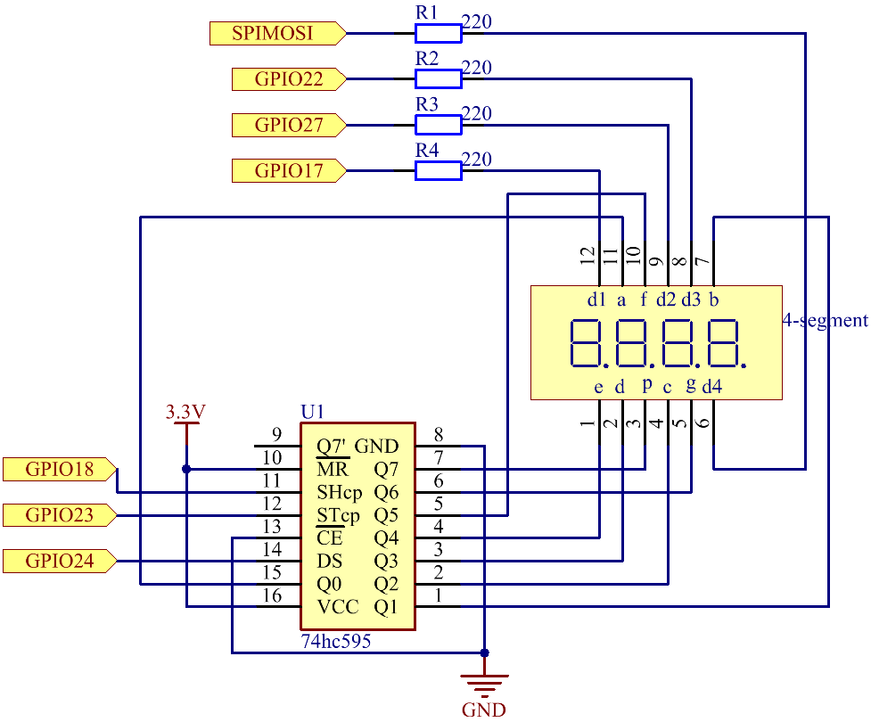

.. note::

    Bonjour et bienvenue dans la communauté SunFounder Raspberry Pi & Arduino & ESP32 Enthusiasts sur Facebook ! Plongez plus profondément dans le monde du Raspberry Pi, d'Arduino et d'ESP32 avec d'autres passionnés.

    **Pourquoi nous rejoindre ?**

    - **Support d'experts** : Résolvez les problèmes après-vente et les défis techniques grâce à l'aide de notre communauté et de notre équipe.
    - **Apprendre et partager** : Échangez des astuces et des tutoriels pour améliorer vos compétences.
    - **Aperçus exclusifs** : Accédez en avant-première aux annonces de nouveaux produits.
    - **Réductions spéciales** : Profitez de réductions exclusives sur nos derniers produits.
    - **Promotions festives et tirages au sort** : Participez à des concours et promotions spéciales.

    👉 Prêt à explorer et créer avec nous ? Cliquez sur [|link_sf_facebook|] et rejoignez-nous dès aujourd'hui !

1.1.5 Afficheur 7 segments à 4 chiffres
===========================================

Introduction
-----------------

Passons maintenant à la commande de l'afficheur 7 segments à 4 chiffres.

Composants
---------------

.. image:: img/list_4_digit.png

Principe de fonctionnement
-----------------------------

**Afficheur 7 segments à 4 chiffres**

L'afficheur 7 segments à 4 chiffres est constitué de quatre afficheurs 7 segments fonctionnant ensemble.

.. image:: img/4-digit-sche.png

Chaque segment de l'afficheur 7 segments à 4 chiffres fonctionne indépendamment. 
Il utilise le principe de la persistance rétinienne pour afficher rapidement les 
caractères de chaque segment en boucle, formant ainsi une chaîne continue.

Par exemple, lorsque "1234" est affiché, "1" est visible sur le premier segment, 
mais "234" ne l'est pas. Après un court instant, le deuxième segment affiche "2" 
tandis que les 1er, 3e et 4e segments ne montrent rien, et ainsi de suite, les quatre 
chiffres défilent tour à tour. Ce processus est très rapide (environ 5 ms), et 
grâce à l'effet de rémanence optique et de persistance visuelle, nous percevons 
les quatre caractères simultanément.

.. image:: img/image78.png

**Codes d'affichage**

Pour vous aider à comprendre comment les afficheurs 7 segments (Anode commune) 
affichent les chiffres, nous avons dressé le tableau suivant. Les chiffres 
correspondent aux numéros 0-F affichés sur l'afficheur 7 segments ; (DP) GFEDCBA 
indique les segments LED allumés ou éteints. Par exemple, 11000000 signifie que DP 
et G sont activés, tandis que les autres sont désactivés. Le chiffre 0 est donc affiché, 
et le code HEX correspond à son équivalent en hexadécimal.

.. image:: img/common_anode.png

Schéma de câblage
--------------------------

============ ======== ======== ===
T-Board Name physical wiringPi BCM
GPIO17       Pin 11   0        17
GPIO27       Pin 13   2        27
GPIO22       Pin 15   3        22
SPIMOSI      Pin 19   12       10
GPIO18       Pin 12   1        18
GPIO23       Pin 16   4        23
GPIO24       Pin 18   5        24
============ ======== ======== ===

Procédures expérimentales
-----------------------------------

**Étape 1** : Construisez le circuit.

.. image:: img/image80.png
    :width: 800

**Étape 2** : Accédez au dossier contenant le code.

.. raw:: html

   <run></run>

.. code-block::

    cd ~/davinci-kit-for-raspberry-pi/c/1.1.5/

**Étape 3** : Compilez le code.

.. raw:: html

   <run></run>

.. code-block::

    gcc 1.1.5_4-Digit.c -lwiringPi

**Étape 4** : Exécutez le fichier compilé.

.. raw:: html

   <run></run>

.. code-block::

    sudo ./a.out

Après l'exécution du code, le programme commence un comptage qui augmente de 1 chaque seconde, et l'afficheur 7 segments à 4 chiffres affiche le nombre correspondant.

.. note::

    Si cela ne fonctionne pas après exécution, ou si un message d'erreur apparaît : "wiringPi.h: Aucun fichier ou répertoire de ce type", veuillez vous référer à :ref:`C code is not working?`.

**Code**

.. code-block:: c

    #include <wiringPi.h>
    #include <stdio.h>
    #include <wiringShift.h>
    #include <signal.h>
    #include <unistd.h>

    #define SDI 5
    #define RCLK 4
    #define SRCLK 1

    const int placePin[] = {12, 3, 2, 0};
    unsigned char number[] = {0xc0, 0xf9, 0xa4, 0xb0, 0x99, 0x92, 0x82, 0xf8, 0x80, 0x90};

    int counter = 0;

    void pickDigit(int digit)
    {
        for (int i = 0; i < 4; i++)
        {
            digitalWrite(placePin[i], 0);
        }
        digitalWrite(placePin[digit], 1);
    }

    void hc595_shift(int8_t data)
    {
        int i;
        for (i = 0; i < 8; i++)
        {
            digitalWrite(SDI, 0x80 & (data << i));
            digitalWrite(SRCLK, 1);
            delayMicroseconds(1);
            digitalWrite(SRCLK, 0);
        }
        digitalWrite(RCLK, 1);
        delayMicroseconds(1);
        digitalWrite(RCLK, 0);
    }

    void clearDisplay()
    {
        int i;
        for (i = 0; i < 8; i++)
        {
            digitalWrite(SDI, 1);
            digitalWrite(SRCLK, 1);
            delayMicroseconds(1);
            digitalWrite(SRCLK, 0);
        }
        digitalWrite(RCLK, 1);
        delayMicroseconds(1);
        digitalWrite(RCLK, 0);
    }

    void loop()
    {
        while(1){
        clearDisplay();
        pickDigit(0);
        hc595_shift(number[counter % 10]);

        clearDisplay();
        pickDigit(1);
        hc595_shift(number[counter % 100 / 10]);

        clearDisplay();
        pickDigit(2);
        hc595_shift(number[counter % 1000 / 100]);
    
        clearDisplay();
        pickDigit(3);
        hc595_shift(number[counter % 10000 / 1000]);
        }
    }

    void timer(int timer1)
    { 
        if (timer1 == SIGALRM)
        { 
            counter++;
            alarm(1); 
            printf("%d\n", counter);
        }
    }

    void main(void)
    {
        if (wiringPiSetup() == -1)
        { 
            printf("setup wiringPi failed !");
            return;
        }
        pinMode(SDI, OUTPUT); 
        pinMode(RCLK, OUTPUT);
        pinMode(SRCLK, OUTPUT);
        
        for (int i = 0; i < 4; i++)
        {
            pinMode(placePin[i], OUTPUT);
            digitalWrite(placePin[i], HIGH);
        }
        signal(SIGALRM, timer); 
        alarm(1);               
        loop(); 
    }

**Explication du Code**

.. code-block:: c

    const int placePin[] = {12, 3, 2, 0};

Ces quatre broches contrôlent les anodes communes des affichages à 7 segments à quatre chiffres.

.. code-block:: c

    unsigned char number[] = {0xc0, 0xf9, 0xa4, 0xb0, 0x99, 0x92, 0x82, 0xf8, 0x80, 0x90};

Un tableau de codes de segments en hexadécimal (Anode commune) pour les chiffres de 0 à 9.

.. code-block:: c

    void pickDigit(int digit)
    {
        for (int i = 0; i < 4; i++)
        {
            digitalWrite(placePin[i], 0);
        }
        digitalWrite(placePin[digit], 1);
    }

Sélectionne l'emplacement du chiffre. Il ne doit y avoir qu'un seul emplacement activé à chaque fois. L'emplacement activé sera mis à l'état haut.

.. code-block:: c

    void loop()
    {
        while(1){
        clearDisplay();
        pickDigit(0);
        hc595_shift(number[counter % 10]);

        clearDisplay();
        pickDigit(1);
        hc595_shift(number[counter % 100 / 10]);

        clearDisplay();
        pickDigit(2);
        hc595_shift(number[counter % 1000 / 100]);
    
        clearDisplay();
        pickDigit(3);
        hc595_shift(number[counter % 10000 / 1000]);
        }
    }

La fonction sert à définir le chiffre affiché sur l'affichage à 7 segments à quatre chiffres.

* ``clearDisplay()`` : Écrit 11111111 pour éteindre les huit LED de l'afficheur à 7 segments afin de supprimer le contenu affiché.
* ``pickDigit(0)`` : Sélectionne le quatrième afficheur 7 segments.
* ``hc595_shift(number[counter%10])`` : Le chiffre des unités du compteur s'affiche sur le quatrième segment.

.. code-block:: c

    signal(SIGALRM, timer); 

C'est une fonction système fournie. Le prototype du code est :

.. code-block:: c

    sig_t signal(int signum,sig_t handler);

Après l'exécution de ``signal()``, une fois que le processus reçoit le signal correspondant (dans ce cas SIGALRM), il interrompt immédiatement la tâche en cours et exécute la fonction définie (ici, ``timer(sig)``).

.. code-block:: c

    alarm(1);

C'est également une fonction système fournie. Le prototype du code est :

.. code-block:: c

    unsigned int alarm (unsigned int seconds);

Elle génère un signal SIGALRM après un certain nombre de secondes.

.. code-block:: c

    void timer(int timer1)
    { 
        if (timer1 == SIGALRM)
        { 
            counter++;
            alarm(1); 
            printf("%d\n", counter);
        }
    }

Nous utilisons les fonctions ci-dessus pour implémenter la fonction de minuterie.
Après que ``alarm()`` a généré le signal SIGALRM, la fonction ``timer()`` est appelée. Elle ajoute 1 au compteur et la fonction ``alarm(1)`` sera de nouveau appelée toutes les secondes de manière répétée.

