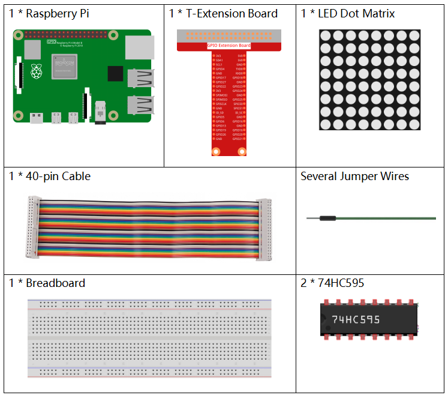
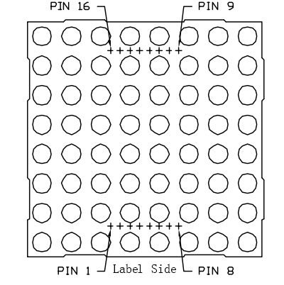
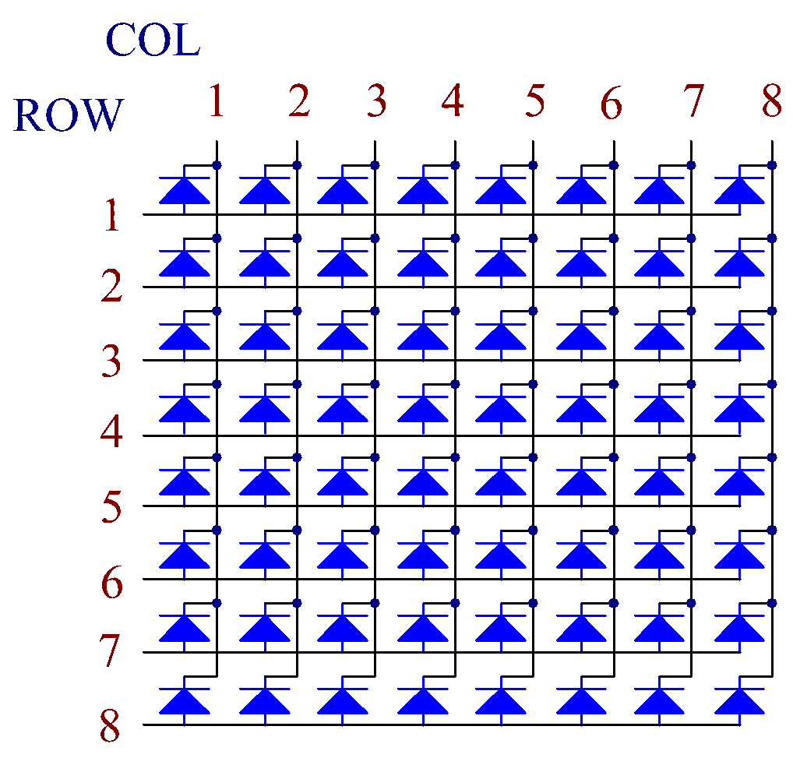
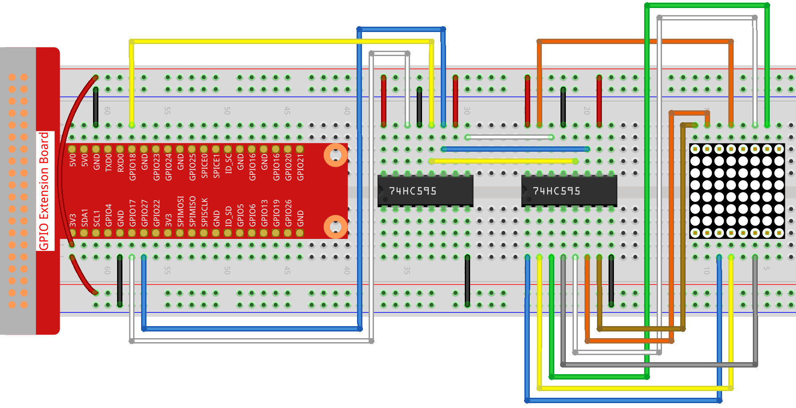

.. note::

    こんにちは、SunFounderのRaspberry Pi & Arduino & ESP32愛好家コミュニティへようこそ！Facebook上でRaspberry Pi、Arduino、ESP32についてもっと深く掘り下げ、他の愛好家と交流しましょう。

    **参加する理由は？**

    - **エキスパートサポート**：コミュニティやチームの助けを借りて、販売後の問題や技術的な課題を解決します。
    - **学び＆共有**：ヒントやチュートリアルを交換してスキルを向上させましょう。
    - **独占的なプレビュー**：新製品の発表や先行プレビューに早期アクセスしましょう。
    - **特別割引**：最新製品の独占割引をお楽しみください。
    - **祭りのプロモーションとギフト**：ギフトや祝日のプロモーションに参加しましょう。

    👉 私たちと一緒に探索し、創造する準備はできていますか？[|link_sf_facebook|]をクリックして今すぐ参加しましょう！

.. _py_led_matrix:

1.1.6 LEDドットマトリックス
===========================

前書き
--------------------

名前が示すように、LEDドットマトリックスはLEDで構成されるマトリックスである。LEDの点灯と調光は、さまざまな文字とパターンを形成する。

部品
------------------

原理
----------------

**LEDドットマトリックス**

一般に、LEDドットマトリックスは、cathode (CC)とcommon anode (CA)の2つのタイプに分類できる。見た目は似ているが、内部的には違いがある。テストを行うとすぐに分かる。このキットではCAが使用される。側面に788BSというラベルが付いている。

下の図を参照してください。ピンは背面の両端に配置されている。ラベル側を参考にしてください。この端のピンはピン1〜8で、もう一方のピンはピン9〜16である。

外部ビュー：

図の下に内部構造を示している。CA LEDドットマトリックスが見える。ROWはLEDのアノードを表し、COLはカソードを表す。CCの場合は逆である。共通点が1つある：両方のタイプで、ピン13、3、4、10、6、11、15、および16はすべてCOLである。ピン9、14、8、12、1、7、2、および5がすべてROWである。左上隅の最初のLEDをオンにする場合、CA LEDドットマトリックスに対して、ピン9をHigh、ピン13をLowに設定し、CC 1に対して、ピン13をHighに、ピン9をLowに設定する。CAの最初の列全体を点灯させる場合は、ピン13をLowに、行9、14、8、12、1、7、2、および5をHighに設定するCCの場合、ピン13をHighに、行9、14、8、12、1、7、2、および5をLowに設定する。理解を深めるために、次の図を検討してください。

内部ビュー：

上記の行と列に対応するピン番号：

=========== ====== ====== ===== ====== ===== ====== ====== ======
**COL**     **1**  **2**  **3** **4**  **5** **6**  **7**  **8**
**Pin No.** **13** **3**  **4** **10** **6** **11** **15** **16**
**ROW**     **1**  **2**  **3** **4**  **5** **6**  **7**  **8**
**Pin No.** **9**  **14** **8** **12** **1** **7**  **2**  **5**
=========== ====== ====== ===== ====== ===== ====== ====== ======

さらに、2つの74HC595チップがここで使用されている。1つはLEDドットマトリックスの行を制御し、もう1つは列を制御する。

回路図
-----------------------

============ ======== ======== ===
T-Board Name physical wiringPi BCM
GPIO17       Pin 11   0        17
GPIO18       Pin 12   1        18
GPIO27       Pin 13   2        27
============ ======== ======== ===

.. image:: ../img/schematic_dot.png
   :width: 800

実験手順
----------------------------

ステップ1: 回路を作る。配線が複雑なので、段階的に作りましょう。まず、T-Cobbler、LEDドットマトリックス、および2つの74HC595チップをブレッドボードに挿入する。
T-Cobblerの3.3Vと接地をボードの両側の穴に接続し、2つの74HC595チップのピン16と10をVCCに、ピン13とピン8を接地に接続する。

.. note::
   上のFritzing画像では、ラベルのある側が下にある。

.. image:: ../img/image87.png
   :width: 800

ステップ2: 2つの74HC595のピン11を一緒に接続し、GPIO27に接続する。
次に、2つのチップのピン12を一緒に接続し、GPIO18に接続する。
それから左側の74HC595のピン14をGPIO17に、ピン9を2番目の74HC595のピン14に接続する。

.. image:: ../img/image88.png
   :width: 800

ステップ3: 右側の74HC595は、LEDドットマトリックスの列を制御する。
マッピングについては、以下の表を参照してください。
したがって、74HC595のQ0〜Q7ピンは、それぞれピン13、3、4、10、6、11、15、および16にマップされる。

+--------------------+--------+--------+--------+--------+--------+--------+--------+--------+
| **74HC595**        | **Q0** | **Q1** | **Q2** | **Q3** | **Q4** | **Q5** | **Q6** | **Q7** |
+--------------------+--------+--------+--------+--------+--------+--------+--------+--------+
| **LED Dot Matrix** | **13** | **3**  | **4**  | **10** | **6**  | **11** | **15** | **16** |
+--------------------+--------+--------+--------+--------+--------+--------+--------+--------+

ステップ4: 次に、LEDドットマトリックスの行を接続する。左側の74HC595はLEDドットマトリックスの行を制御する。
マッピングについては、以下の表を参照してください。左側の74HC595のQ0〜Q7は、それぞれピン9、14、8、12、1、7、2、および5にマッピングされていることは分かった。

+--------------------+--------+--------+--------+--------+--------+--------+--------+--------+
| **74HC595**        | **Q0** | **Q1** | **Q2** | **Q3** | **Q4** | **Q5** | **Q6** | **Q7** |
+--------------------+--------+--------+--------+--------+--------+--------+--------+--------+
| **LED Dot Matrix** | **9**  | **14** | **8**  | **12** | **1**  | **7**  | **2**  | **5**  |
+--------------------+--------+--------+--------+--------+--------+--------+--------+--------+

.. image:: ../img/image90.png
   :width: 800
   

ステップ5: コードのフォルダーに移動する。

.. raw:: html

   <run></run>

.. code-block::

   cd ~/davinci-kit-for-raspberry-pi/c/1.1.6/

ステップ6: コンパイルする。

.. raw:: html

   <run></run>

.. code-block::

   gcc 1.1.6_LedMatrix.c -lwiringPi

ステップ7: 実行する。

.. raw:: html

   <run></run>

.. code-block::

   sudo ./a.out

コードの実行後、LEDドットマトリックスが行ごとに、列ごとに点灯したり消灯したりする。

**コード**

.. code-block:: c

   #include <wiringPi.h>
   #include <stdio.h>

   #define   SDI   0   //serial data input
   #define   RCLK  1   //memory clock input(STCP)
   #define   SRCLK 2   //shift register clock input(SHCP)

   unsigned char code_H[20] = {0x01,0xff,0x80,0xff,0x01,0x02,0x04,0x08,0x10,0x20,0x40,0x80,0xff,0xff,0xff,0xff,0xff,0xff,0xff,0xff};
   unsigned char code_L[20] = {0x00,0x7f,0x00,0xfe,0x00,0x00,0x00,0x00,0x00,0x00,0x00,0x00,0xfe,0xfd,0xfb,0xf7,0xef,0xdf,0xbf,0x7f};

   void init(void){
      pinMode(SDI, OUTPUT); 
      pinMode(RCLK, OUTPUT);
      pinMode(SRCLK, OUTPUT);

      digitalWrite(SDI, 0);
      digitalWrite(RCLK, 0);
      digitalWrite(SRCLK, 0);
   }

   void hc595_in(unsigned char dat){
      int i;
      for(i=0;i<8;i++){
         digitalWrite(SDI, 0x80 & (dat << i));
         digitalWrite(SRCLK, 1);
         delay(1);
         digitalWrite(SRCLK, 0);
      }
   }

   void hc595_out(){
      digitalWrite(RCLK, 1);
      delay(1);
      digitalWrite(RCLK, 0);
   }

   int main(void){
      int i;
      if(wiringPiSetup() == -1){ //when initialize wiring failed, print message to screen
         printf("setup wiringPi failed !");
         return 1;
      }
      init();
      while(1){
         for(i=0;i<sizeof(code_H);i++){
               hc595_in(code_L[i]);
               hc595_in(code_H[i]);
               hc595_out();
               delay(100);
         }

         for(i=sizeof(code_H);i>=0;i--){
               hc595_in(code_L[i]);
               hc595_in(code_H[i]);
               hc595_out();
               delay(100);
         }
      }

      return 0;
   }

**Code Explanation**

.. code-block:: c

   unsigned char code_H[20] = {0x01,0xff,0x80,0xff,0x01,0x02,0x04,0x08,0x10,0x20,0x40,0x80,0xff,0xff,0xff,0xff,0xff,0xff,0xff,0xff};
   unsigned char code_L[20] = {0x00,0x7f,0x00,0xfe,0x00,0x00,0x00,0x00,0x00,0x00,0x00,0x00,0xfe,0xfd,0xfb,0xf7,0xef,0xdf,0xbf,0x7f};

配列code_HはLEDドットマトリックス行の要素を表し、配列code_Lは列の要素を表す。
文字が表示されると、行の要素と列の要素が取得され、それぞれ2つのHC595チップに割り当てられる。
したがって、パターンはLEDドットマトリックスに表示される。例として、code_Hの最初の数字0x01とcode_Lの最初の数字0x00を取り上げる。

二進法に変換された0x01は00000001になり、二進法に変換された0x00は0000 0000になる。

このキットでは、アノードコモンLEDドットマトリックスディスプレイが適用されるため、
8列目の8つのLEDのみが点灯する。コードHが0xffで、code_Lが0x7fであるという条件が同時に満たされると、最初の列のこれら8つのLEDが点灯する。

.. image:: ../img/anode_table.png

.. code-block:: c

   void hc595_in(unsigned char dat){
      int i;
      for(i=0;i<8;i++){
         digitalWrite(SDI, 0x80 & (dat << i));
         digitalWrite(SRCLK, 1);
         delay(1);
         digitalWrite(SRCLK, 0);

HC 595ビットのピンSDIにビット単位でDATの値を書き込みます。SRCLKの初期値は0に設定され、ここで1がセットされ、立ち上がりエッジパルスを生成し、次にPHSDI（DS）の日付をシフトレジスタにシフトさせる。

.. code-block:: c

   void hc595_out(){
      digitalWrite(RCLK, 1);
      delay(1);
      digitalWrite(RCLK, 0);

RCLKの初期値は元々に0に設定されていたが、ここでは1に設定されている。これは、立ち上がりエッジパルスを生成し、データーをシフトレジスタからストレージレジスターにシフトする。

.. code-block:: c

   while(1){
      for(i=0;i<sizeof(code_H);i++){
         hc595_in(code_L[i]);
         hc595_in(code_H[i]);
         hc595_out();
         delay(100);
      }
   }

このループでは、2つの配列code_Lおよびcode_Hのこれらの20個の要素が2つの74HC595チップに1つずつアップロードされる。次に、関数hc595_out()を呼び出して、データをシフトレジスタからストレージレジスタにシフトする。
