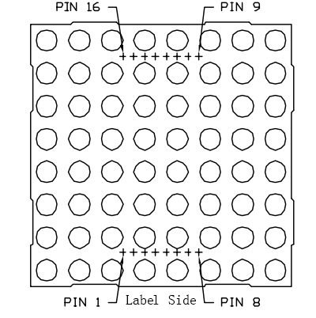
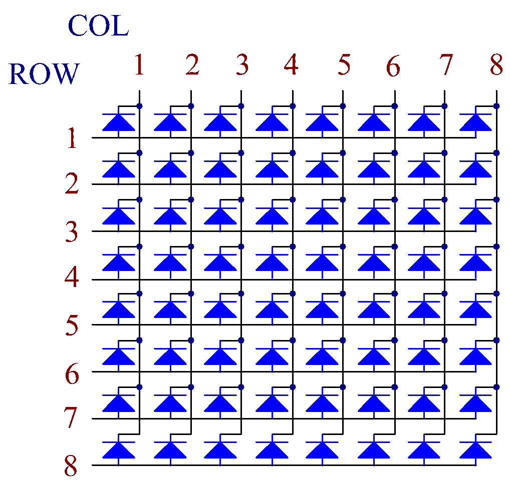

.. note::

    Bonjour, bienvenue dans la communauté SunFounder Raspberry Pi & Arduino & ESP32 sur Facebook ! Plongez plus profondément dans l'univers du Raspberry Pi, de l'Arduino et de l'ESP32 avec d'autres passionnés.

    **Pourquoi nous rejoindre ?**

    - **Support d'experts** : Résolvez les problèmes après-vente et les défis techniques grâce à l'aide de notre communauté et de notre équipe.
    - **Apprendre & Partager** : Échangez des astuces et tutoriels pour améliorer vos compétences.
    - **Aperçus exclusifs** : Accédez en avant-première aux annonces de nouveaux produits et bénéficiez de previews exclusives.
    - **Réductions spéciales** : Profitez de réductions exclusives sur nos nouveaux produits.
    - **Promotions festives et cadeaux** : Participez à des cadeaux et à des promotions spéciales lors des fêtes.

    👉 Prêt à explorer et à créer avec nous ? Cliquez sur [|link_sf_facebook|] et rejoignez-nous dès aujourd'hui !

1.1.6 Matrice de LED
========================

Introduction
---------------------

Comme son nom l'indique, une matrice de LED est un réseau constitué de LED. 
L'allumage et l'extinction de ces LED permettent de créer différents caractères et motifs.

Composants
------------------

.. image:: img/list_dot.png

Principe
----------------

**Matrice de LED**

En général, les matrices de LED peuvent être classées en deux types : cathode 
commune (CC) et anode commune (CA). Elles se ressemblent beaucoup extérieurement, 
mais leur câblage interne diffère. Vous pouvez les identifier par un test. Ce kit 
utilise une matrice CA. Vous pouvez voir l'inscription "788BS" sur le côté.

Consultez la figure ci-dessous. Les broches sont disposées aux deux extrémités à 
l'arrière. Prenez la face avec le marquage comme référence : les broches de ce côté 
sont numérotées de 1 à 8, et de l'autre côté de 9 à 16.

Vue externe :

Les figures ci-dessous montrent la structure interne. Dans une matrice CA, les "ROW" 
représentent l'anode de la LED, et les "COL" la cathode ; c'est l'inverse pour une 
matrice CC. Un point commun : pour les deux types, les broches 13, 3, 4, 10, 6, 11, 15 
et 16 correspondent aux COL, tandis que les broches 9, 14, 8, 12, 1, 7, 2 et 5 correspondent 
aux ROW. Si vous souhaitez allumer la première LED en haut à gauche, dans une matrice CA, 
réglez la broche 9 sur High et la broche 13 sur Low ; pour une matrice CC, réglez la broche 
13 sur High et la broche 9 sur Low. Pour allumer toute la première colonne, pour une matrice 
CA, réglez la broche 13 sur Low et les ROW 9, 14, 8, 12, 1, 7, 2, et 5 sur High, alors que 
pour une CC, réglez la broche 13 sur High et les ROW 9, 14, 8, 12, 1, 7, 2, et 5 sur Low. 
Consultez les figures ci-dessous pour mieux comprendre.

Vue interne :

Numérotation des broches correspondant aux rangées et colonnes ci-dessus :

=========== ====== ====== ===== ====== ===== ====== ====== ======
**COL**     **1**  **2**  **3** **4**  **5** **6**  **7**  **8**
**Pin No.** **13** **3**  **4** **10** **6** **11** **15** **16**
**ROW**     **1**  **2**  **3** **4**  **5** **6**  **7**  **8**
**Pin No.** **9**  **14** **8** **12** **1** **7**  **2**  **5**
=========== ====== ====== ===== ====== ===== ====== ====== ======

De plus, deux puces 74HC595 sont utilisées ici. L'une contrôle les rangées de la matrice de LED, tandis que l'autre gère les colonnes.

Schéma de câblage
-----------------------

============ ======== ======== ===
T-Board Name physical wiringPi BCM
GPIO17       Pin 11   0        17
GPIO18       Pin 12   1        18
GPIO27       Pin 13   2        27
============ ======== ======== ===

.. image:: img/schematic_dot.png
   :width: 800

Procédures expérimentales
----------------------------

**Étape 1 :** Construisez le circuit. Comme le câblage est complexe, suivez les 
étapes une à une. Insérez d'abord le T-Cobbler, la matrice de LED et les deux puces 
74HC595 dans la breadboard. Connectez les broches 3,3 V et GND du T-Cobbler aux trous 
sur les deux côtés de la carte, puis branchez la broche 16 et 10 des deux puces 74HC595 
à VCC, et les broches 13 et 8 à GND.

.. note::
   Dans l'image Fritzing ci-dessus, le côté avec l'étiquette est orienté vers le bas.

.. image:: img/image87.png
   :width: 800

**Étape 2 :** Connectez la broche 11 des deux 74HC595 ensemble, puis à GPIO27 ; ensuite, 
reliez la broche 12 des deux puces à GPIO18 ; et enfin, connectez la broche 14 du 74HC595 
à gauche à GPIO17 et la broche 9 à la broche 14 de la deuxième puce 74HC595.

.. image:: img/image88.png
   :width: 800

**Étape 3 :** Le 74HC595 à droite est destiné à contrôler les colonnes de la matrice LED. 
Consultez le tableau ci-dessous pour la correspondance. Les broches Q0-Q7 du 74HC595 sont 
reliées respectivement aux broches 13, 3, 4, 10, 6, 11, 15 et 16.

+--------------------+--------+--------+--------+--------+--------+--------+--------+--------+
| **74HC595**        | **Q0** | **Q1** | **Q2** | **Q3** | **Q4** | **Q5** | **Q6** | **Q7** |
+--------------------+--------+--------+--------+--------+--------+--------+--------+--------+
| **LED Dot Matrix** | **13** | **3**  | **4**  | **10** | **6**  | **11** | **15** | **16** |
+--------------------+--------+--------+--------+--------+--------+--------+--------+--------+

.. image:: img/image89.png
   :width: 800

**Étape 4 :** Connectez maintenant les rangées (ROW) de la matrice de LED. Le 74HC595 
situé à gauche contrôle les rangées de la matrice. Consultez le tableau ci-dessous pour 
la correspondance. On peut observer que les broches Q0-Q7 du 74HC595 à gauche sont 
respectivement reliées aux broches 9, 14, 8, 12, 1, 7, 2 et 5.

+--------------------+--------+--------+--------+--------+--------+--------+--------+--------+
| **74HC595**        | **Q0** | **Q1** | **Q2** | **Q3** | **Q4** | **Q5** | **Q6** | **Q7** |
+--------------------+--------+--------+--------+--------+--------+--------+--------+--------+
| **LED Dot Matrix** | **9**  | **14** | **8**  | **12** | **1**  | **7**  | **2**  | **5**  |
+--------------------+--------+--------+--------+--------+--------+--------+--------+--------+

.. image:: img/image90.png
   :width: 800

**Étape 5 :** Accédez au dossier contenant le code.

.. raw:: html

   <run></run>

.. code-block::

   cd ~/davinci-kit-for-raspberry-pi/c/1.1.6/

**Étape 6 :** Compilez le code.

.. raw:: html

   <run></run>

.. code-block::

   gcc 1.1.6_LedMatrix.c -lwiringPi

**Étape 7 :** Exécutez le programme.

.. raw:: html

   <run></run>

.. code-block::

   sudo ./a.out

Après l'exécution du code, la matrice de LED s'allume et s'éteint ligne par ligne et colonne par colonne.

.. note::

   Si cela ne fonctionne pas après l'exécution ou si un message d'erreur s'affiche : \"wiringPi.h: No such file or directory\", veuillez vous référer à :ref:`C code is not working?`.

**Code**

.. code-block:: c

   #include <wiringPi.h>
   #include <stdio.h>

   #define   SDI   0   //entrée de données série
   #define   RCLK  1   //entrée d'horloge mémoire (STCP)
   #define   SRCLK 2   //entrée d'horloge de registre à décalage (SHCP)

   unsigned char code_H[20] = {0x01,0xff,0x80,0xff,0x01,0x02,0x04,0x08,0x10,0x20,0x40,0x80,0xff,0xff,0xff,0xff,0xff,0xff,0xff,0xff};
   unsigned char code_L[20] = {0x00,0x7f,0x00,0xfe,0x00,0x00,0x00,0x00,0x00,0x00,0x00,0x00,0xfe,0xfd,0xfb,0xf7,0xef,0xdf,0xbf,0x7f};

   void init(void){
      pinMode(SDI, OUTPUT); 
      pinMode(RCLK, OUTPUT);
      pinMode(SRCLK, OUTPUT);

      digitalWrite(SDI, 0);
      digitalWrite(RCLK, 0);
      digitalWrite(SRCLK, 0);
   }

   void hc595_in(unsigned char dat){
      int i;
      for(i=0;i<8;i++){
         digitalWrite(SDI, 0x80 & (dat << i));
         digitalWrite(SRCLK, 1);
         delay(1);
         digitalWrite(SRCLK, 0);
      }
   }

   void hc595_out(){
      digitalWrite(RCLK, 1);
      delay(1);
      digitalWrite(RCLK, 0);
   }

   int main(void){
      int i;
      if(wiringPiSetup() == -1){ //si l'initialisation de wiring échoue, afficher le message sur l'écran
         printf("setup wiringPi failed !");
         return 1;
      }
      init();
      while(1){
         for(i=0;i<sizeof(code_H);i++){
               hc595_in(code_L[i]);
               hc595_in(code_H[i]);
               hc595_out();
               delay(100);
         }

         for(i=sizeof(code_H);i>=0;i--){
               hc595_in(code_L[i]);
               hc595_in(code_H[i]);
               hc595_out();
               delay(100);
         }
      }

      return 0;
   }
**Explication du Code**

.. code-block:: c

   unsigned char code_H[20] = {0x01,0xff,0x80,0xff,0x01,0x02,0x04,0x08,0x10,0x20,0x40,0x80,0xff,0xff,0xff,0xff,0xff,0xff,0xff,0xff};
   unsigned char code_L[20] = {0x00,0x7f,0x00,0xfe,0x00,0x00,0x00,0x00,0x00,0x00,0x00,0x00,0xfe,0xfd,0xfb,0xf7,0xef,0xdf,0xbf,0x7f};

Le tableau `code_H` représente les éléments de la ligne de la matrice de LED, et le tableau `code_L` correspond aux éléments de la colonne. Lors de l'affichage des caractères, un élément de la ligne et un de la colonne sont sélectionnés et assignés respectivement aux deux puces HC595. Ainsi, un motif est affiché sur la matrice de LED.
Prenons le premier nombre de `code_H`, `0x01` et le premier nombre de `code_L`, `0x00` comme exemples.

0x01 converti en binaire devient 00000001 ; 0x00 converti en binaire devient 00000000.

Dans ce kit, on utilise une matrice de LED à anode commune, donc seules les huit LED de la huitième ligne s'allument.
Lorsque les conditions où `code_H` est 0xff et `code_L` est 0x7f sont remplies simultanément, les 8 LED de la première colonne s'allument.

.. image:: img/anode_table.png

.. code-block:: c

   void hc595_in(unsigned char dat){
      int i;
      for(i=0;i<8;i++){
         digitalWrite(SDI, 0x80 & (dat << i));
         digitalWrite(SRCLK, 1);
         delay(1);
         digitalWrite(SRCLK, 0);

Écrire la valeur de `dat` à la broche SDI du HC595 bit par bit. La valeur initiale de SRCLK était 0, et ici elle est définie sur 1 pour générer une impulsion de front montant, puis transférer la donnée de `pinSDI(DS)` au registre de décalage.

.. code-block:: c

   void hc595_out(){
      digitalWrite(RCLK, 1);
      delay(1);
      digitalWrite(RCLK, 0);

La valeur initiale de RCLK était 0, et ici elle est définie sur 1 pour générer une impulsion de front montant, puis transférer les données du registre de décalage au registre de stockage.       

.. code-block:: c

   while(1){
      for(i=0;i<sizeof(code_H);i++){
         hc595_in(code_L[i]);
         hc595_in(code_H[i]);
         hc595_out();
         delay(100);
      }
   }

Dans cette boucle, les 20 éléments des deux tableaux `code_L` et `code_H` seront chargés dans les deux puces 74HC595 un par un. Ensuite, la fonction `hc595_out()` est appelée pour transférer les données du registre de décalage au registre de stockage.
