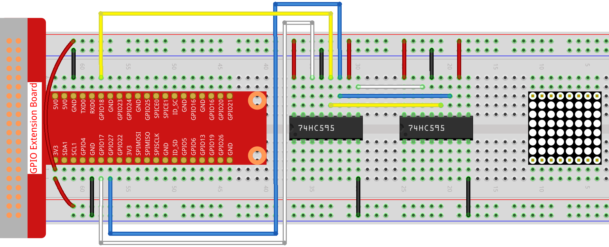

.. note::

    ¡Hola! Bienvenido a la comunidad de entusiastas de SunFounder Raspberry Pi, Arduino y ESP32 en Facebook. Profundiza en Raspberry Pi, Arduino y ESP32 con otros entusiastas.

    **쯇or qué unirse?**

    - **Soporte Experto**: Resuelve problemas postventa y desafíos técnicos con la ayuda de nuestra comunidad y equipo.
    - **Aprender y Compartir**: Intercambia consejos y tutoriales para mejorar tus habilidades.
    - **Previews Exclusivos**: Accede anticipadamente a anuncios de nuevos productos y avances.
    - **Descuentos Especiales**: Disfruta de descuentos exclusivos en nuestros productos más recientes.
    - **Promociones Festivas y Sorteos**: Participa en sorteos y promociones navideñas.

    游녤 쯃isto para explorar y crear con nosotros? Haz clic en [|link_sf_facebook|] y únete hoy mismo!

1.1.6 Matriz de Puntos LED
==================================

Introducción
--------------------

Como su nombre indica, una matriz de puntos LED es una matriz compuesta por LEDs. 
El encendido y apagado de los LEDs forman diferentes caracteres y patrones.

Componentes
------------------

.. image:: img/list_dot.png

Principio
----------------

**Matriz de Puntos LED**

Generalmente, la matriz de puntos LED se puede clasificar en dos tipos: 
cátodo común (CC) y ánodo común (CA). Se parecen mucho, pero internamente 
hay diferencias. Puedes comprobarlo mediante pruebas. En este kit se utiliza
 una de tipo CA, que se puede identificar con la etiqueta 788BS en el lateral.

Observa la figura a continuación. Los pines están dispuestos en los dos extremos 
en la parte posterior. Tomando el lado etiquetado como referencia: los pines de 
este extremo son del 1 al 8, y en el otro extremo son del 9 al 16.

Vista externa:

.. image:: img/image84.png

Las figuras a continuación muestran su estructura interna. En una matriz de 
puntos LED de tipo CA, ROW representa el ánodo del LED, y COL es el cátodo; 
es al contrario en una de tipo CC. Una cosa en común: para ambos tipos, los 
pines 13, 3, 4, 10, 6, 11, 15 y 16 son todos COL, mientras que los pines 9, 
14, 8, 12, 1, 7, 2 y 5 son todos ROW. Si deseas encender el primer LED en la 
esquina superior izquierda, para una matriz de puntos LED CA, simplemente 
establece el pin 9 en alto y el pin 13 en bajo; para una matriz CC, establece 
el pin 13 en alto y el pin 9 en bajo. Si quieres iluminar toda la primera columna, 
para CA, establece el pin 13 en bajo y los ROW 9, 14, 8, 12, 1, 7, 2 y 5 en alto; 
mientras que para CC, establece el pin 13 en alto y los ROW 9, 14, 8, 12, 1, 7, 2 y 
5 en bajo. Considera las siguientes figuras para una mejor comprensión.

Vista interna:

.. image:: img/image85.png
   :width: 400
   :align: center

Numeración de pines correspondiente a las filas y columnas anteriores:

=========== ====== ====== ===== ====== ===== ====== ====== ======
**COL**     **1**  **2**  **3** **4**  **5** **6**  **7**  **8**
**Pin No.** **13** **3**  **4** **10** **6** **11** **15** **16**
**ROW**     **1**  **2**  **3** **4**  **5** **6**  **7**  **8**
**Pin No.** **9**  **14** **8** **12** **1** **7**  **2**  **5**
=========== ====== ====== ===== ====== ===== ====== ====== ======

Además, se utilizan aquí dos chips 74HC595. Uno controla las filas de la matriz de puntos LED, mientras que el otro controla las columnas.

Diagrama Esquemático
-----------------------

============ ======== ======== ===
T-Board Name physical wiringPi BCM
GPIO17       Pin 11   0        17
GPIO18       Pin 12   1        18
GPIO27       Pin 13   2        27
============ ======== ======== ===

.. image:: img/schematic_dot.png
   :width: 800

Procedimientos Experimentales
-------------------------------------

**Paso 1:** Construir el circuito. Dado que el cableado es complicado, 
lo haremos paso a paso. Primero, inserta el T-Cobbler, la matriz de puntos 
LED y los dos chips 74HC595 en la placa de pruebas. Conecta el 3.3V y GND 
del T-Cobbler a los orificios en los dos lados de la placa, luego conecta 
el pin 16 y el 10 de los dos chips 74HC595 a VCC, y el pin 13 y el pin 8 a GND.

.. note::
   En la imagen de Fritzing anterior, el lado con la etiqueta está en la parte inferior.

.. image:: img/image87.png
   :width: 800

**Paso 2:** Conecta el pin 11 de los dos 74HC595 juntos, y luego a GPIO27; 
luego el pin 12 de los dos chips, a GPIO18; a continuación, el pin 14 del 
74HC595 del lado izquierdo a GPIO17 y el pin 9 al pin 14 del segundo 74HC595.

**Paso 3:** El 74HC595 del lado derecho controla las columnas de la matriz 
de puntos LED. Consulta la tabla a continuación para la asignación. Por lo 
tanto, los pines Q0-Q7 del 74HC595 están asignados a los pines 13, 3, 4, 10, 
6, 11, 15 y 16 respectivamente.

+--------------------+--------+--------+--------+--------+--------+--------+--------+--------+
| **74HC595**        | **Q0** | **Q1** | **Q2** | **Q3** | **Q4** | **Q5** | **Q6** | **Q7** |
+--------------------+--------+--------+--------+--------+--------+--------+--------+--------+
| **LED Dot Matrix** | **13** | **3**  | **4**  | **10** | **6**  | **11** | **15** | **16** |
+--------------------+--------+--------+--------+--------+--------+--------+--------+--------+

.. image:: img/image89.png
   :width: 800

**Paso 4:** Ahora conecta los ROW de la matriz de puntos LED. El 74HC595 del 
lado izquierdo controla los ROW de la matriz de puntos LED. Consulta la tabla 
a continuación para la asignación. Podemos ver que Q0-Q7 del 74HC595 del lado 
izquierdo están asignados a los pines 9, 14, 8, 12, 1, 7, 2 y 5 respectivamente.

+--------------------+--------+--------+--------+--------+--------+--------+--------+--------+
| **74HC595**        | **Q0** | **Q1** | **Q2** | **Q3** | **Q4** | **Q5** | **Q6** | **Q7** |
+--------------------+--------+--------+--------+--------+--------+--------+--------+--------+
| **LED Dot Matrix** | **9**  | **14** | **8**  | **12** | **1**  | **7**  | **2**  | **5**  |
+--------------------+--------+--------+--------+--------+--------+--------+--------+--------+

.. image:: img/image90.png
   :width: 800

**Paso 5:** Ve a la carpeta del código.

.. raw:: html

   <run></run>

.. code-block::

   cd ~/davinci-kit-for-raspberry-pi/c/1.1.6/

**Paso 6:** Compila.

.. raw:: html

   <run></run>

.. code-block::

   gcc 1.1.6_LedMatrix.c -lwiringPi

**Paso 7:** Ejecuta.

.. raw:: html

   <run></run>

.. code-block::

   sudo ./a.out

Después de ejecutar el código, la matriz de puntos LED se iluminará, activando las filas y columnas secuencialmente.

.. note::

   Si no funciona después de ejecutar, o aparece un mensaje de error: \"wiringPi.h: No such file or directory\", consulta :ref:`C code is not working?`.

**Código**

.. code-block:: c

   #include <wiringPi.h>
   #include <stdio.h>

   #define   SDI   0   //entrada de datos en serie
   #define   RCLK  1   //entrada de reloj de memoria (STCP)
   #define   SRCLK 2   //entrada de reloj del registro de desplazamiento (SHCP)

   unsigned char code_H[20] = {0x01,0xff,0x80,0xff,0x01,0x02,0x04,0x08,0x10,0x20,0x40,0x80,0xff,0xff,0xff,0xff,0xff,0xff,0xff,0xff};
   unsigned char code_L[20] = {0x00,0x7f,0x00,0xfe,0x00,0x00,0x00,0x00,0x00,0x00,0x00,0x00,0xfe,0xfd,0xfb,0xf7,0xef,0xdf,0xbf,0x7f};

   void init(void){
      pinMode(SDI, OUTPUT); 
      pinMode(RCLK, OUTPUT);
      pinMode(SRCLK, OUTPUT);

      digitalWrite(SDI, 0);
      digitalWrite(RCLK, 0);
      digitalWrite(SRCLK, 0);
   }

   void hc595_in(unsigned char dat){
      int i;
      for(i=0;i<8;i++){
         digitalWrite(SDI, 0x80 & (dat << i));
         digitalWrite(SRCLK, 1);
         delay(1);
         digitalWrite(SRCLK, 0);
      }
   }

   void hc595_out(){
      digitalWrite(RCLK, 1);
      delay(1);
      digitalWrite(RCLK, 0);
   }

   int main(void){
      int i;
      if(wiringPiSetup() == -1){ //cuando la inicialización de wiring falla, imprime un mensaje en pantalla
         printf("setup wiringPi failed !");
         return 1;
      }
      init();
      while(1){
         for(i=0;i<sizeof(code_H);i++){
               hc595_in(code_L[i]);
               hc595_in(code_H[i]);
               hc595_out();
               delay(100);
         }

         for(i=sizeof(code_H);i>=0;i--){
               hc595_in(code_L[i]);
               hc595_in(code_H[i]);
               hc595_out();
               delay(100);
         }
      }

      return 0;
   }

**Explicación del Código**

.. code-block:: c

   unsigned char code_H[20] = {0x01,0xff,0x80,0xff,0x01,0x02,0x04,0x08,0x10,0x20,0x40,0x80,0xff,0xff,0xff,0xff,0xff,0xff,0xff,0xff};
   unsigned char code_L[20] = {0x00,0x7f,0x00,0xfe,0x00,0x00,0x00,0x00,0x00,0x00,0x00,0x00,0xfe,0xfd,0xfb,0xf7,0xef,0xdf,0xbf,0x7f};

El arreglo code_H representa los elementos de la fila de la matriz de puntos LED, y el arreglo code_L se refiere a los elementos de la columna. Cuando se muestran caracteres, se adquiere un elemento de la fila y uno de la columna y se asignan a los dos chips HC595 respectivamente. Así se muestra un patrón en la matriz de puntos LED.
Tomemos como ejemplo el primer número de code_H, 0x01, y el primer número de code_L, 0x00.

0x01 convertido a binario se convierte en 00000001; 0x00 convertido a binario se convierte en 0000 0000.

En este kit, se aplica una matriz de puntos LED de ánodo común, por lo que solo se iluminan los ocho LEDs en la octava fila. 
Cuando se cumplen simultáneamente las condiciones de que code_H es 0xff y code_L es 0x7f, se iluminan estos 8 LEDs en la primera columna.

.. image:: img/anode_table.png

.. code-block:: c

   void hc595_in(unsigned char dat){
      int i;
      for(i=0;i<8;i++){
         digitalWrite(SDI, 0x80 & (dat << i));
         digitalWrite(SRCLK, 1);
         delay(1);
         digitalWrite(SRCLK, 0);

Escribe el valor de dat en el pin SDI del HC595 bit a bit. El valor inicial de SRCLK se establece en 0, y aquí se establece en 1, lo que genera un pulso de flanco ascendente, luego desplaza la fecha de pinSDI(DS) al registro de desplazamiento.

.. code-block:: c

   void hc595_out(){
      digitalWrite(RCLK, 1);
      delay(1);
      digitalWrite(RCLK, 0);

El valor inicial de RCLK se establece en 0, y aquí se establece en 1, lo que genera un flanco ascendente, luego desplaza los datos del registro de desplazamiento al registro de almacenamiento.

.. code-block:: c

   while(1){
      for(i=0;i<sizeof(code_H);i++){
         hc595_in(code_L[i]);
         hc595_in(code_H[i]);
         hc595_out();
         delay(100);
      }
   }

En este bucle, se subirán uno a uno los 20 elementos en los dos arreglos, code_L y code_H, a los dos chips 74HC595. Luego se llama a la función hc595_out() para desplazar los datos del registro de desplazamiento al registro de almacenamiento.

