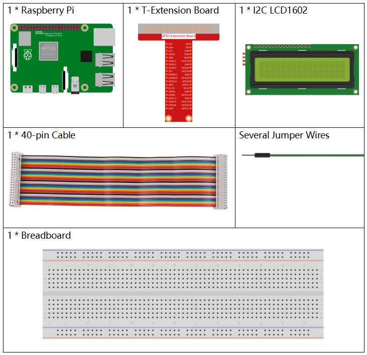
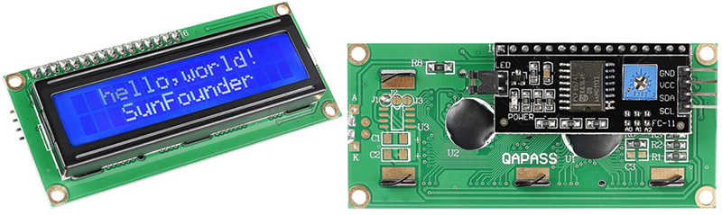
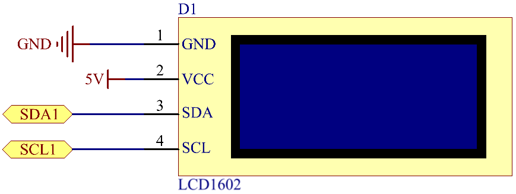

.. note::

    こんにちは、SunFounderのRaspberry Pi & Arduino & ESP32愛好家コミュニティへようこそ！Facebook上でRaspberry Pi、Arduino、ESP32についてもっと深く掘り下げ、他の愛好家と交流しましょう。

    **参加する理由は？**

    - **エキスパートサポート**：コミュニティやチームの助けを借りて、販売後の問題や技術的な課題を解決します。
    - **学び＆共有**：ヒントやチュートリアルを交換してスキルを向上させましょう。
    - **独占的なプレビュー**：新製品の発表や先行プレビューに早期アクセスしましょう。
    - **特別割引**：最新製品の独占割引をお楽しみください。
    - **祭りのプロモーションとギフト**：ギフトや祝日のプロモーションに参加しましょう。

    👉 私たちと一緒に探索し、創造する準備はできていますか？[|link_sf_facebook|]をクリックして今すぐ参加しましょう！

.. _py_lcd:

1.1.7 I2C LCD1602
======================

前書き
------------------

LCD1602は文字型液晶ディスプレイで、32（16 * 2）文字を同時に表示できる。

部品
-------------------

原理
-----------

**I2C LCD1602**

ご存知のように、LCDやその他のディスプレイはマンマシンの相互作用を大幅に強化するが、共通の弱点を共有している。
それらがコントローラーに接続されると、外部ポートがあまりないコントローラーの複数のIOが占用される。
また、コントローラーの他の機能も制限される。したがって、この問題を解決するために、I2Cバスを備えたLCD1602が開発された。

**I2C通信**

I2C（アイ・スクエアド・シー）バスは、一つマスターデバイス（または複数のマスターデバイス）と単一または複数のスレーブデバイス間の通信用の非常に強力なバスである。

I2Cメインコントローラーを使用して、IOエクスパンダー、各種センサー、EEPROM、ADC/DACなどを制御できる。
これらはすべて、ホストの2つのピン、シリアルデータ（SDA1）ラインとシリアルクロックライン（SCL1）によってのみ制御される。

回路図
---------------------

============ ========
T-Board Name physical
SDA1         Pin 3
SCL1         Pin 5
============ ========

実験手順
-----------------------------

ステップ1： 回路を作る。

.. image:: ../img/image96.png
    :width: 800

ステップ2： I2Cをセットアップします（ :ref:`i2c_config` 。I2Cを設定している場合は、このステップをスキップしてください。）

ステップ3： ディレクトリを変更する。

.. raw:: html

   <run></run>

.. code-block::

    cd ~/davinci-kit-for-raspberry-pi/c/1.1.7/

ステップ4： コンパイルする。

.. raw:: html

   <run></run>

.. code-block::

    gcc 1.1.7_Lcd1602.c -lwiringPi

ステップ5： 実行する。

.. raw:: html

   <run></run>

.. code-block::

    sudo ./a.out

コードの実行後、LCDに「Greetings」、「SunFounderから」が表示される。

.. note::

    コードと配線に問題がないのに LCD に内容が表示されない場合は、背面のポテンショメータをひねってみてください。

**コード**

.. code-block:: c

    #include <stdio.h>
    #include <wiringPi.h>
    #include <wiringPiI2C.h>
    #include <string.h>

    int LCDAddr = 0x27;
    int BLEN = 1;
    int fd;

    void write_word(int data){
        int temp = data;
        if ( BLEN == 1 )
            temp |= 0x08;
        else
            temp &= 0xF7;
        wiringPiI2CWrite(fd, temp);
    }

    void send_command(int comm){
        int buf;
        // Send bit7-4 firstly
        buf = comm & 0xF0;
        buf |= 0x04;			// RS = 0, RW = 0, EN = 1
        write_word(buf);
        delay(2);
        buf &= 0xFB;			// Make EN = 0
        write_word(buf);

        // Send bit3-0 secondly
        buf = (comm & 0x0F) << 4;
        buf |= 0x04;			// RS = 0, RW = 0, EN = 1
        write_word(buf);
        delay(2);
        buf &= 0xFB;			// Make EN = 0
        write_word(buf);
    }

    void send_data(int data){
        int buf;
        // Send bit7-4 firstly
        buf = data & 0xF0;
        buf |= 0x05;			// RS = 1, RW = 0, EN = 1
        write_word(buf);
        delay(2);
        buf &= 0xFB;			// Make EN = 0
        write_word(buf);

        // Send bit3-0 secondly
        buf = (data & 0x0F) << 4;
        buf |= 0x05;			// RS = 1, RW = 0, EN = 1
        write_word(buf);
        delay(2);
        buf &= 0xFB;			// Make EN = 0
        write_word(buf);
    }

    void init(){
        send_command(0x33);	// Must initialize to 8-line mode at first
        delay(5);
        send_command(0x32);	// Then initialize to 4-line mode
        delay(5);
        send_command(0x28);	// 2 Lines & 5*7 dots
        delay(5);
        send_command(0x0C);	// Enable display without cursor
        delay(5);
        send_command(0x01);	// Clear Screen
        wiringPiI2CWrite(fd, 0x08);
    }

    void clear(){
        send_command(0x01);	//clear Screen
    }

    void write(int x, int y, char data[]){
        int addr, i;
        int tmp;
        if (x < 0)  x = 0;
        if (x > 15) x = 15;
        if (y < 0)  y = 0;
        if (y > 1)  y = 1;

        // Move cursor
        addr = 0x80 + 0x40 * y + x;
        send_command(addr);
        
        tmp = strlen(data);
        for (i = 0; i < tmp; i++){
            send_data(data[i]);
        }
    }

    void main(){
        fd = wiringPiI2CSetup(LCDAddr);
        init();
        write(0, 0, "Greetings!");
        write(1, 1, "From SunFounder");
    }

**コードの説明**

.. code-block::

    void write_word(int data){……}
    void send_command(int comm){……}
    void send_data(int data){……}
    void init(){……}
    void clear(){……}
    void write(int x, int y, char data[]){……}

これらの関数は、I2C LCD1602オープンソースコードを制御するために使用される。
これにより、I2C LCD1602を簡単に使用できる。
これらの関数の中で、 ``init()`` は初期化に使用され、 ``clear()`` は画面の消去に使用され、 ``write()`` は表示内容の書き込みに使用され、
他の関数は上記の関数をサポートする。

.. code-block:: c

    fd = wiringPiI2CSetup(LCDAddr);

この関数は指定されたデバイスシンボルでI2Cシステムを初期化する。関数のプロトタイプ：

.. code-block:: c

    int wiringPiI2CSetup(int devId);

パラメーターdevIdはI2Cデバイスのアドレスであり、i2cdetectコマンド（付録を参照）で見つけることができ、I2C LCD1602のdevIdは通常0x27である。

.. code-block:: c

    void write(int x, int y, char data[]){}

この関数では、 ``data[]`` はLCDにプリントされる文字であり、パラメーターxとyはプリントの位置を決定する（行y + 1、列x + 1はプリントされる文字の開始位置である）。
