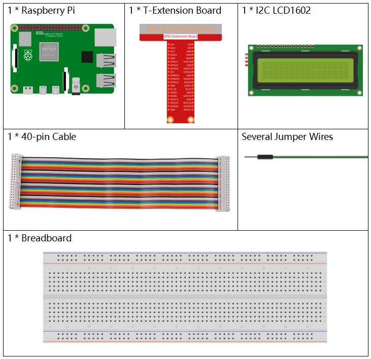
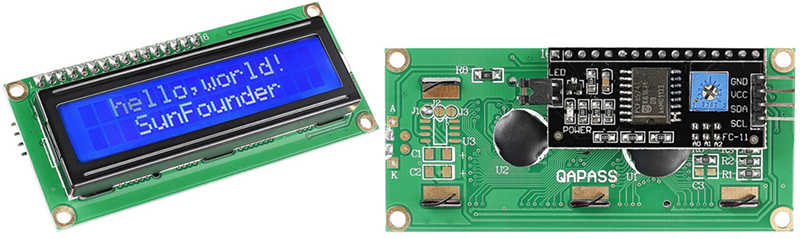
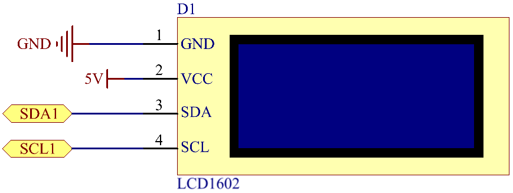
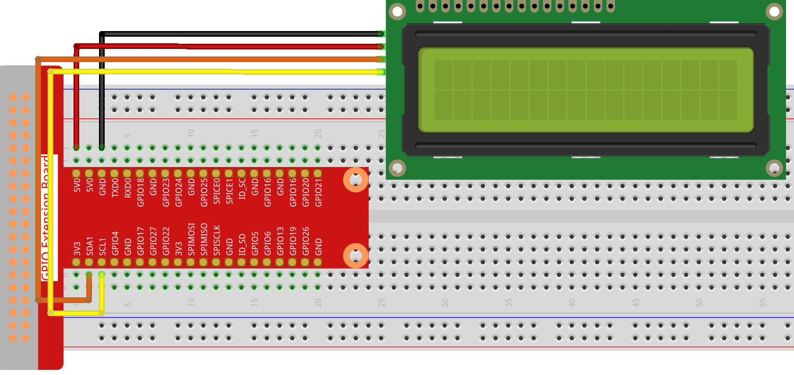

.. note::

    Bonjour, bienvenue dans la communauté SunFounder des passionnés de Raspberry Pi, Arduino et ESP32 sur Facebook ! Plongez-vous plus profondément dans l'univers du Raspberry Pi, de l'Arduino et de l'ESP32 avec d'autres passionnés.

    **Pourquoi nous rejoindre ?**

    - **Support d'experts** : Résolvez les problèmes après-vente et les défis techniques grâce à l'aide de notre communauté et de notre équipe.
    - **Apprendre et partager** : Échangez des astuces et des tutoriels pour perfectionner vos compétences.
    - **Aperçus exclusifs** : Profitez d'un accès anticipé aux nouvelles annonces de produits et aux aperçus.
    - **Remises spéciales** : Bénéficiez de réductions exclusives sur nos derniers produits.
    - **Promotions festives et cadeaux** : Participez à des tirages au sort et à des promotions pendant les fêtes.

    👉 Prêt à explorer et à créer avec nous ? Cliquez sur [|link_sf_facebook|] et rejoignez-nous dès aujourd'hui !

1.1.7 LCD1602 I2C
======================

Introduction
------------------

Le LCD1602 est un écran à cristaux liquides de type caractère, capable d'afficher 
32 caractères (16*2) simultanément.

Composants
-------------------

Principe
-------------

**LCD1602 I2C**

* **GND** : Masse
* **VCC** : Alimentation électrique, 5V.
* **SDA** : Ligne de données série. Connecter au VCC via une résistance de tirage.
* **SCL** : Ligne d'horloge série. Connecter au VCC via une résistance de tirage.

Comme vous le savez, bien que les écrans LCD et d'autres types d'affichages enrichissent considérablement l'interaction homme-machine, ils présentent un inconvénient commun : lorsqu'ils sont connectés à un contrôleur, ils occupent de nombreux ports d'E/S, limitant ainsi d'autres fonctionnalités. 

C'est pourquoi le LCD1602 avec un module I2C a été développé pour résoudre ce problème. Le module I2C intègre une puce PCF8574 qui convertit les données série I2C en données parallèles pour l'affichage sur le LCD. 

* `PCF8574 Datasheet <https://www.ti.com/lit/ds/symlink/pcf8574.pdf?ts=1627006546204&ref_url=https%253A%252F%252Fwww.google.com%252F>`_

**Adresse I2C**

L'adresse par défaut est généralement 0x27, dans quelques cas, elle peut être 0x3F.

Prenons l'exemple de l'adresse par défaut 0x27, l'adresse de l'appareil peut être modifiée en court-circuitant les broches A0/A1/A2 ; à l'état par défaut, A0/A1/A2 sont à 1, et si le pont est réalisé, A0/A1/A2 sont à 0.

.. image:: img/i2c_address.jpg
    :width: 600

**Rétroéclairage/Contraste**

Le rétroéclairage peut être activé par un cavalier. Retirez le cavalier pour désactiver le rétroéclairage. Le potentiomètre bleu à l'arrière est utilisé pour ajuster le contraste (le rapport de luminosité entre le blanc le plus brillant et le noir le plus sombre).

.. image:: img/back_lcd1602.jpg

* **Cavalier de court-circuit** : Le rétroéclairage peut être activé grâce à ce cavalier. Retirez-le pour désactiver le rétroéclairage.
* **Potentiomètre** : Utilisé pour ajuster le contraste (la clarté du texte affiché), qui augmente dans le sens horaire et diminue dans le sens antihoraire.

Schéma de câblage
---------------------

============ ========
T-Board Name physical
SDA1         Pin 3
SCL1         Pin 5
============ ========

Procédures expérimentales
-----------------------------

**Étape 1 :** Construisez le circuit.

**Étape 2 :** Configurez I2C (voir :ref:`I2C Configuration`. Si vous avez déjà configuré I2C, passez cette étape).

**Étape 3 :** Changez de répertoire.

.. raw:: html

   <run></run>

.. code-block::

    cd ~/davinci-kit-for-raspberry-pi/c/1.1.7/

**Étape 4 :** Compilez.

.. raw:: html

   <run></run>

.. code-block::

    gcc 1.1.7_Lcd1602.c -lwiringPi

**Étape 5 :** Exécutez.

.. raw:: html

   <run></run>

.. code-block::

    sudo ./a.out

Après l'exécution du code, vous verrez « Greetings », « From SunFounder » s'afficher sur le LCD.

.. note::

    * Si une erreur indique ``wiringPi.h: No such file or directory``, veuillez vous référer à :ref:`install_wiringpi`.
    * Si vous obtenez l'erreur ``Unable to open I2C device: No such file or directory``, vous devez vous référer à :ref:`i2c_config` pour activer I2C et vérifier si le câblage est correct.
    * Si le code et le câblage sont corrects mais que le LCD n'affiche toujours pas de contenu, ajustez le potentiomètre à l'arrière pour augmenter le contraste.

**Code**

.. code-block:: c

    #include <stdio.h>
    #include <wiringPi.h>
    #include <wiringPiI2C.h>
    #include <string.h>

    int LCDAddr = 0x27;
    int BLEN = 1;
    int fd;

    void write_word(int data){
        int temp = data;
        if ( BLEN == 1 )
            temp |= 0x08;
        else
            temp &= 0xF7;
        wiringPiI2CWrite(fd, temp);
    }

    void send_command(int comm){
        int buf;
        // Envoie des bits 7 à 4 en premier
        buf = comm & 0xF0;
        buf |= 0x04;			// RS = 0, RW = 0, EN = 1
        write_word(buf);
        delay(2);
        buf &= 0xFB;			// Désactive EN (EN = 0)
        write_word(buf);

        // Envoie des bits 3 à 0 en second
        buf = (comm & 0x0F) << 4;
        buf |= 0x04;			// RS = 0, RW = 0, EN = 1
        write_word(buf);
        delay(2);
        buf &= 0xFB;			// Désactive EN (EN = 0)
        write_word(buf);
    }

    void send_data(int data){
        int buf;
        // Envoie des bits 7 à 4 en premier
        buf = data & 0xF0;
        buf |= 0x05;			// RS = 1, RW = 0, EN = 1
        write_word(buf);
        delay(2);
        buf &= 0xFB;			// Désactive EN (EN = 0)
        write_word(buf);

        // Envoie des bits 3 à 0 en second
        buf = (data & 0x0F) << 4;
        buf |= 0x05;			// RS = 1, RW = 0, EN = 1
        write_word(buf);
        delay(2);
        buf &= 0xFB;			// Désactive EN (EN = 0)
        write_word(buf);
    }

    void init(){
        send_command(0x33);	// Initialisation en mode 8 lignes
        delay(5);
        send_command(0x32);	// Passage en mode 4 lignes
        delay(5);
        send_command(0x28);	// 2 lignes et caractères 5*7
        delay(5);
        send_command(0x0C);	// Activation de l'affichage sans curseur
        delay(5);
        send_command(0x01);	// Effacement de l'écran
        wiringPiI2CWrite(fd, 0x08);
    }

    void clear(){
        send_command(0x01);	// Effacement de l'écran
    }

    void write(int x, int y, char data[]){
        int addr, i;
        int tmp;
        if (x < 0)  x = 0;
        if (x > 15) x = 15;
        if (y < 0)  y = 0;
        if (y > 1)  y = 1;

        // Déplace le curseur
        addr = 0x80 + 0x40 * y + x;
        send_command(addr);
        
        tmp = strlen(data);
        for (i = 0; i < tmp; i++){
            send_data(data[i]);
        }
    }

    void main(){
        fd = wiringPiI2CSetup(LCDAddr);
        init();
        write(0, 0, "Greetings!");
        write(1, 1, "From SunFounder");
    }

**Explication du Code**

.. code-block::

    void write_word(int data){……}
    void send_command(int comm){……}
    void send_data(int data){……}
    void init(){……}
    void clear(){……}
    void write(int x, int y, char data[]){……}

Ces fonctions sont utilisées pour contrôler le code source ouvert du LCD1602 I2C, ce qui nous permet de l'utiliser facilement.
Parmi ces fonctions, `init()` est utilisée pour l'initialisation, `clear()` pour effacer l'écran, `write()` pour écrire les informations à afficher, et les autres fonctions servent de support à ces principales.

.. code-block:: c

    fd = wiringPiI2CSetup(LCDAddr);

Cette fonction initialise le système I2C avec le symbole de l'appareil spécifié. Le prototype de la fonction :

.. code-block:: c

    int wiringPiI2CSetup(int devId);

Le paramètre `devId` est l'adresse du périphérique I2C, il peut être trouvé via la commande `i2cdetect` (voir annexe) et l'adresse de l'I2C LCD1602 est généralement 0x27.

.. code-block:: c

    void write(int x, int y, char data[]){}

Dans cette fonction, `data[]` est le texte à imprimer sur le LCD, et les paramètres `x` et `y` déterminent la position d'impression (la ligne y+1, la colonne x+1 correspond au point de départ du texte à afficher).

