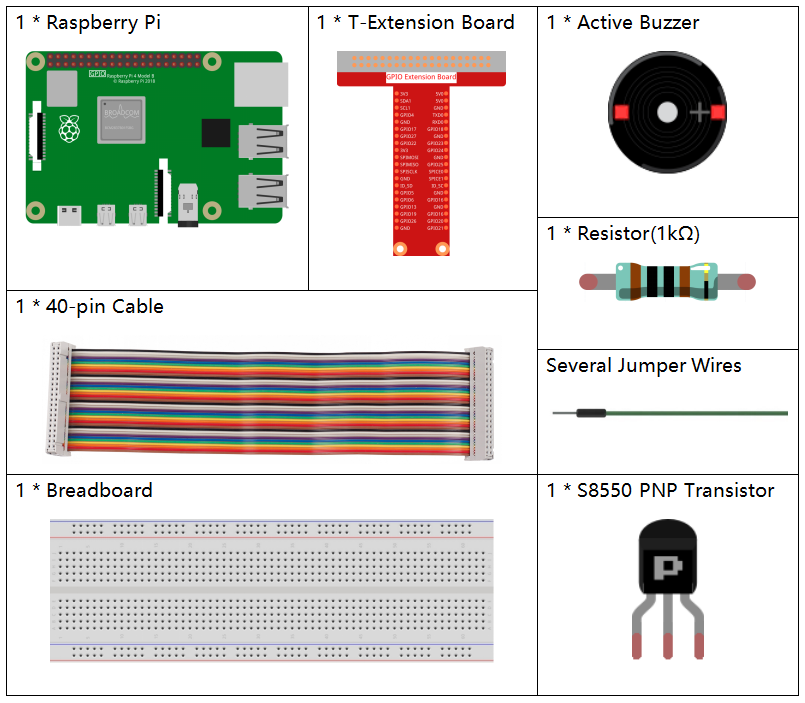
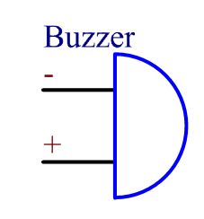

.. note::

    ¡Hola! Bienvenido a la Comunidad de Entusiastas de SunFounder Raspberry Pi, Arduino y ESP32 en Facebook. Profundiza en Raspberry Pi, Arduino y ESP32 junto a otros entusiastas.

    **¿Por qué unirse?**

    - **Soporte Experto**: Resuelve problemas post-venta y desafíos técnicos con la ayuda de nuestra comunidad y equipo.
    - **Aprender y Compartir**: Intercambia consejos y tutoriales para mejorar tus habilidades.
    - **Avances Exclusivos**: Accede anticipadamente a anuncios de nuevos productos y avances.
    - **Descuentos Especiales**: Disfruta de descuentos exclusivos en nuestros productos más nuevos.
    - **Promociones Festivas y Sorteos**: Participa en sorteos y promociones navideñas.

    👉 ¿Listo para explorar y crear con nosotros? Haz clic en [|link_sf_facebook|] y únete hoy!

1.2.1 Zumbador Activo
========================

Introducción
--------------

En esta lección, aprenderemos a controlar un zumbador activo para que emita 
un sonido utilizando un transistor PNP.

Componentes
-------------

Principio
------------

**Zumbador**

Como un tipo de zumbador electrónico con estructura integrada, los zumbadores, 
que son alimentados por corriente continua, se utilizan ampliamente en computadoras, 
impresoras, fotocopiadoras, alarmas, juguetes electrónicos, dispositivos electrónicos 
automotrices, teléfonos, temporizadores y otros productos electrónicos o dispositivos 
de voz. Los zumbadores se pueden categorizar en activos y pasivos (ver la imagen siguiente). 
Coloca el zumbador de modo que sus pines queden hacia arriba; el zumbador con una placa de 
circuito verde es un zumbador pasivo, mientras que el que está envuelto con cinta negra es un zumbador activo.

La diferencia entre un zumbador activo y uno pasivo:

.. image:: img/image101.png
    :width: 400
    :align: center

La diferencia entre un zumbador activo y uno pasivo es la siguiente: 
un zumbador activo tiene una fuente de oscilación incorporada, por lo que 
produce sonido cuando se energiza. En cambio, un zumbador pasivo no tiene 
dicha fuente, por lo que no emitirá sonido si se utilizan señales de corriente 
continua; en su lugar, se deben usar ondas cuadradas cuya frecuencia esté entre 
2K y 5K para activarlo. El zumbador activo suele ser más caro que el pasivo 
debido a sus múltiples circuitos osciladores incorporados.

A continuación se muestra el símbolo eléctrico de un zumbador. Tiene dos 
pines con polos positivo y negativo. Con un + en la superficie que representa 
el ánodo y el otro es el cátodo.

Puedes verificar los pines del zumbador; el más largo es el ánodo y el más corto 
es el cátodo. No los confundas al conectarlos, de lo contrario, el zumbador no emitirá sonido.

Diagrama Esquemático
-------------------------

En este experimento, se utiliza un zumbador activo, un transistor PNP y una 
resistencia de 1k entre la base del transistor y GPIO para proteger el transistor. 
Cuando la salida GPIO17 de Raspberry Pi está en bajo (0V) mediante programación, 
el transistor conducirá debido a la saturación de corriente y el zumbador 
emitirá sonido. Sin embargo, cuando se suministre un nivel alto a la E/S de 
Raspberry Pi, el transistor se cortará y el zumbador no emitirá sonido.

.. image:: img/image332.png

Procedimientos Experimentales
---------------------------------

**Paso 1:** Construir el circuito. (Presta atención a los polos del zumbador: 
el que tiene la etiqueta + es el polo positivo y el otro es el negativo.)

.. image:: img/image104.png
    :width: 800

**Paso 2:** Abre el archivo de código.

.. raw:: html

   <run></run>

.. code-block::

    cd ~/davinci-kit-for-raspberry-pi/c/1.2.1/

**Paso 3:** Compila el código.

.. raw:: html

   <run></run>

.. code-block::

    gcc 1.2.1_ActiveBuzzer.c -lwiringPi

**Paso 4:** Ejecuta el archivo ejecutable.

.. raw:: html

   <run></run>

.. code-block::

    sudo ./a.out

Al ejecutar el código, el zumbador emitirá un sonido.

.. note::

    Si no funciona después de ejecutarlo, o aparece un mensaje de error: \"wiringPi.h: No such file or directory\", consulta :ref:`c code is not working?`.

**Código**

.. code-block:: c

    #include <wiringPi.h>
    #include <stdio.h>

    #define BeepPin 0
    int main(void){
        if(wiringPiSetup() == -1){ //si la inicialización de wiring falla, imprime un mensaje en pantalla
            printf("setup wiringPi failed !");
            return 1;
        }
        
        pinMode(BeepPin, OUTPUT);   //configura GPIO0 como salida
        while(1){
            //zumbador encendido
            printf("Buzzer on\n");
            digitalWrite(BeepPin, LOW);
            delay(100);
            printf("Buzzer off\n");
            //zumbador apagado
            digitalWrite(BeepPin, HIGH);
            delay(100);
        }
        return 0;
    }

**Explicación del Código**

.. code-block:: c

    digitalWrite(BeepPin, LOW);

Utilizamos un zumbador activo en este experimento, por lo que emitirá 
sonido automáticamente al conectarlo a la corriente continua. Este código 
establece el puerto de E/S en nivel bajo (0V), lo que permite gestionar el 
transistor y hacer que el zumbador emita sonido.

.. code-block:: c

    digitalWrite(BeepPin, HIGH);

Esto establece el puerto de E/S en nivel alto (3.3V), por lo que el transistor 
no se energiza y el zumbador no emite sonido.
