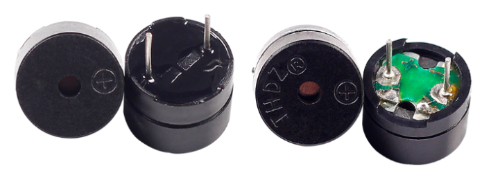

.. note::

    こんにちは、SunFounderのRaspberry Pi & Arduino & ESP32愛好家コミュニティへようこそ！Facebook上でRaspberry Pi、Arduino、ESP32についてもっと深く掘り下げ、他の愛好家と交流しましょう。

    **参加する理由は？**

    - **エキスパートサポート**：コミュニティやチームの助けを借りて、販売後の問題や技術的な課題を解決します。
    - **学び＆共有**：ヒントやチュートリアルを交換してスキルを向上させましょう。
    - **独占的なプレビュー**：新製品の発表や先行プレビューに早期アクセスしましょう。
    - **特別割引**：最新製品の独占割引をお楽しみください。
    - **祭りのプロモーションとギフト**：ギフトや祝日のプロモーションに参加しましょう。

    👉 私たちと一緒に探索し、創造する準備はできていますか？[|link_sf_facebook|]をクリックして今すぐ参加しましょう！

1.2.1 アクティブブザー
======================

前書き
------------

このレッスンでは、PNPトランジスタでアクティブブザーを鳴らす方法を学習する。

部品
----------

.. image:: ../img/list_1.2.1.png

原理
---------

**ブザー**

統合された構造を持つ電子ブザーの一種として、DC電源によって電圧供給されるブザーは、コンピューター、プリンター、コピー機、警報器、電子玩具、自動車用電子装置、電話、タイマー、その他の電子製品または音声装置で広く使用されている。ブザーは、アクティブとパッシブに分類できる（次の図を参照）。ピンが上を向くようにブザーを回し、緑色の回路基板を備えたブザーはパッシブブザーで、黒いテープで囲まれたブザーはアクティブである。

アクティブブザーとパッシブブザーの違い：

アクティブブザーとパッシブブザーの違いは次の通りである：アクティブブザーには振動源が内蔵されているため、通電すると音が鳴る。ただし、パッシブブザーにはそのような振動源がないため、DC信号が使用されてもビープ音は鳴らない。代わりに、周波数が2K〜5Kの方形波を使用して駆動する必要がある。アクティブブザーは、多くの場合、複数の発振回路が内蔵されているため、パッシブブザーよりも高価である。

以下はブザーの電気記号である。両極の2つのピンが搭載されている。表面の+は陽極を表し、もう1つは陰極を表す。

.. image:: ../img/image102.png
    :width: 150
    :align: center

ブザーのピンをチェックすることができ、長い方が陽極で、短い方が陰極である。接続時にそれらを混同しないでください。混同すると、ブザーが鳴らない。

回路図
-----------------

この実験では、アクティブブザー、PNPトランジスタ、および1k抵抗器をトランジスタのベースとGPIOの間に使用して、トランジスタを保護する。Raspberry Pi出力のGPIO17にプログラミングによって低レベル（0V）が供給されると、電流飽和のためトランジスタが導通し、ブザーが音を出す。しかし、Raspberry PiのIOに高レベルが供給されると、トランジスターが切断され、ブザーは音を出さない。

.. image:: ../img/image332.png

実験手順
-----------------------

ステップ1： 回路を作る。（ブザーの両極に注意してください：+ラベルが付いている方が正極で、もう一方が負極である。）

.. image:: ../img/image104.png
    :width: 800

ステップ2： コードファイルを開く。

.. raw:: html

   <run></run>

.. code-block::

    cd /home/pi/davinci-kit-for-raspberry-pi/c/1.2.1/

ステップ3： コードをコンパイルする。

.. raw:: html

   <run></run>

.. code-block::

    gcc 1.2.1_ActiveBuzzer.c -lwiringPi

ステップ4： EXEファイルを実行する。

.. raw:: html

   <run></run>

.. code-block::

    sudo ./a.out

コードが実行されると、ブザーが鳴く。

**コード**

.. code-block:: c

    #include <wiringPi.h>
    #include <stdio.h>

    #define BeepPin 0
    int main(void){
        if(wiringPiSetup() == -1){ //when initialize wiring failed, print messageto screen
            printf("setup wiringPi failed !");
            return 1;
        }
        
        pinMode(BeepPin, OUTPUT);   //set GPIO0 output
        while(1){
            //beep on
            printf("Buzzer on\n");
            digitalWrite(BeepPin, LOW);
            delay(100);
            printf("Buzzer off\n");
            //beep off
            digitalWrite(BeepPin, HIGH);
            delay(100);
        }
        return 0;
    }

**コードの説明**

.. code-block:: c

    digitalWrite(BeepPin, LOW);

この実験ではアクティブブザーを使用しているため、直流に接続すると自動的に音が鳴く。このスケッチは、I/Oポートを低レベル（0V）に設定して、トランジスタを管理し、ブザーを鳴らすためのものである。

.. code-block:: c

    digitalWrite(BeepPin, HIGH);

I/Oポートを高レベル（3.3V）に設定するため、トランジスターは通電されず、ブザーは鳴らない。
