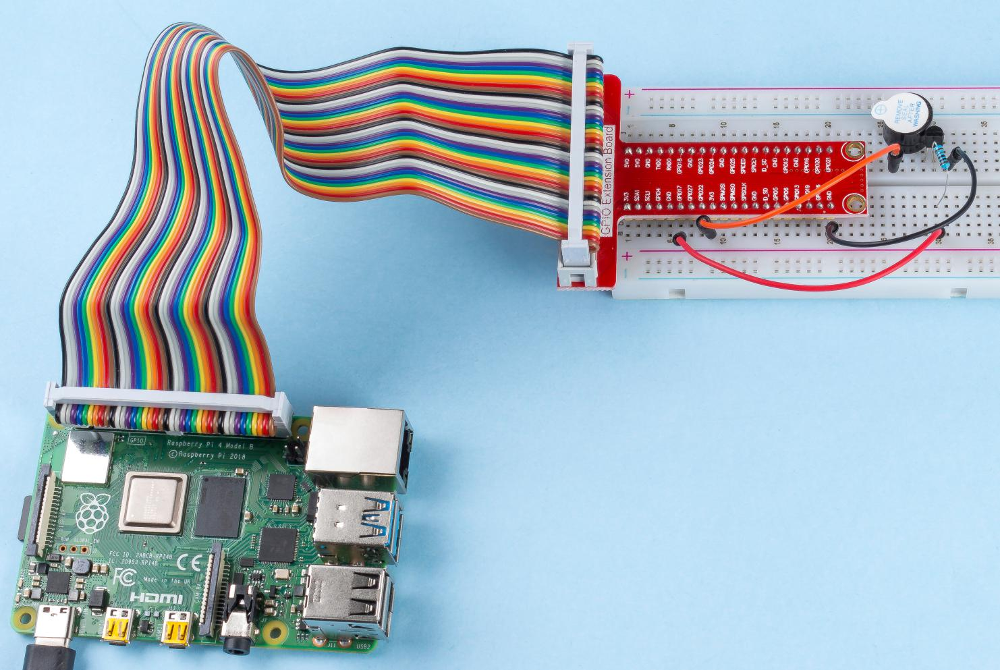

.. note::

    Hello, welcome to the SunFounder Raspberry Pi & Arduino & ESP32 Enthusiasts Community on Facebook! Dive deeper into Raspberry Pi, Arduino, and ESP32 with fellow enthusiasts.

    **Why Join?**

    - **Expert Support**: Solve post-sale issues and technical challenges with help from our community and team.
    - **Learn & Share**: Exchange tips and tutorials to enhance your skills.
    - **Exclusive Previews**: Get early access to new product announcements and sneak peeks.
    - **Special Discounts**: Enjoy exclusive discounts on our newest products.
    - **Festive Promotions and Giveaways**: Take part in giveaways and holiday promotions.

    👉 Ready to explore and create with us? Click [|link_sf_facebook|] and join today!

1.2.1 Active Buzzer
===================

Introduction
------------

In this lesson, we will learn how to drive an active buzzer to beep with
a PNP transistor.

Components
----------

.. image:: img/list_1.2.1.png

Principle
---------

**Buzzer**

As a type of electronic buzzer with an integrated structure, buzzers,
which are supplied by DC power, are widely used in computers, printers,
photocopiers, alarms, electronic toys, automotive electronic devices,
telephones, timers and other electronic products or voice devices.
Buzzers can be categorized as active and passive ones (see the following
picture). Turn the buzzer so that its pins are facing up, and the buzzer
with a green circuit board is a passive buzzer, while the one enclosed
with a black tape is an active one.

The difference between an active buzzer and a passive buzzer:

.. image:: img/image101.png
    :width: 400
    :align: center

The difference between an active buzzer and a passive buzzer is: An
active buzzer has a built-in oscillating source, so it will make sounds
when electrified. But a passive buzzer does not have such source, so it
will not beep if DC signals are used; instead, you need to use square
waves whose frequency is between 2K and 5K to drive it. The active
buzzer is often more expensive than the passive one because of multiple
built-in oscillating circuits.

The following is the electrical symbol of a buzzer. It has two pins with
positive and negative poles. With a + in the surface represents the
anode and the other is the cathode.

.. image:: img/image102.png
    :width: 150
    :align: center

You can check the pins of the buzzer, the longer one is the anode and
the shorter one is the cathode. Please don’t mix them up when
connecting, otherwise the buzzer will not make sound.

Schematic Diagram
-----------------

In this experiment, an active buzzer, a PNP transistor and a 1k resistor
are used between the base of the transistor and GPIO to protect the
transistor. When the GPIO17 of Raspberry Pi output is supplied with low
level (0V) by programming, the transistor will conduct because of
current saturation and the buzzer will make sounds. But when high level
is supplied to the IO of Raspberry Pi, the transistor will be cut off
and the buzzer will not make sounds.

.. image:: img/image332.png

Experimental Procedures
-----------------------

**Step 1:** Build the circuit. (Pay attention to poles of the buzzer:
The one with + label is the positive pole and the other is the
negative.)

.. image:: img/image104.png
    :width: 800

For C Language Users
^^^^^^^^^^^^^^^^^^^^

**Step 2**: Open the code file.

.. raw:: html

   <run></run>

.. code-block::

    cd ~/davinci-kit-for-raspberry-pi/c/1.2.1/

**Step 3**: Compile the code.

.. raw:: html

   <run></run>

.. code-block::

    gcc 1.2.1_ActiveBuzzer.c -lwiringPi

**Step 4**: Run the executable file above.

.. raw:: html

   <run></run>

.. code-block::

    sudo ./a.out

The code run, the buzzer beeps.

.. note::

    If it does not work after running, or there is an error prompt: \"wiringPi.h: No such file or directory\", please refer to :ref:`C code is not working?`.

**Code**

.. code-block:: c

    #include <wiringPi.h>
    #include <stdio.h>

    #define BeepPin 0
    int main(void){
        if(wiringPiSetup() == -1){ //when initialize wiring failed, print messageto screen
            printf("setup wiringPi failed !");
            return 1;
        }
        
        pinMode(BeepPin, OUTPUT);   //set GPIO0 output
        while(1){
            //beep on
            printf("Buzzer on\n");
            digitalWrite(BeepPin, LOW);
            delay(100);
            printf("Buzzer off\n");
            //beep off
            digitalWrite(BeepPin, HIGH);
            delay(100);
        }
        return 0;
    }

**Code Explanation**

.. code-block:: c

    digitalWrite(BeepPin, LOW);

We use an active buzzer in this experiment, so it will make sound 
automatically when connecting to the direct current. This sketch 
is to set the I/O port as low level (0V), thus to manage the 
transistor and make the buzzer beep. 

.. code-block:: c

    digitalWrite(BeepPin, HIGH);

To set the I/O port as high level(3.3V), thus the transistor is 
not energized and the buzzer doesn’t beep. 

For Python Language Users
^^^^^^^^^^^^^^^^^^^^^^^^^

**Step 2**: Open the code file.

.. raw:: html

   <run></run>

.. code-block::

    cd ~/davinci-kit-for-raspberry-pi/python

**Step 3**: Run.

.. raw:: html

    <run></run>

.. code-block::

    sudo python3 1.2.1_ActiveBuzzer.py

The code run, the buzzer beeps.

**Code**

.. note::

    You can **Modify/Reset/Copy/Run/Stop** the code below. But before that, you need to go to  source code path like ``davinci-kit-for-raspberry-pi/python``. 
    
.. raw:: html

    <run></run>

.. code-block:: python

    import RPi.GPIO as GPIO
    import time

    # Set #17 as buzzer pin
    BeepPin = 17

    def setup():
        # Set the GPIO modes to BCM Numbering
        GPIO.setmode(GPIO.BCM)
        # Set LedPin's mode to output, 
        # and initial level to High(3.3v)
        GPIO.setup(BeepPin, GPIO.OUT, initial=GPIO.HIGH)

    def main():
        while True:
            # Buzzer on (Beep)
            print ('Buzzer On')
            GPIO.output(BeepPin, GPIO.LOW)
            time.sleep(0.1)
            # Buzzer off
            print ('Buzzer Off')
            GPIO.output(BeepPin, GPIO.HIGH)
            time.sleep(0.1)

    def destroy():
        # Turn off buzzer
        GPIO.output(BeepPin, GPIO.HIGH)
        # Release resource
        GPIO.cleanup()    

    # If run this script directly, do:
    if __name__ == '__main__':
        setup()
        try:
            main()
        # When 'Ctrl+C' is pressed, the program 
        # destroy() will be  executed.
        except KeyboardInterrupt:
            destroy()

**Code Explanation**

.. code-block:: python

    GPIO.output(BeepPin, GPIO.LOW)

Set the buzzer pin as low level to make the buzzer beep.  

.. code-block:: python

    time.sleep(0.1)

Wait for 0.1 second. Change the switching frequency by 
changing this parameter. 

.. note::
    Not the sound frequency. Active Buzzer cannot change sound frequency.

.. code-block:: python

    GPIO.output(BeepPin, GPIO.HIGH)

Close the buzzer. 

Phenomenon Picture
------------------

