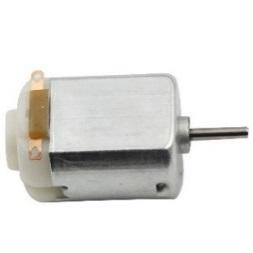
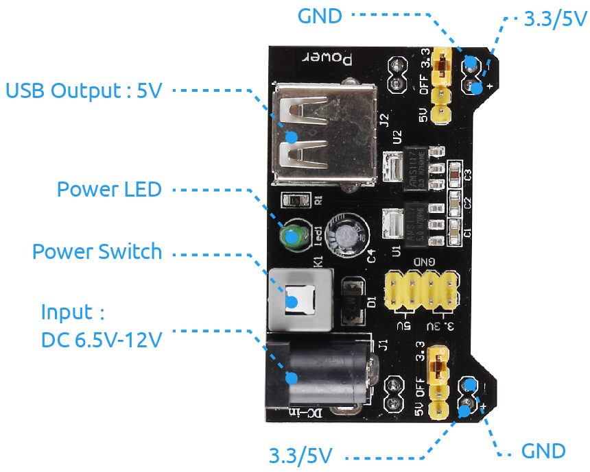

.. note::

    ¡Hola! Bienvenido a la Comunidad de Entusiastas de SunFounder Raspberry Pi, Arduino y ESP32 en Facebook. Profundiza en Raspberry Pi, Arduino y ESP32 junto a otros entusiastas.

    **¿Por qué unirse?**

    - **Soporte Experto**: Resuelve problemas post-venta y desafíos técnicos con la ayuda de nuestra comunidad y equipo.
    - **Aprender y Compartir**: Intercambia consejos y tutoriales para mejorar tus habilidades.
    - **Avances Exclusivos**: Accede anticipadamente a anuncios de nuevos productos y avances.
    - **Descuentos Especiales**: Disfruta de descuentos exclusivos en nuestros productos más nuevos.
    - **Promociones Festivas y Sorteos**: Participa en sorteos y promociones navideñas.

    👉 ¿Listo para explorar y crear con nosotros? Haz clic en [|link_sf_facebook|] y únete hoy!

1.3.1 Motor
=============

Introducción
---------------

En esta lección, aprenderemos a utilizar el L293D para accionar un motor de 
corriente continua y hacerlo girar en sentido horario y antihorario. Dado que 
el motor de corriente continua necesita una corriente mayor, utilizaremos el 
módulo de alimentación para alimentar los motores por razones de seguridad.

Componentes
---------------

.. image:: img/list_1.3.1.png

Principio
-------------

**L293D**

El L293D es un controlador de motor de 4 canales integrado en un chip que 
soporta alta tensión y alta corriente. Está diseñado para conectarse a niveles 
lógicos estándar DTL y TTL, y para accionar cargas inductivas (como bobinas de 
relé, motores de CC, motores paso a paso) y transistores de conmutación de 
potencia, entre otros. Los motores de corriente continua son dispositivos que 
convierten la energía eléctrica en corriente continua en energía mecánica. Se 
utilizan ampliamente en accionamientos eléctricos debido a su excelente rendimiento 
en la regulación de velocidad.

A continuación se muestra la figura de los pines. El L293D tiene dos pines (Vcc1 y Vcc2) para la alimentación. Vcc2 se utiliza para alimentar el motor, mientras que Vcc1 alimenta el chip. Dado que aquí se utiliza un motor de corriente continua de pequeño tamaño, conectaremos ambos pines a +5V.

.. image:: img/image111.png

La siguiente figura muestra la estructura interna del L293D. El pin EN es un 
pin de habilitación que solo funciona con un nivel alto; A representa la 
entrada y Y la salida. Puedes ver la relación entre ellos en la parte inferior 
derecha. Cuando el pin EN está en nivel alto, si A está en alto, Y saldrá en 
nivel alto; si A está en bajo, Y saldrá en bajo. Cuando el pin EN está en bajo, 
el L293D no funcionará.

.. image:: img/image334.png

**Motor de Corriente Continua**

Este es un motor de CC de 5V. Girará cuando se le dé a los dos terminales 
de la placa de cobre un nivel alto y uno bajo. Para mayor comodidad, puedes 
soldar los pines al motor.

.. image:: img/image335.png

**Módulo de Alimentación**

En este experimento, se necesita una gran corriente para accionar el motor, 
especialmente al iniciar y detener, lo que interferirá severamente con el 
funcionamiento normal de la Raspberry Pi. Por lo tanto, alimentaremos el 
motor por separado con este módulo para que funcione de manera segura y estable.

Puedes simplemente conectarlo en la placa de pruebas para suministrar energía. 
Proporciona voltajes de 3.3V y 5V, y puedes conectar cualquiera de ellos a 
través de un capuchón de puente incluido.

Diagrama Esquemático
-----------------------

Conecta el módulo de alimentación en la placa de pruebas e inserta el capuchón 
de puente en el pin de 5V, luego saldrá un voltaje de 5V. Conecta el pin 1 del 
L293D a GPIO22 y configúralo en nivel alto. Conecta el pin 2 a GPIO27 y el pin 7 
a GPIO17, luego establece un pin en alto y el otro en bajo. De esta manera, puedes 
cambiar la dirección de rotación del motor.

.. image:: img/image336.png

Procedimientos Experimentales
--------------------------------

**Paso 1:** Construir el circuito.

.. image:: img/1.3.1.png
    :width: 800

.. note::
    El módulo de alimentación puede usar una batería de 9V con el conector 
    de batería de 9V incluido en el kit. Inserta el capuchón de puente del 
    módulo de alimentación en las tiras de bus de 5V de la placa de pruebas.

.. image:: img/image118.jpeg

**Paso 2**: Acceder a la carpeta del código.

.. raw:: html

    <run></run>

.. code-block::

    cd ~/davinci-kit-for-raspberry-pi/c/1.3.1/

**Paso 3**: Compilar.

.. raw:: html

   <run></run>

.. code-block::

    gcc 1.3.1_Motor.c -lwiringPi

**Paso 4**: Ejecutar el archivo ejecutable.

.. raw:: html

   <run></run>

.. code-block::

    sudo ./a.out

Al ejecutar el código, el motor primero girará en sentido horario 
durante 5 segundos, luego se detendrá durante 5 segundos, después girará 
en sentido antihorario durante 5 segundos; posteriormente, el motor se 
detendrá durante 5 segundos. Esta serie de acciones se repetirá.

.. note::

    Si no funciona después de ejecutarlo, o aparece un mensaje de error: \"wiringPi.h: No such file or directory\", consulta :ref:`c code is not working?`.

**Código**

.. code-block:: c

    #include <wiringPi.h>
    #include <stdio.h>

    #define MotorPin1       0
    #define MotorPin2       2
    #define MotorEnable     3

    int main(void){
        int i;
        if(wiringPiSetup() == -1){ //si la inicialización de wiring falla, imprime un mensaje en pantalla
            printf("setup wiringPi failed !");
            return 1;
        }
        
        pinMode(MotorPin1, OUTPUT);
        pinMode(MotorPin2, OUTPUT);
        pinMode(MotorEnable, OUTPUT);
        while(1){
            printf("Clockwise\n");
            delay(100);
            digitalWrite(MotorEnable, HIGH);
            digitalWrite(MotorPin1, HIGH);
            digitalWrite(MotorPin2, LOW);
            for(i=0;i<3;i++){
                delay(1000);
            }

            printf("Stop\n");
            delay(100);
            digitalWrite(MotorEnable, LOW);
            for(i=0;i<3;i++){
                delay(1000);
            }

            printf("Anti-clockwise\n");
            delay(100);
            digitalWrite(MotorEnable, HIGH);
            digitalWrite(MotorPin1, LOW);
            digitalWrite(MotorPin2, HIGH);
            for(i=0;i<3;i++){
                delay(1000);
            }

            printf("Stop\n");
            delay(100);
            digitalWrite(MotorEnable, LOW);
            for(i=0;i<3;i++){
                delay(1000);
            }
        }
        return 0;
    }

**Explicación del Código**

.. code-block:: c

    digitalWrite(MotorEnable, HIGH);

Habilita el L239D.

.. code-block:: c

    digitalWrite(MotorPin1, HIGH);
    digitalWrite(MotorPin2, LOW);

Establece un nivel alto para 2A (pin 7); dado que 1,2EN (pin 1) está en 
nivel alto, 2Y saldrá en nivel alto.

Establece un nivel bajo para 1A, luego 1Y saldrá en nivel bajo, y 
el motor girará.

.. code-block:: c

    for(i=0;i<3;i++){
    delay(1000);
    }

Este bucle retrasa durante 3*1000 ms.

.. code-block:: c

    digitalWrite(MotorEnable, LOW)

Si 1,2EN (pin 1) está en nivel bajo, el L293D no funcionará. El motor deja de girar.

.. code-block:: c

    digitalWrite(MotorPin1, LOW)
    digitalWrite(MotorPin2, HIGH)

Invierte el flujo de corriente del motor, luego el motor girará en sentido inverso.

