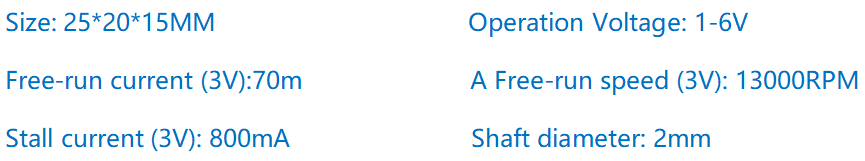

.. note::

    Ciao, benvenuto nella Community di SunFounder Raspberry Pi & Arduino & ESP32 Enthusiasts su Facebook! Approfondisci le tue conoscenze su Raspberry Pi, Arduino ed ESP32 insieme ad altri appassionati.

    **Perché Unirsi?**

    - **Supporto Esperto**: Risolvi problematiche post-vendita e sfide tecniche con l’aiuto della nostra comunità e del nostro team.
    - **Impara e Condividi**: Scambia consigli e tutorial per migliorare le tue competenze.
    - **Anteprime Esclusive**: Ottieni accesso anticipato a nuovi annunci di prodotti e anticipazioni.
    - **Sconti Speciali**: Goditi sconti esclusivi sui nostri ultimi prodotti.
    - **Promozioni Festive e Giveaway**: Partecipa a giveaway e promozioni speciali durante le festività.

    👉 Pronto per esplorare e creare con noi? Clicca [|link_sf_facebook|] e unisciti oggi stesso!

1.3.1 Motore
===============

Introduzione
------------------

In questa lezione, impareremo come utilizzare il driver L293D per controllare 
un motore CC e farlo ruotare in senso orario e antiorario. Poiché il motore CC 
richiede una corrente maggiore, per motivi di sicurezza, utilizziamo il modulo 
di alimentazione per fornire energia ai motori.

Componenti
--------------

.. image:: img/list_1.3.1.png

Principio
------------

**L293D**

L293D è un driver per motori a 4 canali con alta tensione e alta corrente 
integrato in un chip. È progettato per connettersi a livelli logici standard 
DTL, TTL e per pilotare carichi induttivi (come bobine di relè, motori CC, 
motori passo-passo) e transistor di commutazione di potenza. I motori CC sono 
dispositivi che trasformano l'energia elettrica CC in energia meccanica e sono 
ampiamente utilizzati per la loro elevata precisione nella regolazione della velocità.

Vedi la figura dei pin qui sotto. L293D ha due pin (Vcc1 e Vcc2) per l’alimentazione. 
Vcc2 alimenta il motore, mentre Vcc1 alimenta il chip. Dato che qui viene utilizzato 
un motore CC di piccole dimensioni, collega entrambi i pin a +5V.

.. image:: img/image111.png

Di seguito è riportata la struttura interna di L293D. Il pin EN è un pin di 
abilitazione che funziona solo con livello alto; A indica l’ingresso e Y l’uscita. 
Puoi vedere la relazione tra di loro in basso a destra. Quando il pin EN è a 
livello alto, se A è alto, Y fornisce un livello alto; se A è basso, Y fornisce 
un livello basso. Quando il pin EN è a livello basso, l’L293D non funziona.

.. image:: img/image334.png

**Motore CC**

.. image:: img/image114.jpeg

Questo è un motore CC a 5V. Ruoterà quando si applicano un livello alto e uno 
basso ai due terminali della lamina di rame. Per comodità, puoi saldare i pin.

**Modulo di Alimentazione**

In questo esperimento, sono necessarie grandi correnti per pilotare il motore, 
specialmente durante l’avvio e l’arresto, il che può interferire gravemente con 
il normale funzionamento del Raspberry Pi. Perciò, alimentiamo il motore separatamente 
con questo modulo per garantire un funzionamento sicuro e stabile.

Puoi inserirlo direttamente nella breadboard per fornire alimentazione. Fornisce 
una tensione di 3,3V e 5V, a cui puoi collegarti tramite un ponticello incluso.

.. image:: img/image115.png

Schema Elettrico
------------------

Inserisci il modulo di alimentazione nella breadboard e collega il ponticello 
al pin da 5V per ottenere un’uscita a 5V. Collega il pin 1 dell’L293D a GPIO22 
e impostalo a livello alto. Collega il pin2 a GPIO27 e il pin7 a GPIO17, quindi 
imposta uno dei pin a livello alto e l’altro a livello basso per cambiare la 
direzione di rotazione del motore.

.. image:: img/image336.png

Procedure Sperimentali
--------------------------

**Step 1:** Costruisci il circuito.

.. image:: img/1.3.1.png
    :width: 800

.. note::
    Il modulo di alimentazione può essere alimentato da una batteria da 9V con 
    la clip per batteria da 9V inclusa nel kit. Inserisci il ponticello del modulo 
    di alimentazione nella striscia da 5V della breadboard.

.. image:: img/image118.jpeg

**Step 2**: Entra nella cartella del codice.

.. raw:: html

    <run></run>
    
.. code-block::

    cd ~/davinci-kit-for-raspberry-pi/c/1.3.1/

**Step 3**: Compila.

.. raw:: html

   <run></run>

.. code-block::

    gcc 1.3.1_Motor.c -lwiringPi

**Step 4**: Esegui il file eseguibile sopra.

.. raw:: html

   <run></run>

.. code-block::

    sudo ./a.out

Durante l'esecuzione del codice, il motore ruota inizialmente in senso orario 
per 5 secondi, poi si ferma per 5 secondi; successivamente ruota in senso 
antiorario per 5 secondi e poi si ferma di nuovo per 5 secondi. Questa sequenza 
si ripeterà ciclicamente.

.. note::

    Se non funziona dopo l'esecuzione o compare un messaggio di errore come : \"wiringPi.h: No such file or directory", consulta :ref:`Il codice C non funziona?`.

**Codice**

.. code-block:: c

    #include <wiringPi.h>
    #include <stdio.h>

    #define MotorPin1       0
    #define MotorPin2       2
    #define MotorEnable     3

    int main(void){
        int i;
        if(wiringPiSetup() == -1){ //se l'inizializzazione di wiring fallisce, stampa un messaggio
            printf("setup wiringPi failed !");
            return 1;
        }
        
        pinMode(MotorPin1, OUTPUT);
        pinMode(MotorPin2, OUTPUT);
        pinMode(MotorEnable, OUTPUT);
        while(1){
            printf("Clockwise\n");
            delay(100);
            digitalWrite(MotorEnable, HIGH);
            digitalWrite(MotorPin1, HIGH);
            digitalWrite(MotorPin2, LOW);
            for(i=0;i<3;i++){
                delay(1000);
            }

            printf("Stop\n");
            delay(100);
            digitalWrite(MotorEnable, LOW);
            for(i=0;i<3;i++){
                delay(1000);
            }

            printf("Anti-clockwise\n");
            delay(100);
            digitalWrite(MotorEnable, HIGH);
            digitalWrite(MotorPin1, LOW);
            digitalWrite(MotorPin2, HIGH);
            for(i=0;i<3;i++){
                delay(1000);
            }

            printf("Stop\n");
            delay(100);
            digitalWrite(MotorEnable, LOW);
            for(i=0;i<3;i++){
                delay(1000);
            }
        }
        return 0;
    }

**Spiegazione del Codice**

.. code-block:: c

    digitalWrite(MotorEnable, HIGH);

Abilita l’L293D.

.. code-block:: c

    digitalWrite(MotorPin1, HIGH);
    digitalWrite(MotorPin2, LOW);

Imposta un livello alto per 2A (pin 7); poiché 1,2EN (pin 1) è a livello alto, 
2Y uscirà a livello alto.

Imposta un livello basso per 1A, quindi 1Y uscirà a livello basso e il motore 
inizierà a ruotare.

.. code-block:: c

    for(i=0;i<3;i++){
    delay(1000);
    }

questo ciclo è per un ritardo di 3*1000ms.

.. code-block:: c

    digitalWrite(MotorEnable, LOW)

Se 1,2EN (pin1) è a livello basso, l’L293D non funziona e il motore si ferma.

.. code-block:: c

    digitalWrite(MotorPin1, LOW)
    digitalWrite(MotorPin2, HIGH)

Inverti la direzione della corrente nel motore, e il motore ruoterà in senso opposto.
