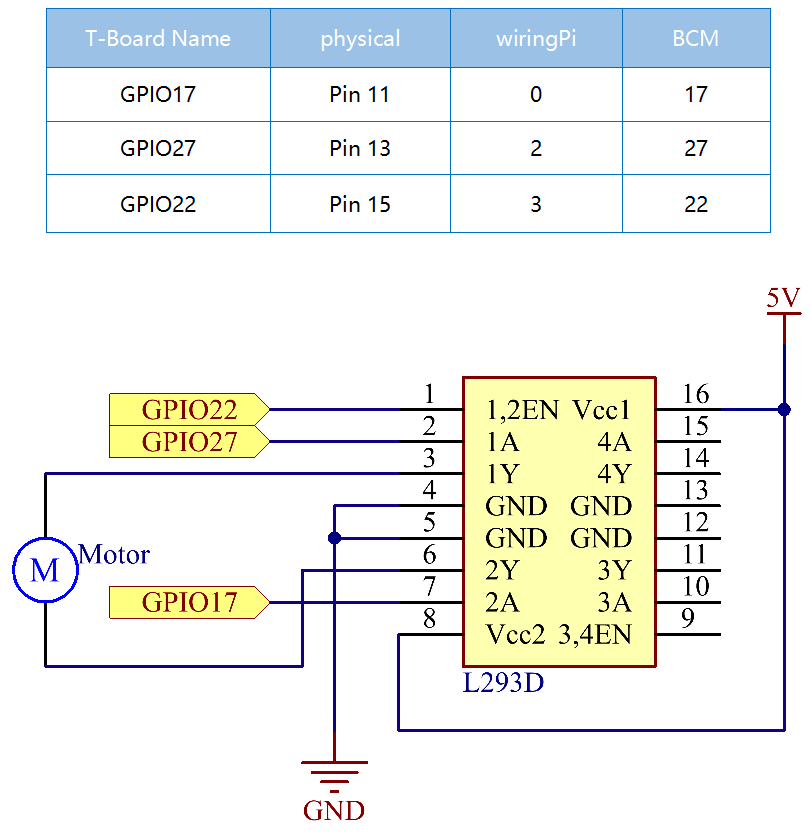

.. note::

    Hallo und willkommen in der SunFounder Raspberry Pi & Arduino & ESP32 Enthusiasten-Gemeinschaft auf Facebook! Tauchen Sie tiefer ein in die Welt von Raspberry Pi, Arduino und ESP32 mit anderen Enthusiasten.

    **Warum beitreten?**

    - **Expertenunterstützung**: Lösen Sie Nachverkaufsprobleme und technische Herausforderungen mit Hilfe unserer Gemeinschaft und unseres Teams.
    - **Lernen & Teilen**: Tauschen Sie Tipps und Anleitungen aus, um Ihre Fähigkeiten zu verbessern.
    - **Exklusive Vorschauen**: Erhalten Sie frühzeitigen Zugang zu neuen Produktankündigungen und exklusiven Einblicken.
    - **Spezialrabatte**: Genießen Sie exklusive Rabatte auf unsere neuesten Produkte.
    - **Festliche Aktionen und Gewinnspiele**: Nehmen Sie an Gewinnspielen und Feiertagsaktionen teil.

    👉 Sind Sie bereit, mit uns zu erkunden und zu erschaffen? Klicken Sie auf [|link_sf_facebook|] und treten Sie heute bei!

1.3.1 Motor
=============

Einführung
-----------------

In dieser Lektion lernen wir, 
mit L293D einen Gleichstrommotor antreiben und ihn im und gegen den Uhrzeigersinn drehen. 
Da der Gleichstrommotor aus Sicherheitsgründen einen größeren Strom benötigt, 
verwenden wir hier das Stromversorgungsmodul zur Versorgung der Motoren.

Komponenten
-----------------

.. image:: ../img/list_1.3.1.png

Prinzip
---------

**L293D**

L293D ist ein 4-Kanal-Motortreiber, der durch einen Chip mit hoher Spannung und hohem Strom integriert ist. Es ist für den Anschluss an Standard-DTL-, TTL-Logikniveau und ansteuerungsinduktive Lasten (wie Relaisspulen, Gleichstrom-, Schrittmotoren) sowie Leistungsschalttransistoren usw. ausgelegt. Gleichstrommotoren sind Geräte, die elektrische Gleichstromenergie in mechanische Energie umwandeln. Sie werden im elektrischen Antrieb wegen ihrer überlegenen Geschwindigkeitsregelungsleistung häufig verwendet.

Siehe die Abbildung der Pins unten. Der L293D verfügt über zwei Pins (Vcc1 und Vcc2) für die Stromversorgung. Vcc2 wird verwendet, um den Motor mit Strom zu versorgen, während Vcc1 dient, um den Chip zu versorgen. Da hier ein kleiner Gleichstrommotor verwendet wird, verbinden Sie beide Pins mit + 5V.

.. image:: ../img/image111.png

Das Folgende ist die interne Struktur von L293D. Pin EN ist ein Freigabepin und funktioniert nur mit hohem Niveau. A steht für Eingabe und Y für Ausgabe. Sie können die Beziehung zwischen ihnen unten rechts sehen. Wenn Pin EN auf Hohe Niveau steht und A auf High steht, gibt Y Hohe Niveau aus. Wenn A niedrig ist, gibt Y einen niedrigen Niveau aus. Wenn Pin EN auf niedgrigen Niveau steht, funktioniert der L293D nicht.

.. image:: ../img/image334.png

**Gleichspannungs Motor**

.. image:: ../img/image114.jpeg

Dies ist ein 5V Gleichstrommotor. Es dreht sich, wenn Sie den beiden Anschlüssen des Kupferblechs einen hohen und einen niedrigen Niveau geben. Der Einfachheit halber können Sie die Pin daran schweißen.

.. image:: ../img/image335.png

**Energieversorgung Modul**

In diesem Experiment werden große Ströme benötigt, um den Motor anzutreiben, insbesondere wenn er startet und stoppt, was die normale Arbeit von Raspberry Pi stark beeinträchtigt. Da versorgen wir diesen Motor separat mit Strom, damit er sicher und gleichmäßig läuft.

Sie können es einfach in das Steckbrett einstecken, um Strom zu liefern. Es liefert eine Spannung von 3,3V und 5V, und Sie können entweder über eine mitgelieferte Überbrückungskappe anschließen.

Schematische Darstellung
----------------------------

Stecken Sie das Netzteilmodul in das Steckbrett und setzen Sie die Überbrückungskappe auf 5V, dann wird eine Spannung von 5V ausgegeben. Verbinden Sie Pin 1 des L293D mit GPIO22 und stellen Sie ihn auf Hohe Niveau ein. Verbinden Sie Pin2 mit GPIO27 und Pin7 mit GPIO17 und setzen Sie dann einen Pin hoch, während der andere niedrig ist. So können Sie die Drehrichtung des Motors ändern.

Experimentelle Verfahren
--------------------------

Schritt 1: Bauen Sie die Schaltung auf.

.. note::
    Das Leistungsmodul kann eine 9-V-Batterie mit der im Kit enthaltenen 9V-Batterieschnalle anlegen. 
    Setzen Sie die Überbrückungskappe des Leistungsmoduls in die 5V-Busleisten des Steckbretts ein.

.. image:: ../img/image118.jpeg

Schritt 2: Gehen Sie in den Ordner der Kode.

.. raw:: html

    <run></run>
    
.. code-block::

    cd ~/davinci-kit-for-raspberry-pi/c/1.3.1/

Schritt 3: Kompilieren.

.. raw:: html

   <run></run>

.. code-block::

    gcc 1.3.1_Motor.c -lwiringPi

Schritt 4: Führen Sie die obige ausführbare Datei aus.

.. raw:: html

   <run></run>

.. code-block::

    sudo ./a.out

Während die Kode läuft, dreht sich der Motor zuerst 5 Sekunden lang im Uhrzeigersinn und stoppt dann 5 Sekunden lang. Danach dreht er sich 5 Sekunden lang gegen den Uhrzeigersinn. Anschließend stoppt der Motor für 5S. Diese Reihe von Aktionen wird wiederholt ausgeführt.

**Code**

.. code-block:: c

    #include <wiringPi.h>
    #include <stdio.h>

    #define MotorPin1       0
    #define MotorPin2       2
    #define MotorEnable     3

    int main(void){
        int i;
        if(wiringPiSetup() == -1){ //when initialize wiring failed, print messageto screen
            printf("setup wiringPi failed !");
            return 1;
        }
        
        pinMode(MotorPin1, OUTPUT);
        pinMode(MotorPin2, OUTPUT);
        pinMode(MotorEnable, OUTPUT);
        while(1){
            printf("Clockwise\n");
            delay(100);
            digitalWrite(MotorEnable, HIGH);
            digitalWrite(MotorPin1, HIGH);
            digitalWrite(MotorPin2, LOW);
            for(i=0;i<3;i++){
                delay(1000);
            }

            printf("Stop\n");
            delay(100);
            digitalWrite(MotorEnable, LOW);
            for(i=0;i<3;i++){
                delay(1000);
            }

            printf("Anti-clockwise\n");
            delay(100);
            digitalWrite(MotorEnable, HIGH);
            digitalWrite(MotorPin1, LOW);
            digitalWrite(MotorPin2, HIGH);
            for(i=0;i<3;i++){
                delay(1000);
            }

            printf("Stop\n");
            delay(100);
            digitalWrite(MotorEnable, LOW);
            for(i=0;i<3;i++){
                delay(1000);
            }
        }
        return 0;
    }

**Code Erklärung**

.. code-block:: c

    digitalWrite(MotorEnable, HIGH);

Aktivieren Sie den L239D.

.. code-block:: c

    digitalWrite(MotorPin1, HIGH);
    digitalWrite(MotorPin2, LOW);

Stellen Sie einen hohen Niveau für 2A ein (Pin 7); Da sich 1,2EN (Pin 1) auf einem hohen Niveau befindet, gibt 2Y einen hohen Niveau aus.

Stellen Sie einen niedrigen Niveau für 1A ein, dann gibt 1Y einen niedrigen Niveau aus und der Motor dreht sich.

.. code-block:: c

    for(i=0;i<3;i++){
    delay(1000);
    }

Diese Schleife soll 3*1000ms verzögern.

.. code-block:: c

    digitalWrite(MotorEnable, LOW)

Wenn sich 1,2EN (Pin1) auf einem niedrigen Niveau befindet, funktioniert L293D nicht. Motor stoppt sich zu drehen.

.. code-block:: c

    digitalWrite(MotorPin1, LOW)
    digitalWrite(MotorPin2, HIGH)

Den Stromfluss des Motors umkehren, dann dreht sich der Motor umgekehrt.
