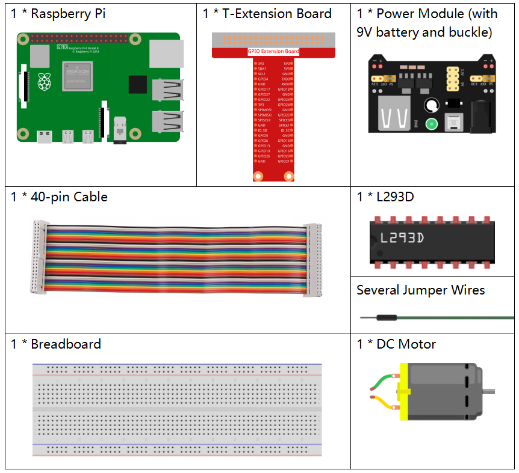

.. note::

    こんにちは、SunFounderのRaspberry Pi & Arduino & ESP32愛好家コミュニティへようこそ！Facebook上でRaspberry Pi、Arduino、ESP32についてもっと深く掘り下げ、他の愛好家と交流しましょう。

    **参加する理由は？**

    - **エキスパートサポート**：コミュニティやチームの助けを借りて、販売後の問題や技術的な課題を解決します。
    - **学び＆共有**：ヒントやチュートリアルを交換してスキルを向上させましょう。
    - **独占的なプレビュー**：新製品の発表や先行プレビューに早期アクセスしましょう。
    - **特別割引**：最新製品の独占割引をお楽しみください。
    - **祭りのプロモーションとギフト**：ギフトや祝日のプロモーションに参加しましょう。

    👉 私たちと一緒に探索し、創造する準備はできていますか？[|link_sf_facebook|]をクリックして今すぐ参加しましょう！

1.3.1 モーター
===============

前書き
-----------------

このレッスンでは、L293Dを使用してDCモーターを駆動し、時計回りと反時計回りに回転させる方法を学習する。
安全上の理由で、DCモーターは大電流を必要とするため、ここでは電源モジュールを使用してモーターに電力を供給する。

部品
-----------

原理
---------

**L293D**

L293Dは、高電圧と高電流のチップで統合された4チャネルモータードライバーである。
標準のDTL、TTLロジックレベルに接続し、誘導負荷（リレーコイル、DC、ステッピングモーターなど）およびパワースイッチングトランジスタなどを駆動するように設計される。
DCモーターは、DC電気エネルギーを機械エネルギーに変換するデバイスである。それらは、優れた速度調整性能の利点により、電気駆動装置で広く使用されている。

ピンの図については、以下の図を参照してください。L293Dには、電源用の2つのピン（Vcc1とVcc2）がある。Vcc2はモーターに電力を供給し、Vcc1はチップに電力を供給するために使用される。
ここでは小型のDCモーターが使用されているため、両方のピンを+ 5Vに接続してください。

.. image:: ../img/image111.png

以下はL293Dの内部構造である。ピンENはイネーブルピンであり、高レベルでのみ機能する。Aは入力を表し、Yは出力を表す。それらの間の関係は右下に見ることができる。
ピンENがHighレベルのとき、AがHighの場合、YはHighレベルを出力する。AがLowの場合、YはLowレベルを出力する。ピンENがLowレベルの場合、L293Dは機能しない。

.. image:: ../img/image334.png

**DCモーター**

.. image:: ../img/image114.jpeg

これは5V DCモーターである。銅板の2つの端子に1つの高レベルと1つの低レベルを与えると回転する。便宜上、ピンを溶接することができる。

.. image:: ../img/image335.png

**電源モジュール**

この実験では、特に起動時と停止時にモーターを駆動するために大きな電流が必要である。
これは、Raspberry Piの通常の動作を大幅に妨害する可能性がある。そのため、このモジュールによってモーターに個別に電力を供給し、安全かつ着実に動作させる。

ブレッドボードに差し込むだけで電力を供給できる。3.3Vと5Vの電圧を提供し、付属のジャンパーキャップを介してどちらでも接続できる。

.. image:: ../img/image115.png

回路図
------------------

電源モジュールをブレッドボードに差し込み、ジャンパーキャップを5Vのピンに挿入すると、5Vの電圧が出力される。L293Dのピン1をGPIO22に接続し、それを高レベルに設定する。
ピン2をGPIO27に、ピン7をGPIO17に接続し、一方のピンをhighに、もう一方のピンをhighに設定する。したがって、モーターの回転方向を変更できる。

.. image:: ../img/image336.png

実験手順
--------------------------

ステップ1： 回路を作る。

.. image:: ../img/1.3.1.png
    :width: 800

.. note::
    電源モジュールはキットの9Vバッテリーバックルで9Vバッテリーを適用できる。電源モジュールのジャンパキャップをブレッドボードの5Vバスストリップに挿入する。

.. image:: ../img/image118.jpeg

ステップ2： コードのフォルダーに入る。

.. raw:: html

    <run></run>
    
.. code-block::

    cd ~/davinci-kit-for-raspberry-pi/c/1.3.1/

ステップ3： コンパイルする。

.. raw:: html

   <run></run>

.. code-block::

    gcc 1.3.1_Motor.c -lwiringPi

ステップ4： EXEファイルを実行する。

.. raw:: html

   <run></run>

.. code-block::

    sudo ./a.out

コードが実行されると、モーターは最初に5秒間時計回りに回転し、それから5秒間停止し、その後5秒間反時計回りに回転してから5秒間停止する。この一連の動作は繰り返し実行される。

**コード**

.. code-block:: c

    #include <wiringPi.h>
    #include <stdio.h>

    #define MotorPin1       0
    #define MotorPin2       2
    #define MotorEnable     3

    int main(void){
        int i;
        if(wiringPiSetup() == -1){ //when initialize wiring failed, print messageto screen
            printf("setup wiringPi failed !");
            return 1;
        }
        
        pinMode(MotorPin1, OUTPUT);
        pinMode(MotorPin2, OUTPUT);
        pinMode(MotorEnable, OUTPUT);
        while(1){
            printf("Clockwise\n");
            delay(100);
            digitalWrite(MotorEnable, HIGH);
            digitalWrite(MotorPin1, HIGH);
            digitalWrite(MotorPin2, LOW);
            for(i=0;i<3;i++){
                delay(1000);
            }

            printf("Stop\n");
            delay(100);
            digitalWrite(MotorEnable, LOW);
            for(i=0;i<3;i++){
                delay(1000);
            }

            printf("Anti-clockwise\n");
            delay(100);
            digitalWrite(MotorEnable, HIGH);
            digitalWrite(MotorPin1, LOW);
            digitalWrite(MotorPin2, HIGH);
            for(i=0;i<3;i++){
                delay(1000);
            }

            printf("Stop\n");
            delay(100);
            digitalWrite(MotorEnable, LOW);
            for(i=0;i<3;i++){
                delay(1000);
            }
        }
        return 0;
    }

**コードの説明**

.. code-block:: c

    digitalWrite(MotorEnable, HIGH);

L239Dを有効にする。

.. code-block:: c

    digitalWrite(MotorPin1, HIGH);
    digitalWrite(MotorPin2, LOW);

2A（ピン7）に高レベルを設定する。1,2EN（ピン1）は高レベルなので、2Yは高レベルを出力する。

1Aに低レベルを設定すると、1Yが低レベルを出力し、モーターが回転する。

.. code-block:: c

    for(i=0;i<3;i++){
    delay(1000);
    }

このループは3 * 1000ms遅延する。

.. code-block:: c

    digitalWrite(MotorEnable, LOW)

1,2EN（ピン1）が低レベルの場合、L293Dは機能しない。モーターが回転を停止する。

.. code-block:: c

    digitalWrite(MotorPin1, LOW)
    digitalWrite(MotorPin2, HIGH)

モーターの電流を逆にすると、モーターが逆回転する。
