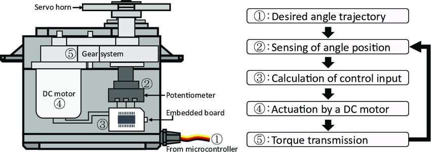

.. note::

    Bonjour, bienvenue dans la communauté des passionnés de SunFounder Raspberry Pi, Arduino et ESP32 sur Facebook ! Explorez plus en profondeur le Raspberry Pi, l'Arduino et l'ESP32 avec d'autres passionnés.

    **Pourquoi nous rejoindre ?**

    - **Support d'experts** : Résolvez les problèmes post-vente et relevez les défis techniques grâce à l'aide de notre communauté et de notre équipe.
    - **Apprendre et partager** : Échangez des astuces et des tutoriels pour perfectionner vos compétences.
    - **Aperçus exclusifs** : Bénéficiez d'un accès anticipé aux nouvelles annonces de produits et aux avant-premières.
    - **Réductions spéciales** : Profitez de réductions exclusives sur nos nouveaux produits.
    - **Promotions festives et cadeaux** : Participez à des concours et promotions spéciales pendant les fêtes.

    👉 Prêt à explorer et à créer avec nous ? Cliquez sur [|link_sf_facebook|] et rejoignez-nous dès aujourd'hui !

1.3.2 Servo
===============

Introduction
----------------

Dans cette leçon, nous allons apprendre à faire tourner le servomoteur.

Composants
-------------

.. image:: img/list_1.3.2.png

Principe
-----------

**Servomoteur**

Un servomoteur est généralement composé des parties suivantes : un boîtier, un arbre, 
un système d'engrenages, un potentiomètre, un moteur à courant continu (DC) et une 
carte embarquée.

.. image:: img/image121.png

Son fonctionnement est le suivant : Le microcontrôleur envoie des signaux PWM 
(modulation de largeur d'impulsion) au servomoteur, puis la carte intégrée dans 
le servomoteur reçoit les signaux via la broche de signal et contrôle le moteur 
interne pour tourner. Par conséquent, le moteur entraîne le système d'engrenages, 
qui à son tour actionne l'arbre après une réduction de vitesse. L'arbre et le 
potentiomètre du servomoteur sont reliés ensemble. Lorsque l'arbre tourne, il entraîne 
le potentiomètre, ce qui permet au potentiomètre de sortir un signal de tension vers 
la carte intégrée. Ensuite, la carte détermine la direction et la vitesse de 
rotation en fonction de la position actuelle, afin qu'il puisse s'arrêter précisément 
à la position définie et s'y maintenir.

L'angle est déterminé par la durée d'une impulsion appliquée au fil de commande. 
C'est ce qu'on appelle la modulation de largeur d'impulsion (PWM). Le servomoteur 
s'attend à recevoir une impulsion toutes les 20 ms. La durée de l'impulsion déterminera 
jusqu'où le moteur tourne. Par exemple, une impulsion de 1,5 ms fera tourner le moteur
 à la position de 90 degrés (position neutre).

Lorsque l'impulsion envoyée est inférieure à 1,5 ms, le servomoteur tourne vers une 
position et maintient son arbre de sortie à un certain nombre de degrés dans le sens 
antihoraire par rapport au point neutre. Lorsque l'impulsion est supérieure à 1,5 ms, 
l'effet inverse se produit. La largeur minimale et maximale de l'impulsion pour 
commander le servomoteur à se déplacer vers une position valide dépend de chaque 
servomoteur. En général, l'impulsion minimale sera d'environ 0,5 ms et l'impulsion 
maximale sera de 2,5 ms.

.. image:: img/image123.jpeg

Schéma de câblage
-----------------------

.. image:: ../img/image337.png

Procédure expérimentale
---------------------------

**Étape 1 :** Construisez le circuit.

.. image:: ../img/image125.png

**Étape 2 :** Accédez au dossier contenant le code.

.. raw:: html

   <run></run>

.. code-block::

    cd ~/davinci-kit-for-raspberry-pi/c/1.3.2

**Étape 3 :** Compilez le code.

.. raw:: html

   <run></run>

.. code-block::

    gcc 1.3.2_Servo.c -lwiringPi

**Étape 4 :** Exécutez le fichier compilé.

.. raw:: html

   <run></run>

.. code-block::

    sudo ./a.out

Une fois le programme exécuté, le servomoteur tournera de 0 à 180 degrés, 
puis de 180 à 0 degrés, de manière circulaire.

.. note::

    Si le programme ne fonctionne pas après l'exécution ou si un message d'erreur s'affiche : « wiringPi.h: No such file or directory », veuillez vous référer à :ref:`C code is not working?`.

**Code**

.. code-block:: c

    #include <wiringPi.h>
    #include <softPwm.h>
    #include <stdio.h>

    #define ServoPin    1       // définit le servomoteur sur GPIO1
    long Map(long value, long fromLow, long fromHigh, long toLow, long toHigh){
        return (toHigh-toLow)*(value-fromLow) / (fromHigh-fromLow) + toLow;
    }
    void setAngle(int pin, int angle){    // Crée une fonction pour contrôler l'angle du servomoteur.
        if(angle < 0)
            angle = 0;
        if(angle > 180)
            angle = 180;
        softPwmWrite(pin, Map(angle, 0, 180, 5, 25));   
    } 

    int main(void)
    {
        int i;
        if(wiringPiSetup() == -1){ // en cas d'échec de l'initialisation de wiringPi, affiche un message d'erreur à l'écran
            printf("setup wiringPi failed !");
            return 1; 
        }
        softPwmCreate(ServoPin, 0, 200);       // initialise la broche PWM pour le servomoteur
        while(1){
            for(i=0;i<181;i++){     // fait tourner le servomoteur de 0 à 180 degrés.

                delay(2);
            }
            delay(1000);
            for(i=181;i>-1;i--){    // fait tourner le servomoteur de 180 à 0 degrés.

                delay(2);
            }
            delay(1000);
        }
        return 0;
    }

**Explication du code**

.. code-block:: c

    long Map(long value,long fromLow,long fromHigh,long toLow,long toHigh){
        return (toHigh-toLow)*(value-fromLow) / (fromHigh-fromLow) + toLow;
    }

Crée une fonction `Map()` pour mapper la valeur dans le code suivant.

.. code-block:: c

    void setAngle(int pin, int angle){    // Crée une fonction pour contrôler l'angle du servomoteur.
        if(angle < 0)
            angle = 0;
        if(angle > 180)
            angle = 180;
        softPwmWrite(pin, Map(angle, 0, 180, 5, 25));   
    } 

Crée une fonction `setAngle()` pour écrire l'angle du servomoteur.

.. code-block:: c

    softPwmWrite(pin,Map(angle,0,180,5,25));  

Cette fonction permet de modifier le cycle de service du PWM.

Pour faire tourner le servomoteur de 0 à 180°, la largeur d'impulsion doit varier 
dans la plage de 0,5 ms à 2,5 ms lorsque la période est de 20 ms ; dans la fonction 
`softPwmCreate()`, nous avons défini la période à 200 x 100 us = 20 ms, nous devons 
donc mapper 0 ~ 180 à 5 x 100 us ~ 25 x 100 us.

Le prototype de cette fonction est illustré ci-dessous.

.. code-block:: 

    int softPwmCreate(int pin, int initialValue, int pwmRange);

**Paramètre pin :** N'importe quelle broche GPIO du Raspberry Pi peut être définie comme broche PWM.

**Paramètre initialValue :** La largeur d'impulsion initiale est égale à initialValue fois 100 us.

**Paramètre pwmRange :** La période du PWM est égale à pwmRange fois 100 us.

