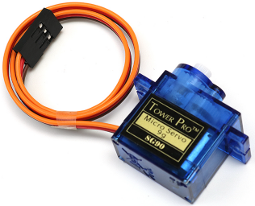

.. note::

    Hallo und willkommen in der SunFounder Raspberry Pi & Arduino & ESP32 Enthusiasten-Gemeinschaft auf Facebook! Tauchen Sie tiefer ein in die Welt von Raspberry Pi, Arduino und ESP32 mit anderen Enthusiasten.

    **Warum beitreten?**

    - **Expertenunterstützung**: Lösen Sie Nachverkaufsprobleme und technische Herausforderungen mit Hilfe unserer Gemeinschaft und unseres Teams.
    - **Lernen & Teilen**: Tauschen Sie Tipps und Anleitungen aus, um Ihre Fähigkeiten zu verbessern.
    - **Exklusive Vorschauen**: Erhalten Sie frühzeitigen Zugang zu neuen Produktankündigungen und exklusiven Einblicken.
    - **Spezialrabatte**: Genießen Sie exklusive Rabatte auf unsere neuesten Produkte.
    - **Festliche Aktionen und Gewinnspiele**: Nehmen Sie an Gewinnspielen und Feiertagsaktionen teil.

    👉 Sind Sie bereit, mit uns zu erkunden und zu erschaffen? Klicken Sie auf [|link_sf_facebook|] und treten Sie heute bei!

1.3.2 Servo
============

Einführung
--------------

In dieser Lektion lernen wir, wie man das Servo dreht.

Komponenten
--------------------

.. image:: ../img/list_1.3.2.png

Prinzip
---------

**Servo**

Ein Servo besteht im Allgemeinen aus folgenden Teilen: 
Gehäuse, Welle, Getriebe, Potentiometer, Gleichstrommotor und eingebettete Platine.

Das funktioniert so: Der Mikrocontroller sendet PWM-Signale an das Servo, und dann empfängt die im Servo eingebettete Karte die Signale über den Signal Pin und steuert den Motor im Inneren, um sich zu drehen. Infolgedessen treibt der Motor das Zahnradsystem an und motiviert dann die Welle nach dem Abbremsen. Die Welle und das Potentiometer des Servos sind miteinander verbunden. Wenn sich die Welle dreht, treibt sie das Potentiometer an, sodass das Potentiometer ein Spannungssignal an die eingebettete Platine ausgibt. Dann bestimmt das Board die Richtung und Geschwindigkeit der Drehung basierend auf der aktuellen Position, so dass es genau an der richtigen Position wie definiert anhalten und dort halten kann.

.. image:: ../img/image122.png

Der Winkel wird durch die Dauer eines Impulses bestimmt, der an den Steuerdraht angelegt wird. Dies wird als Pulsweitenmodulation bezeichnet. Das Servo erwartet alle 20 ms einen Impuls. Die Länge des Impulses bestimmt, wie weit sich der Motor dreht. Zum Beispiel bringt ein Impuls von 1,5 ms den Motor in die 90-Grad-Position (neutrale Position).

Wenn ein Impuls an ein Servo gesendet wird, das weniger als 1,5 ms beträgt, dreht sich das Servo in eine Position und hält seine Ausgangswelle einige Grad gegen den Uhrzeigersinn vom Neutralpunkt entfernt. Wenn der Impuls breiter als 1,5 ms ist, tritt das Gegenteil auf. Die minimale Breite und die maximale Impulsbreite, die das Servo anweisen, sich in eine gültige Position zu drehen, sind Funktionen jedes Servos. Im Allgemeinen ist der minimale Impuls ungefähr 0,5 ms breit und der maximale Impuls ist 2,5 ms breit.

.. image:: ../img/image123.jpeg

Schematische Darstellung
---------------------------------

.. image:: ../img/image337.png

Experimentelle Verfahren
-------------------------------------

Schritt 1: Bauen Sie die Schaltung auf.

.. image:: ../img/image125.png
    :width: 800

Schritt 2: Gehen Sie zum Ordner des Codes.

.. raw:: html

   <run></run>

.. code-block::

    cd /home/pi/davinci-kit-for-raspberry-pi/c/1.3.2

Schritt 3: Kompilieren Sie den Code.

.. raw:: html

   <run></run>

.. code-block::

    gcc 1.3.2_Servo.c -lwiringPi

Schritt 4: Führen Sie die ausführbare Datei aus.

.. raw:: html

   <run></run>

.. code-block::

    sudo ./a.out

Nachdem das Programm ausgeführt wurde, dreht sich das Servo kreisförmig von 0 Grad auf 180 Grad und dann von 180 Grad auf 0 Grad.

**Code**

.. code-block:: c

    #include <wiringPi.h>
    #include <softPwm.h>
    #include <stdio.h>

    #define ServoPin    1       //define the servo to GPIO1
    long Map(long value,long fromLow,long fromHigh,long toLow,long toHigh){
        return (toHigh-toLow)*(value-fromLow) / (fromHigh-fromLow) + toLow;
    }
    void setAngle(int pin, int angle){    //Create a funtion to control the angle of the servo.
        if(angle < 0)
            angle = 0;
        if(angle > 180)
            angle = 180;
        softPwmWrite(pin,Map(angle, 0, 180, 5, 25));   
    } 

    int main(void)
    {
        int i;
        if(wiringPiSetup() == -1){ //when initialize wiring failed,print message to screen
            printf("setup wiringPi failed !");
            return 1; 
        }
        softPwmCreate(ServoPin, 0, 200);       //initialize PMW pin of servo
        while(1){
            for(i=0;i<181;i++){     // Let servo rotate from 0 to 180.            	setAngle(ServoPin,i);
                delay(2);
            }
            delay(1000);
            for(i=181;i>-1;i--){        // Let servo rotate from 180 to 0.            	setAngle(ServoPin,i);
                delay(2);
            }
            delay(1000);
        }
        return 0;
    }

**Code Erklärung**

.. code-block:: c

    long Map(long value,long fromLow,long fromHigh,long toLow,long toHigh){
        return (toHigh-toLow)*(value-fromLow) / (fromHigh-fromLow) + toLow;
    }

Erstellen Sie eine ``Map()`` - Funktion, um den Wert im folgenden Kode zuzuordnen.

.. code-block:: c

    void setAngle(int pin, int angle){    //Create a funtion to control the angle of the servo.
        if(angle < 0)
            angle = 0;
        if(angle > 180)
            angle = 180;
        softPwmWrite(pin,Map(angle, 0, 180, 5, 25));   
    } 

Erstellen Sie eine Funktion, ``setAngle()`` , um den Winkel zum Servo zu schreiben.

.. code-block:: c

    softPwmWrite(pin,Map(angle,0,180,5,25));  

Diese Funktion kann das Einschaltdauer der PWM ändern.

Damit sich das Servo auf 0 bis 180° dreht, 
sollte sich die Impulsbreite im Bereich von 0,5 ms bis 2,5 ms ändern, 
wenn die Periode 20 ms beträgt. In der Funktion ``softPwmCreate()`` haben wir festgelegt, 
dass der Zeitraum 200x100us = 20ms beträgt. Daher müssen wir 0 ~ 180 bis 5x100us ~ 25x100us zuordnen.

Der Prototyp dieser Funktion ist unten dargestellt.

.. code-block:: 

    int softPwmCreate（int pin，int initialValue，int pwmRange）;

**pin:** Jeder GPIO-Pin von Raspberry Pi kann als PWM-Pin gesetzt werden.

**initialValue:** Die anfängliche Impulsbreite ist der initialValue mal 100us.

**pwmRange:** Die Periode von PWM ist die pwmRange mal 100us.

