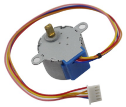
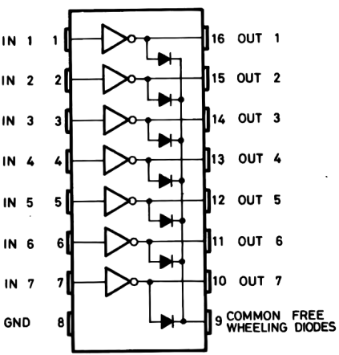
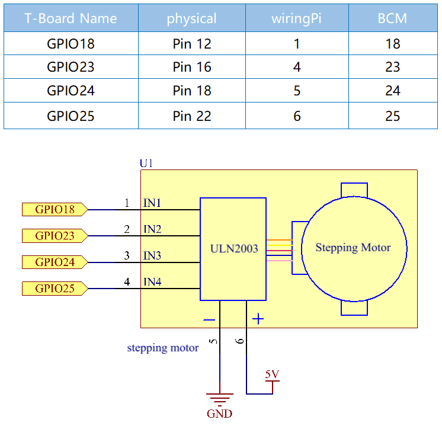
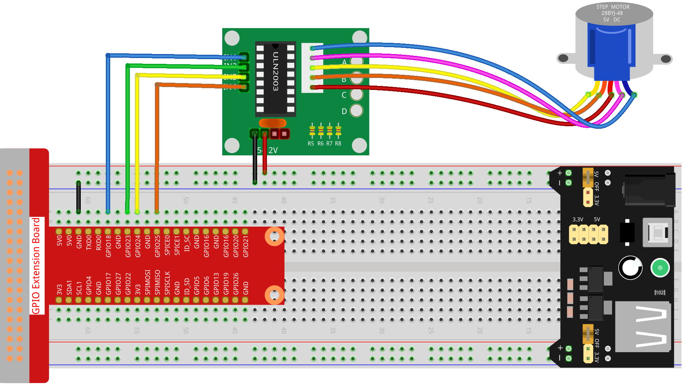
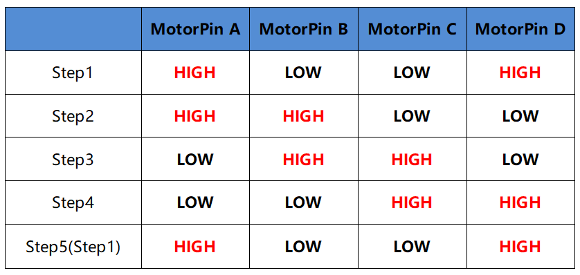
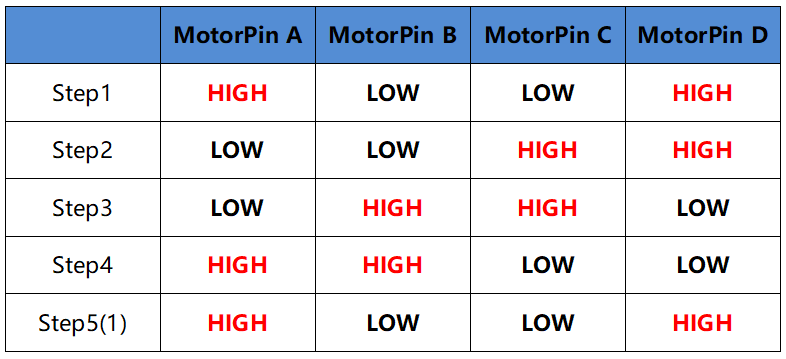

.. nota::

    Ciao, benvenuto nella Community di SunFounder Raspberry Pi & Arduino & ESP32 Enthusiasts su Facebook! Approfondisci le tue conoscenze su Raspberry Pi, Arduino ed ESP32 insieme ad altri appassionati.

    **Perché Unirsi?**

    - **Supporto Esperto**: Risolvi problematiche post-vendita e sfide tecniche con l’aiuto della nostra comunità e del nostro team.
    - **Impara e Condividi**: Scambia consigli e tutorial per migliorare le tue competenze.
    - **Anteprime Esclusive**: Ottieni accesso anticipato a nuovi annunci di prodotti e anticipazioni.
    - **Sconti Speciali**: Goditi sconti esclusivi sui nostri ultimi prodotti.
    - **Promozioni Festive e Giveaway**: Partecipa a giveaway e promozioni speciali durante le festività.

    👉 Pronto per esplorare e creare con noi? Clicca [|link_sf_facebook|] e unisciti oggi stesso!

1.3.3 Motore Passo-passo
=============================

Introduzione
---------------

I motori passo-passo, grazie al loro design unico, possono essere 
controllati con un alto grado di precisione senza necessità di meccanismi 
di feedback. L'albero di un motore passo-passo, montato con una serie di 
magneti, è controllato da una serie di bobine elettromagnetiche che si 
caricano positivamente e negativamente in una sequenza specifica, muovendolo 
in avanti o indietro a piccoli "passi".

Componenti
-------------

.. image:: img/list_1.3.3.png

Principio
-------------

**Motore Passo-passo**

Esistono due tipi di motori passo-passo, unipolari e bipolari, ed è molto 
importante sapere con quale tipo si sta lavorando. In questo esperimento, 
useremo un motore passo-passo unipolare.

Il motore passo-passo utilizzato è a quattro fasi e sfrutta un'alimentazione 
in corrente continua unipolare. Finché si alimentano le fasi del motore seguendo 
una sequenza temporale appropriata, è possibile farlo ruotare passo dopo passo. 
Il diagramma schematico di un motore passo-passo a quattro fasi è mostrato di 
seguito:

Nell’immagine, al centro del motore c'è un rotore, un magnete permanente a forma 
di ingranaggio. Intorno al rotore, i denti vanno da 0 a 5. Più esternamente, ci 
sono 8 poli magnetici, con ciascuna coppia opposta collegata da un avvolgimento 
di bobina. Formano così quattro coppie, da A a D, chiamate fase. Il motore ha 
quattro fili collegati a interruttori SA, SB, SC e SD. Pertanto, le quattro fasi 
sono in parallelo nel circuito, e i due poli magnetici in una fase sono in serie.

**Come funziona un motore passo-passo a 4 fasi:**

Quando l'interruttore SB è acceso, mentre gli interruttori SA, SC e SD sono 
spenti, i poli magnetici della fase B si allineano con i denti 0 e 3 del rotore. 
Allo stesso tempo, i denti 1 e 4 creano denti sfalsati con i poli delle fasi C e D. 
I denti 2 e 5 creano denti sfalsati con i poli magnetici delle fasi D e A. 
Quando l'interruttore SC è acceso e gli interruttori SB, SA e SD sono spenti, 
il rotore ruota sotto l'influenza del campo magnetico della fase C, allineandosi 
con i denti 1 e 4. Energizzando le fasi A, B, C e D in sequenza, il rotore ruoterà 
in ordine di fasi A, B, C e D.

.. image:: img/image130.png

Il motore passo-passo a quattro fasi ha tre modalità operative: passo singolo a 
quattro fasi, doppio passo a quattro fasi e passo a otto fasi. L'angolo di passo 
per il passo singolo e il doppio passo a quattro fasi è lo stesso, ma la coppia 
di trascinamento per il singolo passo è inferiore. L'angolo di passo della modalità 
a otto fasi è la metà di quello delle modalità a quattro fasi singolo e doppio, 
permettendo una coppia di trascinamento elevata e una maggiore precisione di controllo.

Lo statore del motore passo-passo che utilizziamo ha 32 poli magnetici, quindi 
un giro completo richiede 32 passi. L'albero di uscita del motore passo-passo 
è collegato a un set di ingranaggi di riduzione, con un rapporto di riduzione 
di 1/64. Quindi, per far ruotare un giro completo dell'albero di uscita finale 
sono necessari 32*64=2048 passi.

**ULN2003**

Per applicare il motore nel circuito, è necessario utilizzare una scheda driver. 
Il driver del motore passo-passo ULN2003 è un circuito invertitore a 7 canali. 
Ovvero, quando il pin di ingresso è a livello alto, il pin di uscita di ULN2003 
è a livello basso, e viceversa. Se forniamo un livello alto a IN1 e un livello 
basso a IN2, IN3 e IN4, allora l’uscita OUT1 sarà a livello basso, mentre tutte 
le altre uscite saranno a livello alto. Di seguito è mostrata la struttura 
interna del chip.

Il driver del motore passo-passo costituito dal chip ULN2003 e da 4 LED è mostrato 
qui sotto. Sulla scheda, IN1, IN2, IN3 e IN4 fungono da ingressi e i quattro LED, 
A, B, C, D sono gli indicatori dei pin di ingresso. Inoltre, OUT1, OUT2, OUT3 e OUT4 
sono collegati rispettivamente a SA, SB, SC e SD sul driver del motore passo-passo. 
Quando il valore di IN1 è impostato a livello alto, si accende A; l'interruttore SA 
si attiva, e il motore passo-passo compie un passo. Questo schema si ripete continuamente. 
Pertanto, fornendo una sequenza temporale specifica al motore passo-passo, esso ruoterà 
passo dopo passo. L'ULN2003 viene utilizzato per fornire sequenze temporali specifiche 
al motore passo-passo.

.. image:: img/image132.png

Schema Elettrico
-------------------

Procedure Sperimentali
--------------------------

**Passo 1:** Montare il circuito.

**Passo 2:** Accedere alla cartella del codice.

.. raw:: html

   <run></run>

.. code-block::

    cd ~/davinci-kit-for-raspberry-pi/c/1.3.3/

**Passo 3:** Compilare il codice.

.. raw:: html

   <run></run>

.. code-block::

    gcc 1.3.3_StepperMotor.c -lwiringPi

**Passo 4:** Eseguire il file eseguibile.

.. raw:: html

   <run></run>

.. code-block::

    sudo ./a.out

All'esecuzione del codice, il motore passo-passo ruoterà in senso orario o 
antiorario in base all'input che fornisci, 'a' o 'c'.

.. note::

    Se il programma non funziona dopo l'esecuzione o compare un errore come : \"wiringPi.h: Nessun file o directory di questo tipo", consulta :ref:`Il codice C non funziona?`.

**Codice**

.. code-block:: c

    #include <stdio.h>
    #include <wiringPi.h>

    const int motorPin[] = {1, 4, 5, 6};
    int rolePerMinute = 15;
    int stepsPerRevolution = 2048;
    int stepSpeed = 0;

    void rotary(char direction){
        if(direction == 'c'){
            for(int j=0;j<4;j++){
                for(int i=0;i<4;i++)
                    {digitalWrite(motorPin[i],0x99>>j & (0x08>>i));}
                delayMicroseconds(stepSpeed);
            }        
        }
        else if(direction =='a'){
            for(int j=0;j<4;j++){
                for(int i=0;i<4;i++)
                    {digitalWrite(motorPin[i],0x99<<j & (0x80>>i));}
                delayMicroseconds(stepSpeed);
            }   
        }
    }

    void loop()
    {
        char direction = '0';
        while (1)
        {       
            printf("select motor direction a=anticlockwise, c=clockwise: ");
            delay(100);
            direction=getchar();
            if (direction == 'c')
            {
                printf("motor running clockwise\n");
                delay(100);
                break;
            }
            else if (direction == 'a')
            {
                printf("motor running anti-clockwise\n");
                delay(100);
                break;
            }
            else
            {
                printf("input error, please try again!\n");
                delay(100);
            }
        }
        while(1)
        {
            rotary(direction);
        }
    }

    void main(void)
    {
        if (wiringPiSetup() == -1)
        {
            printf("setup wiringPi failed !");
            return;
        }
        for (int i = 0; i < 4; i++)
        {
            pinMode(motorPin[i], OUTPUT);
        }
        stepSpeed = (60000000 / rolePerMinute) / stepsPerRevolution;
        loop();
    }

**Spiegazione del Codice**

.. code-block:: c

    int rolePerMinute = 15;
    int stepsPerRevolution = 2048;
    int stepSpeed = 0;

**rolePerMinute:** Giri al minuto, ovvero il numero di RPM del motore 
passo-passo utilizzato in questo kit, che dovrebbe essere compreso tra 0 e 17.

**stepsPerRevolution:** Numero di passi per ogni giro. Il motore 
passo-passo utilizzato in questo kit richiede 2048 passi per una rotazione completa.

**stepSpeed:** Tempo utilizzato per ciascun passo, e nel main() assegnamo 
il valore con la formula: 「(60000000 / rolePerMinute) / stepsPerRevolution」 
(60,000,000 us = 1 minuto)

.. code-block:: c

    void loop()
    {
        char direction = '0';
        while (1)
        {       
            printf("select motor direction a=anticlockwise, c=clockwise: ");
            direction=getchar();
            if (direction == 'c')
            {
                printf("motor running clockwise\n");
                break;
            }
            else if (direction == 'a')
            {
                printf("motor running anti-clockwise\n");
                break;
            }
            else
            {
                printf("input error, please try again!\n");
            }
        }
        while(1)
        {
            rotary(direction);
        }
    }

La funzione loop() è divisa in due parti principali (entrambe contenute tra due while(1)):

La prima parte acquisisce il valore del tasto premuto. Quando viene ottenuto 'a' o 'c', si esce dal ciclo e si interrompe l'input.

La seconda parte chiama rotary(direction) per avviare il motore passo-passo.

.. code-block:: c

    void rotary(char direction){
        if(direction == 'c'){
            for(int j=0;j<4;j++){
                for(int i=0;i<4;i++)
                    {digitalWrite(motorPin[i],0x99>>j & (0x08>>i));}
                delayMicroseconds(stepSpeed);
            }        
        }
        else if(direction =='a'){
            for(int j=0;j<4;j++){
                for(int i=0;i<4;i++)
                    {digitalWrite(motorPin[i],0x99<<j & (0x80>>i));}
                delayMicroseconds(stepSpeed);
            }   
        }
    }

Per fare in modo che il motore passo-passo **ruoti in senso orario**, 
lo stato di livello di motorPin è riportato nella tabella seguente:

Pertanto, l’assegnazione del potenziale a MotorPin viene eseguita utilizzando un doppio ciclo for.

Nel Passo1, j=0, i=0~4.

motorPin[0] verrà impostato su livello alto（10011001&00001000=1）

motorPin[1] verrà impostato su livello basso（10011001&00000100=0）

motorPin[2] verrà impostato su livello basso（10011001&00000010=0）

motorPin[3] verrà impostato su livello alto（10011001&00000001=1）

Nel Passo2, j=1, i=0~4.

motorPin[0] verrà impostato su livello alto（01001100&00001000=1）

motorPin[1] verrà impostato su livello basso（01001100&00000100=1）

e così via.

Per fare in modo che il motore passo-passo ruoti **in senso antiorario**, 
lo stato di livello di motorPin è riportato nella tabella seguente.

Nel Passo1, j=0, i=0~4.

motorPin[0] verrà impostato su livello alto（10011001&10000000=1）

motorPin[1] verrà impostato su livello basso（10011001&01000000=0）

Nel Passo2, j=1, i=0~4.

motorPin[0] verrà impostato su livello alto（00110010&10000000=0）

motorPin[1] verrà impostato su livello basso（00110010&01000000=0）

e così via.
