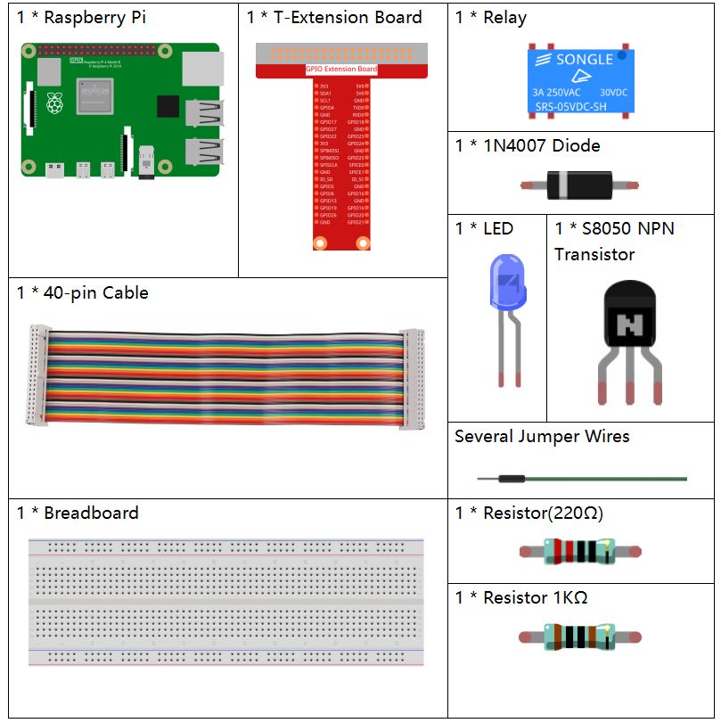
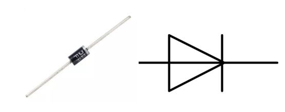
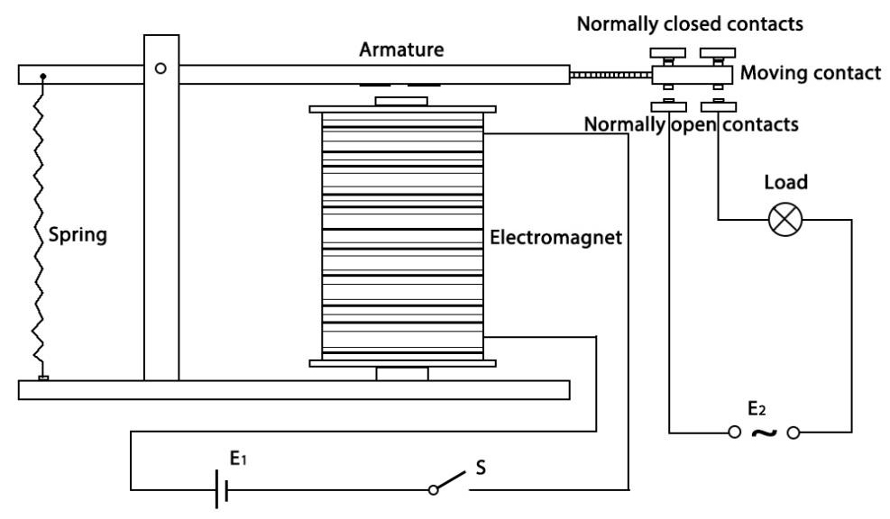
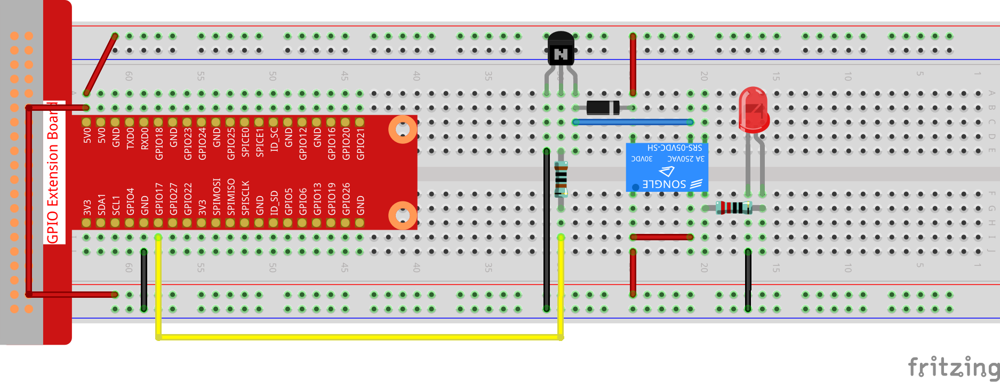

.. note::

    Hallo und willkommen in der SunFounder Raspberry Pi & Arduino & ESP32 Enthusiasten-Gemeinschaft auf Facebook! Tauchen Sie tiefer ein in die Welt von Raspberry Pi, Arduino und ESP32 mit anderen Enthusiasten.

    **Warum beitreten?**

    - **Expertenunterstützung**: Lösen Sie Nachverkaufsprobleme und technische Herausforderungen mit Hilfe unserer Gemeinschaft und unseres Teams.
    - **Lernen & Teilen**: Tauschen Sie Tipps und Anleitungen aus, um Ihre Fähigkeiten zu verbessern.
    - **Exklusive Vorschauen**: Erhalten Sie frühzeitigen Zugang zu neuen Produktankündigungen und exklusiven Einblicken.
    - **Spezialrabatte**: Genießen Sie exklusive Rabatte auf unsere neuesten Produkte.
    - **Festliche Aktionen und Gewinnspiele**: Nehmen Sie an Gewinnspielen und Feiertagsaktionen teil.

    👉 Sind Sie bereit, mit uns zu erkunden und zu erschaffen? Klicken Sie auf [|link_sf_facebook|] und treten Sie heute bei!

1.3.4 Relais
==============

Einführung
------------------

In dieser Lektion lernen wir, ein Relais zu verwenden. Es ist eine der am häufigsten verwendeten Komponenten im automatischen Steuerungssystem. Wenn die Spannung, der Strom, die Temperatur, der Druck usw. den vorgegebenen Wert erreichen, überschreiten oder unterschreiten, wird das Relais den Stromkreis anschließen oder unterbrechen, um das Gerät zu steuern und zu schützen.

Komponenten
----------------

Prinzip
---------

**Diode**

Eine Diode ist eine zweipolige Komponente in der Elektronik mit einem unidirektionalen Stromfluss. 
Es bietet einen geringen Widerstand in Richtung des Stromflusses und einen hohen Widerstand in der entgegengesetzten Richtung. 
Dioden werden meistens verwendet, um Schäden an Bauteilen zu vermeiden, 
insbesondere aufgrund elektromotorischer Kraft in Schaltkreisen, 
die normalerweise polarisiert sind.

Die beiden Anschlüsse einer Diode sind polarisiert, wobei das positive Ende als Anode und das negative Ende als Kathode bezeichnet wird. 
Die Kathode besteht üblicherweise aus Silber oder hat ein Farbband. 
Die Steuerung der Stromflussrichtung ist eines der Hauptmerkmale von Dioden - der Strom in einer Diode fließt von Anode zu Kathode. 
Das Verhalten einer Diode ähnelt dem Verhalten eines Rückschlagventils. Eine der wichtigsten Eigenschaften einer Diode ist die nichtlineare Stromspannung. 
Wenn eine höhere Spannung an die Anode angeschlossen ist, fließt Strom von Anode zu Kathode, 
und der Prozess wird als Vorwärtsvorspannung bezeichnet. 
Wenn jedoch die höhere Spannung an die Kathode angeschlossen ist, 
leitet die Diode keine Elektrizität, und der Prozess wird als Sperrvorspannung bezeichnet.

**Relais**

Wie wir vielleicht wissen, ist Relais ein Gerät, das verwendet wird, um eine Verbindung zwischen zwei oder mehr Punkten oder Geräten als Reaktion auf das angelegte Eingangssignal herzustellen. Mit anderen Worten, Relais stellen eine Isolation zwischen der Steuerung und dem Gerät bereit, da Geräte sowohl mit Wechselstrom als auch mit Gleichstrom arbeiten können. Sie empfangen jedoch Signale von einem Mikrocontroller, der mit Gleichstrom arbeitet, weshalb ein Relais erforderlich ist, um die Lücke zu schließen. Das Relais ist äußerst nützlich, wenn Sie eine große Menge an Strom oder Spannung mit einem kleinen elektrischen Signal steuern müssen.

Jedes Relais besteht aus 5 Teilen:

**Elektromagnet** - Er besteht aus einem Eisenkern, der durch eine Drahtspule gewickelt ist. Wenn Elektrizität durchgelassen wird, wird sie magnetisch. Daher wird es Elektromagnet genannt.

**Anker** - Der bewegliche Magnetstreifen wird als Anker bezeichnet. Wenn Strom durch sie fließt, wird die Spule erregt, wodurch ein Magnetfeld erzeugt wird, das verwendet wird, um die normalerweise offenen (N/O) oder normalerweise geschlossenen (N/C) Punkte zu erzeugen oder zu brechen. Der Anker kann sowohl mit Gleichstrom (DC) als auch mit Wechselstrom (AC) bewegt werden.

**Feder** - Wenn am Elektromagneten keine Ströme durch die Spule fließen, zieht die Feder den Anker weg, sodass der Stromkreis nicht abgeschlossen werden kann.

Satz elektrischer **Kontakte** - Es gibt zwei Kontaktpunkte:

* Normalerweise offen - verbunden, wenn das Relais aktiviert ist, und getrennt, wenn es inaktiv ist.

* Normalerweise geschlossen - nicht angeschlossen, wenn das Relais aktiviert ist, und angeschlossen, wenn es inaktiv ist. aktiviert ist,

**Molded frame** - Die Relais sind zum Schutz mit Kunststoff bedeckt.

**Funktionieren des Relais**

Das Funktionsprinzip des Relais ist einfach. Wenn das Relais mit Strom versorgt wird, fließen Ströme durch die Steuerspule. Infolgedessen beginnt der Elektromagnet zu erregen. Dann wird der Anker von der Spule angezogen, bewegliche Kontakt zusammezihen, wodurch eine Verbindung mit den normalerweise offenen Kontakten hergestellt wird. Der Stromkreis mit der Last wird also erregt. Ein Unterbrechen des Stromkreises wäre dann ein ähnlicher Fall, da der bewegliche Kontakt unter der Kraft der Feder zu den normalerweise geschlossenen Kontakten hochgezogen wird. Auf diese Weise kann das Ein- und Ausschalten des Relais den Zustand eines Lastkreises steuern.

Schematische Darstellung
----------------------------

.. image:: ../img/image345.png

Experimentelle Verfahren
-----------------------------------

Schritt 1: Bauen Sie die Schaltung auf.

Schritt 2: Öffnen Sie die Kodedatei.

.. raw:: html

   <run></run>

.. code-block::

    cd ~/davinci-kit-for-raspberry-pi/c/1.3.4

Schritt 3: Kompilieren Sie den Code.

.. raw:: html

   <run></run>

.. code-block::

    gcc 1.3.4_Relay.c -lwiringPi

Schritt 4: Führen Sie die ausführbare Datei aus.

.. raw:: html

   <run></run>

.. code-block::

    sudo ./a.out

Nachdem die Kode ausgeführt wurde, leuchtet die LED auf. 
Außerdem können Sie ein Ticktock hören, 
das durch das Unterbrechen des normalerweise geschlossenen Kontakts und das Schließen des normalerweise offenen Kontakts verursacht wird.

**Code**

.. code-block:: c

    #include <wiringPi.h>
    #include <stdio.h>
    #define RelayPin 0

    int main(void){
        if(wiringPiSetup() == -1){ //when initialize wiring failed, print message to screen
            printf("setup wiringPi failed !");
            return 1;
        }
        pinMode(RelayPin, OUTPUT);   //set GPIO17(GPIO0) output
        while(1){
            // Tick
            printf("Relay Open......\n");
            delay(100);
            digitalWrite(RelayPin, LOW);
            delay(1000);
            // Tock
            printf("......Relay Close\n");
            delay(100);
            digitalWrite(RelayPin, HIGH);
            delay(1000);
        }

        return 0;
    }

**Code Erklärung**

.. code-block:: c

    digitalWrite(RelayPin, LOW);

Stellen Sie den I/O -Anschluss auf einen niedrigen Niveau (0V) ein, 
damit der Transistor nicht erregt und die Spule nicht mit Strom versorgt wird. 
Es gibt keine elektromagnetische Kraft, daher öffnet sich das Relais und die LED leuchtet nicht.

.. code-block:: c

    digitalWrite(RelayPin, HIGH);

Stellen Sie den I/O -Anschluss auf einen hohen Niveau (5V) ein, 
um den Transistor mit Strom zu versorgen. 
Die Spule des Relais wird mit Strom versorgt und erzeugt elektromagnetische Kraft. 
Das Relais schließt, die LED leuchtet auf.
