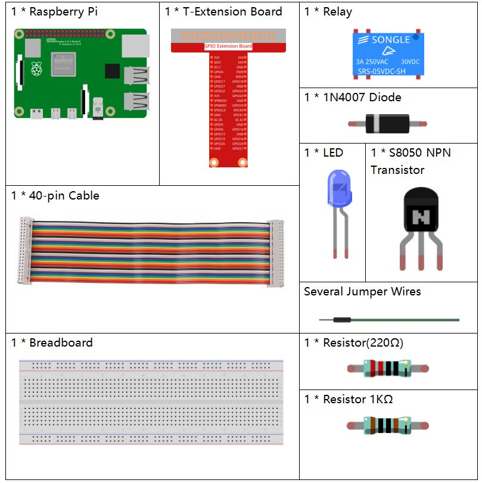

.. note::

    Ciao, benvenuto nella community SunFounder Raspberry Pi & Arduino & ESP32 Enthusiasts su Facebook! Approfondisci le tue conoscenze su Raspberry Pi, Arduino e ESP32 con altri appassionati.

    **Perché unirti a noi?**

    - **Supporto esperto**: Risolvi problemi post-vendita e sfide tecniche con l’aiuto della nostra community e del nostro team.
    - **Impara e condividi**: Scambia consigli e tutorial per migliorare le tue competenze.
    - **Anteprime esclusive**: Ottieni accesso anticipato a nuovi annunci di prodotti e anteprime.
    - **Sconti speciali**: Approfitta di sconti esclusivi sui nostri prodotti più recenti.
    - **Promozioni festive e omaggi**: Partecipa a giveaway e promozioni festive.

    👉 Pronto a esplorare e creare con noi? Clicca [|link_sf_facebook|] e unisciti oggi stesso!

1.3.4 Relè
=============

Introduzione
--------------

In questa lezione, impareremo a utilizzare un relè. È uno dei componenti 
comunemente utilizzati nei sistemi di controllo automatico. Quando la 
tensione, la corrente, la temperatura, la pressione, ecc., raggiungono, 
superano o sono inferiori al valore prestabilito, il relè collega o interrompe 
il circuito per controllare e proteggere l'apparecchiatura.

Componenti
-------------

Principio
-------------

**Diodo**

Un diodo è un componente elettronico a due terminali con un flusso di 
corrente unidirezionale. Offre bassa resistenza nella direzione del 
flusso di corrente e alta resistenza nella direzione opposta. I diodi 
sono utilizzati principalmente per prevenire danni ai componenti, in 
particolare dovuti alla forza elettromotrice nei circuiti solitamente polarizzati.

.. image:: img/image344.png

I due terminali di un diodo sono polarizzati, con l'estremità positiva 
chiamata anodo e l'estremità negativa chiamata catodo. Il catodo è 
generalmente di colore argentato o presenta una banda colorata. Il flusso 
di corrente in un diodo va dall'anodo al catodo. Il comportamento di un 
diodo è simile a quello di una valvola di non ritorno. Una delle 
caratteristiche più importanti di un diodo è la curva corrente-tensione 
non lineare.

**Relè**

Un relè è un dispositivo che consente di stabilire una connessione tra due o 
più punti in risposta al segnale di ingresso. In altre parole, i relè forniscono 
isolamento tra il controller e il dispositivo, poiché i dispositivi possono 
funzionare sia in corrente alternata (AC) che continua (DC). Tuttavia, ricevono 
segnali da un microcontrollore che opera in DC, quindi è necessario un relè per 
colmare il divario. Il relè è estremamente utile quando è necessario controllare 
una grande quantità di corrente o tensione con un piccolo segnale elettrico.

Ci sono 5 parti in ogni relè:

**Elettromagnete** - Costituito da un nucleo di ferro avvolto da una bobina di 
fili. Quando l'elettricità passa, diventa magnetico e si chiama elettromagnete.

**Armatura** - Striscia magnetica mobile nota come armatura. Quando la corrente 
fluisce, la bobina si energizza, producendo un campo magnetico che attiva o 
disattiva i contatti aperti (N/O) o chiusi (N/C).

**Molla** - Quando nessuna corrente passa attraverso la bobina, la molla tira 
l'armatura via, interrompendo il circuito.

Set di **contatti elettrici** - Ci sono due punti di contatto:

-  Normalmente aperto - connesso quando il relè è attivato, disconnesso quando è inattivo.
-  Normalmente chiuso - non connesso quando il relè è attivato, connesso quando è inattivo.

**Struttura in plastica** - I relè sono rivestiti di plastica per la protezione.

**Funzionamento del Relè**

Il principio di funzionamento del relè è semplice. Quando viene alimentato, la 
corrente inizia a fluire attraverso la bobina di controllo, energizzando 
l'elettromagnete. L'armatura viene quindi attratta verso la bobina, connettendo 
i contatti aperti e chiudendo il circuito. Per interrompere il circuito, l'armatura 
viene sollevata dai contatti chiusi grazie alla molla. In questo modo, l'accensione 
e lo spegnimento del relè possono controllare lo stato di un circuito di carico.

.. image:: img/image142.jpeg

Schema
---------

.. image:: img/image345.png

Procedure Sperimentali
------------------------

**Passo 1:** Monta il circuito.

.. image:: img/image144.png
    :width: 800

**Passo 2**: Apri il file del codice.

.. raw:: html

   <run></run>

.. code-block::

    cd ~/davinci-kit-for-raspberry-pi/c/1.3.4

**Passo 3:** Compila il codice.

.. raw:: html

   <run></run>

.. code-block::

    gcc 1.3.4_Relay.c -lwiringPi

**Passo 4:** Esegui il file eseguibile.

.. raw:: html

   <run></run>

.. code-block::

    sudo ./a.out

Dopo l'esecuzione del codice, il LED si accenderà. Inoltre, puoi sentire 
un ticchettio causato dall'interruzione del contatto normalmente chiuso 
e dalla chiusura del contatto normalmente aperto.

.. note::

    Se non funziona dopo l'esecuzione, o appare un messaggio di errore: \"wiringPi.h: No such file or directory", consulta la guida :ref:`Il codice C non funziona?`.

**Codice**

.. code-block:: c

    #include <wiringPi.h>
    #include <stdio.h>
    #define RelayPin 0

    int main(void){
        if(wiringPiSetup() == -1){ //se l'inizializzazione wiring fallisce, stampa un messaggio a schermo
            printf("setup wiringPi failed !");
            return 1;
        }
        pinMode(RelayPin, OUTPUT);   //imposta GPIO17(GPIO0) in output
        while(1){
            // Tick
            printf("Relay Open......\n");
            delay(100);
            digitalWrite(RelayPin, LOW);
            delay(1000);
            // Tock
            printf("......Relay Close\n");
            delay(100);
            digitalWrite(RelayPin, HIGH);
            delay(1000);
        }

        return 0;
    }

**Spiegazione del Codice**

.. code-block:: c

    digitalWrite(RelayPin, LOW);

Imposta la porta I/O a livello basso (0V), disattivando il transistor e non 
alimentando la bobina. Non c'è forza elettromagnetica, quindi il relè si apre 
e il LED non si accende.

.. code-block:: c

    digitalWrite(RelayPin, HIGH);

Imposta la porta I/O a livello alto (5V) per energizzare il transistor. 
La bobina del relè viene alimentata, generando forza elettromagnetica, e 
il relè si chiude, accendendo il LED.
