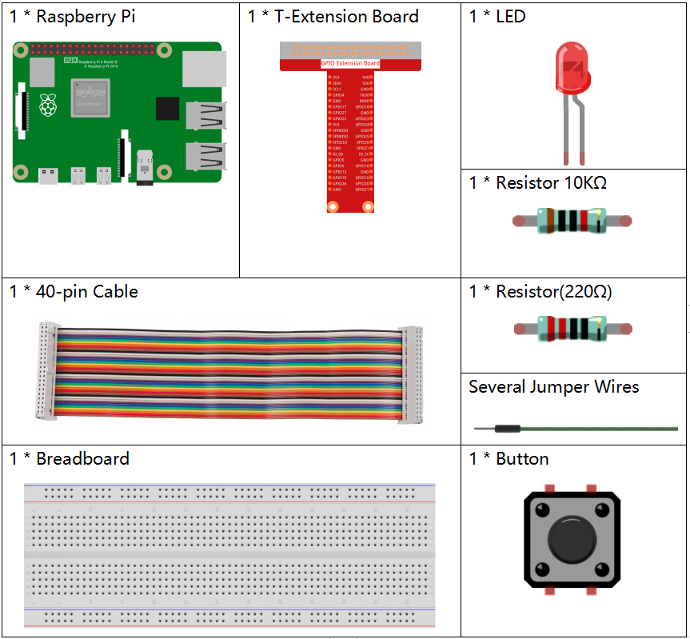
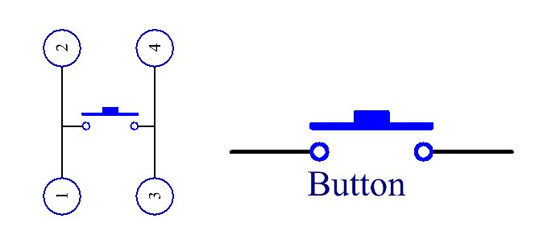
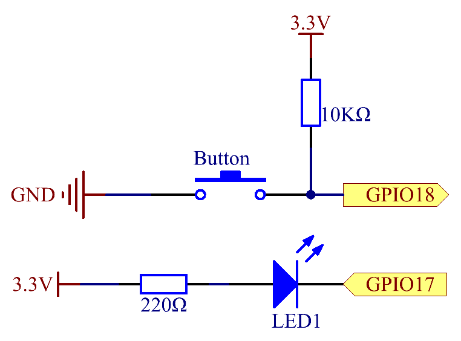
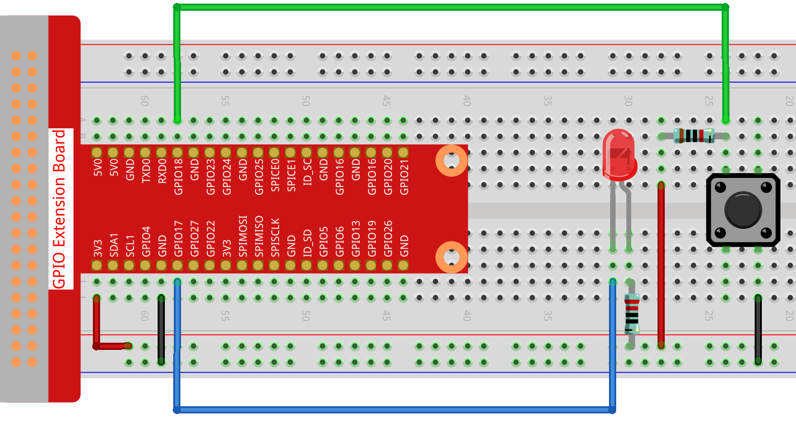

.. note::

    Hello, welcome to the SunFounder Raspberry Pi & Arduino & ESP32 Enthusiasts Community on Facebook! Dive deeper into Raspberry Pi, Arduino, and ESP32 with fellow enthusiasts.

    **Why Join?**

    - **Expert Support**: Solve post-sale issues and technical challenges with help from our community and team.
    - **Learn & Share**: Exchange tips and tutorials to enhance your skills.
    - **Exclusive Previews**: Get early access to new product announcements and sneak peeks.
    - **Special Discounts**: Enjoy exclusive discounts on our newest products.
    - **Festive Promotions and Giveaways**: Take part in giveaways and holiday promotions.

    👉 Ready to explore and create with us? Click [|link_sf_facebook|] and join today!

2.1.1 Button
============

Introduction
-----------------

In this lesson, we will learn how to turn on or off the LED by using a
button.

Components
---------------

Principle
-------------

**Button**

Button is a common component used to control electronic devices. It is
usually used as switch to connect or break circuits. Although buttons
come in a variety of sizes and shapes, the one used here is a 6mm
mini-button as shown in the following pictures.

Two pins on the left are connected, and the one on the right is similar
to the left, which is shown below:

.. image:: img/image148.png
    :width: 400
    :align: center

The symbol shown as below is usually used to represent a button in
circuits.

When the button is pressed, the 4 pins are connected, thus closing the
circuit.

Schematic Diagram
---------------------

Use a normally open button as the input of Raspberry Pi, the connection
is shown in the schematic diagram below. When the button is pressed, the
GPIO18 will turn into low level (0V). We can detect the state of the
GPIO18 through programming. That is, if the GPIO18 turns into low level,
it means the button is pressed. You can run the corresponding code when
the button is pressed, and then the LED will light up.

.. note::
    The longer pin of the LED is the anode and the shorter one is
    the cathode.

.. image:: img/image302.png
    :width: 600
    :align: center

Experimental Procedures
---------------------------

**Step 1**: Build the circuit.

**Step 2**: Open the code file.

.. raw:: html

   <run></run>

.. code-block::

    cd ~/davinci-kit-for-raspberry-pi/c/2.1.1/

.. note::
    Change directory to the path of the code in this experiment via **cd**.

**Step 3**: Compile the code.

.. raw:: html

   <run></run>

.. code-block::

    gcc 2.1.1_Button.c -lwiringPi

**Step 4**: Run the executable file.

.. raw:: html

   <run></run>

.. code-block::

    sudo ./a.out

After the code runs, press the button, the LED lights up; otherwise,
turns off.

.. note::

    If it does not work after running, or there is an error prompt: \"wiringPi.h: No such file or directory\", please refer to :ref:`C code is not working?`.

**Code**

.. code-block:: c

    #include <wiringPi.h>
    #include <stdio.h>

    #define LedPin      0
    #define ButtonPin   1

    int main(void){
        // When initialize wiring failed, print message to screen
        if(wiringPiSetup() == -1){
            printf("setup wiringPi failed !");
            return 1;
        }
        
        pinMode(LedPin, OUTPUT);
        pinMode(ButtonPin, INPUT);
        digitalWrite(LedPin, HIGH);
        
        while(1){
            // Indicate that button has pressed down
            if(digitalRead(ButtonPin) == 0){
                // Led on
                digitalWrite(LedPin, LOW);
            //  printf("...LED on\n");
            }
            else{
                // Led off
                digitalWrite(LedPin, HIGH);
            //  printf("LED off...\n");
            }
        }
        return 0;
    }

**Code Explanation**

.. code-block:: 

    #define LedPin      0

Pin GPIO17 in the T_Extension Board is equal to the GPIO0 in the
wiringPi.

.. code-block:: 

    #define ButtonPin   1

ButtonPin is connected to GPIO1.

.. code-block:: 

    pinMode(LedPin, OUTPUT);

Set LedPin as output to assign value to it.

.. code-block:: 

    pinMode(ButtonPin, INPUT);

Set ButtonPin as input to read the value of ButtonPin.

.. code-block:: C

    while(1){
            // Indicate that button has pressed down
            if(digitalRead(ButtonPin) == 0){
                // Led on
                digitalWrite(LedPin, LOW);
            //  printf("...LED on\n");
            }
            else{
                // Led off
                digitalWrite(LedPin, HIGH);
            //  printf("LED off...\n");
            }
        }

if (digitalRead (ButtonPin) == 0: check whether the button has been
pressed. Execute digitalWrite(LedPin, LOW) when button is pressed to
light up LED.

