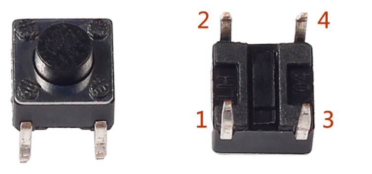
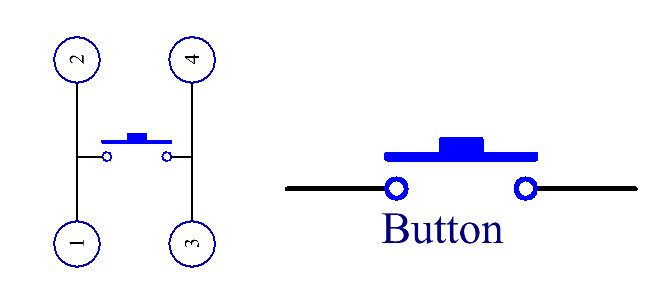

.. note::

    こんにちは、SunFounderのRaspberry Pi & Arduino & ESP32愛好家コミュニティへようこそ！Facebook上でRaspberry Pi、Arduino、ESP32についてもっと深く掘り下げ、他の愛好家と交流しましょう。

    **参加する理由は？**

    - **エキスパートサポート**：コミュニティやチームの助けを借りて、販売後の問題や技術的な課題を解決します。
    - **学び＆共有**：ヒントやチュートリアルを交換してスキルを向上させましょう。
    - **独占的なプレビュー**：新製品の発表や先行プレビューに早期アクセスしましょう。
    - **特別割引**：最新製品の独占割引をお楽しみください。
    - **祭りのプロモーションとギフト**：ギフトや祝日のプロモーションに参加しましょう。

    👉 私たちと一緒に探索し、創造する準備はできていますか？[|link_sf_facebook|]をクリックして今すぐ参加しましょう！

2.1.1 ボタン
============

前書き
-----------------

このレッスンでは、LEDをボタンでオンまたはオフにする方法を学習する。

部品
---------------

.. image:: ../img/list_2.1.1_Button.png

原理
-------------

**ボタン**

ボタンは電子デバイスを制御するために使用される一般的な部品である。通常、回路を接続または遮断するためのスイッチとして使用される。ボタンにはさまざまなサイズと形状があるが、ここで使用するものは、次の図に示すように6mmのミニボタンである。

左側の2つのピンが接続されており、右側の方は左側と同じである。以下を参照してください：

以下に示す記号は、通常、回路内のボタンを表すために使用される。

ボタンを押すと、4つのピンが接続され、回路が閉じる。

回路図
---------------------

Raspberry Piの入力として常開ボタンを使用し、接続は下の概略図に示されている。
ボタンを押すと、GPIO18は低レベル（0V）に変わる。
プログラミングによってGPIO18の状態を検出できる。
つまり、GPIO18が低レベルになった場合、ボタンが押されたことを意味する。
ボタンが押されたときに対応するコードを実行すると、LEDが点灯する。

.. image:: ../img/image302.png
    :width: 600
    :align: center

.. image:: ../img/image303.png
    :width: 400
    :align: center

実験手順
---------------------------

ステップ1： 回路を作る。

.. image:: ../img/image152.png
    :width: 800

ステップ2： コードファイルを開く。

.. raw:: html

   <run></run>

.. code-block::

    cd /home/pi/davinci-kit-for-raspberry-pi/c/2.1.1/

.. note::
    cd を使用して、この実験のコードのパスにディレクトリを変更する。

ステップ3： コードをコンパイルする。

.. raw:: html

   <run></run>

.. code-block::

    gcc 2.1.1_Button.c -lwiringPi

ステップ4： EXEファイルを実行する。

.. raw:: html

   <run></run>

.. code-block::

    sudo ./a.out

コードの実行後、ボタンを押すと、LEDが点灯する。それ以外の場合は消灯する。

**コード**

.. code-block:: c

    #include <wiringPi.h>
    #include <stdio.h>

    #define LedPin      0
    #define ButtonPin   1

    int main(void){
        // When initialize wiring failed, print message to screen
        if(wiringPiSetup() == -1){
            printf("setup wiringPi failed !");
            return 1;
        }
        
        pinMode(LedPin, OUTPUT);
        pinMode(ButtonPin, INPUT);
        digitalWrite(LedPin, HIGH);
        
        while(1){
            // Indicate that button has pressed down
            if(digitalRead(ButtonPin) == 0){
                // Led on
                digitalWrite(LedPin, LOW);
            //  printf("...LED on\n");
            }
            else{
                // Led off
                digitalWrite(LedPin, HIGH);
            //  printf("LED off...\n");
            }
        }
        return 0;
    }

**コードの説明**

.. code-block:: 

    #define LedPin      0

T_ExtensionボードのGPIO17ピンは、wiringPiのGPIO0と同じである。

.. code-block:: 

    #define ButtonPin   1

ButtonPinはGPIO1に接続されている。

.. code-block:: 

    pinMode(LedPin, OUTPUT);

LedPinを出力として設定し、値を割り当てる。

.. code-block:: 

    pinMode(ButtonPin, INPUT);

ButtonPinを入力として設定し、ButtonPinの値を読み取る。

.. code-block:: C

    while(1){
            // Indicate that button has pressed down
            if(digitalRead(ButtonPin) == 0){
                // Led on
                digitalWrite(LedPin, LOW);
            //  printf("...LED on\n");
            }
            else{
                // Led off
                digitalWrite(LedPin, HIGH);
            //  printf("LED off...\n");
            }
        }

``if(digitalRead(ButtonPin))== 0:`` ボタンが押されたかどうかを確認してください。
ボタンを押してLEDを点灯させると、 ``digitalWrite(LedPin、LOW)`` を実行してください。
