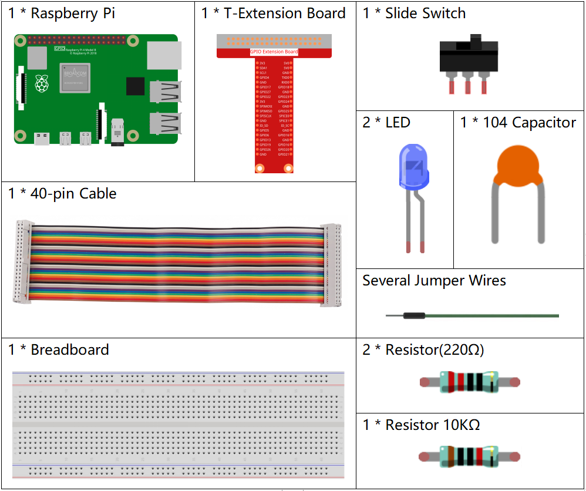

.. note::

    Bonjour et bienvenue dans la communauté SunFounder dédiée aux passionnés de Raspberry Pi, Arduino et ESP32 sur Facebook ! Plongez dans l'univers du Raspberry Pi, d'Arduino et d'ESP32 avec d'autres passionnés.

    **Pourquoi nous rejoindre ?**

    - **Support d'experts** : Résolvez vos problèmes après-vente et relevez des défis techniques avec l'aide de notre communauté et de notre équipe.
    - **Apprendre & Partager** : Échangez des conseils et des tutoriels pour améliorer vos compétences.
    - **Aperçus exclusifs** : Accédez en avant-première aux nouvelles annonces de produits et aux aperçus.
    - **Réductions spéciales** : Profitez de remises exclusives sur nos nouveaux produits.
    - **Promotions festives et cadeaux** : Participez à des tirages au sort et à des promotions spéciales pour les fêtes.

    👉 Prêt(e) à explorer et à créer avec nous ? Cliquez sur [|link_sf_facebook|] et rejoignez-nous dès aujourd'hui !

2.1.2 Interrupteur à glissière
=================================

Introduction
------------

Dans cette leçon, nous allons apprendre à utiliser un interrupteur à glissière. 
Généralement, l'interrupteur à glissière est soudé sur un circuit imprimé (PCB) 
comme interrupteur d'alimentation, mais ici, nous l'insérons dans une breadboard, 
ce qui peut rendre sa fixation moins stable. Nous l'utilisons sur la breadboard 
pour démontrer son fonctionnement.

Composants
--------------

Principe
----------

**Interrupteur à glissière**

.. image:: img/image156.jpeg

Un interrupteur à glissière, comme son nom l'indique, fonctionne en déplaçant la barre 
de l'interrupteur pour connecter ou interrompre le circuit, permettant ainsi de commuter 
les circuits. Les types couramment utilisés sont SPDT, SPTT, DPDT, DPTT, etc. L'interrupteur 
à glissière est généralement utilisé dans les circuits basse tension. Il est apprécié pour 
sa flexibilité et sa stabilité, et il est largement utilisé dans les instruments 
électroniques et les jouets électriques.

Comment cela fonctionne : Utilisez la broche centrale comme broche fixe. Lorsque vous 
faites glisser le commutateur vers la gauche, les deux broches de gauche sont connectées ; 
lorsque vous le faites glisser vers la droite, les deux broches de droite sont connectées. 
Ainsi, il fonctionne comme un interrupteur pour connecter ou déconnecter les circuits. 
Voir le schéma ci-dessous :

.. image:: img/image304.png

Le symbole de circuit de l'interrupteur à glissière est illustré ci-dessous. 
La broche 2 dans le schéma fait référence à la broche centrale.

.. image:: img/image159.png

**Condensateur**

Le condensateur est un composant capable de stocker de l'énergie sous forme de 
charge électrique ou de créer une différence de potentiel (tension statique) 
entre ses plaques, un peu comme une petite batterie rechargeable.

Unités standard de capacité

Microfarad (μF) 1μF = 1/1 000 000 = 0,000001 = :math:`10^{- 6}` F

Nanofarad (nF) 1nF = 1/1 000 000 000 = 0,000000001 = :math:`10^{- 9}` F

Picofarad (pF) 1pF = 1/1 000 000 000 000 = 0,000000000001 = :math:`10^{- 12}` F

.. note::
    Ici, nous utilisons un **condensateur 104 (10 x 10\ 4\ pF)**. Comme pour 
    les résistances, les chiffres sur les condensateurs permettent de lire les 
    valeurs une fois assemblés sur le circuit. Les deux premiers chiffres représentent 
    la valeur, et le dernier chiffre signifie le multiplicateur. Ainsi, 104 représente 
    une puissance de 10 x 10 exposant 4 (en pF), soit 100 nF.

Schéma de câblage
---------------------

Connectez la broche centrale de l'interrupteur à glissière au GPIO17, et deux LEDs 
aux broches GPIO22 et GPIO27 respectivement. Ainsi, lorsque vous faites glisser 
l'interrupteur, vous verrez les deux LEDs s'allumer alternativement.

.. image:: img/image305.png

.. image:: img/image306.png

Procédures expérimentales
------------------------------

**Étape 1 :** Montez le circuit.

.. image:: img/image161.png
    :width: 800

**Étape 2** : Accédez au dossier du code.

.. raw:: html

   <run></run>

.. code-block::

    cd ~/davinci-kit-for-raspberry-pi/c/2.1.2

**Étape 3** : Compilez le code.

.. raw:: html

   <run></run>

.. code-block::

    gcc 2.1.2_Slider.c -lwiringPi 

**Étape 4** : Exécutez le fichier exécutable ci-dessus.

.. raw:: html

   <run></run>

.. code-block::

    sudo ./a.out

Pendant l'exécution du code, faites glisser l'interrupteur vers la gauche, 
la LED jaune s'allume ; vers la droite, c'est la LED rouge qui s'allume.

.. note::

    Si cela ne fonctionne pas après l'exécution, ou s'il y a un message d'erreur indiquant : \"wiringPi.h: No such file or directory\", veuillez consulter :ref:`C code is not working?`.

**Code**

.. code-block:: c

    #include <wiringPi.h>
    #include <stdio.h>
    #define slidePin        0
    #define led1            3
    #define led2            2

    int main(void)
    {
        // Si l'initialisation de wiringPi échoue, afficher un message à l'écran
        if(wiringPiSetup() == -1){
            printf("setup wiringPi failed !");
            return 1;
        }
        pinMode(slidePin, INPUT);
        pinMode(led1, OUTPUT);
        pinMode(led2, OUTPUT);
        while(1){
            // interrupteur glissé vers la droite, led1 allumée
            if(digitalRead(slidePin) == 1){
                digitalWrite(led1, LOW);
                digitalWrite(led2, HIGH);
                printf("LED1 on\n");
                delay(100);
            }
            // interrupteur glissé vers la gauche, led2 allumée
            if(digitalRead(slidePin) == 0){
                digitalWrite(led2, LOW);
                digitalWrite(led1, HIGH);
                printf(".....LED2 on\n");
                delay(100);
            }
        }
        return 0;
    }

**Explication du code**

.. code-block:: c

    if(digitalRead(slidePin) == 1){
                digitalWrite(led1, LOW);
                digitalWrite(led2, HIGH);
                printf("LED1 on\n");
        }

Lorsque l'interrupteur est poussé vers la droite, la broche centrale et celle de 
droite sont connectées ; le Raspberry Pi lit un niveau haut à la broche centrale, 
donc la LED1 s'allume et la LED2 s'éteint.

.. code-block:: c

    if(digitalRead(slidePin) == 0){
                digitalWrite(led2, LOW);
                digitalWrite(led1, HIGH);
                printf(".....LED2 on\n");
            }

Lorsque l'interrupteur est poussé vers la gauche, la broche centrale et celle de 
gauche sont connectées ; le Raspberry Pi lit un niveau bas, donc la LED2 s'allume 
et la LED1 s'éteint.
