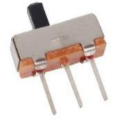
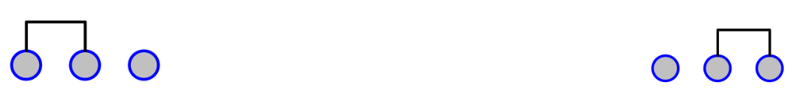
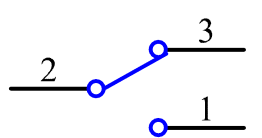

.. note::

    こんにちは、SunFounderのRaspberry Pi & Arduino & ESP32愛好家コミュニティへようこそ！Facebook上でRaspberry Pi、Arduino、ESP32についてもっと深く掘り下げ、他の愛好家と交流しましょう。

    **参加する理由は？**

    - **エキスパートサポート**：コミュニティやチームの助けを借りて、販売後の問題や技術的な課題を解決します。
    - **学び＆共有**：ヒントやチュートリアルを交換してスキルを向上させましょう。
    - **独占的なプレビュー**：新製品の発表や先行プレビューに早期アクセスしましょう。
    - **特別割引**：最新製品の独占割引をお楽しみください。
    - **祭りのプロモーションとギフト**：ギフトや祝日のプロモーションに参加しましょう。

    👉 私たちと一緒に探索し、創造する準備はできていますか？[|link_sf_facebook|]をクリックして今すぐ参加しましょう！

2.1.2 スライドスイッチ
======================

前書き
------------

このレッスンでは、スライドスイッチの使用方法を学習する。
通常、スライドスイッチは電源スイッチとしてPCBにはんだ付けされるが、
ここではブレッドボードに挿入する必要があるため、締め付けられない場合がある。
そして、その機能を示すためにブレッドボードで使用する。

部品
----------

.. image:: ../img/list_2.1.2_slide_switch.png

原理
---------

**スライドスイッチ**

スライドスイッチは名前が示すように、スイッチバーをスライドさせて回路を接続または遮断し、
さらに回路を切り替えるものである。汎用タイプは、SPDT、SPTT、DPDT、DPTTなどである。
スライドスイッチは低電圧回路で一般的に使用されている。融通性と安定性の特徴を備えており、
電気機器や電気玩具に広く適用されている。

仕組み：中央のピンを固定ピンとして設定する。
スライドを左に引くと、左の2つのピンが接続され、右に引くと、
右側の2つのピンが接続される。したがって、
回路を接続または遮断するスイッチとして機能する。以下の図を参照してください：

スライドスイッチの回路記号を以下に示す。図のピン2は中央のピンを指す。

**コンデンサ**

コンデンサーは、小さな充電式バッテリーのように、エネルギーを電荷の形で蓄えたり、プレート間に電位差（静的電圧）を生成する能力を持つ部品である。

静電容量の標準単位

Microfarad (μF) 1μF = 1/1,000,000 = 0.000001 = :math:`10^{- 6}` F

Nanofarad (nF) 1nF = 1/1,000,000,000 = 0.000000001 = :math:`10^{- 9}`\ F

Picofarad (pF) 1pF = 1/1,000,000,000,000 = 0.000000000001 =
:math:`10^{- 12}`\ F

.. note::
    ここでは、 **104コンデンサ** (10 x :math:`10^{4}`\ PF) を使用する。
    抵抗器のリングのように、コンデンサの数字は、ボードに組み立てられた後に値を読み取ることに役立つ。
    最初の2桁は値を表し、数字の最後の桁は乗数を指す（pF単位）。

回路図
-----------------

スライドスイッチの中央のピンをGPIO17に接続し、2つのLEDをそれぞれGPIO22とGPIO27に接続する。
次に、スライドを引くと、2つのLEDが交互に点灯する。

.. image:: ../img/image305.png

.. image:: ../img/image306.png

実験手順
-----------------------

ステップ1： 回路を作る。

.. image:: ../img/image161.png
    :width: 800

ステップ2： コードのフォルダーに入る。

.. raw:: html

   <run></run>

.. code-block::

    cd /home/pi/davinci-kit-for-raspberry-pi/c/2.1.2

ステップ3： コンパイルする。

.. raw:: html

   <run></run>

.. code-block::

    gcc 2.1.2_Slider.c -lwiringPi 

ステップ4： EXEファイルを実行する。

.. raw:: html

   <run></run>

.. code-block::

    sudo ./a.out

コードの実行中に、スイッチを左側に接続すると、黄色のLEDが点灯する。右側に接続すると、赤いライトが点灯する。

**コード**

.. code-block:: c

    #include <wiringPi.h>
    #include <stdio.h>
    #define slidePin        0
    #define led1            3
    #define led2            2

    int main(void)
    {
        // When initialize wiring failed, print message to screen
        if(wiringPiSetup() == -1){
            printf("setup wiringPi failed !");
            return 1;
        }
        pinMode(slidePin, INPUT);
        pinMode(led1, OUTPUT);
        pinMode(led2, OUTPUT);
        while(1){
            // slide switch high, led1 on
            if(digitalRead(slidePin) == 1){
                digitalWrite(led1, LOW);
                digitalWrite(led2, HIGH);
                printf("LED1 on\n");
                delay(100);
            }
            // slide switch low, led2 on
            if(digitalRead(slidePin) == 0){
                digitalWrite(led2, LOW);
                digitalWrite(led1, HIGH);
                printf(".....LED2 on\n");
                delay(100);
            }
        }
        return 0;
    }

**コードの説明**

.. code-block:: c

    if(digitalRead(slidePin) == 1){
                digitalWrite(led1, LOW);
                digitalWrite(led2, HIGH);
                printf("LED1 on\n");
        }

スライドを右に引くと、中央のピンと右のピンが接続される。 Raspberry Piは中央のピンで高レベルを読み取るため、LED1は点灯し、LED2は消灯する。

.. code-block:: c

    if(digitalRead(slidePin) == 0){
                digitalWrite(led2, LOW);
                digitalWrite(led1, HIGH);
                printf(".....LED2 on\n");
            }

スライドを左に引くと、中央のピンと左のピンが接続されます。Raspberry Piが低レベルを読み取るため、LED2が点灯し、LED1が消灯する。
