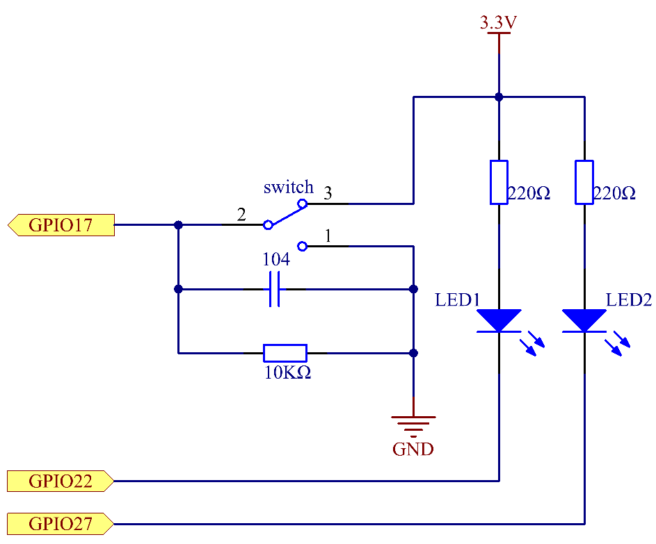

.. note::

    Ciao, benvenuto nella Community SunFounder Raspberry Pi & Arduino & ESP32 Enthusiasts su Facebook! Approfondisci le tue conoscenze su Raspberry Pi, Arduino e ESP32 con altri appassionati.

    **Perché unirti a noi?**

    - **Supporto Esperto**: Risolvi problemi post-vendita e sfide tecniche con l’aiuto della nostra community e del nostro team.
    - **Impara e Condividi**: Scambia consigli e tutorial per migliorare le tue competenze.
    - **Anteprime Esclusive**: Ottieni accesso anticipato ai nuovi annunci di prodotti e alle anteprime.
    - **Sconti Speciali**: Approfitta di sconti esclusivi sui nostri prodotti più recenti.
    - **Promozioni Festive e Omaggi**: Partecipa a giveaway e promozioni festive.

    👉 Pronto a esplorare e creare con noi? Clicca su [|link_sf_facebook|] e unisciti oggi stesso!

2.1.2 Interruttore a Scorrimento
===================================

Introduzione
---------------

In questa lezione impareremo a utilizzare un interruttore a scorrimento. 
Solitamente, l'interruttore a scorrimento è saldato sul PCB come interruttore 
di alimentazione, ma qui lo inseriamo nella breadboard, anche se potrebbe non 
essere ben saldo, per dimostrarne la funzione.

Componenti
-------------

.. image:: img/list_2.1.2_slide_switch.png

Principio
-------------

**Interruttore a Scorrimento**

.. image:: img/image156.jpeg

Un interruttore a scorrimento, come suggerisce il nome, funziona facendo 
scorrere la leva per connettere o interrompere il circuito, commutando così 
i circuiti. I tipi più comuni sono SPDT, SPTT, DPDT, DPTT, e vengono utilizzati 
frequentemente nei circuiti a bassa tensione. Presenta caratteristiche di 
flessibilità e stabilità, ed è ampiamente utilizzato in strumenti elettrici e 
giocattoli elettronici.

Funzionamento: Imposta il pin centrale come fisso. Quando fai scorrere 
l'interruttore a sinistra, i due pin a sinistra sono collegati; quando 
lo fai scorrere a destra, si collegano i due pin a destra. In questo modo, 
funziona come un interruttore per connettere o disconnettere i circuiti. 
Vedi la figura seguente:

.. image:: img/image304.png

Il simbolo del circuito dell'interruttore a scorrimento è mostrato di seguito. 
Il pin 2 nella figura si riferisce al pin centrale.

.. image:: img/image159.png

**Condensatore**

Un condensatore è un componente che ha la capacità di immagazzinare energia 
sotto forma di carica elettrica o di produrre una differenza di potenziale 
(tensione statica) tra le sue piastre, come una piccola batteria ricaricabile.

Unità standard di capacità:

Microfarad (μF) 1μF = 1/1.000.000 = 0,000001 = :math:`10^{- 6}` F

Nanofarad (nF) 1nF = 1/1.000.000.000 = 0,000000001 = :math:`10^{- 9}`\ F

Picofarad (pF) 1pF = 1/1.000.000.000.000 = 0,000000000001 = :math:`10^{- 12}`\ F

.. note::
    Qui utilizziamo un **condensatore 104 (10 x 10^4 PF)**. Proprio come gli anelli 
    dei resistori, i numeri sui condensatori aiutano a leggere i valori una volta 
    assemblati sulla scheda. Le prime due cifre rappresentano il valore e l'ultima 
    cifra indica il moltiplicatore. Pertanto, 104 rappresenta una potenza di 10 x 10 alla 4 (in pF), 
    pari a 100 nF.

Schema Elettrico
--------------------

Collega il pin centrale dell’interruttore a scorrimento al GPIO17 e due LED 
rispettivamente ai pin GPIO22 e GPIO27. Quindi, quando sposti l'interruttore, 
vedrai i due LED accendersi alternativamente.

.. image:: img/image305.png

Procedure Sperimentali
--------------------------

**Passo 1:** Costruisci il circuito.

.. image:: img/image161.png
    :width: 800

**Passo 2:** Vai alla cartella del codice.

.. raw:: html

   <run></run>

.. code-block::

    cd ~/davinci-kit-for-raspberry-pi/c/2.1.2

**Passo 3:** Compila.

.. raw:: html

   <run></run>

.. code-block::

    gcc 2.1.2_Slider.c -lwiringPi 

**Passo 4:** Esegui il file eseguibile.

.. raw:: html

   <run></run>

.. code-block::

    sudo ./a.out

Durante l'esecuzione del codice, collega l'interruttore a sinistra e si 
accenderà il LED giallo; spostandolo a destra, si accenderà il LED rosso.

.. note::

    Se non funziona dopo l’esecuzione, o appare un messaggio di errore: \"wiringPi.h: No such file or directory\", fai riferimento a :ref:`Il codice C non funziona?`.

**Codice**

.. code-block:: c

    #include <wiringPi.h>
    #include <stdio.h>
    #define slidePin        0
    #define led1            3
    #define led2            2

    int main(void)
    {
        // Se l'inizializzazione di wiring fallisce, stampa un messaggio a schermo
        if(wiringPiSetup() == -1){
            printf("setup wiringPi failed !");
            return 1;
        }
        pinMode(slidePin, INPUT);
        pinMode(led1, OUTPUT);
        pinMode(led2, OUTPUT);
        while(1){
            // interruttore alto, led1 acceso
            if(digitalRead(slidePin) == 1){
                digitalWrite(led1, LOW);
                digitalWrite(led2, HIGH);
                printf("LED1 on\n");
                delay(100);
            }
            // interruttore basso, led2 acceso
            if(digitalRead(slidePin) == 0){
                digitalWrite(led2, LOW);
                digitalWrite(led1, HIGH);
                printf(".....LED2 on\n");
                delay(100);
            }
        }
        return 0;
    }

**Spiegazione del Codice**

.. code-block:: c

    if(digitalRead(slidePin) == 1){
                digitalWrite(led1, LOW);
                digitalWrite(led2, HIGH);
                printf("LED1 on\n");
        }

Quando l’interruttore è spostato a destra, il pin centrale e quello destro 
sono collegati; il Raspberry Pi legge un livello alto sul pin centrale, quindi 
LED1 si accende e LED2 si spegne.

.. code-block:: c

    if(digitalRead(slidePin) == 0){
                digitalWrite(led2, LOW);
                digitalWrite(led1, HIGH);
                printf(".....LED2 on\n");
            }

Quando l’interruttore è spostato a sinistra, il pin centrale e quello 
sinistro sono collegati; il Raspberry Pi legge un livello basso, quindi 
LED2 si accende e LED1 si spegne.

