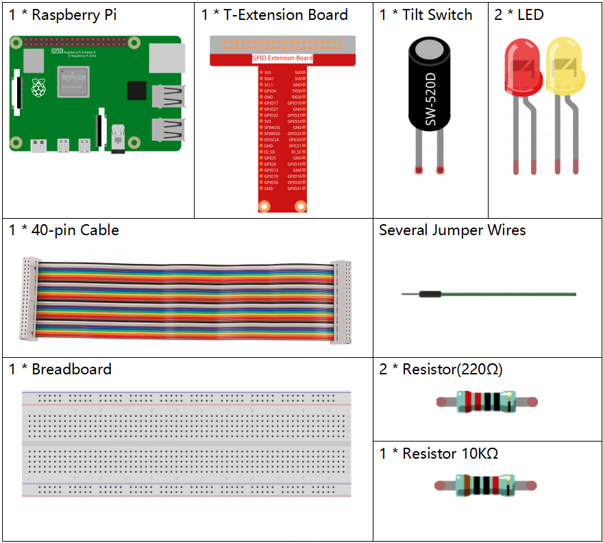
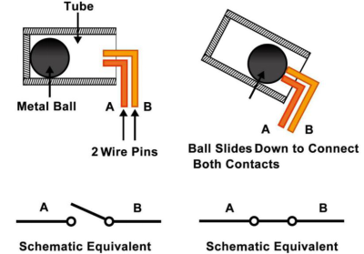
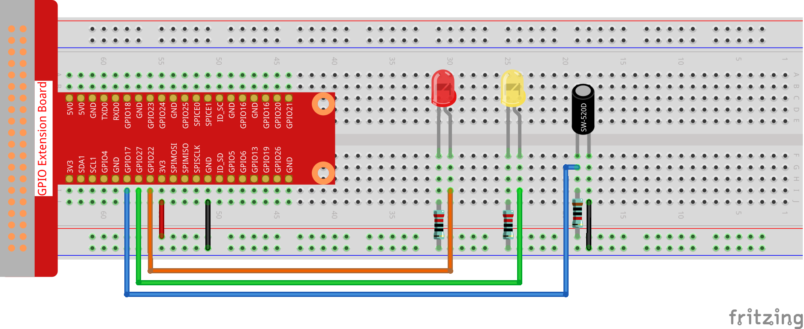

.. note::

    こんにちは、SunFounderのRaspberry Pi & Arduino & ESP32愛好家コミュニティへようこそ！Facebook上でRaspberry Pi、Arduino、ESP32についてもっと深く掘り下げ、他の愛好家と交流しましょう。

    **参加する理由は？**

    - **エキスパートサポート**：コミュニティやチームの助けを借りて、販売後の問題や技術的な課題を解決します。
    - **学び＆共有**：ヒントやチュートリアルを交換してスキルを向上させましょう。
    - **独占的なプレビュー**：新製品の発表や先行プレビューに早期アクセスしましょう。
    - **特別割引**：最新製品の独占割引をお楽しみください。
    - **祭りのプロモーションとギフト**：ギフトや祝日のプロモーションに参加しましょう。

    👉 私たちと一緒に探索し、創造する準備はできていますか？[|link_sf_facebook|]をクリックして今すぐ参加しましょう！

2.1.3 チルトスイッチ
====================

前書き
------------

これは、内部に金属製のボールがあるボールチルトスイッチである。小さな角度の傾きを検出するために使用される。

部品
----------

原理
---------

**チルト**

原理は非常に簡単である。スイッチが特定の角度に傾けられると、内側のボールが転がり落ち、外側のピンに接続された2つの接点に触れて、回路をトリガーする。
そうしないと、ボールが接点から遠ざかり、回路が遮断される。

回路図
-----------------

.. image:: ../img/image307.png

.. image:: ../img/image308.png

実験手順
-----------------------

ステップ1： 回路を作る。

ステップ2： ディレクトリを変更する。

.. raw:: html

   <run></run>

.. code-block::

    cd ~/davinci-kit-for-raspberry-pi/c/2.1.3/

ステップ3： コンパイルする。

.. raw:: html

   <run></run>

.. code-block::

    gcc 2.1.3_Tilt.c -lwiringPi

ステップ4： 実行する。

.. raw:: html

   <run></run>

.. code-block::

    sudo ./a.out

水平に置くと、緑色のLEDが点灯する。傾けると、「Tilt!」画面にプリントされ、赤いLEDが点灯する。再び水平に置くと、緑色のLEDが再び点灯する。

**コード**

.. code-block:: c

    #include <wiringPi.h>
    #include <stdio.h>

    #define TiltPin     0
    #define Gpin        2
    #define Rpin        3

    void LED(char* color)
    {
        pinMode(Gpin, OUTPUT);
        pinMode(Rpin, OUTPUT);
        if (color == "RED")
        {
            digitalWrite(Rpin, HIGH);
            digitalWrite(Gpin, LOW);
        }
        else if (color == "GREEN")
        {
            digitalWrite(Rpin, LOW);
            digitalWrite(Gpin, HIGH);
        }
        else
            printf("LED Error");
    }

    int main(void)
    {
        if(wiringPiSetup() == -1){ //when initialize wiring failed,print message to screen
            printf("setup wiringPi failed !");
            return 1;
        }

        pinMode(TiltPin, INPUT);
        LED("GREEN");
        
        while(1){
            if(0 == digitalRead(TiltPin)){
                delay(10);
                if(0 == digitalRead(TiltPin)){
                    LED("RED");
                    printf("Tilt!\n");
                    delay(100);
                }
            }
            else if(1 == digitalRead(TiltPin)){
                delay(10);
                if(1 == digitalRead(TiltPin)){
                    LED("GREEN");
                }
            }
        }
        return 0;
    }

**コードの説明**

.. code-block:: c

    void LED(char* color)
    {
        pinMode(Gpin, OUTPUT);
        pinMode(Rpin, OUTPUT);
        if (color == "RED")
        {
            digitalWrite(Rpin, HIGH);
            digitalWrite(Gpin, LOW);
        }
        else if (color == "GREEN")
        {
            digitalWrite(Rpin, LOW);
            digitalWrite(Gpin, HIGH);
        }
        else
            printf("LED Error");
    }

関数 ``LED()`` を定義して、2つのLEDをオン・オフにする。
パラメータの色が赤の場合、赤のLEDが点灯する。
同様に、パラメータの色が緑の場合、緑のLEDが点灯する。

.. code-block:: c

    while(1){
            if(0 == digitalRead(TiltPin)){
                delay(10);
                if(0 == digitalRead(TiltPin)){
                    LED("RED");
                    printf("Tilt!\n");
                }
            }
            else if(1 == digitalRead(TiltPin)){
                delay(10);
                if(1 == digitalRead(TiltPin)){
                    LED("GREEN");
                }
            }
        }

傾斜スイッチの読み取り値が0の場合、傾斜スイッチが傾斜していることを意味し、
関数LEDにパラメーター「RED」を書き込んで赤色LEDを点灯させる。
そうしない場合、緑色のLEDが点灯する。
