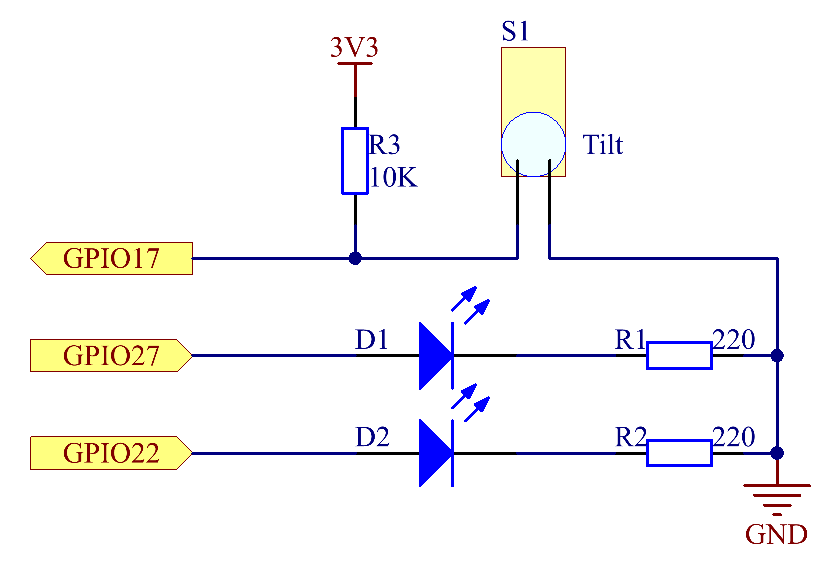

.. note::

    Bonjour et bienvenue dans la communauté SunFounder dédiée aux passionnés de Raspberry Pi, Arduino et ESP32 sur Facebook ! Plongez dans l'univers du Raspberry Pi, d'Arduino et d'ESP32 avec d'autres passionnés.

    **Pourquoi nous rejoindre ?**

    - **Support d'experts** : Résolvez vos problèmes après-vente et relevez des défis techniques avec l'aide de notre communauté et de notre équipe.
    - **Apprendre & Partager** : Échangez des conseils et des tutoriels pour améliorer vos compétences.
    - **Aperçus exclusifs** : Accédez en avant-première aux nouvelles annonces de produits et aux aperçus.
    - **Réductions spéciales** : Profitez de remises exclusives sur nos nouveaux produits.
    - **Promotions festives et cadeaux** : Participez à des tirages au sort et à des promotions spéciales pour les fêtes.

    👉 Prêt(e) à explorer et à créer avec nous ? Cliquez sur [|link_sf_facebook|] et rejoignez-nous dès aujourd'hui !

2.1.3 Interrupteur à bascule
===============================

Introduction
--------------

Il s'agit d'un interrupteur à bascule avec une bille métallique à l'intérieur. 
Il est utilisé pour détecter les inclinaisons à faible angle.

Composants
--------------

.. image:: img/list_2.1.3_tilt_switch.png

Principe
-----------

**Interrupteur à bascule**

Le principe est très simple. Lorsque l'interrupteur est incliné selon un certain 
angle, la bille à l'intérieur roule et touche les deux contacts reliés aux broches 
extérieures, déclenchant ainsi les circuits. Sinon, la bille reste éloignée des 
contacts, interrompant les circuits.

.. image:: img/image167.png

Schéma de câblage
---------------------

.. image:: img/image307.png

Procédures expérimentales
----------------------------

**Étape 1 :** Montez le circuit.

.. image:: img/image169.png
    :width: 800

**Étape 2 :** Changez de répertoire.

.. raw:: html

   <run></run>

.. code-block::

    cd ~/davinci-kit-for-raspberry-pi/c/2.1.3/

**Étape 3 :** Compilez le code.

.. raw:: html

   <run></run>

.. code-block::

    gcc 2.1.3_Tilt.c -lwiringPi

**Étape 4 :** Exécutez le programme.

.. raw:: html

   <run></run>

.. code-block::

    sudo ./a.out

Placez l'interrupteur à l'horizontale, et la LED verte s'allumera. Si vous l'inclinez, 
le message « Inclinaison ! » s'affichera à l'écran et la LED rouge s'allumera. 
Remettez-le à l'horizontale, et la LED verte se rallumera.

.. note::

    Si cela ne fonctionne pas après l'exécution, ou s'il y a un message 
    d'erreur indiquant : \"wiringPi.h: No such file or directory\", veuillez 
    consulter :ref:`C code is not working?`.

**Code**

.. code-block:: c

    #include <wiringPi.h>
    #include <stdio.h>

    #define TiltPin     0
    #define Gpin        2
    #define Rpin        3

    void LED(char* color)
    {
        pinMode(Gpin, OUTPUT);
        pinMode(Rpin, OUTPUT);
        if (color == "RED")
        {
            digitalWrite(Rpin, HIGH);
            digitalWrite(Gpin, LOW);
        }
        else if (color == "GREEN")
        {
            digitalWrite(Rpin, LOW);
            digitalWrite(Gpin, HIGH);
        }
        else
            printf("LED Error");
    }

    int main(void)
    {
        if(wiringPiSetup() == -1){ // Si l'initialisation de wiringPi échoue, affichez un message à l'écran
            printf("setup wiringPi failed !");
            return 1;
        }

        pinMode(TiltPin, INPUT);
        LED("GREEN");
        
        while(1){
            if(0 == digitalRead(TiltPin)){
                delay(10);
                if(0 == digitalRead(TiltPin)){
                    LED("RED");
                    printf("Tilt!\n");
                    delay(100);
                }
            }
            else if(1 == digitalRead(TiltPin)){
                delay(10);
                if(1 == digitalRead(TiltPin)){
                    LED("GREEN");
                }
            }
        }
        return 0;
    }

**Explication du code**

.. code-block:: c

    void LED(char* color)
    {
        pinMode(Gpin, OUTPUT);
        pinMode(Rpin, OUTPUT);
        if (color == "RED")
        {
            digitalWrite(Rpin, HIGH);
            digitalWrite(Gpin, LOW);
        }
        else if (color == "GREEN")
        {
            digitalWrite(Rpin, LOW);
            digitalWrite(Gpin, HIGH);
        }
        else
            printf("LED Error");
    }

Définissez une fonction LED() pour allumer ou éteindre les deux LEDs. Si le 
paramètre color est RED, la LED rouge s'allume ; de même, si le paramètre color 
est GREEN, la LED verte s'allume.

.. code-block:: c

    while(1){
            if(0 == digitalRead(TiltPin)){
                delay(10);
                if(0 == digitalRead(TiltPin)){
                    LED("RED");
                    printf("Tilt!\n");
                }
            }
            else if(1 == digitalRead(TiltPin)){
                delay(10);
                if(1 == digitalRead(TiltPin)){
                    LED("GREEN");
                }
            }
        }

Si la valeur lue de l'interrupteur à bascule est 0, cela signifie que 
l'interrupteur est incliné. Écrivez alors le paramètre « RED » dans la 
fonction LED pour allumer la LED rouge ; sinon, la LED verte s'allume.
