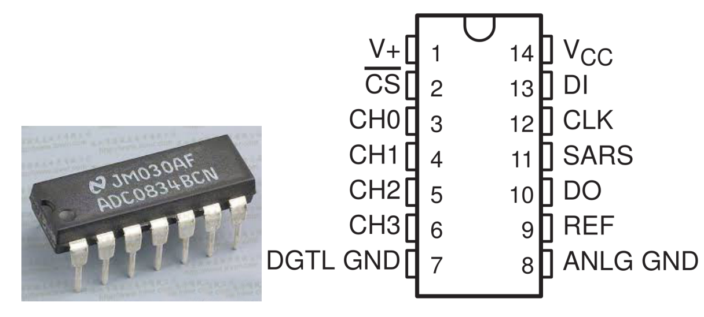
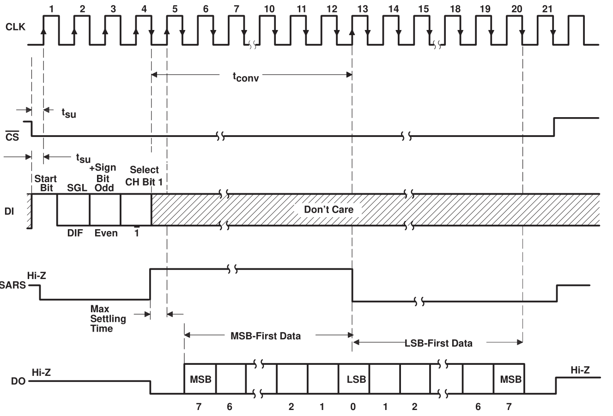

.. note::

    Ciao, benvenuto nella Community di SunFounder per gli appassionati di Raspberry Pi, Arduino e ESP32 su Facebook! Approfondisci le tue conoscenze su Raspberry Pi, Arduino e ESP32 con altri appassionati.

    **Perché unirti a noi?**

    - **Supporto Esperto**: Risolvi problemi post-vendita e sfide tecniche con l'aiuto della nostra community e del nostro team.
    - **Impara e Condividi**: Scambia consigli e tutorial per migliorare le tue competenze.
    - **Anteprime Esclusive**: Ottieni accesso anticipato ai nuovi annunci di prodotti e alle anteprime.
    - **Sconti Speciali**: Approfitta di sconti esclusivi sui nostri prodotti più recenti.
    - **Promozioni Festive e Omaggi**: Partecipa a giveaway e promozioni festive.

    👉 Sei pronto per esplorare e creare con noi? Clicca su [|link_sf_facebook|] e unisciti oggi stesso!

2.1.4 Potenziometro
=====================

Introduzione
---------------

La funzione ADC (convertitore analogico-digitale) può essere utilizzata 
per convertire segnali analogici in segnali digitali, e in questo esperimento 
viene utilizzato ADC0834 per implementare la funzione ADC. Qui realizziamo 
questo processo utilizzando un potenziometro, che modifica la quantità fisica 
- tensione - convertita dalla funzione ADC.

Componenti
--------------

.. image:: img/list_2.1.4_potentiometer.png

Principio
-------------

**ADC0834**

L'ADC0834 è un convertitore analogico-digitale a 8 bit `successive
approximation <https://cn.bing.com/dict/search?q=successive approximations&FORM=BDVSP6&mkt=zh-cn>`__
 dotato di un multiplexer multicanale configurabile in ingresso e con input/output seriale. L'input/output 
 seriale è configurato per interfacciarsi con registri a scorrimento standard o microprocessori.

**Sequenza di Operazione**

Una conversione è avviata impostando CS a basso livello, abilitando tutti i circuiti logici. CS deve rimanere 
basso per l'intero processo di conversione. Un segnale di clock è quindi ricevuto dal processore. Ad ogni transizione 
da basso ad alto del segnale di clock, i dati su DI vengono caricati nel registro a scorrimento dell'indirizzo del 
multiplexer. Il primo livello alto in ingresso è il bit di avvio. A questo segue una parola di assegnazione di 3 o 4 bit. 
Ad ogni successiva transizione da basso ad alto del segnale di clock, il bit di avvio e la parola di assegnazione vengono 
trasferiti attraverso il registro a scorrimento. Quando il bit di avvio viene inserito nella posizione di avvio del registro 
del multiplexer, il canale di ingresso viene selezionato e inizia la conversione. L’uscita dello stato SAR (SARS) diventa alta 
per indicare che è in corso una conversione, e DI viene disabilitato per tutta la durata della conversione.

Viene automaticamente inserito un intervallo di un periodo di clock per consentire la stabilizzazione del canale multiplexato selezionato. 
L'uscita dati DO esce dallo stato ad alta impedenza e fornisce un livello basso per questo periodo di stabilizzazione del multiplexer. 
Il comparatore SAR confronta le uscite successive della scala resistiva con il segnale analogico in ingresso. L'uscita del comparatore 
indica se l'ingresso analogico è maggiore o minore dell'uscita della scala resistiva. Man mano che la conversione procede, i dati di 
conversione sono simultaneamente emessi dal pin di uscita DO, con il bit più significativo (MSB) per primo.

Dopo otto periodi di clock, la conversione è completa e l'uscita SARS torna bassa. Infine, i dati vengono emessi partendo dal bit meno 
significativo (LSB) dopo il flusso di dati MSB-primo.

**Tabella di Controllo degli Indirizzi MUX di ADC0834**

.. image:: img/image176.png
    :width: 800
    :align: center

**Potenziometro**

Un potenziometro è anche un componente di resistenza con 3 terminali e il 
suo valore resistivo può essere regolato in base a una variazione regolare. 
Il potenziometro di solito è composto da un resistore e una spazzola mobile. 
Quando la spazzola si sposta lungo il resistore, si genera una resistenza o 
tensione specifica in base alla posizione della spazzola.

.. image:: img/image310.png
    :width: 300
    :align: center

Le funzioni del potenziometro nel circuito sono le seguenti:

1. Funzione di divisore di tensione

Il potenziometro è un resistore regolabile in modo continuo. Quando si regola 
l'asse o il cursore del potenziometro, il contatto mobile scorre sul resistore. 
A questo punto, si può ottenere una tensione in uscita in base alla tensione 
applicata sul potenziometro e all'angolo a cui è ruotato il braccio mobile o 
alla distanza percorsa.

Schema Elettrico
--------------------

.. image:: img/image311.png

.. image:: img/image312.png

Procedure Sperimentali
--------------------------

**Passo 1:** Costruisci il circuito.

.. image:: img/image180.png
    :width: 800

.. note::
    Posiziona il chip facendo riferimento alla posizione corrispondente
    indicata nell'immagine. Assicurati che la scanalatura sul chip sia
    rivolta verso sinistra quando viene posizionato.

**Passo 2:** Apri il file del codice.

.. raw:: html

   <run></run>

.. code-block::

    cd ~/davinci-kit-for-raspberry-pi/c/2.1.4/

**Passo 3:** Compila il codice.

.. raw:: html

   <run></run>

.. code-block::

    gcc 2.1.4_Potentiometer.c -lwiringPi

**Passo 4:** Esegui il programma.

.. raw:: html

   <run></run>

.. code-block::

    sudo ./a.out

Dopo aver eseguito il codice, ruota la manopola del potenziometro: l'intensità
del LED cambierà di conseguenza.

.. note::

    Se il programma non funziona dopo l'esecuzione, o appare un messaggio di errore: \"wiringPi.h: File o directory non trovato\", fai riferimento a :ref:`Il codice C non funziona?`.

**Codice**

.. code-block:: c

    #include <wiringPi.h>
    #include <stdio.h>
    #include <softPwm.h>

    typedef unsigned char uchar;
    typedef unsigned int uint;

    #define     ADC_CS    0
    #define     ADC_CLK   1
    #define     ADC_DIO   2
    #define     LedPin    3

    uchar get_ADC_Result(uint channel)
    {
        uchar i;
        uchar dat1=0, dat2=0;
        int sel = channel > 1 & 1;
        int odd = channel & 1;

        digitalWrite(ADC_CLK, 1);
        delayMicroseconds(2);
        digitalWrite(ADC_CLK, 0);
        delayMicroseconds(2);

        pinMode(ADC_DIO, OUTPUT);
        digitalWrite(ADC_CS, 0);
        // Bit di avvio
        digitalWrite(ADC_CLK,0);
        digitalWrite(ADC_DIO,1);    delayMicroseconds(2);
        digitalWrite(ADC_CLK,1);    delayMicroseconds(2);
        // Modalità Singolo Fine
        digitalWrite(ADC_CLK,0);
        digitalWrite(ADC_DIO,1);    delayMicroseconds(2);
        digitalWrite(ADC_CLK,1);    delayMicroseconds(2);
        // Dispari
        digitalWrite(ADC_CLK,0);
        digitalWrite(ADC_DIO,odd);  delayMicroseconds(2);
        digitalWrite(ADC_CLK,1);    delayMicroseconds(2);
        // Seleziona
        digitalWrite(ADC_CLK,0);
        digitalWrite(ADC_DIO,sel);    delayMicroseconds(2);
        digitalWrite(ADC_CLK,1);

        digitalWrite(ADC_DIO,1);    delayMicroseconds(2);
        digitalWrite(ADC_CLK,0);
        digitalWrite(ADC_DIO,1);    delayMicroseconds(2);

        for(i=0;i<8;i++)
        {
            digitalWrite(ADC_CLK,1);    delayMicroseconds(2);
            digitalWrite(ADC_CLK,0);    delayMicroseconds(2);

            pinMode(ADC_DIO, INPUT);
            dat1=dat1<<1 | digitalRead(ADC_DIO);
        }

        for(i=0;i<8;i++)
        {
            dat2 = dat2 | ((uchar)(digitalRead(ADC_DIO))<<i);
            digitalWrite(ADC_CLK,1);    delayMicroseconds(2);
            digitalWrite(ADC_CLK,0);    delayMicroseconds(2);
        }

        digitalWrite(ADC_CS,1);
        pinMode(ADC_DIO, OUTPUT);
        return(dat1==dat2) ? dat1 : 0;
    }

    int main(void)
    {
        uchar analogVal;
        if(wiringPiSetup() == -1){ //quando l'inizializzazione di wiring fallisce, stampa un messaggio sullo schermo
            printf("setup wiringPi failed !");
            return 1;
        }
        softPwmCreate(LedPin,  0, 100);
        pinMode(ADC_CS,  OUTPUT);
        pinMode(ADC_CLK, OUTPUT);

        while(1){
            analogVal = get_ADC_Result(0);
            printf("Current analogVal : %d\n", analogVal);
            delay(100);
            softPwmWrite(LedPin, analogVal);
            delay(100);
        }
        return 0;
    }

**Spiegazione del Codice**

.. code-block:: c

    #define     ADC_CS    0
    #define     ADC_CLK   1
    #define     ADC_DIO   2
    #define     LedPin    3

Definiamo CS, CLK, DIO dell'ADC0834 e li colleghiamo rispettivamente a 
GPIO0, GPIO1 e GPIO2. Successivamente, colleghiamo il LED a GPIO3.

.. code-block:: c

    uchar get_ADC_Result(uint channel)
    {
        uchar i;
        uchar dat1=0, dat2=0;
        int sel = channel > 1 & 1;
        int odd = channel & 1;

        digitalWrite(ADC_CLK, 1);
        delayMicroseconds(2);
        digitalWrite(ADC_CLK, 0);
        delayMicroseconds(2);

        pinMode(ADC_DIO, OUTPUT);
        digitalWrite(ADC_CS, 0);
        // Bit di avvio
        digitalWrite(ADC_CLK,0);
        digitalWrite(ADC_DIO,1);    delayMicroseconds(2);
        digitalWrite(ADC_CLK,1);    delayMicroseconds(2);
        // Modalità singola (Single End mode)
        digitalWrite(ADC_CLK,0);
        digitalWrite(ADC_DIO,1);    delayMicroseconds(2);
        digitalWrite(ADC_CLK,1);    delayMicroseconds(2);
        // ODD
        digitalWrite(ADC_CLK,0);
        digitalWrite(ADC_DIO,odd);  delayMicroseconds(2);
        digitalWrite(ADC_CLK,1);    delayMicroseconds(2);
        // Selezione
        digitalWrite(ADC_CLK,0);
        digitalWrite(ADC_DIO,sel);    delayMicroseconds(2);
        digitalWrite(ADC_CLK,1);

        digitalWrite(ADC_DIO,1);    delayMicroseconds(2);
        digitalWrite(ADC_CLK,0);
        digitalWrite(ADC_DIO,1);    delayMicroseconds(2);
        for(i=0;i<8;i++)
        {
            digitalWrite(ADC_CLK,1);    delayMicroseconds(2);
            digitalWrite(ADC_CLK,0);    delayMicroseconds(2);

            pinMode(ADC_DIO, INPUT);
            dat1=dat1<<1 | digitalRead(ADC_DIO);
        }

        for(i=0;i<8;i++)
        {
            dat2 = dat2 | ((uchar)(digitalRead(ADC_DIO))<<i);
            digitalWrite(ADC_CLK,1);    delayMicroseconds(2);
            digitalWrite(ADC_CLK,0);    delayMicroseconds(2);
        }

        digitalWrite(ADC_CS,1);
        pinMode(ADC_DIO, OUTPUT);
        return(dat1==dat2) ? dat1 : 0;
    }

La funzione di conversione Analogico-Digitale (ADC) dell'ADC0834 viene 
eseguita come segue:

.. code-block:: c

    digitalWrite(ADC_CS, 0);

Imposta CS a livello basso per avviare la conversione AD.

.. code-block:: c

    // Bit di avvio
    digitalWrite(ADC_CLK,0);
    digitalWrite(ADC_DIO,1);    delayMicroseconds(2);
    digitalWrite(ADC_CLK,1);    delayMicroseconds(2);

Al primo passaggio da basso ad alto del segnale di clock, impostiamo DIO 
su 1 come bit di avvio. Nei tre passaggi successivi, si configurano le 
parole di assegnazione.

.. code-block:: c

    // Modalità singola (Single End mode)
    digitalWrite(ADC_CLK,0);
    igitalWrite(ADC_DIO,1);    delayMicroseconds(2);
    gitalWrite(ADC_CLK,1);    delayMicroseconds(2);

Quando il segnale di clock passa nuovamente da basso ad alto, impostiamo DIO su 1 e selezioniamo la modalità SGL.

.. code-block:: c

    // ODD
    digitalWrite(ADC_CLK,0);
    digitalWrite(ADC_DIO,odd);  delayMicroseconds(2);
    digitalWrite(ADC_CLK,1);    delayMicroseconds(2);

Al terzo passaggio, il valore di DIO è controllato dalla variabile **odd**.

.. code-block:: c

    // Selezione
    digitalWrite(ADC_CLK,0);
    digitalWrite(ADC_DIO,sel);    delayMicroseconds(2);
    digitalWrite(ADC_CLK,1);

Al quarto passaggio del segnale di clock, il valore di DIO è controllato dalla 
variabile **sel**.

Con **channel=0**, **sel=0** e **odd=0**, le formule operative per **sel** e **odd** sono:

.. code-block:: c

    int sel = channel > 1 & 1;
    int odd = channel & 1;

Quando **channel=1**, **sel=0** e **odd=1**, si può fare riferimento alla 
tabella di controllo logico dell’indirizzo. Qui viene selezionato CH1 e il 
bit di avvio viene inserito nella posizione di partenza del registro multiplexer, 
avviando così la conversione.

.. image:: img/image313.png

.. code-block:: c

    digitalWrite(ADC_DIO,1);    delayMicroseconds(2);
    digitalWrite(ADC_CLK,0);
    digitalWrite(ADC_DIO,1);    delayMicroseconds(2);

Qui, DIO è impostato su 1 due volte; puoi ignorarlo.

.. code-block:: c

    for(i=0;i<8;i++)
        {
            digitalWrite(ADC_CLK,1);    delayMicroseconds(2);
            digitalWrite(ADC_CLK,0);    delayMicroseconds(2);

            pinMode(ADC_DIO, INPUT);
            dat1=dat1<<1 | digitalRead(ADC_DIO);
        }

Nel primo ciclo for(), non appena il quinto impulso del CLK passa da livello 
alto a basso, DIO è impostato in modalità input. A questo punto, inizia la 
conversione e il valore convertito viene memorizzato nella variabile dat1. 
Dopo otto periodi di clock, la conversione è completa.

.. code-block:: c

    for(i=0;i<8;i++)
        {
            dat2 = dat2 | ((uchar)(digitalRead(ADC_DIO))<<i);
            digitalWrite(ADC_CLK,1);    delayMicroseconds(2);
            digitalWrite(ADC_CLK,0);    delayMicroseconds(2);
        }

Nel secondo ciclo for(), dopo altri otto periodi di clock, i valori convertiti 
vengono inviati tramite DO e memorizzati nella variabile dat2.

.. code-block:: c

    digitalWrite(ADC_CS,1);
    pinMode(ADC_DIO, OUTPUT);
    return(dat1==dat2) ? dat1 : 0;

return(dat1==dat2) ? dat1 : 0 serve a confrontare il valore ottenuto durante 
la conversione con il valore in uscita. Se sono uguali, viene restituito il 
valore convertito dat1; altrimenti, viene restituito 0. A questo punto, il 
flusso di lavoro dell'ADC0834 è completo.

.. code-block:: c

    softPwmCreate(LedPin,  0, 100);

Questa funzione crea un pin PWM software su LedPin, inizializzando la 
larghezza d'impulso a 0 e impostando il periodo PWM a 100 x 100 µs.

.. code-block:: c

    while(1){
            analogVal = get_ADC_Result(0);
            printf("Current analogVal : %d\n", analogVal);
            softPwmWrite(LedPin, analogVal);
            delay(100);
        }

Nel programma principale, legge il valore del canale 0 collegato al 
potenziometro. Memorizza il valore nella variabile analogVal e poi 
lo scrive su LedPin. Ora potrai vedere la luminosità del LED variare 
in base al valore del potenziometro.

