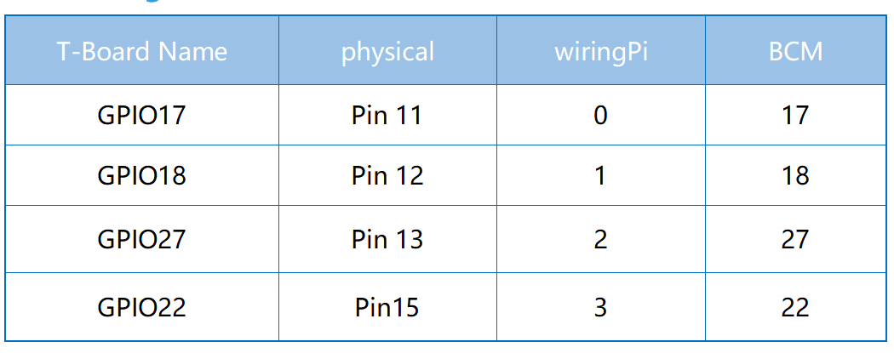

.. note::

    ¡Hola! Bienvenido a la comunidad de entusiastas de SunFounder Raspberry Pi, Arduino y ESP32 en Facebook. Profundiza en Raspberry Pi, Arduino y ESP32 junto a otros entusiastas.

    **¿Por qué unirte?**

    - **Soporte experto**: Resuelve problemas post-venta y desafíos técnicos con la ayuda de nuestra comunidad y equipo.
    - **Aprender y compartir**: Intercambia consejos y tutoriales para mejorar tus habilidades.
    - **Avances exclusivos**: Accede anticipadamente a anuncios de nuevos productos y vistas previas.
    - **Descuentos especiales**: Disfruta de descuentos exclusivos en nuestros productos más recientes.
    - **Promociones festivas y sorteos**: Participa en sorteos y promociones navideñas.

    👉 ¿Listo para explorar y crear con nosotros? Haz clic en [|link_sf_facebook|] y únete hoy.

2.1.4 Potenciómetro
======================

Introducción
----------------

La función ADC se puede utilizar para convertir señales analógicas en 
señales digitales, y en este experimento, se utiliza el ADC0834 para 
obtener la función que involucra ADC. Aquí, implementamos este proceso 
utilizando un potenciómetro. El potenciómetro cambia la magnitud física 
— voltaje, que es convertido por la función ADC.

Componentes
----------------

.. image:: img/list_2.1.4_potentiometer.png

Principio
------------

**ADC0834**

El ADC0834 es un convertidor analógico a digital de 8 bits de `successive
approximation <https://cn.bing.com/dict/search?q=successive approximations&FORM=BDVSP6&mkt=zh-cn>`__ 
que está equipado con un multiplexor multicanal configurable en entrada y con entrada/salida en serie. 
La entrada/salida en serie está configurada para conectarse con registros de desplazamiento estándar o microprocesadores.

.. image:: img/image309.png

**Secuencia de Operación**

La conversión se inicia configurando CS en bajo, lo que activa todos 
los circuitos lógicos. CS debe mantenerse en bajo durante todo el proceso 
de conversión. Luego, se recibe una entrada de reloj del procesador. 
En cada transición de bajo a alto del reloj, los datos en DI se cargan 
en el registro de desplazamiento de la dirección del multiplexor. 
El primer nivel alto en la entrada es el bit de inicio. A continuación, 
se envía una palabra de asignación de 3 a 4 bits después del bit de inicio. 
En cada transición sucesiva de bajo a alto del reloj, el bit de inicio y la 
palabra de asignación se desplazan a través del registro de desplazamiento. 
Cuando el bit de inicio se desplaza a la ubicación de inicio del registro 
del multiplexor, se selecciona el canal de entrada y comienza la conversión. 
La salida del estado del SAR (SARS) se eleva para indicar que una conversión 
está en curso, y DI al registro de desplazamiento del multiplexor se desactiva 
durante la duración de la conversión.

Se inserta automáticamente un intervalo de un período de reloj para permitir 
que el canal multiplexado seleccionado se estabilice. La salida de datos DO 
sale del estado de alta impedancia y proporciona un nivel bajo durante este 
período de tiempo de estabilización del multiplexor. El comparador SAR compara 
las salidas sucesivas de la escalera resistiva con la señal analógica entrante. 
La salida del comparador indica si la entrada analógica es mayor o menor que la 
salida de la escalera resistiva. A medida que avanza la conversión, los datos de 
conversión se envían simultáneamente desde el pin de salida DO, siendo el bit más 
significativo (MSB) el primero.

Después de ocho períodos de reloj, la conversión está completa y la salida SARS 
baja. Finalmente, se envían primero los datos del bit menos significativo tras 
la transmisión de datos del bit más significativo.

.. image:: img/image175.png
    :width: 800
    :align: center

**TABLA DE LÓGICA DE CONTROL DE DIRECCIÓN MUX DEL ADC0834**

.. image:: img/image176.png
    :width: 800
    :align: center

**Potenciómetro**

El potenciómetro es también un componente resistivo con 3 terminales y su valor 
de resistencia puede ajustarse según alguna variación regular. El potenciómetro 
generalmente consiste en un resistor y un cepillo móvil. Cuando el cepillo se 
desplaza a lo largo del resistor, hay una cierta resistencia o voltaje de salida 
dependiendo del desplazamiento.

.. image:: img/image310.png
    :width: 300
    :align: center

Las funciones del potenciómetro en el circuito son las siguientes:

1. Servir como divisor de voltaje

El potenciómetro es un resistor ajustable de forma continua. Cuando ajustas 
el eje o el mango deslizante del potenciómetro, el contacto móvil se desliza 
sobre el resistor. En este punto, se puede obtener un voltaje dependiendo del 
voltaje aplicado al potenciómetro y del ángulo que ha rotado el brazo móvil o 
la distancia que ha recorrido.

Diagrama Esquemático
------------------------

.. image:: img/image312.png

Procedimientos Experimentales
------------------------------------

**Paso 1:** Construir el circuito.

.. image:: img/image180.png
    :width: 800

.. note::
    Por favor, coloca el chip en la posición correspondiente indicada en 
    la imagen. Ten en cuenta que las ranuras en el chip deben estar a la 
    izquierda cuando se coloque.

**Paso 2:** Abre el archivo de código.

.. raw:: html

   <run></run>

.. code-block::

    cd ~/davinci-kit-for-raspberry-pi/c/2.1.4/

**Paso 3:** Compila el código.

.. raw:: html

   <run></run>

.. code-block::

    gcc 2.1.4_Potentiometer.c -lwiringPi

**Paso 4:** Ejecuta.

.. raw:: html

   <run></run>

.. code-block::

    sudo ./a.out

Después de que el código se ejecute, gira el knob en el potenciómetro, la 
intensidad del LED cambiará en consecuencia.

.. note::

    Si no funciona después de ejecutarlo, o si aparece un mensaje de error: \"wiringPi.h: No such file or directory", consulta :ref:`C code is not working?`.
**Código**

.. code-block:: c

    #include <wiringPi.h>
    #include <stdio.h>
    #include <softPwm.h>

    typedef unsigned char uchar;
    typedef unsigned int uint;

    #define     ADC_CS    0
    #define     ADC_CLK   1
    #define     ADC_DIO   2
    #define     LedPin    3

    uchar get_ADC_Result(uint channel)
    {
        uchar i;
        uchar dat1=0, dat2=0;
        int sel = channel > 1 & 1;
        int odd = channel & 1;

        digitalWrite(ADC_CLK, 1);
        delayMicroseconds(2);
        digitalWrite(ADC_CLK, 0);
        delayMicroseconds(2);

        pinMode(ADC_DIO, OUTPUT);
        digitalWrite(ADC_CS, 0);
        // Bit de inicio
        digitalWrite(ADC_CLK,0);
        digitalWrite(ADC_DIO,1);    delayMicroseconds(2);
        digitalWrite(ADC_CLK,1);    delayMicroseconds(2);
        // Modo de extremo único
        digitalWrite(ADC_CLK,0);
        digitalWrite(ADC_DIO,1);    delayMicroseconds(2);
        digitalWrite(ADC_CLK,1);    delayMicroseconds(2);
        // IMPAR
        digitalWrite(ADC_CLK,0);
        digitalWrite(ADC_DIO,odd);  delayMicroseconds(2);
        digitalWrite(ADC_CLK,1);    delayMicroseconds(2);
        // Selección
        digitalWrite(ADC_CLK,0);
        digitalWrite(ADC_DIO,sel);    delayMicroseconds(2);
        digitalWrite(ADC_CLK,1);

        digitalWrite(ADC_DIO,1);    delayMicroseconds(2);
        digitalWrite(ADC_CLK,0);
        digitalWrite(ADC_DIO,1);    delayMicroseconds(2);

        for(i=0;i<8;i++)
        {
            digitalWrite(ADC_CLK,1);    delayMicroseconds(2);
            digitalWrite(ADC_CLK,0);    delayMicroseconds(2);

            pinMode(ADC_DIO, INPUT);
            dat1=dat1<<1 | digitalRead(ADC_DIO);
        }

        for(i=0;i<8;i++)
        {
            dat2 = dat2 | ((uchar)(digitalRead(ADC_DIO))<<i);
            digitalWrite(ADC_CLK,1);    delayMicroseconds(2);
            digitalWrite(ADC_CLK,0);    delayMicroseconds(2);
        }

        digitalWrite(ADC_CS,1);
        pinMode(ADC_DIO, OUTPUT);
        return(dat1==dat2) ? dat1 : 0;
    }

    int main(void)
    {
        uchar analogVal;
        if(wiringPiSetup() == -1){ // si la inicialización de wiring falla, imprime un mensaje en pantalla
            printf("setup wiringPi failed !");
            return 1;
        }
        softPwmCreate(LedPin,  0, 100);
        pinMode(ADC_CS,  OUTPUT);
        pinMode(ADC_CLK, OUTPUT);

        while(1){
            analogVal = get_ADC_Result(0);
            printf("Current analogVal : %d\n", analogVal);
            delay(100);
            softPwmWrite(LedPin, analogVal);
            delay(100);
        }
        return 0;
    }

**Explicación del código**

.. code-block:: c

    #define     ADC_CS    0
    #define     ADC_CLK   1
    #define     ADC_DIO   2
    #define     LedPin    3

Define CS, CLK y DIO del ADC0834, y conéctalos a GPIO0, GPIO1 y GPIO2 
respectivamente. Luego conecta el LED a GPIO3.

.. code-block:: c

    uchar get_ADC_Result(uint channel)
    {
        uchar i;
        uchar dat1=0, dat2=0;
        int sel = channel > 1 & 1;
        int odd = channel & 1;

        digitalWrite(ADC_CLK, 1);
        delayMicroseconds(2);
        digitalWrite(ADC_CLK, 0);
        delayMicroseconds(2);

        pinMode(ADC_DIO, OUTPUT);
        digitalWrite(ADC_CS, 0);
        // Bit de inicio
        digitalWrite(ADC_CLK,0);
        digitalWrite(ADC_DIO,1);    delayMicroseconds(2);
        digitalWrite(ADC_CLK,1);    delayMicroseconds(2);
        // Modo de extremo único
        digitalWrite(ADC_CLK,0);
        digitalWrite(ADC_DIO,1);    delayMicroseconds(2);
        digitalWrite(ADC_CLK,1);    delayMicroseconds(2);
        // IMPAR
        digitalWrite(ADC_CLK,0);
        digitalWrite(ADC_DIO,odd);  delayMicroseconds(2);
        digitalWrite(ADC_CLK,1);    delayMicroseconds(2);
        // Selección
        digitalWrite(ADC_CLK,0);
        digitalWrite(ADC_DIO,sel);    delayMicroseconds(2);
        digitalWrite(ADC_CLK,1);

        digitalWrite(ADC_DIO,1);    delayMicroseconds(2);
        digitalWrite(ADC_CLK,0);
        digitalWrite(ADC_DIO,1);    delayMicroseconds(2);
        for(i=0;i<8;i++)
        {
            digitalWrite(ADC_CLK,1);    delayMicroseconds(2);
            digitalWrite(ADC_CLK,0);    delayMicroseconds(2);

            pinMode(ADC_DIO, INPUT);
            dat1=dat1<<1 | digitalRead(ADC_DIO);
        }

        for(i=0;i<8;i++)
        {
            dat2 = dat2 | ((uchar)(digitalRead(ADC_DIO))<<i);
            digitalWrite(ADC_CLK,1);    delayMicroseconds(2);
            digitalWrite(ADC_CLK,0);    delayMicroseconds(2);
        }

        digitalWrite(ADC_CS,1);
        pinMode(ADC_DIO, OUTPUT);
        return(dat1==dat2) ? dat1 : 0;
    }

Hay una función de ADC0834 para realizar la conversión de analógico a digital. 
El flujo de trabajo específico es el siguiente:

.. code-block:: c

    digitalWrite(ADC_CS, 0);

Establece CS en nivel bajo y comienza a habilitar la conversión AD.

.. code-block:: c

    // Bit de inicio
    digitalWrite(ADC_CLK,0);
    digitalWrite(ADC_DIO,1);    delayMicroseconds(2);
    digitalWrite(ADC_CLK,1);    delayMicroseconds(2);
Cuando ocurre la transición de bajo a alto del reloj por primera vez, se 
establece DIO en 1 como bit de inicio. En los siguientes tres pasos, hay 
3 palabras de asignación.

.. code-block:: c

    // Modo de extremo único
    digitalWrite(ADC_CLK,0);
    digitalWrite(ADC_DIO,1);    delayMicroseconds(2);
    digitalWrite(ADC_CLK,1);    delayMicroseconds(2);

Tan pronto como la transición de bajo a alto del reloj ocurre por segunda vez, 
se establece DIO en 1 y se elige el modo SGL.

.. code-block:: c

    // IMPAR
    digitalWrite(ADC_CLK,0);
    digitalWrite(ADC_DIO,odd);  delayMicroseconds(2);
    digitalWrite(ADC_CLK,1);    delayMicroseconds(2);

Cuando ocurre por tercera vez, el valor de DIO es controlado por la variable **odd**.

.. code-block:: c

    // Selección
    digitalWrite(ADC_CLK,0);
    digitalWrite(ADC_DIO,sel);    delayMicroseconds(2);
    digitalWrite(ADC_CLK,1);

La pulso de CLK convertida de bajo a alto por cuarta vez, el valor de DIO 
es controlado por la variable **sel**.

Bajo la condición de que channel=0, sel=0, odd=0, las fórmulas operativas 
relativas a **sel** y **odd** son las siguientes:

.. code-block:: c

    int sel = channel > 1 & 1;
    int odd = channel & 1;

Cuando se cumple la condición de que channel=1, sel=0, odd=1, consulta la 
siguiente tabla de lógica de control de dirección. Aquí se elige CH1, y el 
bit de inicio se desplaza a la ubicación de inicio del registro del multiplexor 
y comienza la conversión.

.. image:: img/image313.png

.. code-block:: c

    digitalWrite(ADC_DIO,1);    delayMicroseconds(2);
    digitalWrite(ADC_CLK,0);
    digitalWrite(ADC_DIO,1);    delayMicroseconds(2);

Aquí, se establece DIO en 1 dos veces, por favor ignóralo.

.. code-block:: c

    for(i=0;i<8;i++)
        {
            digitalWrite(ADC_CLK,1);    delayMicroseconds(2);
            digitalWrite(ADC_CLK,0);    delayMicroseconds(2);

            pinMode(ADC_DIO, INPUT);
            dat1=dat1<<1 | digitalRead(ADC_DIO);
        }

En la primera declaración for(), tan pronto como el quinto pulso de CLK 
se convierte de alto a bajo, se establece DIO en modo de entrada. Luego, 
comienza la conversión y el valor convertido se almacena en la variable dat1. 
Después de ocho períodos de reloj, la conversión está completa.

.. code-block:: c

    for(i=0;i<8;i++)
        {
            dat2 = dat2 | ((uchar)(digitalRead(ADC_DIO))<<i);
            digitalWrite(ADC_CLK,1);    delayMicroseconds(2);
            digitalWrite(ADC_CLK,0);    delayMicroseconds(2);
        }

En la segunda declaración for(), se envían los valores convertidos a través 
de DO después de otros ocho períodos de reloj y se almacenan en la variable dat2.

.. code-block:: c

    digitalWrite(ADC_CS,1);
    pinMode(ADC_DIO, OUTPUT);
    return(dat1==dat2) ? dat1 : 0;

return(dat1==dat2) ? dat1 : 0 se utiliza para comparar el valor obtenido 
durante la conversión y el valor de salida. Si son iguales, se devuelve el 
valor convertido dat1; de lo contrario, se devuelve 0. Aquí, el flujo de 
trabajo del ADC0834 se completa.

.. code-block:: c

    softPwmCreate(LedPin,  0, 100);

La función es utilizar software para crear un pin PWM, LedPin, luego se 
establece el ancho de pulso inicial en 0 y el período de PWM en 100 x 100us.

.. code-block:: c

    while(1){
            analogVal = get_ADC_Result(0);
            printf("Current analogVal : %d\n", analogVal);
            softPwmWrite(LedPin, analogVal);
            delay(100);
        }

En el programa principal, se lee el valor del canal 0 que ha sido conectado 
a un potenciómetro. Y se almacena el valor en la variable analogVal y luego 
se escribe en LedPin. Ahora puedes ver cómo cambia el brillo del LED con el 
valor del potenciómetro.
