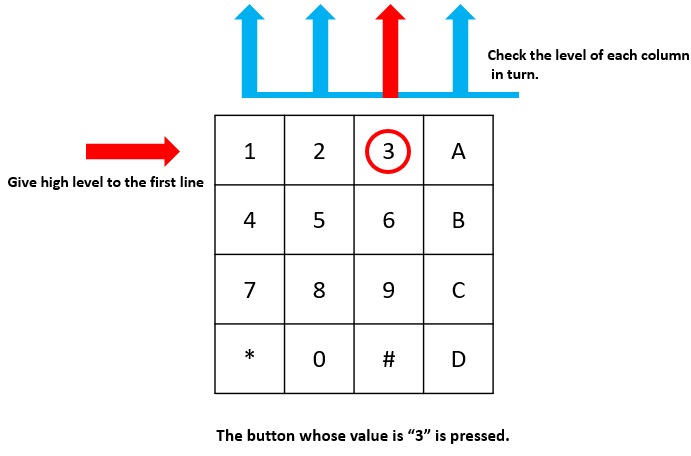

.. note::

    Bonjour, bienvenue dans la communauté Facebook des passionnés de SunFounder Raspberry Pi & Arduino & ESP32 ! Plongez plus profondément dans l'univers du Raspberry Pi, de l'Arduino et de l'ESP32 avec d'autres passionnés.

    **Pourquoi nous rejoindre ?**

    - **Support d'experts** : Résolvez les problèmes après-vente et les défis techniques grâce à l'aide de notre communauté et de notre équipe.
    - **Apprenez & Partagez** : Échangez des astuces et des tutoriels pour perfectionner vos compétences.
    - **Aperçus exclusifs** : Accédez en avant-première aux annonces de nouveaux produits et aux aperçus.
    - **Réductions spéciales** : Profitez de réductions exclusives sur nos derniers produits.
    - **Promotions festives et tirages au sort** : Participez à des tirages au sort et bénéficiez de promotions spéciales lors des fêtes.

    👉 Prêt à explorer et à créer avec nous ? Cliquez sur [|link_sf_facebook|] et rejoignez-nous dès aujourd'hui !

2.1.5 Clavier
================

Introduction
---------------

Un clavier est un tableau rectangulaire de boutons. Dans ce projet, nous allons 
l'utiliser pour saisir des caractères.

Composants
-----------

.. image:: img/list_2.1.5_keypad.png

Principe
------------

**Clavier**

Un clavier est un tableau rectangulaire de 12 ou 16 boutons de type OFF-(ON). 
Leurs contacts sont accessibles via un connecteur adapté pour une connexion 
par câble plat ou pour être inséré dans une carte de circuit imprimé. Dans 
certains claviers, chaque bouton est connecté à un contact distinct dans le 
connecteur, tandis que tous les boutons partagent une masse commune.

.. image:: img/image314.png

Le plus souvent, les boutons sont codés en matrice, ce qui signifie que chacun 
d'eux connecte une paire unique de conducteurs dans une matrice. Cette configuration 
est adaptée à un microcontrôleur, qui peut être programmé pour envoyer une impulsion 
de sortie sur chacun des quatre fils horizontaux à tour de rôle. Pendant chaque impulsion, 
il vérifie les quatre fils verticaux restants en séquence, afin de déterminer lequel, 
le cas échéant, transporte un signal. Des résistances pullup ou pulldown doivent être 
ajoutées aux fils d'entrée pour éviter que les entrées du microcontrôleur ne se 
comportent de manière imprévisible en l'absence de signal.

Schéma de câblage
---------------------

.. image:: img/image315.png

.. image:: img/image316.png

Procédure expérimentale
----------------------------

**Étape 1** : Construisez le circuit.

.. image:: img/image186.png
    :width: 800

**Étape 2** : Ouvrez le fichier de code.

.. raw:: html

   <run></run>

.. code-block::

    cd ~/davinci-kit-for-raspberry-pi/c/2.1.5/

**Étape 3** : Compilez le code.

.. raw:: html

   <run></run>

.. code-block::

    gcc 2.1.5_Keypad.cpp -lwiringPi

**Étape 4** : Exécutez le programme.

.. raw:: html

   <run></run>

.. code-block::

    sudo ./a.out

Après l'exécution du code, les valeurs des boutons pressés sur le clavier 
(valeur du bouton) seront affichées à l'écran.

.. note::

    Si le programme ne fonctionne pas après exécution, ou si un message d'erreur 
    s'affiche : \"wiringPi.h: No such file or directory\", veuillez vous référer à 
    :ref:`C code is not working?`.
**Code**

.. code-block:: c

    #include <wiringPi.h>
    #include <stdio.h>

    #define ROWS  4 
    #define COLS  4
    #define BUTTON_NUM (ROWS * COLS)

    unsigned char KEYS[BUTTON_NUM] {  
    '1','2','3','A',
    '4','5','6','B',
    '7','8','9','C',
    '*','0','#','D'};

    unsigned char rowPins[ROWS] = {1, 4, 5, 6}; 
    unsigned char colPins[COLS] = {12, 3, 2, 0};

    void keyRead(unsigned char* result);
    bool keyCompare(unsigned char* a, unsigned char* b);
    void keyCopy(unsigned char* a, unsigned char* b);
    void keyPrint(unsigned char* a);
    void keyClear(unsigned char* a);
    int keyIndexOf(const char value);

    void init(void) {
        for(int i=0 ; i<4 ; i++) {
            pinMode(rowPins[i], OUTPUT);
            pinMode(colPins[i], INPUT);
        }
    }

    int main(void){
        unsigned char pressed_keys[BUTTON_NUM];
        unsigned char last_key_pressed[BUTTON_NUM];

        if(wiringPiSetup() == -1){ //when initialize wiring failed,print message to screen
            printf("setup wiringPi failed !");
            return 1; 
        }
        init();
        while(1){
            keyRead(pressed_keys);
            bool comp = keyCompare(pressed_keys, last_key_pressed);
            if (!comp){
                keyPrint(pressed_keys);
                keyCopy(last_key_pressed, pressed_keys);
            }
            delay(100);
        }
        return 0;  
    }

    void keyRead(unsigned char* result){
        int index;
        int count = 0;
        keyClear(result);
        for(int i=0 ; i<ROWS ; i++ ){
            digitalWrite(rowPins[i], HIGH);
            for(int j =0 ; j < COLS ; j++){
                index = i * ROWS + j;
                if(digitalRead(colPins[j]) == 1){
                    result[count]=KEYS[index];
                    count += 1;
                }
            }
            delay(1);
            digitalWrite(rowPins[i], LOW);
        }
    }

    bool keyCompare(unsigned char* a, unsigned char* b){
        for (int i=0; i<BUTTON_NUM; i++){
            if (a[i] != b[i]){
                return false;
            }
        }
        return true;
    }

    void keyCopy(unsigned char* a, unsigned char* b){
        for (int i=0; i<BUTTON_NUM; i++){
            a[i] = b[i];
        }
    }

    void keyPrint(unsigned char* a){
        if (a[0] != 0){
            printf("%c",a[0]);
        }
        for (int i=1; i<BUTTON_NUM; i++){
            if (a[i] != 0){
                printf(", %c",a[i]);
            }
        }
        printf("\n");
    }

    void keyClear(unsigned char* a){
        for (int i=0; i<BUTTON_NUM; i++){
            a[i] = 0;
        }
    }

    int keyIndexOf(const char value){
        for (int i=0; i<BUTTON_NUM; i++){
            if ((const char)KEYS[i] == value){
                return i;
            }
        }
        return -1;
    }

**Explication du Code**

.. code-block:: c

    unsigned char KEYS[BUTTON_NUM] {  
    '1','2','3','A',
    '4','5','6','B',
    '7','8','9','C',
    '*','0','#','D'};

    unsigned char rowPins[ROWS] = {1, 4, 5, 6}; 
    unsigned char colPins[COLS] = {12, 3, 2, 0};

Déclarez chaque touche du clavier matriciel dans le tableau `KEYS[]` et définissez les broches correspondant à chaque ligne et colonne.

.. code-block:: c

    while(1){
            keyRead(pressed_keys);
            bool comp = keyCompare(pressed_keys, last_key_pressed);
            if (!comp){
                keyPrint(pressed_keys);
                keyCopy(last_key_pressed, pressed_keys);
            }
            delay(100);
        }

Cette partie de la fonction principale lit et affiche la valeur de la touche pressée.

La fonction `keyRead()` lit l'état de chaque touche.

`keyCompare()` et `keyCopy()` sont utilisées pour vérifier si l'état de la touche a changé (c'est-à-dire, si une touche a été pressée ou relâchée).

`keyPrint()` affiche la valeur de la touche dont le niveau actuel est un niveau haut (la touche est pressée).

.. code-block:: c

    void keyRead(unsigned char* result){
        int index;
        int count = 0;
        keyClear(result);
        for(int i=0 ; i<ROWS ; i++ ){
            digitalWrite(rowPins[i], HIGH);
            for(int j =0 ; j < COLS ; j++){
                index = i * ROWS + j;
                if(digitalRead(colPins[j]) == 1){
                    result[count]=KEYS[index];
                    count += 1;
                }
            }
            delay(1);
            digitalWrite(rowPins[i], LOW);
        }
    }

Cette fonction assigne successivement un niveau haut à chaque ligne. Lorsque 
la touche correspondante dans la colonne est pressée, la colonne concernée 
reçoit un niveau haut. Après la boucle à deux niveaux, l'état des touches est 
compilé pour générer un tableau `result[]`.

Lorsque le bouton 3 est pressé :

RowPin [0] writes in the high level, and colPin[2] gets the high level.
ColPin [0], colPin[1], colPin[3] get the low level.

This gives us 0,0,1,0. When rowPin[1], rowPin[2] and rowPin[3] are
written in high level, colPin[0]~colPin[4] will get low level.

Après la boucle de vérification, un tableau est généré :

.. code-block:: c

    result[BUTTON_NUM] {  
    0, 0, 1, 0,
    0, 0, 0, 0,
    0, 0, 0, 0,
    0, 0, 0, 0};

.. code-block:: c

    bool keyCompare(unsigned char* a, unsigned char* b){
        for (int i=0; i<BUTTON_NUM; i++){
            if (a[i] != b[i]){
                return false;
            }
        }
        return true;
    }

    void keyCopy(unsigned char* a, unsigned char* b){
        for (int i=0; i<BUTTON_NUM; i++){
            a[i] = b[i];
        }
    }

Ces deux fonctions sont utilisées pour vérifier si l'état d'une touche a changé, 
par exemple si vous relâchez le bouton "3" ou si vous appuyez sur "2", `keyCompare()` 
renvoie `false`.

`keyCopy()` est utilisée pour réécrire la valeur actuelle du bouton dans le 
tableau `a` (`last_key_pressed[BUTTON_NUM]`) après chaque comparaison. Cela permet 
de les comparer à nouveau lors de la prochaine boucle.

.. code-block:: c

    void keyPrint(unsigned char* a){
    //printf("{");
        if (a[0] != 0){
            printf("%c",a[0]);
        }
        for (int i=1; i<BUTTON_NUM; i++){
            if (a[i] != 0){
                printf(", %c",a[i]);
            }
        }
        printf("\n");
    }

Cette fonction est utilisée pour afficher la valeur de la touche actuellement pressée. 
Si la touche '1' est pressée, '1' sera affiché. Si la touche '1' et ensuite la touche '3' 
sont pressées, alors '1, 3' sera affiché.

