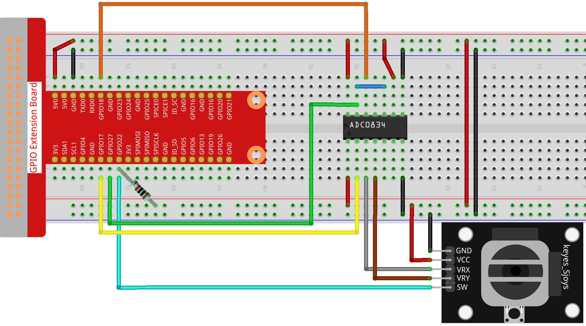

.. note::

    Ciao, benvenuto nella Community su Facebook di appassionati di SunFounder Raspberry Pi, Arduino & ESP32! Esplora più a fondo il mondo di Raspberry Pi, Arduino ed ESP32 insieme a altri appassionati.

    **Perché unirti a noi?**

    - **Supporto Esperto**: Risolvi i problemi post-vendita e le sfide tecniche con l'aiuto della nostra community e del nostro team.
    - **Impara e Condividi**: Scambia suggerimenti e tutorial per migliorare le tue competenze.
    - **Anteprime Esclusive**: Ottieni un accesso anticipato ai nuovi annunci di prodotti e alle anteprime.
    - **Sconti Speciali**: Goditi sconti esclusivi sui nostri prodotti più recenti.
    - **Promozioni Festive e Giveaway**: Partecipa a giveaway e promozioni festive.

    👉 Sei pronto per esplorare e creare insieme a noi? Clicca [|link_sf_facebook|] e unisciti oggi stesso!

2.1.6 Joystick
================

Introduzione
--------------

In questo progetto, impareremo il funzionamento del joystick. Manipoleremo 
il joystick e mostreremo i risultati sullo schermo.

Componenti
-----------

.. image:: img/image317.png

Principio di Funzionamento
----------------------------

**Joystick**

Il principio di base di un joystick è tradurre il movimento della leva in 
informazioni elettroniche che un computer può elaborare.

Per comunicare un’intera gamma di movimenti al computer, il joystick deve 
misurare la posizione della leva su due assi — l’asse X (sinistra-destra) 
e l’asse Y (alto-basso). Come in geometria, le coordinate X-Y individuano 
esattamente la posizione della leva.

Per determinare la posizione della leva, il sistema di controllo del joystick 
monitora semplicemente la posizione di ciascun asse. Il design convenzionale 
del joystick analogico lo fa con due potenziometri, o resistori variabili.

Il joystick dispone anche di un input digitale attivato quando il joystick 
viene premuto verso il basso.

.. image:: img/image318.png

Schema Elettrico
---------------------

Quando si legge il dato del joystick, ci sono delle differenze tra gli assi: 
i dati degli assi X e Y sono analogici e necessitano dell'ADC0834 per convertire 
il valore analogico in digitale. Il dato dell'asse Z è digitale, quindi è 
possibile utilizzare direttamente il GPIO per leggerlo, oppure si può usare l'ADC.

.. image:: img/image319.png

.. image:: img/image320.png

Procedure Sperimentali
--------------------------

**Passo 1:** Costruisci il circuito.

**Passo 2:** Accedi alla cartella del codice.

.. raw:: html

   <run></run>

.. code-block::

    cd ~/davinci-kit-for-raspberry-pi/c/2.1.6/

**Passo 3:** Compila il codice.

.. raw:: html

   <run></run>

.. code-block::

    gcc 2.1.6_Joystick.c -lwiringPi

**Passo 4:** Esegui il file eseguibile.

.. raw:: html

   <run></run>

.. code-block::

    sudo ./a.out

Dopo l'esecuzione del codice, muovi il joystick: i valori corrispondenti 
di x, y e Btn saranno visualizzati sullo schermo.

.. note::

    Se non funziona dopo l'esecuzione, o compare un messaggio di errore: \"wiringPi.h: No such file or directory\", fai riferimento a :ref:`Il codice C non funziona?`.
    
**Spiegazione del Codice**

.. code-block:: c

    #include <wiringPi.h>
    #include <stdio.h>
    #include <softPwm.h>

    typedef unsigned char uchar;
    typedef unsigned int uint;

    #define     ADC_CS    0
    #define     ADC_CLK   1
    #define     ADC_DIO   2
    #define     BtnPin    3

    uchar get_ADC_Result(uint channel)
    {
        uchar i;
        uchar dat1=0, dat2=0;
        int sel = channel > 1 & 1;
        int odd = channel & 1;

        digitalWrite(ADC_CLK, 1);
        delayMicroseconds(2);
        digitalWrite(ADC_CLK, 0);
        delayMicroseconds(2);

        pinMode(ADC_DIO, OUTPUT);
        digitalWrite(ADC_CS, 0);
        // Bit di avvio
        digitalWrite(ADC_CLK,0);
        digitalWrite(ADC_DIO,1);    delayMicroseconds(2);
        digitalWrite(ADC_CLK,1);    delayMicroseconds(2);
        // Modalità single-end
        digitalWrite(ADC_CLK,0);
        digitalWrite(ADC_DIO,1);    delayMicroseconds(2);
        digitalWrite(ADC_CLK,1);    delayMicroseconds(2);
        // Valore ODD
        digitalWrite(ADC_CLK,0);
        digitalWrite(ADC_DIO,odd);  delayMicroseconds(2);
        digitalWrite(ADC_CLK,1);    delayMicroseconds(2);
        // Selezione
        digitalWrite(ADC_CLK,0);
        digitalWrite(ADC_DIO,sel);    delayMicroseconds(2);
        digitalWrite(ADC_CLK,1);

        digitalWrite(ADC_DIO,1);    delayMicroseconds(2);
        digitalWrite(ADC_CLK,0);
        digitalWrite(ADC_DIO,1);    delayMicroseconds(2);

        for(i=0;i<8;i++)
        {
            digitalWrite(ADC_CLK,1);    delayMicroseconds(2);
            digitalWrite(ADC_CLK,0);    delayMicroseconds(2);
            pinMode(ADC_DIO, INPUT);
            dat1=dat1<<1 | digitalRead(ADC_DIO);
        }
        for(i=0;i<8;i++)
        {
            dat2 = dat2 | ((uchar)(digitalRead(ADC_DIO))<<i);
            digitalWrite(ADC_CLK,1);    delayMicroseconds(2);
            digitalWrite(ADC_CLK,0);    delayMicroseconds(2);
        }
        digitalWrite(ADC_CS,1);
        pinMode(ADC_DIO, OUTPUT);
        return(dat1==dat2) ? dat1 : 0;
    }

    int main(void)
    {
        uchar x_val;
        uchar y_val;
        uchar btn_val;
        if(wiringPiSetup() == -1){ //in caso di errore di inizializzazione, stampa un messaggio a schermo
            printf("setup wiringPi failed !");
            return 1;
        }
        pinMode(BtnPin,  INPUT);
        pullUpDnControl(BtnPin, PUD_UP);
        pinMode(ADC_CS,  OUTPUT);
        pinMode(ADC_CLK, OUTPUT);

        while(1){
            x_val = get_ADC_Result(0);
            y_val = get_ADC_Result(1);
            btn_val = digitalRead(BtnPin);
            printf("x = %d, y = %d, btn = %d\n", x_val, y_val, btn_val);
            delay(100);
        }
        return 0;
    }

**Spiegazione del Codice**

.. code-block:: c

    uchar get_ADC_Result(uint channel)
    {
        uchar i;
        uchar dat1=0, dat2=0;
        int sel = channel > 1 & 1;
        int odd = channel & 1;

        digitalWrite(ADC_CLK, 1);
        delayMicroseconds(2);
        digitalWrite(ADC_CLK, 0);
        delayMicroseconds(2);

        pinMode(ADC_DIO, OUTPUT);
        digitalWrite(ADC_CS, 0);
        // Bit di avvio
        digitalWrite(ADC_CLK,0);
        digitalWrite(ADC_DIO,1);    delayMicroseconds(2);
        digitalWrite(ADC_CLK,1);    delayMicroseconds(2);
        // Modalità single-end
        digitalWrite(ADC_CLK,0);
        digitalWrite(ADC_DIO,1);    delayMicroseconds(2);
        digitalWrite(ADC_CLK,1);    delayMicroseconds(2);
        ......

Il processo di funzionamento della funzione è descritto in dettaglio nella sezione 2.1.4 Potenziometro.

.. code-block:: c

    while(1){
            x_val = get_ADC_Result(0);
            y_val = get_ADC_Result(1);
            btn_val = digitalRead(BtnPin);
            printf("x = %d, y = %d, btn = %d\n", x_val, y_val, btn_val);
            delay(100);
        }

VRX e VRY del Joystick sono collegati rispettivamente a CH0 e CH1 dell'ADC0834. 
La funzione getResult() viene chiamata per leggere i valori di CH0 e CH1, che 
vengono memorizzati nelle variabili x_val e y_val. Inoltre, il valore di SW del 
joystick viene letto e salvato nella variabile Btn_val. Infine, i valori di x_val, 
y_val e Btn_val vengono visualizzati con la funzione print().
