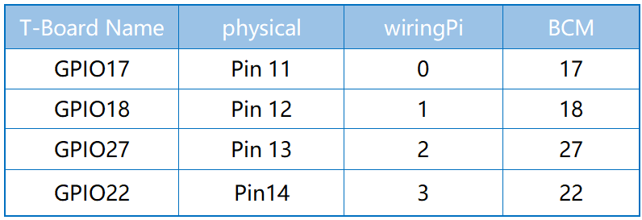
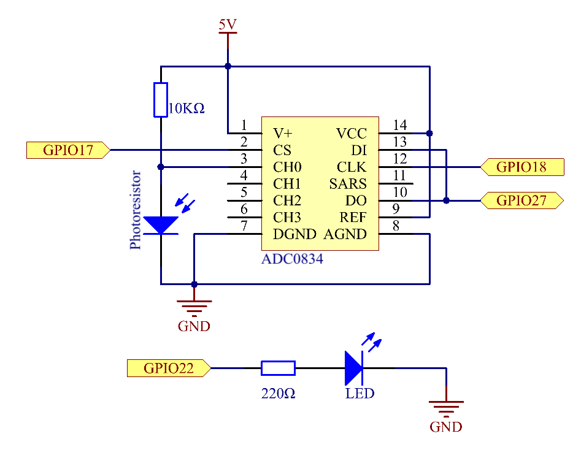

.. note::

    Ciao, benvenuto nella community SunFounder per appassionati di Raspberry Pi, Arduino e ESP32 su Facebook! Approfondisci la tua conoscenza di Raspberry Pi, Arduino ed ESP32 insieme ad altri appassionati.

    **Perché unirti a noi?**

    - **Supporto esperto**: Risolvi problemi post-vendita e sfide tecniche con l'aiuto della nostra community e del nostro team.
    - **Impara e condividi**: Scambia consigli e tutorial per migliorare le tue competenze.
    - **Anteprime esclusive**: Ottieni accesso anticipato agli annunci di nuovi prodotti e alle anteprime.
    - **Sconti speciali**: Approfitta di sconti esclusivi sui nostri nuovi prodotti.
    - **Promozioni e omaggi**: Partecipa a promozioni speciali e omaggi durante le festività.

    👉 Pronto a esplorare e creare con noi? Clicca su [|link_sf_facebook|] e unisciti oggi!

2.2.1 Fotoresistore
======================

Introduzione
----------------

Il fotoresistore è un componente comunemente utilizzato per rilevare 
l'intensità della luce ambientale. Consente al controller di distinguere 
tra giorno e notte e implementare funzioni di controllo della luce, come 
l'accensione delle lampade notturne. Questo progetto è molto simile a quello 
con il potenziometro, con la differenza che qui si misura la variazione di 
tensione in funzione della luce percepita.

Componenti
-------------

.. image:: img/list_2.2.1_photoresistor.png

Principio
------------

Un fotoresistore o fotocellula è una resistenza variabile controllata dalla 
luce. La sua resistenza diminuisce all'aumentare dell'intensità della luce 
incidente; in altre parole, presenta fotoconduttività. Un fotoresistore può 
essere applicato in circuiti per rilevatori sensibili alla luce, così come in 
circuiti di accensione e spegnimento in base alla presenza di luce o oscurità.

.. image:: img/image196.png
    :width: 200
    :align: center

Schema del Circuito
----------------------

Procedura Sperimentale
-------------------------

**Passo 1:** Costruisci il circuito.

.. image:: img/image198.png
    :width: 800

**Passo 2:** Vai alla cartella del codice.

.. raw:: html

   <run></run>

.. code-block::

    cd ~/davinci-kit-for-raspberry-pi/c/2.2.1/

**Passo 3:** Compila il codice.

.. raw:: html

   <run></run>

.. code-block::

    gcc 2.2.1_Photoresistor.c -lwiringPi

**Passo 4:** Esegui il file eseguibile.

.. raw:: html

   <run></run>

.. code-block::

    sudo ./a.out

Quando il codice è in esecuzione, la luminosità del LED varierà in base 
all'intensità della luce rilevata dal fotoresistore.

.. note::

    Se non funziona dopo l'esecuzione o appare un messaggio di errore: \"wiringPi.h: File o directory non esistente\", fai riferimento a :ref:`Il codice C non funziona?`.

**Codice**

.. code-block:: c

    #include <wiringPi.h>
    #include <stdio.h>
    #include <softPwm.h>

    typedef unsigned char uchar;
    typedef unsigned int uint;

    #define     ADC_CS    0
    #define     ADC_CLK   1
    #define     ADC_DIO   2
    #define     LedPin    3

    uchar get_ADC_Result(uint channel)
    {
        uchar i;
        uchar dat1=0, dat2=0;
        int sel = channel > 1 & 1;
        int odd = channel & 1;

        digitalWrite(ADC_CLK, 1);
        delayMicroseconds(2);
        digitalWrite(ADC_CLK, 0);
        delayMicroseconds(2);

        pinMode(ADC_DIO, OUTPUT);
        digitalWrite(ADC_CS, 0);
        // Bit di avvio
        digitalWrite(ADC_CLK,0);
        digitalWrite(ADC_DIO,1);    delayMicroseconds(2);
        digitalWrite(ADC_CLK,1);    delayMicroseconds(2);
        // Modalità single-end
        digitalWrite(ADC_CLK,0);
        digitalWrite(ADC_DIO,1);    delayMicroseconds(2);
        digitalWrite(ADC_CLK,1);    delayMicroseconds(2);
        // ODD
        digitalWrite(ADC_CLK,0);
        digitalWrite(ADC_DIO,odd);  delayMicroseconds(2);
        digitalWrite(ADC_CLK,1);    delayMicroseconds(2);
        // Selezione
        digitalWrite(ADC_CLK,0);
        digitalWrite(ADC_DIO,sel);    delayMicroseconds(2);
        digitalWrite(ADC_CLK,1);

        digitalWrite(ADC_DIO,1);    delayMicroseconds(2);
        digitalWrite(ADC_CLK,0);
        digitalWrite(ADC_DIO,1);    delayMicroseconds(2);

        for(i=0;i<8;i++)
        {
            digitalWrite(ADC_CLK,1);    delayMicroseconds(2);
            digitalWrite(ADC_CLK,0);    delayMicroseconds(2);

            pinMode(ADC_DIO, INPUT);
            dat1=dat1<<1 | digitalRead(ADC_DIO);
        }

        for(i=0;i<8;i++)
        {
            dat2 = dat2 | ((uchar)(digitalRead(ADC_DIO))<<i);
            digitalWrite(ADC_CLK,1);    delayMicroseconds(2);
            digitalWrite(ADC_CLK,0);    delayMicroseconds(2);
        }

        digitalWrite(ADC_CS,1);
        pinMode(ADC_DIO, OUTPUT);
        return(dat1==dat2) ? dat1 : 0;
    }

    int main(void)
    {
        uchar analogVal;
        if(wiringPiSetup() == -1){ //quando l'inizializzazione wiring fallisce, stampa un messaggio a schermo
            printf("setup wiringPi failed !");
            return 1;
        }
        softPwmCreate(LedPin,  0, 100);
        pinMode(ADC_CS,  OUTPUT);
        pinMode(ADC_CLK, OUTPUT);

        while(1){
            analogVal = get_ADC_Result(0);
            printf("Current analogVal : %d\n", analogVal);
            delay(100);
            softPwmWrite(LedPin, analogVal);
            delay(100);
        }
        return 0;
    }

**Spiegazione del Codice**

Il codice qui è lo stesso della sezione 2.1.4 Potenziometro. Se hai 
altre domande, consulta la spiegazione del codice in **2.1.4 Potentiometro.c** 
per i dettagli.

