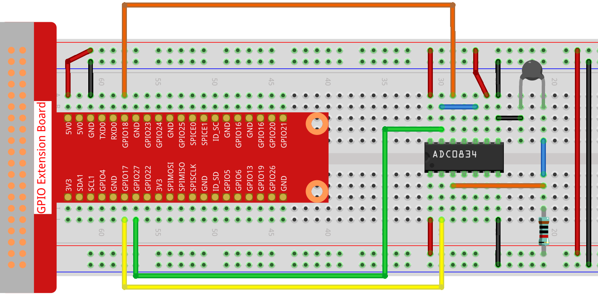

.. note::

    Hello, welcome to the SunFounder Raspberry Pi & Arduino & ESP32 Enthusiasts Community on Facebook! Dive deeper into Raspberry Pi, Arduino, and ESP32 with fellow enthusiasts.

    **Why Join?**

    - **Expert Support**: Solve post-sale issues and technical challenges with help from our community and team.
    - **Learn & Share**: Exchange tips and tutorials to enhance your skills.
    - **Exclusive Previews**: Get early access to new product announcements and sneak peeks.
    - **Special Discounts**: Enjoy exclusive discounts on our newest products.
    - **Festive Promotions and Giveaways**: Take part in giveaways and holiday promotions.

    👉 Ready to explore and create with us? Click [|link_sf_facebook|] and join today!

2.2.2 Thermistor
================

Introduction
------------

Just like photoresistor can sense light, thermistor is a temperature
sensitive electronic device that can be used for realizing functions of
temperature control, such as making a heat alarm.

Components
----------

.. image:: img/list_2.2.2_thermistor.png

Principle
---------

A thermistor is a thermally sensitive resistor that exhibits a precise
and predictable change in resistance proportional to small changes in
temperature. How much its resistance will change is dependent upon its
unique composition. Thermistors are the parts of a larger group of
passive components. And unlike their active component counterparts,
passive devices are incapable of providing power gain, or amplification
to a circuit.

Thermistor is a sensitive element, and it has two types: Negative
Temperature Coefficient (NTC) and Positive Temperature Coefficient
(PTC), also known as NTC and PTC. Its resistance varies significantly
with temperature. The resistance of PTC thermistor increases with
temperature ,while the condition of NTC is opposite to the former In
this experiment we use NTC.

.. image:: img/image325.png

The principle is that the resistance of the NTC thermistor changes with
the temperature of the outer environment. It detects the real-time
temperature of the environment. When the temperature gets higher, the
resistance of the thermistor decreases. Then the voltage data is
converted to digital quantities by the A/D adapter. The temperature in
Celsius or Fahrenheit is output via programming.

In this experiment, a thermistor and a 10k pull-up resistor are used.
Each thermistor has a normal resistance. Here it is 10k ohm, which is
measured under 25 degree Celsius.

Here is the relation between the resistance and temperature:

R\ :sub:`T` =R\ :sub:`N` exp\ :sup:`B(1/TK – 1/TN)`

**R\ T** is the resistance of the NTC thermistor when the temperature is
**T\ K**.

**R\ N** is the resistance of the NTC thermistor under the rated
temperature **T\ N**. Here, the numerical value of **R\ N** is 10k.

**T\ K** is a Kelvin temperature and the unit is K. Here, the numerical
value of **T\ K**\ is 273.15 + degree Celsius.

**T\ N** is a rated Kelvin temperature; the unit is K too. Here, the
numerical value of **T\ N** is 273.15+25.

And **B**\ (beta), the material constant of NTC thermistor, is also
called heat sensitivity index with a numerical value 3950.

**exp** is the abbreviation of exponential, and the base number e is a
natural number and equals 2.7 approximately.

Convert this formula
T\ :sub:`K`\ =1/(ln(R\ :sub:`T`/R\ :sub:`N`)/B+1/T\ :sub:`N`) to get
Kelvin temperature that minus 273.15 equals degree Celsius.

This relation is an empirical formula. It is accurate only when the
temperature and resistance are within the effective range.

Schematic Diagram
-----------------

.. image:: img/image323.png

.. image:: img/image324.png

Experimental Procedures
-----------------------

**Step 1:** Build the circuit.

For C Language Users
^^^^^^^^^^^^^^^^^^^^

**Step 2:** Go to the folder of the code.

.. raw:: html

   <run></run>

.. code-block::

    cd ~/davinci-kit-for-raspberry-pi/c/2.2.2/

**Step 3:** Compile the code.

.. raw:: html

   <run></run>

.. code-block::

    gcc 2.2.2_Thermistor.c -lwiringPi -lm

.. note::
    -lm is to load the library math. Do not omit, or you will make
    an error.

**Step 4:** Run the executable file.

.. raw:: html

   <run></run>

.. code-block::

    sudo ./a.out

With the code run, the thermistor detects ambient temperature which will
be printed on the screen once it finishes the program calculation.

.. note::

    If it does not work after running, or there is an error prompt: \"wiringPi.h: No such file or directory\", please refer to :ref:`C code is not working?`.

**Code**

.. code-block:: c

    #include <wiringPi.h>
    #include <stdio.h>
    #include <math.h>

    typedef unsigned char uchar;
    typedef unsigned int uint;

    #define     ADC_CS    0
    #define     ADC_CLK   1
    #define     ADC_DIO   2

    uchar get_ADC_Result(uint channel)
    {
        uchar i;
        uchar dat1=0, dat2=0;
        int sel = channel > 1 & 1;
        int odd = channel & 1;

        pinMode(ADC_DIO, OUTPUT);
        digitalWrite(ADC_CS, 0);
        // Start bit
        digitalWrite(ADC_CLK,0);
        digitalWrite(ADC_DIO,1);    delayMicroseconds(2);
        digitalWrite(ADC_CLK,1);    delayMicroseconds(2);
        //Single End mode
        digitalWrite(ADC_CLK,0);
        digitalWrite(ADC_DIO,1);    delayMicroseconds(2);
        digitalWrite(ADC_CLK,1);    delayMicroseconds(2);
        // ODD
        digitalWrite(ADC_CLK,0);
        digitalWrite(ADC_DIO,odd);  delayMicroseconds(2);
        digitalWrite(ADC_CLK,1);    delayMicroseconds(2);
        //Select
        digitalWrite(ADC_CLK,0);
        digitalWrite(ADC_DIO,sel);    delayMicroseconds(2);
        digitalWrite(ADC_CLK,1);

        digitalWrite(ADC_DIO,1);    delayMicroseconds(2);
        digitalWrite(ADC_CLK,0);
        digitalWrite(ADC_DIO,1);    delayMicroseconds(2);

        for(i=0;i<8;i++)
        {
            digitalWrite(ADC_CLK,1);    delayMicroseconds(2);
            digitalWrite(ADC_CLK,0);    delayMicroseconds(2);

            pinMode(ADC_DIO, INPUT);
            dat1=dat1<<1 | digitalRead(ADC_DIO);
        }

        for(i=0;i<8;i++)
        {
            dat2 = dat2 | ((uchar)(digitalRead(ADC_DIO))<<i);
            digitalWrite(ADC_CLK,1);    delayMicroseconds(2);
            digitalWrite(ADC_CLK,0);    delayMicroseconds(2);
        }

        digitalWrite(ADC_CS,1);
        pinMode(ADC_DIO, OUTPUT);
        return(dat1==dat2) ? dat1 : 0;
    }

    int main(void)
    {
        unsigned char analogVal;
    double Vr, Rt, temp, cel, Fah;
        if(wiringPiSetup() == -1){ //when initialize wiring failed,print messageto screen
            printf("setup wiringPi failed !");
            return 1;
        }
        pinMode(ADC_CS,  OUTPUT);
        pinMode(ADC_CLK, OUTPUT);

        while(1){
            analogVal = get_ADC_Result(0);
            Vr = 5 * (double)(analogVal) / 255;
            Rt = 10000 * (double)(Vr) / (5 - (double)(Vr));
            temp = 1 / (((log(Rt/10000)) / 3950)+(1 / (273.15 + 25)));
            cel = temp - 273.15;
            Fah = cel * 1.8 +32;
            printf("Celsius: %.2f C  Fahrenheit: %.2f F\n", cel, Fah);
            delay(100);
        }
        return 0;
    }

**Code Explanation**

.. code-block:: c

    #include <math.h>

There is a C numerics library which declares a set of functions to
compute common mathematical operations and transformations.

.. code-block:: c

    analogVal = get_ADC_Result(0);

This function is used to read the value of the thermistor.

.. code-block:: c

    Vr = 5 * (double)(analogVal) / 255;
    Rt = 10000 * (double)(Vr) / (5 - (double)(Vr));
    temp = 1 / (((log(Rt/10000)) / 3950)+(1 / (273.15 + 25)));
    cel = temp - 273.15;
    Fah = cel * 1.8 +32;
    printf("Celsius: %.2f C  Fahrenheit: %.2f F\n", cel, Fah);

These calculations convert the thermistor values into Celsius values.

.. code-block:: c

    Vr = 5 * (double)(analogVal) / 255;
    Rt = 10000 * (double)(Vr) / (5 - (double)(Vr));

These two lines of codes are calculating the voltage distribution with
the read value analog so as to get Rt (resistance of thermistor).

.. code-block:: c

    temp = 1 / (((log(Rt/10000)) / 3950)+(1 / (273.15 + 25)));

This code refers to plugging Rt into the formula
**T\ K\ =1/(ln(R\ T/R\ N)/B+1/T\ N)** to get Kelvin temperature.

.. code-block:: c

    temp = temp - 273.15;

Convert Kelvin temperature into degree Celsius.

.. code-block:: c

    Fah = cel * 1.8 +32;

Convert degree Celsius into Fahrenheit.
    
.. code-block:: c

    printf("Celsius: %.2f C  Fahrenheit: %.2f F\n", cel, Fah);

Print centigrade degree, Fahrenheit degree and their units on the
display.

For Python Language Users
^^^^^^^^^^^^^^^^^^^^^^^^^

**Step 2:** Go to the folder of the code.

.. raw:: html

   <run></run>

.. code-block::

    cd ~/davinci-kit-for-raspberry-pi/python/

**Step 3:** Run the executable file

.. raw:: html

   <run></run>

.. code-block::

    sudo python3 2.2.2_Thermistor.py

With the code run, the thermistor detects ambient temperature which will
be printed on the screen once it finishes the program calculation.

**Code**

.. note::

    You can **Modify/Reset/Copy/Run/Stop** the code below. But before that, you need to go to  source code path like ``davinci-kit-for-raspberry-pi/python``. 
    
.. raw:: html

    <run></run>

.. code-block:: python

    import RPi.GPIO as GPIO
    import ADC0834
    import time
    import math

    def init():
        ADC0834.setup()

    def loop():
        while True:
            analogVal = ADC0834.getResult()
            Vr = 5 * float(analogVal) / 255
            Rt = 10000 * Vr / (5 - Vr)
            temp = 1/(((math.log(Rt / 10000)) / 3950) + (1 / (273.15+25)))
            Cel = temp - 273.15
            Fah = Cel * 1.8 + 32
            print ('Celsius: %.2f C  Fahrenheit: %.2f F' % (Cel, Fah))
            time.sleep(0.2)

    if __name__ == '__main__':
        init()
        try:
            loop()
        except KeyboardInterrupt:
            ADC0834.destroy()

**Code Explanation**

.. code-block:: python

    import math

There is a numerics library which declares a set of functions to compute
common mathematical operations and transformations.

.. code-block:: python

    analogVal = ADC0834.getResult()

This function is used to read the value of the thermistor.

.. code-block:: python

    Vr = 5 * float(analogVal) / 255
    Rt = 10000 * Vr / (5 - Vr)
    temp = 1/(((math.log(Rt / 10000)) / 3950) + (1 / (273.15+25)))
    Cel = temp - 273.15
    Fah = Cel * 1.8 + 32
    print ('Celsius: %.2f °C  Fahrenheit: %.2f ℉' % (Cel, Fah))

These calculations convert the thermistor values into centigrade degree
and Fahrenheit degree.

.. code-block:: python

    Vr = 5 * float(analogVal) / 255
    Rt = 10000 * Vr / (5 - Vr)

These two lines of codes are calculating the voltage distribution with
the read value analog so as to get Rt (resistance of thermistor).

.. code-block:: python

    temp = 1/(((math.log(Rt / 10000)) / 3950) + (1 / (273.15+25)))

This code refers to plugging Rt into the formula
**T\ K\ =1/(ln(R\ T/R\ N)/B+1/T\ N)** to get Kelvin temperature.

.. code-block:: python

    temp = temp - 273.15

Convert Kelvin temperature into centigrade degree.

.. code-block:: python

    Fah = Cel * 1.8 + 32

Convert the centigrade degree into Fahrenheit degree.

.. code-block:: python

    print ('Celsius: %.2f °C  Fahrenheit: %.2f ℉' % (Cel, Fah))

Print centigrade degree, Fahrenheit degree and their units on the
display.

Phenomenon Picture
------------------

.. image:: img/image203.jpeg