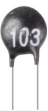

.. note::

    ¡Hola! Bienvenido a la Comunidad de Entusiastas de SunFounder Raspberry Pi, Arduino y ESP32 en Facebook. Profundiza en Raspberry Pi, Arduino y ESP32 con otros entusiastas.

    **¿Por qué unirse?**

    - **Soporte Experto**: Resuelve problemas post-venta y desafíos técnicos con la ayuda de nuestra comunidad y equipo.
    - **Aprender y Compartir**: Intercambia consejos y tutoriales para mejorar tus habilidades.
    - **Vistas Exclusivas**: Obtén acceso anticipado a anuncios de nuevos productos y adelantos.
    - **Descuentos Especiales**: Disfruta de descuentos exclusivos en nuestros productos más nuevos.
    - **Promociones Festivas y Sorteos**: Participa en sorteos y promociones navideñas.

    👉 ¿Listo para explorar y crear con nosotros? Haz clic en [|link_sf_facebook|] y únete hoy.

2.2.2 Thermistor
==================

Introducción
---------------

Al igual que el fotoresistor puede detectar la luz, el termistor es un 
dispositivo electrónico sensible a la temperatura que se puede utilizar 
para realizar funciones de control de temperatura, como la activación de 
una alarma de calor.

Componentes
-------------

.. image:: img/list_2.2.2_thermistor.png

Principio
------------

Un termistor es un resistor térmicamente sensible que presenta un cambio 
preciso y predecible en su resistencia proporcional a pequeñas variaciones 
de temperatura. El grado de cambio en su resistencia depende de su composición 
única. Los termistores son parte de un grupo más amplio de componentes pasivos. 
A diferencia de sus contrapartes activas, los dispositivos pasivos no son capaces 
de proporcionar ganancia de potencia o amplificación a un circuito.

El termistor es un elemento sensible y tiene dos tipos: Coeficiente de Temperatura 
Negativo (NTC) y Coeficiente de Temperatura Positivo (PTC), también conocidos como NTC y PTC. 
Su resistencia varía significativamente con la temperatura. La resistencia del termistor PTC aumenta 
con la temperatura, mientras que en el caso del NTC es lo contrario. En este experimento utilizamos NTC.

El principio es que la resistencia del termistor NTC cambia con la temperatura del entorno. 
Detecta la temperatura en tiempo real del ambiente. Cuando la temperatura aumenta, la resistencia 
del termistor disminuye. Luego, los datos de voltaje se convierten en cantidades digitales mediante 
el adaptador A/D. La temperatura en grados Celsius o Fahrenheit se presenta a través de la programación.

En este experimento, se utiliza un termistor y un resistor pull-up de 10k. Cada termistor tiene una resistencia 
normal. En este caso, es de 10k ohmios, medida a 25 grados Celsius.

Aquí está la relación entre la resistencia y la temperatura:

R\ :sub:`T` =R\ :sub:`N` exp\ :sup:`B(1/TK – 1/TN)`

**R\ T** es la resistencia del termistor NTC cuando la temperatura es **T\ K**.

**R\ N** es la resistencia del termistor NTC a la temperatura nominal **T\ N**. Aquí, el valor numérico de **R\ N** es 10k.

**T\ K** es la temperatura en Kelvin y la unidad es K. Aquí, el valor numérico de **T\ K** es 273.15 + grados Celsius.

**T\ N** es una temperatura nominal en Kelvin; la unidad también es K. Aquí, el valor numérico de **T\ N** es 273.15 + 25.

Y **B** (beta), la constante material del termistor NTC, también se conoce como índice de sensibilidad térmica, con un valor numérico de 3950.

**exp** es la abreviatura de exponencial, y el número base e es un número natural que es aproximadamente igual a 2.7.

Convierte esta fórmula T\ :sub:`K`\ =1/(ln(R\ :sub:`T`/R\ :sub:`N`)/B+1/T\ :sub:`N`) para obtener la temperatura en Kelvin que menos 273.15 es igual a grados Celsius.

Esta relación es una fórmula empírica. Es precisa solo cuando la temperatura 
y la resistencia están dentro del rango efectivo.

Diagrama Esquemático
----------------------

.. image:: img/image323.png

.. image:: img/image324.png

Procedimientos Experimentales
--------------------------------

**Paso 1:** Construir el circuito.

.. image:: img/image202.png
    :width: 800

**Paso 2:** Acceder a la carpeta del código.

.. raw:: html

   <run></run>

.. code-block::

    cd ~/davinci-kit-for-raspberry-pi/c/2.2.2/

**Paso 3:** Compilar el código.

.. raw:: html

   <run></run>

.. code-block::

    gcc 2.2.2_Thermistor.c -lwiringPi -lm

.. note::
    -lm se usa para cargar la biblioteca de matemáticas. No lo omitas, o se generará un error.

    **Paso 4:** Ejecuta el archivo ejecutable.

.. raw:: html

   <run></run>

.. code-block::

    sudo ./a.out

Al ejecutar el código, el termistor detectará la temperatura ambiente, 
que se imprimirá en la pantalla una vez que termine el cálculo del programa.

.. note::

    Si no funciona después de ejecutar, o aparece un mensaje de error: \"wiringPi.h: No such file or directory", consulta :ref:`C code is not working?`.

**Código**

.. code-block:: c

    #include <wiringPi.h>
    #include <stdio.h>
    #include <math.h>

    typedef unsigned char uchar;
    typedef unsigned int uint;

    #define     ADC_CS    0
    #define     ADC_CLK   1
    #define     ADC_DIO   2

    uchar get_ADC_Result(uint channel)
    {
        uchar i;
        uchar dat1=0, dat2=0;
        int sel = channel > 1 & 1;
        int odd = channel & 1;

        digitalWrite(ADC_CLK, 1);
        delayMicroseconds(2);
        digitalWrite(ADC_CLK, 0);
        delayMicroseconds(2);

        pinMode(ADC_DIO, OUTPUT);
        digitalWrite(ADC_CS, 0);
        // Bit de inicio
        digitalWrite(ADC_CLK,0);
        digitalWrite(ADC_DIO,1);    delayMicroseconds(2);
        digitalWrite(ADC_CLK,1);    delayMicroseconds(2);
        // Modo de extremo único
        digitalWrite(ADC_CLK,0);
        digitalWrite(ADC_DIO,1);    delayMicroseconds(2);
        digitalWrite(ADC_CLK,1);    delayMicroseconds(2);
        // IMPAR
        digitalWrite(ADC_CLK,0);
        digitalWrite(ADC_DIO,odd);  delayMicroseconds(2);
        digitalWrite(ADC_CLK,1);    delayMicroseconds(2);
        // Selección
        digitalWrite(ADC_CLK,0);
        digitalWrite(ADC_DIO,sel);    delayMicroseconds(2);
        digitalWrite(ADC_CLK,1);

        digitalWrite(ADC_DIO,1);    delayMicroseconds(2);
        digitalWrite(ADC_CLK,0);
        digitalWrite(ADC_DIO,1);    delayMicroseconds(2);

        for(i=0;i<8;i++)
        {
            digitalWrite(ADC_CLK,1);    delayMicroseconds(2);
            digitalWrite(ADC_CLK,0);    delayMicroseconds(2);

            pinMode(ADC_DIO, INPUT);
            dat1=dat1<<1 | digitalRead(ADC_DIO);
        }

        for(i=0;i<8;i++)
        {
            dat2 = dat2 | ((uchar)(digitalRead(ADC_DIO))<<i);
            digitalWrite(ADC_CLK,1);    delayMicroseconds(2);
            digitalWrite(ADC_CLK,0);    delayMicroseconds(2);
        }

        digitalWrite(ADC_CS,1);
        pinMode(ADC_DIO, OUTPUT);
        return(dat1==dat2) ? dat1 : 0;
    }

    int main(void)
    {
        unsigned char analogVal;
        double Vr, Rt, temp, cel, Fah;
        if(wiringPiSetup() == -1){ // cuando la inicialización de wiring falla, imprime mensaje en la pantalla
            printf("setup wiringPi failed !");
            return 1;
        }
        pinMode(ADC_CS,  OUTPUT);
        pinMode(ADC_CLK, OUTPUT);

        while(1){
            analogVal = get_ADC_Result(0);
            Vr = 5 * (double)(analogVal) / 255;
            Rt = 10000 * (double)(Vr) / (5 - (double)(Vr));
            temp = 1 / (((log(Rt/10000)) / 3950)+(1 / (273.15 + 25)));
            cel = temp - 273.15;
            Fah = cel * 1.8 +32;
            printf("Celsius: %.2f C  Fahrenheit: %.2f F\n", cel, Fah);
            delay(100);
        }
        return 0;
    }

**Explicación del Código**

.. code-block:: c

    #include <math.h>

Aquí se incluye una biblioteca numérica de C que declara un conjunto de 
funciones para calcular operaciones y transformaciones matemáticas comunes.

.. code-block:: c

    analogVal = get_ADC_Result(0);

Esta función se utiliza para leer el valor del termistor.

.. code-block:: c

    Vr = 5 * (double)(analogVal) / 255;
    Rt = 10000 * (double)(Vr) / (5 - (double)(Vr));
    temp = 1 / (((log(Rt/10000)) / 3950)+(1 / (273.15 + 25)));
    cel = temp - 273.15;
    Fah = cel * 1.8 +32;
    printf("Celsius: %.2f C  Fahrenheit: %.2f F\n", cel, Fah);

Estos cálculos convierten los valores del termistor en valores en grados Celsius.

.. code-block:: c

    Vr = 5 * (double)(analogVal) / 255;
    Rt = 10000 * (double)(Vr) / (5 - (double)(Vr));

Estas dos líneas de código calculan la distribución de voltaje con el valor 
analógico leído para obtener Rt (resistencia del termistor).

.. code-block:: c

    temp = 1 / (((log(Rt/10000)) / 3950)+(1 / (273.15 + 25)));

Este código se refiere a la inserción de Rt en la fórmula 
**T\ K\ =1/(ln(R\ T/R\ N)/B+1/T\ N)** para obtener la temperatura en Kelvin.

.. code-block:: c

    temp = temp - 273.15;

Convierte la temperatura en Kelvin a grados Celsius.

.. code-block:: c

    Fah = cel * 1.8 +32;

Convierte los grados Celsius a Fahrenheit.

.. code-block:: c

    printf("Celsius: %.2f C  Fahrenheit: %.2f F\n", cel, Fah);

Imprime el grado centígrado, el grado Fahrenheit y sus unidades en la pantalla.
