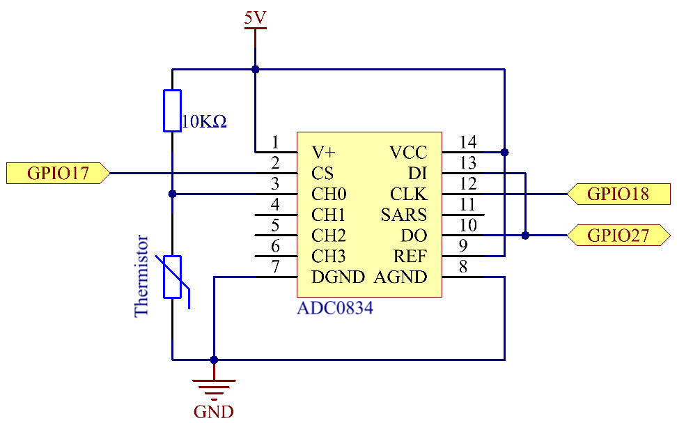

.. note::

    Ciao, benvenuto nella community SunFounder per appassionati di Raspberry Pi, Arduino e ESP32 su Facebook! Approfondisci la tua conoscenza di Raspberry Pi, Arduino ed ESP32 insieme ad altri appassionati.

    **Perché unirti a noi?**

    - **Supporto esperto**: Risolvi problemi post-vendita e sfide tecniche con l'aiuto della nostra community e del nostro team.
    - **Impara e condividi**: Scambia consigli e tutorial per migliorare le tue competenze.
    - **Anteprime esclusive**: Ottieni accesso anticipato agli annunci di nuovi prodotti e anteprime.
    - **Sconti speciali**: Approfitta di sconti esclusivi sui nostri prodotti più recenti.
    - **Promozioni e omaggi**: Partecipa a promozioni e omaggi speciali durante le festività.

    👉 Pronto a esplorare e creare con noi? Clicca su [|link_sf_facebook|] e unisciti oggi!

2.2.2 Termistore
===================

Introduzione
---------------

Proprio come il fotoresistore può rilevare la luce, il termistore è un 
dispositivo elettronico sensibile alla temperatura che può essere utilizzato 
per funzioni di controllo della temperatura, come la realizzazione di un 
allarme termico.

Componenti
--------------

.. image:: img/list_2.2.2_thermistor.png

Principio
------------

Un termistore è una resistenza sensibile al calore che mostra una variazione 
precisa e prevedibile della resistenza proporzionale a piccoli cambiamenti di 
temperatura. L'entità della variazione dipende dalla sua particolare composizione. 
I termistori appartengono al gruppo dei componenti passivi e, a differenza dei 
componenti attivi, non possono fornire amplificazione del segnale o guadagno di 
potenza in un circuito.

Il termistore è un elemento sensibile, esistono due tipi principali: con 
coefficiente di temperatura negativo (NTC) e con coefficiente di temperatura 
positivo (PTC), comunemente abbreviati come NTC e PTC. La resistenza del 
termistore NTC diminuisce all’aumentare della temperatura, mentre per il 
termistore PTC la resistenza aumenta. In questo esperimento utilizziamo un NTC.

.. image:: img/image325.png

Il principio è che la resistenza del termistore NTC varia con la temperatura 
dell'ambiente circostante, rilevando così la temperatura in tempo reale. 
Quando la temperatura aumenta, la resistenza del termistore diminuisce. I dati 
di tensione vengono quindi convertiti in valori digitali tramite un adattatore 
A/D. La temperatura in gradi Celsius o Fahrenheit viene quindi visualizzata 
tramite programmazione.

In questo esperimento, utilizziamo un termistore e una resistenza di pull-up da 
10k. Ogni termistore ha una resistenza normale, qui pari a 10k ohm, misurata a 
25 gradi Celsius.

Ecco la relazione tra resistenza e temperatura:

R\ :sub:`T` =R\ :sub:`N` exp\ :sup:`B(1/TK – 1/TN)`

**R\ T** è la resistenza del termistore NTC alla temperatura **T\ K**.

**R\ N** è la resistenza del termistore NTC alla temperatura nominale **T\ N**. 
Qui, il valore numerico di **R\ N** è 10k.

**T\ K** è la temperatura in Kelvin, misurata in K. Qui, il valore numerico di 
**T\ K**\ è 273,15 + gradi Celsius.

**T\ N** è la temperatura nominale in Kelvin, misurata in K. Qui, il valore 
numerico di **T\ N** è 273,15 + 25.

E **B**\ (beta), la costante del materiale del termistore NTC, è anche chiamata 
indice di sensibilità termica e ha un valore numerico di 3950.

**exp** indica l'esponenziale, con il numero di base **e**, che è approssimativamente 2,7.

Converti questa formula
T\ :sub:`K`\ = 1/(ln(R\ :sub:`T`/R\ :sub:`N`)/B + 1/T\ :sub:`N`) per ottenere la 
temperatura in Kelvin, sottraendo poi 273,15 per ottenere la temperatura in gradi Celsius.

Questa relazione è una formula empirica, accurata solo quando la temperatura e la 
resistenza sono entro un intervallo efficace.

Schema del Circuito
----------------------

.. image:: img/image323.png

Procedure Sperimentali
--------------------------

**Passo 1:** Costruire il circuito.

**Passo 2:** Accedere alla cartella del codice.

.. raw:: html

   <run></run>

.. code-block::

    cd ~/davinci-kit-for-raspberry-pi/c/2.2.2/

**Passo 3:** Compilare il codice.

.. raw:: html

   <run></run>

.. code-block::

    gcc 2.2.2_Thermistor.c -lwiringPi -lm

.. note::
    -lm serve per caricare la libreria matematica. Non ometterlo, altrimenti 
    si verificherà un errore.

**Passo 4:** Eseguire il file eseguibile.

.. raw:: html

   <run></run>

.. code-block::

    sudo ./a.out

Dopo l’esecuzione del codice, il termistore rileverà la temperatura ambientale, 
che sarà visualizzata sullo schermo una volta terminato il calcolo del programma.

.. note::

    Se il programma non funziona dopo l'esecuzione o compare il messaggio di errore: \"wiringPi.h: No such file or directory", fare riferimento a :ref:`Il codice C non funziona?`.

**Codice**

.. code-block:: c

    #include <wiringPi.h>
    #include <stdio.h>
    #include <math.h>

    typedef unsigned char uchar;
    typedef unsigned int uint;

    #define     ADC_CS    0
    #define     ADC_CLK   1
    #define     ADC_DIO   2

    uchar get_ADC_Result(uint channel)
    {
        uchar i;
        uchar dat1=0, dat2=0;
        int sel = channel > 1 & 1;
        int odd = channel & 1;

        digitalWrite(ADC_CLK, 1);
        delayMicroseconds(2);
        digitalWrite(ADC_CLK, 0);
        delayMicroseconds(2);

        pinMode(ADC_DIO, OUTPUT);
        digitalWrite(ADC_CS, 0);
        // Bit di avvio
        digitalWrite(ADC_CLK,0);
        digitalWrite(ADC_DIO,1);    delayMicroseconds(2);
        digitalWrite(ADC_CLK,1);    delayMicroseconds(2);
        // Modalità a singolo terminale
        digitalWrite(ADC_CLK,0);
        digitalWrite(ADC_DIO,1);    delayMicroseconds(2);
        digitalWrite(ADC_CLK,1);    delayMicroseconds(2);
        // Bit dispari
        digitalWrite(ADC_CLK,0);
        digitalWrite(ADC_DIO,odd);  delayMicroseconds(2);
        digitalWrite(ADC_CLK,1);    delayMicroseconds(2);
        // Selezione
        digitalWrite(ADC_CLK,0);
        digitalWrite(ADC_DIO,sel);    delayMicroseconds(2);
        digitalWrite(ADC_CLK,1);

        digitalWrite(ADC_DIO,1);    delayMicroseconds(2);
        digitalWrite(ADC_CLK,0);
        digitalWrite(ADC_DIO,1);    delayMicroseconds(2);

        for(i=0;i<8;i++)
        {
            digitalWrite(ADC_CLK,1);    delayMicroseconds(2);
            digitalWrite(ADC_CLK,0);    delayMicroseconds(2);

            pinMode(ADC_DIO, INPUT);
            dat1=dat1<<1 | digitalRead(ADC_DIO);
        }

        for(i=0;i<8;i++)
        {
            dat2 = dat2 | ((uchar)(digitalRead(ADC_DIO))<<i);
            digitalWrite(ADC_CLK,1);    delayMicroseconds(2);
            digitalWrite(ADC_CLK,0);    delayMicroseconds(2);
        }

        digitalWrite(ADC_CS,1);
        pinMode(ADC_DIO, OUTPUT);
        return(dat1==dat2) ? dat1 : 0;
    }

    int main(void)
    {
        unsigned char analogVal;
        double Vr, Rt, temp, cel, Fah;
        if(wiringPiSetup() == -1){ // Se l'inizializzazione di wiring fallisce, stampa il messaggio sullo schermo
            printf("setup wiringPi failed !");
            return 1;
        }
        pinMode(ADC_CS,  OUTPUT);
        pinMode(ADC_CLK, OUTPUT);

        while(1){
            analogVal = get_ADC_Result(0);
            Vr = 5 * (double)(analogVal) / 255;
            Rt = 10000 * (double)(Vr) / (5 - (double)(Vr));
            temp = 1 / (((log(Rt/10000)) / 3950)+(1 / (273.15 + 25)));
            cel = temp - 273.15;
            Fah = cel * 1.8 +32;
            printf("Celsius: %.2f C  Fahrenheit: %.2f F\n", cel, Fah);
            delay(100);
        }
        return 0;
    }
**Spiegazione del Codice**

.. code-block:: c

    #include <math.h>

Questa è una libreria numerica di C che dichiara un insieme di funzioni per 
calcolare operazioni e trasformazioni matematiche comuni.

.. code-block:: c

    analogVal = get_ADC_Result(0);

Questa funzione viene utilizzata per leggere il valore del termistore.

.. code-block:: c

    Vr = 5 * (double)(analogVal) / 255;
    Rt = 10000 * (double)(Vr) / (5 - (double)(Vr));
    temp = 1 / (((log(Rt/10000)) / 3950)+(1 / (273.15 + 25)));
    cel = temp - 273.15;
    Fah = cel * 1.8 +32;
    printf("Celsius: %.2f C  Fahrenheit: %.2f F\n", cel, Fah);

Questi calcoli convertono i valori del termistore in gradi Celsius.

.. code-block:: c

    Vr = 5 * (double)(analogVal) / 255;
    Rt = 10000 * (double)(Vr) / (5 - (double)(Vr));

Queste due righe di codice calcolano la distribuzione della tensione in base al valore letto di analog per ottenere Rt (resistenza del termistore).

.. code-block:: c

    temp = 1 / (((log(Rt/10000)) / 3950)+(1 / (273.15 + 25)));

Questo codice si riferisce all'inserimento di Rt nella formula
**T\ K\ =1/(ln(R\ T/R\ N)/B+1/T\ N)** per ottenere la temperatura in Kelvin.

.. code-block:: c

    temp = temp - 273.15;

Converte la temperatura da Kelvin a gradi Celsius.

.. code-block:: c

    Fah = cel * 1.8 +32;

Converte la temperatura da gradi Celsius a Fahrenheit.
    
.. code-block:: c

    printf("Celsius: %.2f C  Fahrenheit: %.2f F\n", cel, Fah);

Stampa sul display i valori in gradi Celsius, gradi Fahrenheit e le loro unità di misura.

