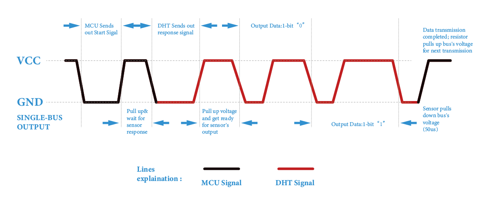

.. note::

    Ciao e benvenuto nella Community di appassionati di SunFounder Raspberry Pi, Arduino e ESP32 su Facebook! Approfondisci le tue conoscenze su Raspberry Pi, Arduino e ESP32 insieme ad altri appassionati.

    **Perché unirsi a noi?**

    - **Supporto esperto**: Risolvi problemi post-vendita e sfide tecniche grazie all’aiuto della nostra community e del nostro team.
    - **Impara e Condividi**: Scambia consigli e tutorial per migliorare le tue competenze.
    - **Anteprime esclusive**: Accedi in anteprima agli annunci sui nuovi prodotti.
    - **Sconti speciali**: Godi di sconti esclusivi sui nostri prodotti più recenti.
    - **Promozioni festive e omaggi**: Partecipa a promozioni festive e concorsi.

    👉 Pronto a esplorare e creare con noi? Clicca su [|link_sf_facebook|] e unisciti oggi stesso!

2.2.3 DHT-11
============

Introduzione
---------------

Il sensore digitale di temperatura e umidità DHT11 è un sensore composito 
che fornisce un’uscita digitale calibrata della temperatura e dell’umidità. 
Grazie alla tecnologia dei moduli digitali dedicati e a quella del rilevamento 
di temperatura e umidità, il prodotto offre alta affidabilità e ottima stabilità.

I sensori includono un elemento umido sensibile e un sensore di temperatura NTC, 
collegati a un microcontrollore a 8 bit ad alte prestazioni.

Componenti
-------------

.. image:: img/list_2.2.3_dht-11.png

Principio di funzionamento
----------------------------

Il DHT11 è un sensore digitale di temperatura e umidità a basso costo. 
Utilizza un sensore capacitivo di umidità e un termistore per misurare 
l'aria circostante e fornisce un segnale digitale sul pin dei dati (non 
sono necessari pin di ingresso analogico).

.. image:: img/image205.png
    :width: 200

Sono disponibili solo tre pin: VCC, GND e DATA. Il processo di comunicazione 
inizia con l'invio dei segnali di avvio sulla linea DATA al DHT11; il DHT11 
riceve i segnali e invia un segnale di risposta. Il dispositivo riceve il 
segnale di risposta e inizia a ricevere 40 bit di dati (8 bit per l'umidità 
intera + 8 bit per l'umidità decimale + 8 bit per la temperatura intera + 8 bit 
per la temperatura decimale + 8 bit di checksum). Per maggiori informazioni, 
fare riferimento al datasheet del DHT11.

Schema elettrico
-------------------

.. image:: img/image326.png

Procedure sperimentali
-------------------------

**Passo 1:** Costruisci il circuito.

.. image:: img/image207.png
    :width: 800

**Passo 2:** Accedi alla cartella del codice.

.. raw:: html

   <run></run>

.. code-block::

    cd ~/davinci-kit-for-raspberry-pi/c/2.2.3/

**Passo 3:** Compila il codice.

.. raw:: html

   <run></run>

.. code-block::

    gcc 2.2.3_DHT.c -lwiringPi

**Passo 4:** Esegui il file eseguibile.

.. raw:: html

   <run></run>

.. code-block::

    sudo ./a.out

Dopo aver avviato il codice, il programma stamperà sullo schermo del 
computer la temperatura e l’umidità rilevate dal DHT11.

.. note::

    Se il programma non funziona dopo l'esecuzione o compare un messaggio 
    di errore: \"wiringPi.h: No such file or directory", fai riferimento a :ref:`Il codice C non funziona?`.

**Codice**

.. code-block:: c

    #include <wiringPi.h>
    #include <stdio.h>
    #include <stdlib.h>
    #include <stdint.h>

    #define maxTim 85
    #define dhtPin 0

    int dht11_dat[5] = {0,0,0,0,0};

    void readDht11() {
        uint8_t laststate = HIGH;
        uint8_t counter = 0;
        uint8_t j = 0, i;
        float Fah; // fahrenheit
        dht11_dat[0] = dht11_dat[1] = dht11_dat[2] = dht11_dat[3] = dht11_dat[4] = 0;
        // abbassa il pin per 18 millisecondi
        pinMode(dhtPin, OUTPUT);
        digitalWrite(dhtPin, LOW);
        delay(18);
        // poi alzalo per 40 microsecondi
        digitalWrite(dhtPin, HIGH);
        delayMicroseconds(40); 
        // prepara il pin per la lettura
        pinMode(dhtPin, INPUT);

        // rileva cambiamenti e leggi i dati
        for (i=0; i< maxTim; i++) {
            counter = 0;
            while (digitalRead(dhtPin) == laststate) {
                counter++;
                delayMicroseconds(1);
                if (counter == 255) {
                    break;
                }
            }
            laststate = digitalRead(dhtPin);

            if (counter == 255) break;
            // ignora le prime 3 transizioni
            if ((i >= 4) && (i%2 == 0)) {
                // memorizza ogni bit nei byte di archiviazione
                dht11_dat[j/8] <<= 1;
                if (counter > 50)
                    dht11_dat[j/8] |= 1;
                j++;
            }
        }
        // verifica la lettura di 40 bit (8 bit x 5) + verifica checksum nell'ultimo byte
        // stampa il risultato se i dati sono corretti
        if ((j >= 40) && 
                (dht11_dat[4] == ((dht11_dat[0] + dht11_dat[1] + dht11_dat[2] + dht11_dat[3]) & 0xFF)) ) {
            Fah = dht11_dat[2] * 9. / 5. + 32;
            printf("Humidity = %d.%d %% Temperature = %d.%d *C (%.1f *F)\n", 
                    dht11_dat[0], dht11_dat[1], dht11_dat[2], dht11_dat[3], Fah);
        }
    }

    int main (void) {
        if(wiringPiSetup() == -1){ //se l'inizializzazione di wiring fallisce, stampa un messaggio
            printf("setup wiringPi failed !");
            return 1; 
        }
        while (1) {
            readDht11();
            delay(500); // aspetta 1 sec per aggiornare
        }
        return 0 ;
    }

**Spiegazione del codice**

.. code-block:: c

    void readDht11() {
        uint8_t laststate = HIGH;
        uint8_t counter = 0;
        uint8_t j = 0, i;
        float Fah; // fahrenheit
        dht11_dat[0] = dht11_dat[1] = dht11_dat[2] = dht11_dat[3] = dht11_dat[4] = 0;
        // ...
    }

Questa funzione serve a realizzare la lettura dei dati del DHT11.

In generale, può essere suddivisa in 3 parti:

1. Preparazione per la lettura del pin:

.. code-block:: c

    // abbassa il pin per 18 millisecondi
    pinMode(dhtPin, OUTPUT);
    digitalWrite(dhtPin, LOW);
    delay(18);
    // poi alzalo per 40 microsecondi
    digitalWrite(dhtPin, HIGH);
    delayMicroseconds(40); 
    // prepara il pin per la lettura
    pinMode(dhtPin, INPUT);

Il flusso di comunicazione è determinato dal timing di funzionamento.

Quando DHT11 si avvia, il microcontrollore (MCU) invia un segnale di basso 
livello e poi mantiene il segnale a livello alto per 40 µs. Successivamente, 
inizia il rilevamento delle condizioni dell'ambiente esterno.

2. Lettura dei dati:

.. code-block:: c

    // rileva cambiamenti e leggi i dati  
    for (i=0; i< maxTim; i++) {
            counter = 0;
            while (digitalRead(dhtPin) == laststate) {
                counter++;
                delayMicroseconds(1);
                if (counter == 255) {
                    break;
                }
            }
            laststate = digitalRead(dhtPin);
            if (counter == 255) break;
            // ignora le prime 3 transizioni
            if ((i >= 4) && (i%2 == 0)) {
                // inserisci ogni bit nei byte di archiviazione
                dht11_dat[j/8] <<= 1;
                if (counter > 50)
                    dht11_dat[j/8] |= 1;
                j++;
            }
        }

Il ciclo memorizza i dati rilevati nell'array dht11_dat[]. DHT11 trasmette i 
dati in blocchi di 40 bit. I primi 16 bit si riferiscono all'umidità, i 
successivi 16 bit alla temperatura, e gli ultimi 8 bit sono utilizzati per 
la verifica. Il formato dei dati è:

**8 bit per l'intero dell'umidità** + **8 bit per la parte decimale dell'umidità** 
+ **8 bit per l'intero della temperatura** + **8 bit per la parte decimale della 
temperatura** + **8 bit per il bit di controllo**.

3. Stampa Umidità e Temperatura.

.. code-block:: c

    // verifica che abbiamo letto 40 bit (8 bit x 5) + verifica checksum nell'ultimo byte
    // stampa i risultati se i dati sono corretti
    if ((j >= 40) && 
            (dht11_dat[4] == ((dht11_dat[0] + dht11_dat[1] + dht11_dat[2] + dht11_dat[3]) & 0xFF)) ) {
        Fah = dht11_dat[2] * 9. / 5. + 32;
        printf("Humidity = %d.%d %% Temperature = %d.%d *C (%.1f *F)\n", 
                dht11_dat[0], dht11_dat[1], dht11_dat[2], dht11_dat[3], Fah);
    }

Quando la memorizzazione dei dati arriva a 40 bit, verifica la validità dei 
dati tramite il **bit di controllo (dht11_dat[4])** e successivamente stampa 
i valori di temperatura e umidità.

Ad esempio, se i dati ricevuti sono 00101011 (valore intero dell'umidità a 8 bit) 
00000000 (valore decimale dell'umidità a 8 bit) 00111100 (valore intero della 
temperatura a 8 bit) 00000000 (valore decimale della temperatura a 8 bit) 01100111 (bit di controllo)

**Calcolo:**

00101011+00000000+00111100+00000000=01100111.

Il risultato finale è uguale al bit di controllo, quindi i dati ricevuti sono corretti:

Umidità = 43%, Temperatura = 60 °C.

Se non è uguale al bit di controllo, la trasmissione dei dati non è normale e i dati vengono ricevuti di nuovo.

