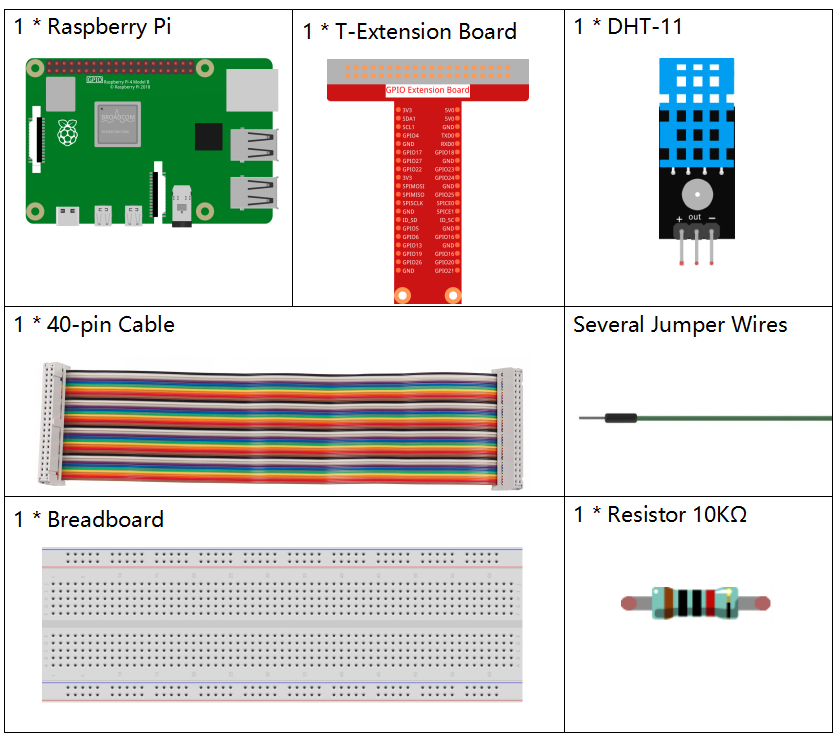

.. note::

    こんにちは、SunFounderのRaspberry Pi & Arduino & ESP32愛好家コミュニティへようこそ！Facebook上でRaspberry Pi、Arduino、ESP32についてもっと深く掘り下げ、他の愛好家と交流しましょう。

    **参加する理由は？**

    - **エキスパートサポート**：コミュニティやチームの助けを借りて、販売後の問題や技術的な課題を解決します。
    - **学び＆共有**：ヒントやチュートリアルを交換してスキルを向上させましょう。
    - **独占的なプレビュー**：新製品の発表や先行プレビューに早期アクセスしましょう。
    - **特別割引**：最新製品の独占割引をお楽しみください。
    - **祭りのプロモーションとギフト**：ギフトや祝日のプロモーションに参加しましょう。

    👉 私たちと一緒に探索し、創造する準備はできていますか？[|link_sf_facebook|]をクリックして今すぐ参加しましょう！

2.2.3 DHT-11
============

前書き
--------------

デジタル温湿度センサーDHT11は、温度と湿度の校正済みデジタル信号出力を含む複合センサーである。専用のデジタルモジュールコレクションの技術と温湿度検知の技術を適用して、製品の高い信頼性と優れた安定性を確保している。

センサーには、湿式素子抵抗センサーとNTC温度センサーが含まれており、高性能の8ビットマイクロコントローラーに接続されている。

部品
----------

原理
---------

DHT11は基本的な超低コストのデジタル温湿度センサーである。
容量性湿度センサーとサーミスタを使用して周囲の空気を測定し、
データピンにデジタル信号を出力する（アナログ入力ピンは不要）。

.. image:: ../img/image205.png
    :width: 200

VCC、GND、とDATAの三つのピンのみが利用できる。
通信プロセスは開始信号をDHT11に送信するDATAラインから始まり、
DHT11は信号を受信して応答信号を返す。次に、ホストは応答信号を受信し、
40ビットの湿度データ（8ビット湿度整数+ 8ビット湿度10進数+ 8ビット温度整数+ 8ビット温度10進数+ 8ビットチェックサム）の受信を開始する。
詳細については、DHT11データシートを参照してください。

回路図
-----------------

.. image:: ../img/image326.png

実験手順
-----------------------

ステップ1： 回路を作る。

.. image:: ../img/image207.png
    :width: 800

ステップ2： コードのフォルダーに入る。

.. raw:: html

   <run></run>

.. code-block::

    cd /home/pi/davinci-kit-for-raspberry-pi/c/2.2.3/

ステップ3： コードをコンパイルする。

.. raw:: html

   <run></run>

.. code-block::

    gcc 2.2.3_DHT.c -lwiringPi

ステップ4： EXEファイルを実行する。

.. raw:: html

   <run></run>

.. code-block::

    sudo ./a.out

コードの実行後、プログラムはDHT11によって検出された温度と湿度をコンピューター画面にプリントする。

**コード**

.. code-block:: c

    #include <wiringPi.h>
    #include <stdio.h>
    #include <stdlib.h>
    #include <stdint.h>

    #define maxTim 85
    #define dhtPin 0

    int dht11_dat[5] = {0,0,0,0,0};

    void readDht11() {
        uint8_t laststate = HIGH;
        uint8_t counter = 0;
        uint8_t j = 0, i;
        float Fah; // fahrenheit
        dht11_dat[0] = dht11_dat[1] = dht11_dat[2] = dht11_dat[3] = dht11_dat[4] = 0;
        // pull pin down for 18 milliseconds
        pinMode(dhtPin, OUTPUT);
        digitalWrite(dhtPin, LOW);
        delay(18);
        // then pull it up for 40 microseconds
        digitalWrite(dhtPin, HIGH);
        delayMicroseconds(40); 
        // prepare to read the pin
        pinMode(dhtPin, INPUT);

        // detect change and read data
        for ( i=0; i< maxTim; i++) {
            counter = 0;
            while (digitalRead(dhtPin) == laststate) {
                counter++;
                delayMicroseconds(1);
                if (counter == 255) {
                    break;
                }
            }
            laststate = digitalRead(dhtPin);

            if (counter == 255) break;
            // ignore first 3 transitions
            if ((i >= 4) && (i%2 == 0)) {
                // shove each bit into the storage bytes
                dht11_dat[j/8] <<= 1;
                if (counter > 50)
                    dht11_dat[j/8] |= 1;
                j++;
            }
        }
        // check we read 40 bits (8bit x 5 ) + verify checksum in the last byte
        // print it out if data is good
        if ((j >= 40) && 
                (dht11_dat[4] == ((dht11_dat[0] + dht11_dat[1] + dht11_dat[2] + dht11_dat[3]) & 0xFF)) ) {
            Fah = dht11_dat[2] * 9. / 5. + 32;
            printf("Humidity = %d.%d %% Temperature = %d.%d *C (%.1f *F)\n", 
                    dht11_dat[0], dht11_dat[1], dht11_dat[2], dht11_dat[3], Fah);
        }
    }

    int main (void) {
        if(wiringPiSetup() == -1){ //when initialize wiring failed, print messageto screen
            printf("setup wiringPi failed !");
            return 1; 
        }
        while (1) {
            readDht11();
            delay(500); // wait 1sec to refresh
        }
        return 0 ;
    }

**コードの説明**

.. code-block:: c

    void readDht11() {
        uint8_t laststate = HIGH;
        uint8_t counter = 0;
        uint8_t j = 0, i;
        float Fah; // fahrenheit
        dht11_dat[0] = dht11_dat[1] = dht11_dat[2] = dht11_dat[3] = dht11_dat[4] = 0;
        // ...
    }

この機能はDHT11の機能を実現するために使用される。

通常、次の3つの部分に分けることができる：

1. ピンを読む準備ができた：

.. code-block:: c

    // pull pin down for 18 milliseconds
    pinMode(dhtPin, OUTPUT);
    digitalWrite(dhtPin, LOW);
    delay(18);
    // then pull it up for 40 microseconds
    digitalWrite(dhtPin, HIGH);
    delayMicroseconds(40); 
    // prepare to read the pin
    pinMode(dhtPin, INPUT);

その通信フローは、作業のタイミングによって決まる。

.. image:: ../img/image208.png
    :width: 800

DHT11が起動すると、MCUは低レベルの信号を送信し、40usの間信号を高レベルに保つ。
その後、外部環境の状態の検出が開始される。

2. データの読み取り：

.. code-block:: c

    // detect change and read data  
    for ( i=0; i< maxTim; i++) {
            counter = 0;
            while (digitalRead(dhtPin) == laststate) {
                counter++;
                delayMicroseconds(1);
                if (counter == 255) {
                    break;
                }
            }
            laststate = digitalRead(dhtPin);
            if (counter == 255) break;
            // ignore first 3 transitions
            if ((i >= 4) && (i%2 == 0)) {
                // shove each bit into the storage bytes
                dht11_dat[j/8] <<= 1;
                if (counter > 50)
                    dht11_dat[j/8] |= 1;
                j++;
            }
        }

ループは検出されたデータを ``dht11_dat[]`` 配列に保存する。DHT11は一度に40ビットのデータを転送する。最初の16ビットは湿度に関連し、中央の16ビットは温度に関連し、最後の8ビットは検証に使用される。データ形式は次のとおりである：

8ビット湿度整数データ + 8ビット湿度10進データ + 8ビット温度整数データ + 8ビット温度10進データ + 8ビットチェックビット。

3. 湿度と温度をプリントする。

.. code-block:: c

    // check we read 40 bits (8bit x 5 ) + verify checksum in the last byte
    // print it out if data is good
    if ((j >= 40) && 
            (dht11_dat[4] == ((dht11_dat[0] + dht11_dat[1] + dht11_dat[2] + dht11_dat[3]) & 0xFF)) ) {
        Fah = dht11_dat[2] * 9. / 5. + 32;
        printf("Humidity = %d.%d %% Temperature = %d.%d *C (%.1f *F)\n", 
                dht11_dat[0], dht11_dat[1], dht11_dat[2], dht11_dat[3], Fah);
    }

データストレージが最大40ビットの場合、 チェックビット ( ``dht11_dat[4]`` ) を通じてデータの有効性をチェックし、温度と湿度をプリントする。

たとえば、受信データが00101011（湿度整数の8ビット値）00000000（湿度10進数の8ビット値）00111100（温度整数の8ビット値）00000000（温度10進数の8ビット値）01100111（チェックビット）の場合、

**計算：**

00101011+00000000+00111100+00000000=01100111.

最終結果はチェックビットデータに等しく、受信データは正しいである：

湿度= 43％、温度= 60 ℃。

チェックビットデータと等しくない場合、データ送信は正常ではなく、データが再度受信される。

