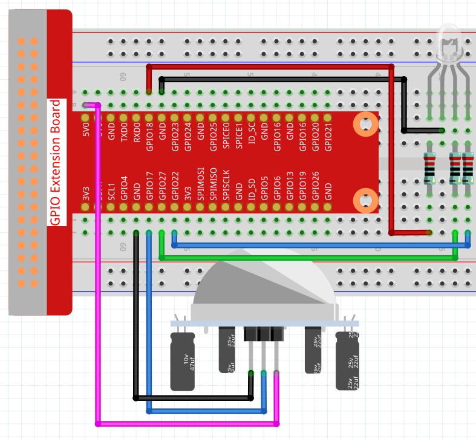

.. note::

    Ciao, benvenuto nella Community di SunFounder per appassionati di Raspberry Pi, Arduino e ESP32 su Facebook! Approfondisci l'uso di Raspberry Pi, Arduino e ESP32 insieme ad altri appassionati.

    **Perché unirsi?**

    - **Supporto esperto**: Risolvi problemi post-vendita e sfide tecniche con l'aiuto della nostra community e del team.
    - **Impara e condividi**: Scambia consigli e tutorial per migliorare le tue competenze.
    - **Anteprime esclusive**: Ottieni accesso anticipato a nuove presentazioni di prodotti e anticipazioni.
    - **Sconti speciali**: Approfitta di sconti esclusivi sui nostri nuovi prodotti.
    - **Promozioni e omaggi festivi**: Partecipa a promozioni festive e a giveaway.

    👉 Pronto a esplorare e creare con noi? Clicca su [|link_sf_facebook|] e unisciti subito!

2.2.4 PIR
===========

Introduzione
--------------

In questo progetto realizzeremo un dispositivo utilizzando sensori 
piroelettrici a infrarossi per il corpo umano. Quando qualcuno si 
avvicina, il LED si accende automaticamente. Altrimenti, la luce si 
spegne. Questo sensore di movimento a infrarossi è in grado di rilevare 
l'infrarosso emesso da esseri umani e animali.

Componenti
-------------

.. image:: img/list_2.2.4_pir.png

Principio
----------

Il sensore PIR rileva la radiazione termica infrarossa, utilizzata per 
individuare la presenza di organismi che emettono questa radiazione.

Il sensore PIR è suddiviso in due sezioni collegate a un amplificatore 
differenziale. Quando un oggetto stazionario è davanti al sensore, le 
due sezioni ricevono la stessa quantità di radiazione e l'uscita è zero. 
Quando un oggetto in movimento si avvicina, una delle sezioni riceve più 
radiazione dell'altra, generando un'oscillazione dell'uscita tra alti e 
bassi livelli. Questa variazione di tensione segnala la rilevazione del movimento.

.. image:: img/image211.png
    :width: 200

Dopo che il modulo di rilevamento è stato collegato, è previsto un minuto di 
inizializzazione. Durante l'inizializzazione, il modulo emetterà un segnale 
da 0 a 3 volte a intervalli. Successivamente, il modulo entra in modalità standby. 
Assicurati di evitare l'interferenza di fonti di luce o altre fonti sul modulo per 
prevenire falsi allarmi causati da segnali di disturbo. È preferibile anche evitare 
un’eccessiva esposizione al vento, che potrebbe interferire con il sensore.

.. image:: img/image212.png
    :width: 400

**Regolazione della distanza**

Ruotando la manopola del potenziometro di regolazione della distanza in senso 
orario, aumenta la portata massima di rilevamento fino a circa 0-7 metri. 
Girandola in senso antiorario, la distanza di rilevamento si riduce, raggiungendo 
un minimo di circa 0-3 metri.

**Regolazione del ritardo**

Ruotando la manopola del potenziometro di regolazione del ritardo in senso orario, 
aumenta il ritardo di rilevamento fino a un massimo di 300 secondi. Al contrario, 
ruotandola in senso antiorario, riduci il ritardo fino a un minimo di 5 secondi.

Due modalità di trigger: (scegli modalità diverse con il ponticello).

-  **H:** **Modalità di trigger ripetibile**, dopo aver rilevato una persona, 
   il modulo emette un livello alto. Durante il periodo di ritardo, se qualcuno 
   entra nell'area di rilevamento, l'uscita rimane a livello alto.

-  **L:** **Modalità di trigger non ripetibile**, emette un livello alto al 
   rilevamento della persona. Dopo il ritardo, l'uscita passa automaticamente 
   dal livello alto al livello basso.

Schema Elettrico
------------------

.. image:: img/image327.png

Procedure Sperimentali
-------------------------

**Passo 1:** Costruisci il circuito.

**Passo 2:** Accedi alla cartella del codice.

.. raw:: html

   <run></run>

.. code-block::

    cd ~/davinci-kit-for-raspberry-pi/c/2.2.4/

**Passo 3:** Compila il codice.

.. raw:: html

   <run></run>

.. code-block::

    gcc 2.2.4_PIR.c -lwiringPi

**Passo 4:** Esegui il file eseguibile.

.. raw:: html

   <run></run>

.. code-block::

    sudo ./a.out

Dopo l'esecuzione del codice, il PIR rileva l'ambiente circostante e fa 
illuminare l'LED RGB di giallo se rileva qualcuno di passaggio. Sul modulo 
PIR ci sono due potenziometri: uno regola la sensibilità e l'altro la distanza 
di rilevamento. Per ottimizzare il funzionamento del modulo PIR, è necessario 
girarli entrambi in senso antiorario fino in fondo.

.. image:: img/PIR_TTE.png

.. note::

    Se il programma non funziona dopo l'esecuzione o viene visualizzato un errore: \"wiringPi.h: Nessun file o directory di questo tipo", consulta :ref:`Il codice C non funziona?`.

**Codice**

.. code-block:: c

    #include <wiringPi.h>
    #include <softPwm.h>
    #include <stdio.h>
    #define uchar unsigned char

    #define pirPin    0     // pir collegato a GPIO0
    #define redPin    1
    #define greenPin  2
    #define bluePin   3

    void ledInit(void){
        softPwmCreate(redPin,  0, 100);
        softPwmCreate(greenPin,0, 100);
        softPwmCreate(bluePin, 0, 100);
    }
    void ledColorSet(uchar r_val, uchar g_val, uchar b_val){
        softPwmWrite(redPin,   r_val);
        softPwmWrite(greenPin, g_val);
        softPwmWrite(bluePin,  b_val);
    }
    int main(void)
    {
        int pir_val;
        if(wiringPiSetup() == -1){ // se l'inizializzazione di wiring fallisce, stampa un messaggio sullo schermo
            printf("setup wiringPi failed !");
            return 1;
        }
        ledInit();
        pinMode(pirPin, INPUT);
        while(1){
            pir_val = digitalRead(pirPin);
            if(pir_val== 1){ //se il valore letto dal pir è di livello HIGH
                ledColorSet(0xff,0xff,0x00); 
            }
            else {
                ledColorSet(0x00,0x00,0xff); 
            }
        }
        return 0;
    }

**Spiegazione del Codice**

.. code-block:: c

    void ledInit(void);
    void ledColorSet(uchar r_val, uchar g_val, uchar b_val);

Questi codici sono utilizzati per impostare il colore dell'LED RGB; per maggiori 
dettagli, consulta :ref:`1.1.2 LED RGB`.

.. code-block:: c

    int main(void)
    {
        int pir_val;
        //…… 
        pinMode(pirPin, INPUT);
        while(1){
            pir_val = digitalRead(pirPin);
            if(pir_val== 1){ //se il valore letto dal pir è di livello HIGH
                ledColorSet(0xff,0xff,0x00); 
            }
            else {
                ledColorSet(0x00,0x00,0xff); 
            }
        }
        return 0;
    }

Quando il PIR rileva lo spettro infrarosso umano, l'LED RGB emette luce gialla; 
altrimenti, emette luce blu.

