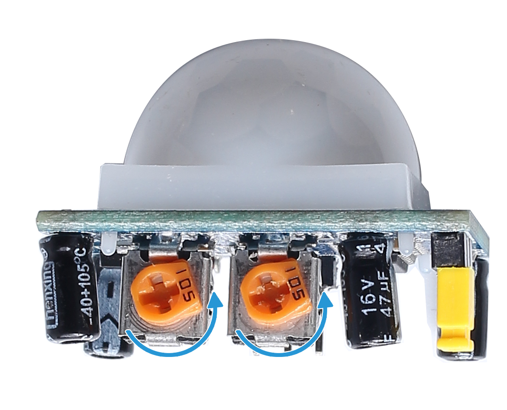

.. note::

    Hallo und willkommen in der SunFounder Raspberry Pi & Arduino & ESP32 Enthusiasten-Gemeinschaft auf Facebook! Tauchen Sie tiefer ein in die Welt von Raspberry Pi, Arduino und ESP32 mit anderen Enthusiasten.

    **Warum beitreten?**

    - **Expertenunterstützung**: Lösen Sie Nachverkaufsprobleme und technische Herausforderungen mit Hilfe unserer Gemeinschaft und unseres Teams.
    - **Lernen & Teilen**: Tauschen Sie Tipps und Anleitungen aus, um Ihre Fähigkeiten zu verbessern.
    - **Exklusive Vorschauen**: Erhalten Sie frühzeitigen Zugang zu neuen Produktankündigungen und exklusiven Einblicken.
    - **Spezialrabatte**: Genießen Sie exklusive Rabatte auf unsere neuesten Produkte.
    - **Festliche Aktionen und Gewinnspiele**: Nehmen Sie an Gewinnspielen und Feiertagsaktionen teil.

    👉 Sind Sie bereit, mit uns zu erkunden und zu erschaffen? Klicken Sie auf [|link_sf_facebook|] und treten Sie heute bei!

2.2.3 PIR
=========

Einführung
------------

In diesem Projekt werden wir ein Gerät unter Verwendung der pyroelektrischen Infrarotsensoren des menschlichen Körpers herstellen. Wenn sich jemand der LED nähert, leuchtet die LED automatisch auf. Wenn nicht, geht das Licht aus. Dieser Infrarot-Bewegungssensor ist ein Typ Sensor, der das von Mensch und Tier emittierte Infrarot erfassen kann.

Komponenten
------------------

.. image:: ../img/list_2.2.4_pir.png

Prinzip
---------

Der PIR-Sensor erfasst Infrarot-Wärmestrahlung, 
mit der das Vorhandensein von Organismen erfasst werden kann, die Infrarot-Wärmestrahlung emittieren.

Der PIR-Sensor ist in zwei Steckplätze unterteilt, 
die an einen Differenzverstärker angeschlossen sind. 
Wenn sich ein stationäres Objekt vor dem Sensor befindet, 
empfangen die beiden Schlitze die gleiche Strahlungsmenge und der Ausgang ist Null. 
Wenn sich ein sich bewegendes Objekt vor dem Sensor befindet, 
empfängt einer der Schlitze mehr Strahlung als der andere, 
wodurch der Ausgang stark oder niedrig schwankt. 
Diese Änderung der Ausgangsspannung ist ein Ergebnis der Bewegungserkennung.

.. image:: ../img/image211.png
    :width: 200

Nach dem Verdrahten des Sensormoduls erfolgt eine einminütige Initialisierung. Während der Initialisierung wird das Modul in Intervallen 0 bis 3 Mal ausgegeben. Dann befindet sich das Modul im Standby-Modus. Bitte halten Sie die Interferenz von Lichtquellen und anderen Quellen von der Oberfläche des Moduls fern, um Fehlfunktionen durch das Störsignal zu vermeiden. Und Sie sollten das Modul besser ohne zu viel Wind verwenden, da der Wind auch den Sensor stören kann.

.. image:: ../img/image212.png
    :width: 400

**Abstandseinstellung**

Durch Drehen des Knopfes des Potentiometers zur Entfernungseinstellung im Uhrzeigersinn vergrößert sich der Bereich der Erfassungsentfernung und der maximale Erfassungsentfernungsbereich beträgt etwa 0 bis 7 Meter. Wenn Sie ihn gegen den Uhrzeigersinn drehen, verringert sich die Reichweite der Erfassungsentfernung, und die minimale Reichweite der Erfassungsentfernung beträgt etwa 0 bis 3 Meter.

**Verzögerungseinstellung**

Drehen Sie die Taste des Potentiometers für die Verzögerungseinstellung im Uhrzeigersinn. Sie können auch sehen, wie die Erfassungsverzögerung zunimmt. Das Maximum der Erfassungsverzögerung kann bis zu 300 s erreichen. Im Gegenteil, wenn Sie es gegen den Uhrzeigersinn drehen, können Sie die Verzögerung um mindestens 5 Sekunden verkürzen.

Zwei Triggermodus: (Auswahl verschiedener Modus mit der Überbrückungskappe).

-  **H:** Wiederholbarer Triggermodus, nachdem der menschliche Körper erfasst wurde, gibt das Modul einen hohen Niveau aus. Wenn während der nachfolgenden Verzögerungszeit jemand den Erfassungsbereich betritt, bleibt der Ausgang auf dem hohen Niveau.

-  **L:** Nicht wiederholbarer Triggermodus, gibt einen hohen Pegel aus, wenn der menschliche Körper erfasst wird. Nach der Verzögerung wechselt der Ausgang automatisch von High- auf Low-Pegel.

Schematische Darstellung
-------------------------------------

.. image:: ../img/image327.png

Experimentelle Verfahren
----------------------------------

Schritt 1: Bauen Sie die Schaltung auf.

.. image:: ../img/image214.png
    :width: 800

Schritt 2: Gehen Sie zum Ordner der Kode.

.. raw:: html

   <run></run>

.. code-block::

    cd /home/pi/davinci-kit-for-raspberry-pi/c/2.2.4/

Schritt 3: Kompilieren Sie die Kode.

.. raw:: html

   <run></run>

.. code-block::

    gcc 2.2.4_PIR.c -lwiringPi

Schritt 4: Führen Sie die ausführbare Datei aus.

.. raw:: html

   <run></run>

.. code-block::

    sudo ./a.out

After the code runs, PIR detects surroundings and let RGB LED glow yellow if it senses someone walking by. There are two potentiometers on the PIR module: one is to adjust sensitivity and the other is to adjust the detection distance. To make the PIR module work better, you You need to turn both of them counterclockwise to the end.

**Code**

.. code-block:: c

    #include <wiringPi.h>
    #include <softPwm.h>
    #include <stdio.h>
    #define uchar unsigned char

    #define pirPin    0     //the pir connect to GPIO0
    #define redPin    1
    #define greenPin  2
    #define bluePin   3

    void ledInit(void){
        softPwmCreate(redPin,  0, 100);
        softPwmCreate(greenPin,0, 100);
        softPwmCreate(bluePin, 0, 100);
    }
    void ledColorSet(uchar r_val, uchar g_val, uchar b_val){
        softPwmWrite(redPin,   r_val);
        softPwmWrite(greenPin, g_val);
        softPwmWrite(bluePin,  b_val);
    }
    int main(void)
    {
        int pir_val;
        if(wiringPiSetup() == -1){ //when initialize wiring failed,print message to screen
            printf("setup wiringPi failed !");
            return 1;
        }
        ledInit();
        pinMode(pirPin, INPUT);
        while(1){
        pir_val = digitalRead(pirPin);
            if(pir_val== 1){ //if read pir is HIGH level
                ledColorSet(0xff,0xff,0x00); 
            }
            else {
            ledColorSet(0x00,0x00,0xff); 
            }
        }
        return 0;
    }

**Code Erklärung**

.. code-block:: c

    void ledInit(void);
    void ledColorSet(uchar r_val, uchar g_val, uchar b_val);

Mit dieser Kode wird die Farbe der RGB-LED eingestellt. 
Weitere Informationen finden Sie unter :ref:`py_rgb_led` for more details.

.. code-block:: c

    int main(void)
    {
        int pir_val;
        //…… 
        pinMode(pirPin, INPUT);
        while(1){
        pir_val = digitalRead(pirPin);
            if(pir_val== 1){ //if read pir is HIGH level
                ledColorSet(0xff,0xff,0x00); 
            }
            else {
            ledColorSet(0x00,0x00,0xff); 
            }
        }
        return 0;
    }

Wenn PIR das menschliche Infrarotspektrum erkennt, sendet die RGB-LED das gelbe Licht aus. Wenn nicht, wird das blaue Licht ausgesendet.

