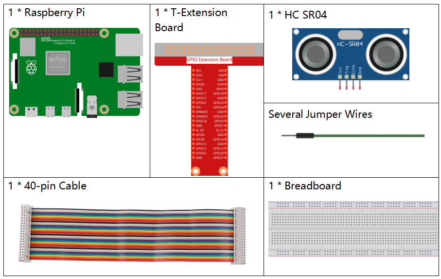
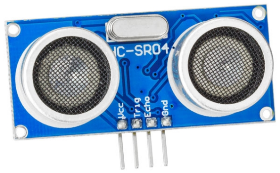
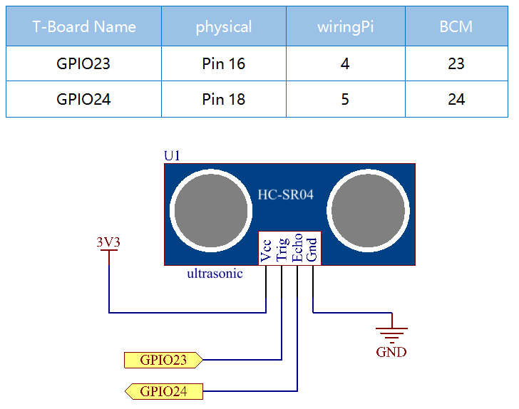

.. note::

    ¡Hola! Bienvenidos a la comunidad de entusiastas de SunFounder para Raspberry Pi, Arduino y ESP32 en Facebook. Sumérgete en el mundo de Raspberry Pi, Arduino y ESP32 junto con otros apasionados.

    **¿Por qué unirse?**

    - **Soporte de Expertos**: Soluciona problemas post-venta y desafíos técnicos con la ayuda de nuestra comunidad y equipo.
    - **Aprende y Comparte**: Intercambia consejos y tutoriales para mejorar tus habilidades.
    - **Avances Exclusivos**: Accede anticipadamente a anuncios de nuevos productos y adelantos.
    - **Descuentos Especiales**: Disfruta de descuentos exclusivos en nuestros productos más recientes.
    - **Promociones y Sorteos Festivos**: Participa en sorteos y promociones especiales en días festivos.

    👉 ¿Listo para explorar y crear con nosotros? Haz clic en [|link_sf_facebook|] y únete hoy.

2.2.5 Módulo Sensor Ultrasónico
====================================

Introducción
----------------

El sensor ultrasónico utiliza ondas ultrasónicas para detectar objetos 
con precisión y medir distancias. Emite ondas ultrasónicas y las convierte 
en señales electrónicas.

Componentes
---------------

Principio
--------------

**Ultrasonido**

El módulo de medición ultrasónica proporciona una función de medición sin 
contacto de 2 cm a 400 cm, con una precisión de hasta 3 mm. Puede garantizar 
una señal estable dentro de 5 m, y esta se va debilitando gradualmente después 
de esa distancia, hasta desaparecer en la posición de 7 m.

El módulo incluye transmisores y receptores ultrasónicos, así como un circuito 
de control. Los principios básicos son los siguientes:

(1) Usar un flip-flop IO para procesar una señal de nivel alto de al menos 10 µs.

(2) El módulo envía automáticamente ocho ciclos de 40 kHz y detecta si se recibe una señal de retorno.

(3) Si la señal regresa, pasando al nivel alto, la duración del nivel alto del IO 
representa el tiempo desde la emisión de la onda ultrasónica hasta su retorno. 
En este caso, la distancia de prueba = (tiempo de nivel alto x velocidad del 
sonido (340 m/s) / 2).

.. image:: img/image328.png
    :width: 500

El diagrama de tiempo se muestra a continuación. Solo necesitas suministrar 
un pulso corto de 10 µs para la entrada de disparo para iniciar la medición, 
y luego el módulo emitirá una ráfaga de 8 ciclos de ultrasonido a 40 kHz y 
generará su eco. Puedes calcular la distancia en función del intervalo de 
tiempo entre el envío de la señal de disparo y la recepción del eco.

Fórmula: µs / 58 = centímetros o µs / 148 = pulgadas; o: la distancia = tiempo 
de nivel alto \* velocidad (340 M/S) / 2; se recomienda usar un ciclo de medición 
superior a 60 ms para evitar colisiones de señales de disparo y eco.

.. image:: img/image218.png
    :width: 800

Diagrama de Circuito
-----------------------

Procedimientos Experimentales
-------------------------------

**Paso 1:** Construye el circuito.

.. image:: img/image220.png
    :width: 800

**Paso 2:** Accede a la carpeta del código.

.. raw:: html

   <run></run>

.. code-block::

    cd ~/davinci-kit-for-raspberry-pi/c/2.2.5/

**Paso 3:** Compila el código.

.. raw:: html

   <run></run>

.. code-block::

    gcc 2.2.5_Ultrasonic.c -lwiringPi

**Paso 4:** Ejecuta el archivo ejecutable.

.. raw:: html

   <run></run>

.. code-block::

    sudo ./a.out

Con el código en ejecución, el módulo sensor ultrasónico detectará la 
distancia entre el obstáculo frente a él y el propio módulo, mostrando 
luego el valor de la distancia en la pantalla.

.. note::

    Si no funciona tras ejecutar el código, o aparece el mensaje de error: \"wiringPi.h: No such file or directory", consulta :ref:`C code is not working?`.
**Código**

.. code-block:: c

    #include <wiringPi.h>
    #include <stdio.h>
    #include <sys/time.h>

    #define Trig    4
    #define Echo    5

    void ultraInit(void)
    {
        pinMode(Echo, INPUT);
        pinMode(Trig, OUTPUT);
    }

    float disMeasure(void)
    {
        struct timeval tv1;
        struct timeval tv2;
        long time1, time2;
        float dis;

        digitalWrite(Trig, LOW);
        delayMicroseconds(2);

        digitalWrite(Trig, HIGH);
        delayMicroseconds(10);      
        digitalWrite(Trig, LOW);
                                    
        while(!(digitalRead(Echo) == 1));   
        gettimeofday(&tv1, NULL);           

        while(!(digitalRead(Echo) == 0));   
        gettimeofday(&tv2, NULL);           

        time1 = tv1.tv_sec * 1000000 + tv1.tv_usec;   
        time2  = tv2.tv_sec * 1000000 + tv2.tv_usec;

        dis = (float)(time2 - time1) / 1000000 * 34000 / 2;  

        return dis;
    }

    int main(void)
    {
        float dis;
        if(wiringPiSetup() == -1){ //si la inicialización de wiring falla, muestra mensaje en pantalla
            printf("setup wiringPi failed !");
            return 1;
        }

        ultraInit();
        
        while(1){
            dis = disMeasure();
            printf("%0.2f cm\n\n",dis);
            delay(300);
        }

        return 0;
    }

**Explicación del Código**

.. code-block:: c

    void ultraInit(void)
    {
        pinMode(Echo, INPUT);
        pinMode(Trig, OUTPUT);
    }

Inicializa los pines del sensor ultrasónico; en este proceso, se configura Echo como entrada y Trig como salida.

.. code-block:: c

    float disMeasure(void){};

Esta función permite la medición con el sensor ultrasónico calculando la distancia de detección según el tiempo de retorno.

.. code-block:: c

    struct timeval tv1;
    struct timeval tv2;

La estructura timeval se utiliza para almacenar el tiempo actual. La estructura completa es la siguiente:

.. code-block:: c

    struct timeval
    {
    __time_t tv_sec;        /* Segundos. */
    __suseconds_t tv_usec;  /* Microsegundos. */
    };

Aquí, tv_sec representa los segundos desde Epoch en la creación de struct 
timeval. Tv_usec indica microsegundos o fracciones de segundo.

.. code-block:: c

    digitalWrite(Trig, HIGH);
    delayMicroseconds(10);     
    digitalWrite(Trig, LOW);

Se envía un pulso ultrasónico de 10 µs.

.. code-block:: c

    while(!(digitalRead(Echo) == 1));
    gettimeofday(&tv1, NULL);

Este bucle vacío asegura que, tras el envío de la señal de disparo, no haya 
interferencias por señales de eco, y luego registra el tiempo actual.

.. code-block:: c

    while(!(digitalRead(Echo) == 0)); 
    gettimeofday(&tv2, NULL);

Este bucle vacío asegura que el siguiente paso no se ejecute hasta recibir la 
señal de eco y luego registra el tiempo actual.

.. code-block:: c

    time1 = tv1.tv_sec * 1000000 + tv1.tv_usec;
    time2  = tv2.tv_sec * 1000000 + tv2.tv_usec;

Convierte el tiempo almacenado por struct timeval en microsegundos.

.. code-block:: c

    dis = (float)(time2 - time1) / 1000000 * 34000 / 2;  

La distancia se calcula con el intervalo de tiempo y la velocidad de 
propagación del sonido. Velocidad del sonido en el aire: 34000 cm/s.
