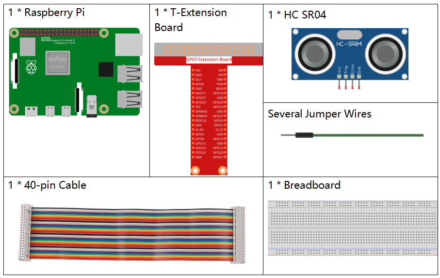
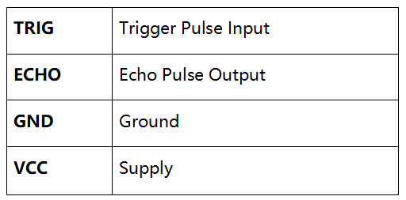
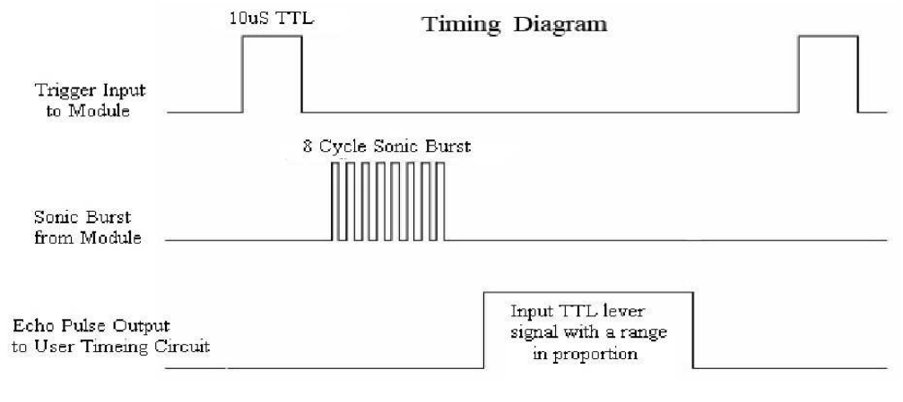
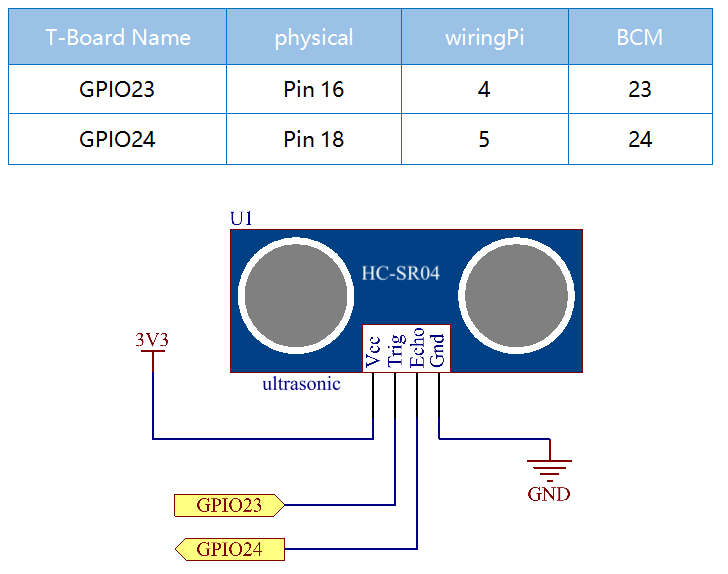
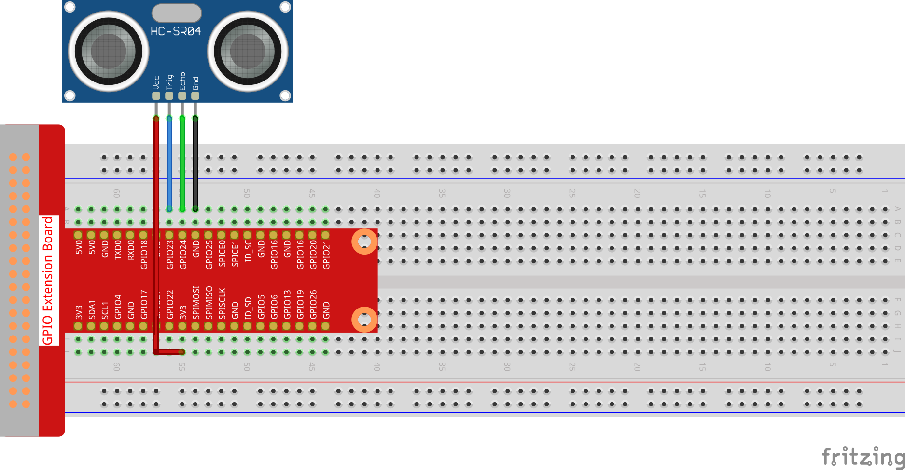

.. note::

    こんにちは、SunFounderのRaspberry Pi & Arduino & ESP32愛好家コミュニティへようこそ！Facebook上でRaspberry Pi、Arduino、ESP32についてもっと深く掘り下げ、他の愛好家と交流しましょう。

    **参加する理由は？**

    - **エキスパートサポート**：コミュニティやチームの助けを借りて、販売後の問題や技術的な課題を解決します。
    - **学び＆共有**：ヒントやチュートリアルを交換してスキルを向上させましょう。
    - **独占的なプレビュー**：新製品の発表や先行プレビューに早期アクセスしましょう。
    - **特別割引**：最新製品の独占割引をお楽しみください。
    - **祭りのプロモーションとギフト**：ギフトや祝日のプロモーションに参加しましょう。

    👉 私たちと一緒に探索し、創造する準備はできていますか？[|link_sf_facebook|]をクリックして今すぐ参加しましょう！

2.2.4 超音波センサーモジュール
==============================

前書き
--------------

超音波センサーは超音波を使用して物体を正確に検出し、距離を測定する。超音波を送り出し、電子信号に変換する。

部品
----------

原理
---------

**超音波**

超音波測距モジュールは2cm-400cmの非接触測定機能を提供し、測距精度は3mmに達することができる。信号が5m以内で安定し、5m後に信号が徐々に弱まり、7mの位置が消えることを確認できる。

モジュールには、超音波送信機、受信機、と制御回路が含まれている。基本的な原理は次のとおりである：

(1)IOフリップフロップを使用して、少なくとも10usの高レベル信号を処理する。

(2)モジュールは8つの40khzを自動的に送信し、パルス信号が戻すかどうかを検出する。

(3)信号が戻し、高レベルを通過する場合、高出力IO持続時間は、超音波の送信から信号の戻りまでの時間である。ここでは、テスト距離=（高時間x音速（340 m/s）/ 2。

.. image:: ../img/image217.png
    :width: 200

タイミング図を以下に示す。トリガー入力に10usの短いパルスを供給してレンジングを開始するだけで、モジュールは40 kHzで8サイクルの超音波バーストを送信し、エコーを上げる。トリガー信号を送信してからエコー信号を受信するまでの時間間隔で範囲を計算できる。

式：us/58 =センチメートルまたはus/148 =インチ;または：範囲=高レベル時間 * 速度（340M/S）/ 2;トリガー信号とエコー信号の信号衝突を防ぐために、60ms以上の測定サイクルを使用することをお勧めする。

回路図
-----------------

実験手順
-----------------------

ステップ1： 回路を作る。

ステップ2： コードのフォルダーに入る。

.. raw:: html

   <run></run>

.. code-block::

    cd /home/pi/davinci-kit-for-raspberry-pi/c/2.2.5/

ステップ3： コードをコンパイルする。

.. raw:: html

   <run></run>

.. code-block::

    gcc 2.2.5_Ultrasonic.c -lwiringPi

ステップ4： EXEファイルを実行する。

.. raw:: html

   <run></run>

.. code-block::

    sudo ./a.out

コードを実行すると、超音波センサーモジュールが前方の障害物とモジュール自体の間の距離を検出し、距離値が画面に出力される。

**コード**

.. code-block:: c

    #include <wiringPi.h>
    #include <stdio.h>
    #include <sys/time.h>

    #define Trig    4
    #define Echo    5

    void ultraInit(void)
    {
        pinMode(Echo, INPUT);
        pinMode(Trig, OUTPUT);
    }

    float disMeasure(void)
    {
        struct timeval tv1;
        struct timeval tv2;
        long time1, time2;
    float dis;

        digitalWrite(Trig, LOW);
        delayMicroseconds(2);

        digitalWrite(Trig, HIGH);
        delayMicroseconds(10);      
        digitalWrite(Trig, LOW);
                                    
        while(!(digitalRead(Echo) == 1));   
        gettimeofday(&tv1, NULL);           

        while(!(digitalRead(Echo) == 0));   
        gettimeofday(&tv2, NULL);           

        time1 = tv1.tv_sec * 1000000 + tv1.tv_usec;   
        time2  = tv2.tv_sec * 1000000 + tv2.tv_usec;

        dis = (float)(time2 - time1) / 1000000 * 34000 / 2;  

        return dis;
    }

    int main(void)
    {
        float dis;
        if(wiringPiSetup() == -1){ //when initialize wiring failed,print message to screen
            printf("setup wiringPi failed !");
            return 1;
        }

        ultraInit();
        
        while(1){
            dis = disMeasure();
            printf("%0.2f cm\n\n",dis);
            delay(300);
        }

        return 0;
    }

**コードの説明**

.. code-block:: c

    void ultraInit(void)
    {
        pinMode(Echo, INPUT);
        pinMode(Trig, OUTPUT);
    }

超音波ピンを初期化する。一方、Echoを入力、Trigを出力に設定する。

.. code-block:: c

    float disMeasure(void){};

戻り検出距離を計算することにより、この機能は超音波センサーの機能を実現するために使用される。

.. code-block:: c

    struct timeval tv1;
    struct timeval tv2;

構造体 ``timeval`` は、現在の時刻を保存するために使用される構造体である。完全な構造は次の通りである：

.. code-block:: c

    struct timeval
    {
    __time_t tv_sec;        /* Seconds. */
    __suseconds_t tv_usec;  /* Microseconds. */
    };

ここで、 ``tv_sec`` は、エポックが ``struct timeval`` を作成するときに費やした秒を表す。 ``Tv_usec`` はマイクロ秒または秒の一部を表す。

.. code-block:: c

    digitalWrite(Trig, HIGH);
    delayMicroseconds(10);     
    digitalWrite(Trig, LOW);

10usの超音波パルスが送信されている。

.. code-block:: c

    while(!(digitalRead(Echo) == 1));
    gettimeofday(&tv1, NULL);

このempty loopは、トリガー信号が送信されたときに、干渉エコー信号がないことを確認してから現在の時刻を取得するために使用される。

.. code-block:: c

    while(!(digitalRead(Echo) == 0)); 
    gettimeofday(&tv2, NULL);

このempty loopは、エコー信号が受信されて現在の時刻が取得されるまで次のステップが実行されないようにするために使用される。

.. code-block:: c

    time1 = tv1.tv_sec * 1000000 + tv1.tv_usec;
    time2  = tv2.tv_sec * 1000000 + tv2.tv_usec;

struct timevalによって保存された時間を完全なマイクロ秒時間に変換する。

.. code-block:: c

    dis = (float)(time2 - time1) / 1000000 * 34000 / 2;  

距離は時間間隔と音の伝播速度によって計算される。空気中の音速：34000cm/s。
