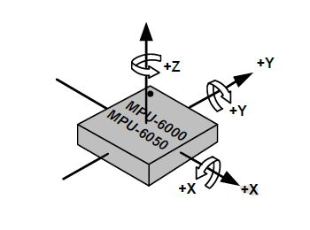

.. note::

    Hello, welcome to the SunFounder Raspberry Pi & Arduino & ESP32 Enthusiasts Community on Facebook! Dive deeper into Raspberry Pi, Arduino, and ESP32 with fellow enthusiasts.

    **Why Join?**

    - **Expert Support**: Solve post-sale issues and technical challenges with help from our community and team.
    - **Learn & Share**: Exchange tips and tutorials to enhance your skills.
    - **Exclusive Previews**: Get early access to new product announcements and sneak peeks.
    - **Special Discounts**: Enjoy exclusive discounts on our newest products.
    - **Festive Promotions and Giveaways**: Take part in giveaways and holiday promotions.

    👉 Ready to explore and create with us? Click [|link_sf_facebook|] and join today!

2.2.5 MPU6050 Module
====================

Introduction
------------

The MPU-6050 is the world’s first and only 6-axis motion tracking
devices (3-axis Gyroscope and 3-axis Accelerometer) designed for
smartphones, tablets and wearable sensors that have these features,
including the low power, low cost, and high performance requirements.

In this experiment, use I2C to obtain the values of the three-axis
acceleration sensor and three-axis gyroscope for MPU6050 and display
them on the screen.

Components
----------

.. image:: img/list_2.2.6.png

Principle
---------

**MPU6050**

The MPU-6050 is a 6-axis(combines 3-axis Gyroscope, 3-axis
Accelerometer) motion tracking devices.

Its three coordinate systems are defined as follows:

Put MPU6050 flat on the table, assure that the face with label is upward
and a dot on this surface is on the top left corner. Then the upright
direction upward is the z-axis of the chip. The direction from left to
right is regarded as the X-axis. Accordingly the direction from back to
front is defined as the Y-axis.

**3-axis Accelerometer**

The accelerometer works on the principle of piezo electric effect, the
ability of certain materials to generate an electric charge in response
to applied mechanical stress.

Here, imagine a cuboidal box, having a small ball inside it, like in the
picture above. The walls of this box are made with piezo electric
crystals. Whenever you tilt the box, the ball is forced to move in the
direction of the inclination, due to gravity. The wall with which the
ball collides, creates tiny piezo electric currents. There are totally,
three pairs of opposite walls in a cuboid. Each pair corresponds to an
axis in 3D space: X, Y and Z axes. Depending on the current produced
from the piezo electric walls, we can determine the direction of
inclination and its magnitude.

.. image:: img/image224.png

We can use the MPU6050 to detect its acceleration on each coordinate
axis (in the stationary desktop state, the Z-axis acceleration is 1
gravity unit, and the X and Y axes are 0). If it is tilted or in a
weightless/overweight condition, the corresponding reading will change.

There are four kinds of measuring ranges that can be selected
programmatically: +/-2g, +/-4g, +/-8g, and +/-16g (2g by default)
corresponding to each precision. Values range from -32768 to 32767.

The reading of accelerometer is converted to an acceleration value by
mapping the reading from the reading range to the measuring range.

Acceleration = (Accelerometer axis raw data / 65536 \* full scale
Acceleration range) g

Take the X-axis as an example, when Accelerometer X axis raw data is
16384 and the range is selected as +/-2g:

**Acceleration along the X axis = (16384 / 65536 \* 4) g**  **=1g**

**3-axis Gyroscope**

Gyroscopes work on the principle of Coriolis acceleration. Imagine that
there is a fork like structure, that is in constant back and forth
motion. It is held in place using piezo electric crystals. Whenever, you
try to tilt this arrangement, the crystals experience a force in the
direction of inclination. This is caused as a result of the inertia of
the moving fork. The crystals thus produce a current in consensus with
the piezo electric effect, and this current is amplified.

.. image:: img/image225.png
    :width: 800
    :align: center

The Gyroscope also has four kinds of measuring ranges: +/- 250, +/- 500,
+/- 1000, +/- 2000. The calculation method and Acceleration are
basically consistent.

The formula for converting the reading into angular velocity is as
follows:

Angular velocity = (Gyroscope axis raw data / 65536 \* full scale
Gyroscope range) °/s

The X axis, for example, the Accelerometer X axis raw data is 16384 and
ranges + / - 250°/ s:

**Angular velocity along the X axis = (16384 / 65536 \* 500)°/s** **=125°/s**

Schematic Diagram
-----------------

MPU6050 communicates with the microcontroller through the I2C bus
interface. The SDA1 and SCL1 need to be connected to the corresponding
pin.

.. image:: img/image330.png
    :width: 600
    :align: center

Experimental Procedures
---------------------------

**Step 1:** Build the circuit.

.. image:: img/image227.png
    :width: 800

**Step 2**: Setup I2C (see :ref:`i2c_config`. If you have set I2C, skip this
step.)

**Step 3:** Go to the folder of the code.

.. raw:: html

   <run></run>

.. code-block::

    cd ~/davinci-kit-for-raspberry-pi/c/2.2.6/

**Step 4:** Compile the code.

.. raw:: html

   <run></run>

.. code-block::

    gcc 2.2.6_mpu6050.c -lwiringPi -lm

**Step 5:** Run the executable file.

.. raw:: html

   <run></run>

.. code-block::

    sudo ./a.out

With the code run, deflection angle of x axis, y axis and the
acceleration, angular velocity on each axis read by MPU6050 will be
printed on the screen after being calculating.

.. note::

    If it does not work after running, or there is an error prompt: \"wiringPi.h: No such file or directory\", please refer to :ref:`C code is not working?`.

**Code**

.. code-block:: c

    #include  <wiringPiI2C.h>
    #include <wiringPi.h>
    #include  <stdio.h>
    #include  <math.h>
    int fd;
    int acclX, acclY, acclZ;
    int gyroX, gyroY, gyroZ;
    double acclX_scaled, acclY_scaled, acclZ_scaled;
    double gyroX_scaled, gyroY_scaled, gyroZ_scaled;

    int read_word_2c(int addr)
    {
    int val;
    val = wiringPiI2CReadReg8(fd, addr);
    val = val << 8;
    val += wiringPiI2CReadReg8(fd, addr+1);
    if (val >= 0x8000)
        val = -(65536 - val);
    return val;
    }

    double dist(double a, double b)
    {
    return sqrt((a*a) + (b*b));
    }

    double get_y_rotation(double x, double y, double z)
    {
    double radians;
    radians = atan2(x, dist(y, z));
    return -(radians * (180.0 / M_PI));
    }

    double get_x_rotation(double x, double y, double z)
    {
    double radians;
    radians = atan2(y, dist(x, z));
    return (radians * (180.0 / M_PI));
    }

    int main()
    {
    fd = wiringPiI2CSetup (0x68);
    wiringPiI2CWriteReg8 (fd,0x6B,0x00);//disable sleep mode 
    printf("set 0x6B=%X\n",wiringPiI2CReadReg8 (fd,0x6B));
    
    while(1) {

        gyroX = read_word_2c(0x43);
        gyroY = read_word_2c(0x45);
        gyroZ = read_word_2c(0x47);

        gyroX_scaled = gyroX / 131.0;
        gyroY_scaled = gyroY / 131.0;
        gyroZ_scaled = gyroZ / 131.0;

        //Print values for the X, Y, and Z axes of the gyroscope sensor.
        printf("My gyroX_scaled: %f\n", gyroY X_scaled);
        delay(100);
        printf("My gyroY_scaled: %f\n", gyroY Y_scaled);
        delay(100);
        printf("My gyroZ_scaled: %f\n", gyroY Z_scaled);
        delay(100);

        acclX = read_word_2c(0x3B);
        acclY = read_word_2c(0x3D);
        acclZ = read_word_2c(0x3F);

        acclX_scaled = acclX / 16384.0;
        acclY_scaled = acclY / 16384.0;
        acclZ_scaled = acclZ / 16384.0;
        
        //Print the X, Y, and Z values of the acceleration sensor.
        printf("My acclX_scaled: %f\n", acclX_scaled);
        delay(100);
        printf("My acclY_scaled: %f\n", acclY_scaled);
        delay(100);
        printf("My acclZ_scaled: %f\n", acclZ_scaled);
        delay(100);

        printf("My X rotation: %f\n", get_x_rotation(acclX_scaled, acclY_scaled, acclZ_scaled));
        delay(100);
        printf("My Y rotation: %f\n", get_y_rotation(acclX_scaled, acclY_scaled, acclZ_scaled));
        delay(100);
        
        delay(100);
    }
    return 0;
    }

**Code Explanation**

.. code-block:: c

    int read_word_2c(int addr)
    {
    int val;
    val = wiringPiI2CReadReg8(fd, addr);
    val = val << 8;
    val += wiringPiI2CReadReg8(fd, addr+1);
    if (val >= 0x8000)
        val = -(65536 - val);
    return val;
    }

Read sensor data sent from MPU6050.

.. code-block:: c

    double get_y_rotation(double x, double y, double z)
    {
    double radians;
    radians = atan2(x, dist(y, z));
    return -(radians * (180.0 / M_PI));
    }

We get the deflection angle on the Y-axis.

.. code-block:: c

    double get_x_rotation(double x, double y, double z)
    {
    double radians;
    radians = atan2(y, dist(x, z));
    return (radians * (180.0 / M_PI));
    }

Calculate the deflection angle of the X-axis.

.. code-block:: c

    gyroX = read_word_2c(0x43);
    gyroY = read_word_2c(0x45);
    gyroZ = read_word_2c(0x47);

    gyroX_scaled = gyroX / 131.0;
    gyroY_scaled = gyroY / 131.0;
    gyroZ_scaled = gyroZ / 131.0;

    //Print values for the X, Y, and Z axes of the gyroscope sensor.
    printf("My gyroX_scaled: %f\n", gyroY X_scaled);
    printf("My gyroY_scaled: %f\n", gyroY Y_scaled);
    printf("My gyroZ_scaled: %f\n", gyroY Z_scaled);

Read the values of the x axis, y axis and z axis on the gyroscope sensor, 
convert the metadata to angular velocity values, and then print them.

.. code-block:: c

    acclX = read_word_2c(0x3B);
    acclY = read_word_2c(0x3D);
    acclZ = read_word_2c(0x3F);

    acclX_scaled = acclX / 16384.0;
    acclY_scaled = acclY / 16384.0;
    acclZ_scaled = acclZ / 16384.0;
        
    //Print the X, Y, and Z values of the acceleration sensor.
    printf("My acclX_scaled: %f\n", acclX_scaled);
    printf("My acclY_scaled: %f\n", acclY_scaled);
    printf("My acclZ_scaled: %f\n", acclZ_scaled);

Read the values of the x axis, y axis and z axis on the acceleration sensor,
convert the metadata to accelerated speed values (gravity unit), and then 
print them.

.. code-block:: c

    printf("My X rotation: %f\n", get_x_rotation(acclX_scaled, acclY_scaled, acclZ_scaled));
    printf("My Y rotation: %f\n", get_y_rotation(acclX_scaled, acclY_scaled, acclZ_scaled));

Print the deflection angles of the x-axis and y-axis.
