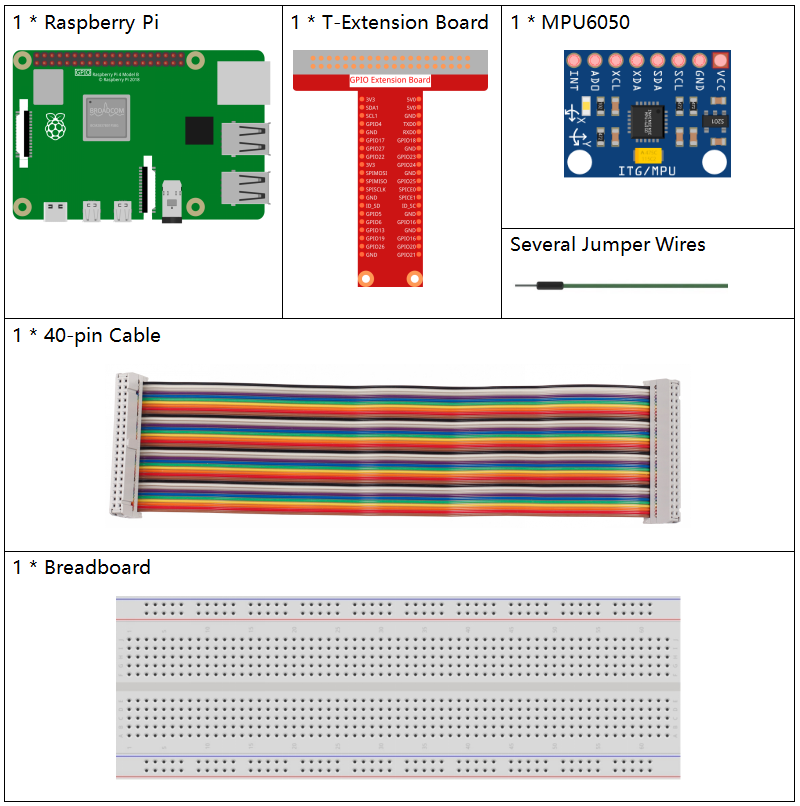

.. note::

    Hallo und willkommen in der SunFounder Raspberry Pi & Arduino & ESP32 Enthusiasten-Gemeinschaft auf Facebook! Tauchen Sie tiefer ein in die Welt von Raspberry Pi, Arduino und ESP32 mit anderen Enthusiasten.

    **Warum beitreten?**

    - **Expertenunterstützung**: Lösen Sie Nachverkaufsprobleme und technische Herausforderungen mit Hilfe unserer Gemeinschaft und unseres Teams.
    - **Lernen & Teilen**: Tauschen Sie Tipps und Anleitungen aus, um Ihre Fähigkeiten zu verbessern.
    - **Exklusive Vorschauen**: Erhalten Sie frühzeitigen Zugang zu neuen Produktankündigungen und exklusiven Einblicken.
    - **Spezialrabatte**: Genießen Sie exklusive Rabatte auf unsere neuesten Produkte.
    - **Festliche Aktionen und Gewinnspiele**: Nehmen Sie an Gewinnspielen und Feiertagsaktionen teil.

    👉 Sind Sie bereit, mit uns zu erkunden und zu erschaffen? Klicken Sie auf [|link_sf_facebook|] und treten Sie heute bei!

2.2.6 MPU6050-Modul
=========================

Einführung
----------------

Die MPU-6050 ist das weltweit erste und einzige 6-Achsen-Bewegungsverfolgungsgerät (3-Achsen-Gyroskop und 3-Achsen-Beschleunigungsmesser), das für Smartphones, Tablets und tragbare Sensoren entwickelt wurde, die diese Funktionen aufweisen, einschließlich geringer Leistung, geringer Kosten und hoher Leistung Leistungsanforderungen.

Verwenden Sie in diesem Experiment I2C, um die Werte des dreiachsigen Beschleunigungssensors und des dreiachsigen Gyroskops für MPU6050 zu erhalten und auf dem Bildschirm anzuzeigen.

Komponenten
------------------

Prinzip
---------

**MPU6050**

Die MPU-6050 ist ein 6-Achsen-Bewegungsverfolgungsgerät (kombiniert 3-Achsen-Gyroskop, 3-Achsen-Beschleunigungsmesser).

Seine drei Koordinatensysteme sind wie folgt definiert:

Legen Sie die MPU6050 flach auf den Tisch und stellen Sie sicher, dass das Gesicht mit dem Etikett nach oben zeigt und sich ein Punkt auf dieser Oberfläche in der oberen linken Ecke befindet. Dann ist die aufrechte Richtung nach oben die z-Achse des Chips. Die Richtung von links nach rechts wird als X-Achse angesehen. Dementsprechend ist die Richtung von hinten nach vorne als Y-Achse definiert.

.. image:: ../img/image223.png

**3-Achsbeschleunigungsmesser**

Der Beschleunigungsmesser arbeitet nach dem Prinzip des piezoelektrischen Effekts, der Fähigkeit bestimmter Materialien, als Reaktion auf angelegte mechanische Beanspruchung eine elektrische Ladung zu erzeugen.

Stellen Sie sich hier eine quaderförmige Kisten vor, in der sich eine kleine Kugel befindet, wie im obigen Bild. Die Wände dieser Kisten bestehen aus piezoelektrischen Kristallen. Immer wenn Sie die Kisten kippen, muss sich der Ball aufgrund der Schwerkraft in Richtung der Neigung bewegen. Die Wand, mit der die Kugel kollidiert, erzeugt winzige piezoelektrische Ströme. Es gibt insgesamt drei Paare gegenüberliegender Wände in einem Quader. Jedes Paar entspricht einer Achse im 3D-Raum: X-, Y- und Z-Achse. Abhängig vom Strom, der von den piezoelektrischen Wänden erzeugt wird, können wir die Neigungsrichtung und ihre Größe bestimmen.

.. image:: ../img/image224.png

Wir können die MPU6050 verwenden, um ihre Beschleunigung auf jeder Koordinatenachse zu erfassen (im stationären Desktop-Zustand beträgt die Beschleunigung der Z-Achse 1 Schwerkrafteinheit und die X- und Y-Achse 0). Wenn es gekippt ist oder sich in einem schwerelosen / übergewichtigen Zustand befindet, ändert sich der entsprechende Wert.

Es gibt vier Arten von Messbereichen, die programmgesteuert ausgewählt werden können: +/-2g, +/-4g, +/-8g und +/-16g (standardmäßig 2 g), die jeder Genauigkeit entsprechen. Die Werte reichen von -32768 bis 32767.

Der Messwert des Beschleunigungsmessers wird in einen Beschleunigungswert umgewandelt, indem der Messwert vom Messbereich auf den Messbereich abgebildet wird.

Beschleunigung = (Rohdaten der Beschleunigungsmesserachse / 65536 * voller Beschleunigungsbereich) g

Nehmen Sie als Beispiel die X-Achse, wenn die Rohdaten der X-Achse des Beschleunigungsmessers 16384 sind und der Bereich als +/- 2 g ausgewählt ist:

**Beschleunigung entlang der X-Achse = (16384/65536 * 4) g = 1g**

**3-Achsen-Gyroskop**

Gyroskope arbeiten nach dem Prinzip der Coriolis-Beschleunigung.. Stellen Sie sich vor, es gibt eine gabelartige Struktur, die sich ständig hin und her bewegt. Es wird mit piezoelektrischen Kristallen an Ort und Stelle gehalten. Immer wenn Sie versuchen, diese Anordnung zu kippen, erfahren die Kristalle eine Kraft in Neigungsrichtung. Dies wird durch die Trägheit der beweglichen Gabel verursacht. Die Kristalle erzeugen somit einen Strom, der mit dem piezoelektrischen Effekt übereinstimmt, und dieser Strom wird verstärkt.

.. image:: ../img/image225.png
    :width: 800
    :align: center

Das Gyroskop verfügt außerdem über vier Arten von Messbereichen: +/- 250, +/- 500, +/- 1000, +/- 2000. Die Berechnungsmethode und die Beschleunigung sind grundsätzlich konsistent.

Die Formel zum Umwandeln des Messwerts in die Winkelgeschwindigkeit lautet wie folgt:

Winkelgeschwindigkeit = (Rohdaten der Gyroskopachse / 65536 * Gyroskopbereich im vollen Maßstab) °/s

Die X-Achse, zum Beispiel die Rohdaten der X-Achse des Beschleunigungsmessers, ist 16384 und reicht von +/- 250 °/s:

**Winkelgeschwindigkeit entlang der X-Achse = (16384/65536 * 500) °/s = 125 °/s**

Schematische Darstellung
-------------------------------

Die MPU6050 kommuniziert mit dem Mikrocontroller über die I2C-Busschnittstelle. 
Der SDA1 und der SCL1 müssen mit dem entsprechenden Pin verbunden werden.

.. image:: ../img/image330.png
    :width: 600
    :align: center

Experimentelle Verfahren
---------------------------

Schritt 1: Bauen Sie die Schaltung auf.

.. image:: ../img/image227.png
    :width: 800

Schritt 2: I2C einrichten (siehe Anhang. Wenn Sie :ref:`i2c_config`  haben, überspringen Sie diesen Schritt.)

Schritt 3: Gehen Sie zum Ordner der Kode.

.. raw:: html

   <run></run>

.. code-block::

    cd /home/pi/davinci-kit-for-raspberry-pi/c/2.2.6/

Schritt 4: Kompilieren Sie der Kode.

.. raw:: html

   <run></run>

.. code-block::

    gcc 2.2.6_mpu6050.c -lwiringPi -lm

Schritt 5: Führen Sie die ausführbare Datei aus.

.. raw:: html

   <run></run>

.. code-block::

    sudo ./a.out

Wenn die Kode ausgeführt wird, werden der Ablenkwinkel der x-Achse, der y-Achse und die Beschleunigung sowie die Winkelgeschwindigkeit auf jeder von der MPU6050 gelesenen Achse nach der Berechnung auf dem Bildschirm gedruckt.

**Code**

.. code-block:: c

    #include  <wiringPiI2C.h>
    #include <wiringPi.h>
    #include  <stdio.h>
    #include  <math.h>
    int fd;
    int acclX, acclY, acclZ;
    int gyroX, gyroY, gyroZ;
    double acclX_scaled, acclY_scaled, acclZ_scaled;
    double gyroX_scaled, gyroY_scaled, gyroZ_scaled;

    int read_word_2c(int addr)
    {
        int val;
        val = wiringPiI2CReadReg8(fd, addr);
        val = val << 8;
        val += wiringPiI2CReadReg8(fd, addr+1);
        if (val >= 0x8000)
            val = -(65536 - val);
        return val;
    }

    double dist(double a, double b)
    {
        return sqrt((a*a) + (b*b));
    }

    double get_y_rotation(double x, double y, double z)
    {
        double radians;
        radians = atan2(x, dist(y, z));
        return -(radians * (180.0 / M_PI));
    }

    double get_x_rotation(double x, double y, double z)
    {
        double radians;
        radians = atan2(y, dist(x, z));
        return (radians * (180.0 / M_PI));
    }

    int main()
    {
        fd = wiringPiI2CSetup (0x68);
        wiringPiI2CWriteReg8 (fd,0x6B,0x00);//disable sleep mode 
        printf("set 0x6B=%X\n",wiringPiI2CReadReg8 (fd,0x6B));
        
        while(1) {

            gyroX = read_word_2c(0x43);
            gyroY = read_word_2c(0x45);
            gyroZ = read_word_2c(0x47);

            gyroX_scaled = gyroX / 131.0;
            gyroY_scaled = gyroY / 131.0;
            gyroZ_scaled = gyroZ / 131.0;

            //Print values for the X, Y, and Z axes of the gyroscope sensor.
            printf("My gyroX_scaled: %f\n", gyroY X_scaled);
            delay(100);
            printf("My gyroY_scaled: %f\n", gyroY Y_scaled);
            delay(100);
            printf("My gyroZ_scaled: %f\n", gyroY Z_scaled);
            delay(100);

            acclX = read_word_2c(0x3B);
            acclY = read_word_2c(0x3D);
            acclZ = read_word_2c(0x3F);

            acclX_scaled = acclX / 16384.0;
            acclY_scaled = acclY / 16384.0;
            acclZ_scaled = acclZ / 16384.0;
            
            //Print the X, Y, and Z values of the acceleration sensor.
            printf("My acclX_scaled: %f\n", acclX_scaled);
            delay(100);
            printf("My acclY_scaled: %f\n", acclY_scaled);
            delay(100);
            printf("My acclZ_scaled: %f\n", acclZ_scaled);
            delay(100);

            printf("My X rotation: %f\n", get_x_rotation(acclX_scaled, acclY_scaled, acclZ_scaled));
            delay(100);
            printf("My Y rotation: %f\n", get_y_rotation(acclX_scaled, acclY_scaled, acclZ_scaled));
            delay(100);
            
            delay(100);
        }
        return 0;
    }

**Code Erklärung**

.. code-block:: c

    int read_word_2c(int addr)
    {
    int val;
    val = wiringPiI2CReadReg8(fd, addr);
    val = val << 8;
    val += wiringPiI2CReadReg8(fd, addr+1);
    if (val >= 0x8000)
        val = -(65536 - val);
    return val;
    }

Lesen Sie die von der MPU6050 gesendeten Sensordaten.

.. code-block:: c

    double get_y_rotation(double x, double y, double z)
    {
    double radians;
    radians = atan2(x, dist(y, z));
    return -(radians * (180.0 / M_PI));
    }

Wir erhalten den Ablenkwinkel auf der Y-Achse.

.. code-block:: c

    double get_x_rotation(double x, double y, double z)
    {
    double radians;
    radians = atan2(y, dist(x, z));
    return (radians * (180.0 / M_PI));
    }

Berechnen Sie den Ablenkwinkel der x-Achse.

.. code-block:: c

    gyroX = read_word_2c(0x43);
    gyroY = read_word_2c(0x45);
    gyroZ = read_word_2c(0x47);

    gyroX_scaled = gyroX / 131.0;
    gyroY_scaled = gyroY / 131.0;
    gyroZ_scaled = gyroZ / 131.0;

    //Print values for the X, Y, and Z axes of the gyroscope sensor.
    printf("My gyroX_scaled: %f\n", gyroY X_scaled);
    printf("My gyroY_scaled: %f\n", gyroY Y_scaled);
    printf("My gyroZ_scaled: %f\n", gyroY Z_scaled);

Lesen Sie die Werte der x-Achse, der y-Achse und der z-Achse auf dem Gyroskopsensor, konvertieren Sie die Metadaten in Winkelgeschwindigkeitswerte und drucken Sie sie dann aus.

.. code-block:: c

    acclX = read_word_2c(0x3B);
    acclY = read_word_2c(0x3D);
    acclZ = read_word_2c(0x3F);

    acclX_scaled = acclX / 16384.0;
    acclY_scaled = acclY / 16384.0;
    acclZ_scaled = acclZ / 16384.0;
        
    //Print the X, Y, and Z values of the acceleration sensor.
    printf("My acclX_scaled: %f\n", acclX_scaled);
    printf("My acclY_scaled: %f\n", acclY_scaled);
    printf("My acclZ_scaled: %f\n", acclZ_scaled);

Lesen Sie die Werte der x-, y- und z-Achse auf dem Beschleunigungssensor ab, konvertieren Sie die Metadaten in beschleunigte Geschwindigkeitswerte (Schwerkrafteinheit) und drucken Sie sie dann aus.

.. code-block:: c

    printf("My X rotation: %f\n", get_x_rotation(acclX_scaled, acclY_scaled, acclZ_scaled));
    printf("My Y rotation: %f\n", get_y_rotation(acclX_scaled, acclY_scaled, acclZ_scaled));

Drucken Sie die Ablenkwinkel der x- und y-Achse.

