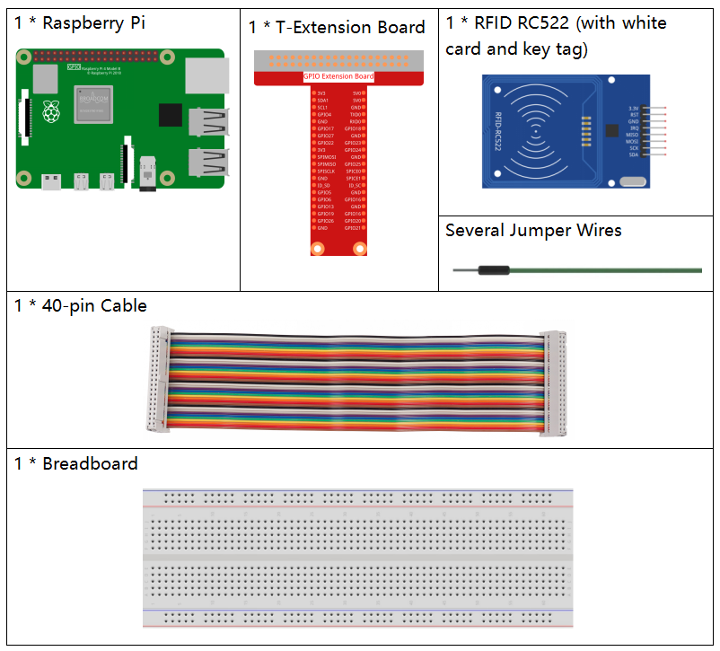
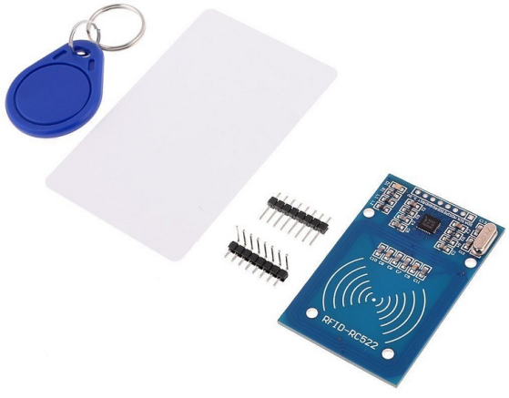

.. note::

    Bonjour et bienvenue dans la communauté des passionnés de SunFounder Raspberry Pi, Arduino et ESP32 sur Facebook ! Plongez dans l'univers de Raspberry Pi, Arduino et ESP32 avec d'autres passionnés.

    **Pourquoi nous rejoindre ?**

    - **Support d'experts** : Résolvez les problèmes après-vente et relevez vos défis techniques grâce à l'aide de notre communauté et de notre équipe.
    - **Apprenez et Partagez** : Échangez des astuces et des tutoriels pour perfectionner vos compétences.
    - **Aperçus exclusifs** : Bénéficiez d'un accès anticipé aux nouvelles annonces de produits et aux avant-premières.
    - **Réductions spéciales** : Profitez de réductions exclusives sur nos nouveaux produits.
    - **Promotions festives et concours** : Participez à des concours et des promotions lors des fêtes.

    👉 Prêt à explorer et à créer avec nous ? Cliquez sur [|link_sf_facebook|] et rejoignez-nous dès aujourd'hui !

2.2.7 Module RFID MFRC522
===========================

Introduction
---------------

L'identification par radiofréquence (RFID) désigne les technologies utilisant 
la communication sans fil entre un objet (ou étiquette) et un dispositif 
d'interrogation (ou lecteur) pour suivre et identifier automatiquement ces objets.

Parmi les applications courantes de cette technologie, on retrouve les chaînes 
d'approvisionnement dans la grande distribution, les chaînes d'approvisionnement 
militaires, les méthodes de paiement automatisées, le suivi des bagages, la gestion 
de documents et la gestion pharmaceutique, pour n'en nommer que quelques-unes.

Dans ce projet, nous utiliserons le RFID pour la lecture et l'écriture de données.

Composants
-------------

Principe
----------

**RFID**

L'identification par radiofréquence (RFID) utilise la communication sans fil entre un 
objet (ou tag) et un dispositif d'interrogation (ou lecteur) pour suivre et identifier 
automatiquement ces objets. La portée de transmission du tag est limitée à quelques mètres 
du lecteur. Une ligne de vue directe entre le lecteur et le tag n'est pas nécessaire.

La plupart des tags contiennent au moins un circuit intégré (CI) et une antenne. La puce 
stocke les informations et gère la communication radiofréquence (RF) avec le lecteur. 
Les tags passifs ne possèdent pas de source d'énergie indépendante et dépendent d'un 
signal électromagnétique externe, fourni par le lecteur, pour alimenter leur fonctionnement. 
Les tags actifs contiennent une source d'énergie autonome, comme une batterie. 
Par conséquent, ils peuvent disposer de capacités accrues de traitement, de transmission 
et d'une plus grande portée.

**MFRC522**

Le MFRC522 est une puce intégrée de lecture et d'écriture de cartes, couramment utilisée 
dans la communication radiofréquence à 13,56 MHz. Développé par la société NXP, il s'agit 
d'une puce de carte sans contact, à faible coût et basse tension, idéale pour les instruments 
intelligents et les dispositifs portables.

Le MFRC522 utilise un concept avancé de modulation et de démodulation, entièrement 
compatible avec tous les types de méthodes de communication et protocoles sans contact 
passifs à 13,56 MHz. Il prend en charge l'algorithme de chiffrement rapide CRYPTO1 pour 
vérifier les produits MIFARE. Le MFRC522 prend également en charge les communications 
sans contact haute vitesse de la série MIFARE, avec une vitesse de transmission 
bidirectionnelle pouvant atteindre 424 kbit/s. En tant que nouveau membre de la série de 
lecteurs de cartes hautement intégrés à 13,56 MHz, le MFRC522 est similaire aux MF RC500 
et MF RC530, tout en présentant des différences significatives. Il communique avec l'hôte 
via une interface série, ce qui réduit le câblage. Vous pouvez choisir entre les modes SPI, 
I2C et UART (similaire à RS232), ce qui facilite la connexion, économise de l'espace sur la 
carte PCB (plus petite taille) et réduit les coûts.

Schéma de câblage
---------------------

.. image:: img/image331.png

Procédures expérimentales
----------------------------

**Étape 1 :** Construisez le circuit.

.. image:: img/image232.png
    :width: 800

**Étape 2 :** Configurez le SPI (voir :ref:`spi_configuration` pour plus de détails. Si le SPI 
est déjà configuré, passez cette étape.)

**Étape 3 :** Accédez au dossier du code.

.. raw:: html

   <run></run>

.. code-block:: 

    cd ~/davinci-kit-for-raspberry-pi/c/2.2.7/

**Étape 4 :** Compilez le code.

.. raw:: html

   <run></run>

.. code-block:: 

    make read
    make write

.. note::
    Deux exemples sont disponibles pour lire ou écrire l'ID de la carte. Vous pouvez 
    choisir celui qui correspond à votre besoin.

**Étape 5 :** Après avoir exécuté ``./write``, entrez les informations, telles que le nom de la personne, puis placez le tag ou la carte sur le module MRC522 et attendez que l'écriture soit terminée.

.. raw:: html

   <run></run>

.. code-block::

    sudo ./write

**Étape 6 :** Maintenant, exécutez ``./read`` pour lire les informations du tag ou de la carte que vous avez écrites.

.. raw:: html

   <run></run>

.. code-block:: 

    sudo ./read

.. note::

    Si cela ne fonctionne pas après l'exécution ou s'il y a un message d'erreur indiquant : « wiringPi.h : Aucun fichier ou répertoire de ce type », veuillez vous référer à :ref:`C code is not working?`.

**Explication du Code**

.. code-block:: c

    InitRc522();

Cette fonction initialise le module RFID RC522.

.. code-block:: c

    uint8_t read_card_data();

Cette fonction lit les données de la carte et renvoie "1" si la lecture est réussie.

.. code-block:: c

    uint8_t write_card_data(uint8_t *data);

Cette fonction écrit les données sur la carte et renvoie "1" si l'écriture est réussie.
 \*data correspond aux informations qui seront inscrites sur la carte.
