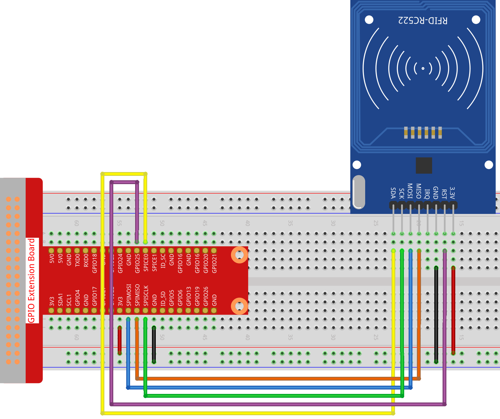

.. note::

    Hallo und willkommen in der SunFounder Raspberry Pi & Arduino & ESP32 Enthusiasten-Gemeinschaft auf Facebook! Tauchen Sie tiefer ein in die Welt von Raspberry Pi, Arduino und ESP32 mit anderen Enthusiasten.

    **Warum beitreten?**

    - **Expertenunterstützung**: Lösen Sie Nachverkaufsprobleme und technische Herausforderungen mit Hilfe unserer Gemeinschaft und unseres Teams.
    - **Lernen & Teilen**: Tauschen Sie Tipps und Anleitungen aus, um Ihre Fähigkeiten zu verbessern.
    - **Exklusive Vorschauen**: Erhalten Sie frühzeitigen Zugang zu neuen Produktankündigungen und exklusiven Einblicken.
    - **Spezialrabatte**: Genießen Sie exklusive Rabatte auf unsere neuesten Produkte.
    - **Festliche Aktionen und Gewinnspiele**: Nehmen Sie an Gewinnspielen und Feiertagsaktionen teil.

    👉 Sind Sie bereit, mit uns zu erkunden und zu erschaffen? Klicken Sie auf [|link_sf_facebook|] und treten Sie heute bei!

2.2.7 MFRC522 RFID-Modul
==========================

Einführung
---------------

Radio Frequency Identification (RFID) bezieht sich auf Technologien, die die drahtlose Kommunikation zwischen einem Objekt (oder Tag) und einem Abfragegerät (oder Lesegerät) verwenden, um solche Objekte automatisch zu verfolgen und zu identifizieren.

Einige der häufigsten Anwendungen für diese Technologie sind Lieferketten für den Einzelhandel, militärische Lieferketten, automatisierte Zahlungsmethoden, Gepäckverfolgung und -verwaltung, Dokumentenverfolgung und pharmazeutische Verwaltung, um nur einige zu nennen.

In diesem Projekt werden wir RFID zum Lesen und Schreiben verwenden.

Komponenten
-----------------

.. image:: ../img/list_2.2.7.png

Prinzip
---------

**RFID**

Radio Frequency Identification (RFID) bezieht sich auf Technologien, bei denen eine drahtlose Kommunikation zwischen einem Objekt (oder Tag) und einem Abfragegerät (oder Lesegerät) verwendet wird, um solche Objekte automatisch zu verfolgen und zu identifizieren. Die Tag-Übertragungsreichweite ist auf mehrere Meter vom Lesegerät begrenzt. Eine klare Sichtlinie zwischen Lesegerät und Etikett ist nicht unbedingt erforderlich.

Die meisten Etikette enthalten mindestens eine integrierte Schaltung (IC) und eine Antenne. Der Mikrochip speichert Informationen und ist für die Verwaltung der Hochfrequenzkommunikation mit dem Lesegerät verantwortlich. Passive Etiketts haben keine unabhängige Energiequelle und sind auf ein externes elektromagnetisches Signal angewiesen, das vom Lesegerät bereitgestellt wird, um ihren Betrieb zu betreiben. Aktive Etiketts enthalten eine unabhängige Energiequelle, z. B. eine Batterie. Dann können sie eine erhöhte Verarbeitung, Übertragungsfähigkeit und Reichweite aufweisen.

.. image:: ../img/image230.png

**MFRC522**

MFRC522 ist eine Art integrierter Lese- und Schreibkartenchip. Es wird üblicherweise im Radio bei 13,56 MHz verwendet. Es wurde von der NXP Company eingeführt und ist ein berührungsloser, kostengünstiger und kleiner Niederspannungs-Kartenchip, der die beste Wahl für intelligente Instrumente und tragbare Handheld-Geräte darstellt.

Der MF RC522 verwendet ein fortschrittliches Modulations- und Demodulationskonzept, das in allen Arten von passiven kontaktlosen Kommunikationsmethoden und -protokollen mit 13,56 MHz vollständig dargestellt wird. Darüber hinaus unterstützt es den schnellen CRYPTO1-Verschlüsselungsalgorithmus zur Überprüfung von MIFARE-Produkten. Der MFRC522 unterstützt auch die berührungslose Hochgeschwindigkeitskommunikation der MIFARE-Serie mit einer bidirektionalen Datenübertragungsrate von bis zu 424 kbit/s. Als neues Mitglied der hochintegrierten 13,56-MHz-Lesekartenserie ist der MF RC522 dem vorhandenen MF RC500 und MF RC530 sehr ähnlich, es gibt jedoch auch große Unterschiede. Es kommuniziert mit dem Host-Computer über die serielle Art und Weise, die weniger Verkabelung erfordert. Sie können zwischen SPI-, I2C- und seriellem UART-Modus (ähnlich wie RS232) wählen, um die Verbindung zu reduzieren, Platz auf der Leiterplatte zu sparen (kleinere Größe) und Kosten zu senken.

Schematische Darstellung
-------------------------------------------

.. image:: ../img/image331.png

Experimentelle Verfahren
--------------------------------

**Schritt 1**: Bauen Sie die Schaltung auf.

**Schritt 2**: SPI einrichten (weitere Informationen finden Sie in Anhang. Wenn Sie :ref:`spi_configuration` haben, überspringen Sie diesen Schritt.)

**Schritt 3**: Gehen Sie zum Ordner der Kode.

.. raw:: html

   <run></run>

.. code-block:: 

    cd ~/davinci-kit-for-raspberry-pi/c/2.2.7/

**Schritt 4**: Kompilieren Sie die Kode.

.. raw:: html

   <run></run>

.. code-block:: 

    make read
    make write

.. note::
    Es gibt zwei Beispiele, mit denen Sie die Karten-ID lesen oder schreiben können. Sie können je nach Bedarf eines davon auswählen.

**Schritt 5:** Nachdem Sie ``./write`` ausgeführt haben, geben Sie die Informationen ein, z.B. den Namen der Person, und legen Sie dann den Tag oder die Karte auf das MRC522-Modul und warten Sie, bis das Schreiben abgeschlossen ist.

.. raw:: html

   <run></run>

.. code-block:: 

    sudo ./read

**Schritt 6:** Führen Sie jetzt ``./read`` aus, um die Informationen des Tags oder der Karte zu lesen, die Sie geschrieben haben.

.. raw:: html

   <run></run>
   
.. code-block:: 

    sudo ./write

**Code Erklärung**

.. code-block:: c

    InitRc522();

Mit dieser Funktion wird das RFID RC522-Modul initialisiert.

.. code-block:: c

    uint8_t read_card_data();

Diese Funktion wird zum Lesen der Daten der Karte verwendet. Wenn der Lesevorgang erfolgreich ist, wird „1“ zurückgegeben.

.. code-block:: c

    uint8_t write_card_data(uint8_t *data);

Diese Funktion wird verwendet, um die Daten der Karte zu schreiben und gibt „1“ zurück, wenn das Schreiben erfolgreich war. ``*data`` sind die Informationen, die auf die Karte geschrieben werden.

