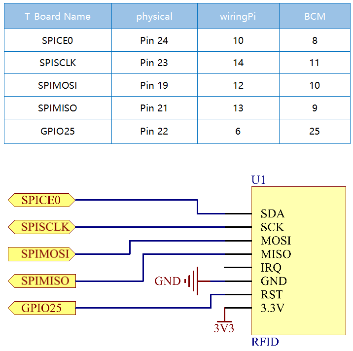

.. note::

    Ciao, benvenuto nella Community su Facebook per gli appassionati di SunFounder Raspberry Pi, Arduino e ESP32! Approfondisci il tuo utilizzo di Raspberry Pi, Arduino ed ESP32 insieme ad altri appassionati.

    **Perché unirti a noi?**

    - **Supporto esperto**: Risolvi i problemi post-vendita e le sfide tecniche con l’aiuto della nostra community e del team.
    - **Impara e Condividi**: Scambia consigli e tutorial per migliorare le tue competenze.
    - **Anteprime Esclusive**: Ottieni l’accesso anticipato a nuovi annunci di prodotti e anticipazioni.
    - **Sconti Speciali**: Approfitta di sconti esclusivi sui nostri prodotti più recenti.
    - **Promozioni e Giveaway Festivi**: Partecipa a promozioni e concorsi in occasione delle festività.

    👉 Pronto a esplorare e creare con noi? Clicca su [|link_sf_facebook|] e unisciti oggi stesso!

2.2.7 Modulo RFID MFRC522
============================

Introduzione
---------------

L'identificazione a radiofrequenza (RFID) fa riferimento alle tecnologie 
che utilizzano la comunicazione wireless tra un oggetto (o tag) e un 
dispositivo interrogante (o lettore) per tracciare e identificare 
automaticamente tali oggetti.

Alcune delle applicazioni più comuni di questa tecnologia includono le catene 
di approvvigionamento nella vendita al dettaglio, le catene di approvvigionamento 
militari, i metodi di pagamento automatizzati, il tracciamento e la gestione 
dei bagagli, il monitoraggio dei documenti e la gestione farmaceutica, solo per 
citarne alcuni.

In questo progetto, useremo l'RFID per la lettura e la scrittura.

Componenti
-------------

.. image:: img/list_2.2.7.png

Principio di Funzionamento
--------------------------

**RFID**

L'identificazione a radiofrequenza (RFID) si riferisce a tecnologie che 
implicano l'uso della comunicazione wireless tra un oggetto (o tag) e un 
dispositivo interrogante (o lettore) per tracciare e identificare 
automaticamente tali oggetti. La portata di trasmissione del tag è limitata 
a diversi metri dal lettore. Non è necessaria una linea di vista diretta tra 
il lettore e il tag.

La maggior parte dei tag contiene almeno un circuito integrato (IC) e 
un'antenna. Il microchip memorizza le informazioni e gestisce la comunicazione 
a radiofrequenza (RF) con il lettore. I tag passivi non hanno una fonte di 
energia indipendente e dipendono da un segnale elettromagnetico esterno, 
fornito dal lettore, per alimentare le loro operazioni. I tag attivi 
contengono una fonte di energia indipendente, come una batteria, e possono 
avere capacità di elaborazione, trasmissione e portata maggiori.

.. image:: img/image230.png

**MFRC522**

Il MFRC522 è un tipo di chip integrato per la lettura e la scrittura di schede. 
Viene comunemente utilizzato a 13,56 MHz. Lanciato dalla NXP, è un chip di 
scheda non a contatto a basso costo, a bassa tensione e di piccole dimensioni, 
ideale per strumenti intelligenti e dispositivi portatili.

Il MFRC522 utilizza un concetto avanzato di modulazione e demodulazione, che si 
presenta pienamente in tutti i tipi di metodi e protocolli di comunicazione senza 
contatto a 13,56 MHz. Supporta inoltre l'algoritmo di crittografia CRYPTO1 per la 
verifica dei prodotti MIFARE. Il MFRC522 supporta anche la serie MIFARE per la 
comunicazione senza contatto ad alta velocità, con una velocità di trasmissione 
dati bidirezionale fino a 424 kbit/s. Come nuovo membro della serie di lettori 
integrati a 13,56 MHz, il MFRC522 è simile ai modelli MFRC500 e MFRC530, ma 
presenta anche grandi differenze. Comunica con il dispositivo host tramite 
un'interfaccia seriale che richiede meno cablaggio. È possibile scegliere tra 
le modalità SPI, I2C e UART seriale (simile a RS232), contribuendo a ridurre 
le connessioni, risparmiare spazio sulla scheda PCB (dimensioni ridotte) e 
ridurre i costi.

Schema di Collegamento
-------------------------

Procedure Sperimentali
--------------------------

**Passo 1:** Costruisci il circuito.

.. image:: img/image232.png
    :width: 800

**Passo 2:** Configura SPI (consulta il :ref:`Appendix` per ulteriori dettagli. Se SPI è già configurato, salta questo passo.)

**Passo 3:** Accedi alla cartella del codice.

.. raw:: html

   <run></run>

.. code-block:: 

    cd ~/davinci-kit-for-raspberry-pi/c/2.2.7/

**Passo 4:** Compila il codice.

.. raw:: html

   <run></run>

.. code-block:: 

    make read
    make write

.. note::
    Sono presenti due esempi per la lettura o scrittura dell'ID della 
    scheda, e puoi scegliere quello più adatto alle tue esigenze.

**Passo 5:** Esegui il file eseguibile.

.. raw:: html

   <run></run>

.. code-block:: 

    sudo ./read

.. raw:: html

   <run></run>
   
.. code-block:: 

    sudo ./write

.. note::

    Se non funziona dopo l'esecuzione o compare un messaggio di errore: \"wiringPi.h: No such file or directory\", consulta :ref:`Il codice C non funziona?`. 

**Spiegazione del Codice**

.. code-block:: c

    InitRc522();

Questa funzione viene utilizzata per inizializzare il modulo RFID RC522.

.. code-block:: c

    uint8_t read_card_data();

Questa funzione legge i dati della scheda e, se la lettura ha successo, restituisce "1".

.. code-block:: c

    uint8_t write_card_data(uint8_t *data);

Questa funzione scrive i dati sulla scheda e restituisce "1" se la scrittura 
ha successo. \*data è l'informazione che verrà scritta sulla scheda.

