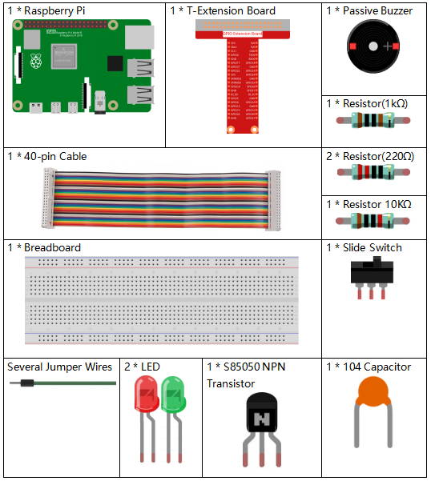

.. note::

    Ciao, benvenuto nella Community su Facebook per gli appassionati di SunFounder Raspberry Pi, Arduino e ESP32! Approfondisci le tue conoscenze su Raspberry Pi, Arduino ed ESP32 insieme ad altri appassionati.

    **Perché unirti a noi?**

    - **Supporto esperto**: Risolvi i problemi post-vendita e le sfide tecniche con l’aiuto della nostra community e del nostro team.
    - **Impara e Condividi**: Scambia consigli e tutorial per migliorare le tue competenze.
    - **Anteprime Esclusive**: Ottieni accesso anticipato agli annunci dei nuovi prodotti e anteprime esclusive.
    - **Sconti Speciali**: Approfitta di sconti esclusivi sui nostri prodotti più recenti.
    - **Promozioni e Giveaway Festivi**: Partecipa a concorsi e promozioni in occasione delle festività.

    👉 Pronto a esplorare e creare con noi? Clicca su [|link_sf_facebook|] e unisciti oggi stesso!

3.1.10 Campanello di Allarme
===============================

Introduzione
--------------

In questo progetto, realizzeremo un dispositivo di allarme manuale. 
È possibile sostituire l'interruttore a levetta con un termistore o 
un sensore di luce per creare un allarme di temperatura o di luminosità.

Componenti
-------------

Schema di Collegamento
--------------------------

============ ======== ======== ===
T-Board Name physical wiringPi BCM
GPIO17       Pin 11   0        17
GPIO18       Pin 12   1        18
GPIO27       Pin 13   2        27
GPIO22       Pin 15   3        22
============ ======== ======== ===

.. image:: img/Schematic_three_one10.png
   :align: center

Procedure Sperimentali
-------------------------

**Passo 1**: Costruisci il circuito.

.. image:: img/image266.png
   :alt: Alarm Bell_bb
   :width: 800

**Passo 2**: Cambia directory.

.. raw:: html

   <run></run>

.. code-block:: 

    cd ~/davinci-kit-for-raspberry-pi/c/3.1.10/

**Passo 3**: Compila.

.. raw:: html

   <run></run>

.. code-block::

    gcc 3.1.10_AlarmBell.c -lwiringPi -lpthread

**Passo 4**: Esegui.

.. raw:: html

   <run></run>

.. code-block::

    sudo ./a.out

Dopo l'avvio del programma, l'interruttore a levetta verrà spostato 
a destra e il cicalino emetterà un suono di allarme. Allo stesso tempo, 
i LED rosso e verde lampeggeranno a una determinata frequenza.

.. note::

    Se non funziona dopo l'esecuzione o compare un messaggio di errore: \"wiringPi.h: No such file or directory\", consulta :ref:`Il codice C non funziona?`.

**Spiegazione del Codice**

.. code-block:: c

    #include <pthread.h>

In questo codice, utilizzerai una nuova libreria, `pthread.h`, che contiene 
una serie di librerie per la gestione dei thread e consente la multithreading. 
Aggiungiamo il parametro **-lpthread** in fase di compilazione per consentire 
il funzionamento indipendente del LED e del cicalino.

.. code-block:: c

    void *ledWork(void *arg){       
        while(1)    
        {   
            if(flag==0){
                pthread_exit(NULL);
            }
            digitalWrite(ALedPin,HIGH);
            delay(500);
            digitalWrite(ALedPin,LOW);
            digitalWrite(BLedPin,HIGH);
            delay(500);
            digitalWrite(BLedPin,LOW);
        }
    }

La funzione `ledWork()` serve a definire lo stato di funzionamento dei due 
LED: accende il LED verde per 0,5s e poi lo spegne; analogamente, accende il 
LED rosso per 0,5s e poi lo spegne.

.. code-block:: c

    void *buzzWork(void *arg){
        while(1)
        {
            if(flag==0){
                pthread_exit(NULL);
            }
            if((note>=800)||(note<=130)){
                pitch = -pitch;
            }
            note=note+pitch;
            softToneWrite(BeepPin,note);
            delay(10);
        }
    }

La funzione `buzzWork()` serve a impostare lo stato di funzionamento del 
cicalino. Impostiamo la frequenza tra 130 e 800, con un incremento o una 
riduzione a intervalli di 20.

.. code-block:: c

    void on(){
        flag = 1;
        if(softToneCreate(BeepPin) == -1){
            printf("setup softTone failed !");
            return; 
        }     
        pthread_t tLed;     
        pthread_create(&tLed,NULL,ledWork,NULL);     
        pthread_t tBuzz;  
        pthread_create(&tBuzz,NULL,buzzWork,NULL);       
    }

Nella funzione `on()`:

1) Imposta il valore del segnale di controllo a \"flag=1\".

2) Crea un pin a tono controllato tramite software **BeepPin**.

3) Crea due thread separati in modo che LED e cicalino possano funzionare contemporaneamente.

**pthread_t tLed:** Dichiarazione di un thread **tLed**.

**pthread_create(&tLed,NULL,ledWork,NULL):** Crea il thread, con prototipo:

int pthread_create(pthread_t *restrict tidp, const pthread_attr_t *restrict_attr, 
void* (*start_rtn)(void*), void *restrict arg);

**Valore di Ritorno**

Se ha successo, restituisce \"**0**\"; altrimenti, restituisce \"**-1**\".

**Parametri**

| Il primo parametro è un puntatore all'identificatore del thread.
| Il secondo parametro serve per impostare l'attributo del thread.
| Il terzo parametro è l'indirizzo iniziale della funzione di esecuzione del thread.
| L'ultimo parametro è quello che esegue la funzione.

.. code-block:: c

    void off(){
        flag = 0;
        softToneStop(BeepPin);
        digitalWrite(ALedPin,LOW);
        digitalWrite(BLedPin,LOW);
    }

La funzione `off()` imposta \"flag=0\" per terminare i thread **ledWork** e 
**BuzzWork** e quindi spegnere il cicalino e i LED.

.. code-block:: c

    int main(){       
        setup(); 
        int lastState = 0;
        while(1){
            int currentState = digitalRead(switchPin);
            if ((currentState == 1)&&(lastState==0)){
                on();
            }
            else if((currentState == 0)&&(lastState==1)){
                off();
            }
            lastState=currentState;
        }
        return 0;
    }

`main()` contiene l'intero processo del programma: inizialmente legge il 
valore dell'interruttore a levetta; se l'interruttore viene spostato a 
destra (lettura 1), viene chiamata la funzione `on()`, il cicalino emette 
un suono e i LED rosso e verde lampeggiano. Altrimenti, il cicalino e i LED 
rimangono spenti.

