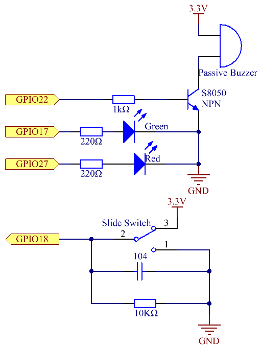

.. note::

    こんにちは、SunFounderのRaspberry Pi & Arduino & ESP32愛好家コミュニティへようこそ！Facebook上でRaspberry Pi、Arduino、ESP32についてもっと深く掘り下げ、他の愛好家と交流しましょう。

    **参加する理由は？**

    - **エキスパートサポート**：コミュニティやチームの助けを借りて、販売後の問題や技術的な課題を解決します。
    - **学び＆共有**：ヒントやチュートリアルを交換してスキルを向上させましょう。
    - **独占的なプレビュー**：新製品の発表や先行プレビューに早期アクセスしましょう。
    - **特別割引**：最新製品の独占割引をお楽しみください。
    - **祭りのプロモーションとギフト**：ギフトや祝日のプロモーションに参加しましょう。

    👉 私たちと一緒に探索し、創造する準備はできていますか？[|link_sf_facebook|]をクリックして今すぐ参加しましょう！

3.1.10 警報ベル
=================

前書き
-----------------

このコースでは、手動警報装置を作成する。
トグルスイッチをサーミスタまたは感光センサーに交換して、温度警報または光警報を作成できる。

部品
---------------

.. image:: ../img/list_Alarm_Bell.png
    :align: center

回路図
-------------------------

============ ======== ======== ===
T-Board Name physical wiringPi BCM
GPIO17       Pin 11   0        17
GPIO18       Pin 12   1        18
GPIO27       Pin 13   2        27
GPIO22       Pin 15   3        22
============ ======== ======== ===

実験手順
-----------------------------

ステップ1： 回路を作る。

.. image:: ../img/image266.png
   :width: 800

ステップ2： ディレクトリを変更する。

.. raw:: html

   <run></run>

.. code-block:: 

    cd ~/davinci-kit-for-raspberry-pi/c/3.1.10/

ステップ3： コンパイルする。

.. raw:: html

   <run></run>

.. code-block::

    gcc 3.1.10_AlarmBell.c -lwiringPi -lpthread

ステップ4： 実行。

.. raw:: html

   <run></run>

.. code-block::

    sudo ./a.out

プログラムが起動すると、トグルスイッチが右に切り替わり、ブザーが警報音を出す。同時に、特定の周波数で赤と緑のLEDが点滅する。

**コードの説明**

.. code-block:: c

    #include <pthread.h>

このコードでは、新しいライブラリ ``thread.h`` を使用する。
これは、一般的なスレッドライブラリのセットであり、マルチスレッドを実現できる。
コンパイル時に ``-lpthread`` パラメーターを追加して、LEDとブザーを独立して動作させる。

.. code-block:: c

    void *ledWork(void *arg){       
        while(1)    
        {   
            if(flag==0){
                pthread_exit(NULL);
            }
            digitalWrite(ALedPin,HIGH);
            delay(500);
            digitalWrite(ALedPin,LOW);
            digitalWrite(BLedPin,HIGH);
            delay(500);
            digitalWrite(BLedPin,LOW);
        }
    }

関数 ``ledWork()`` は、これら2つのLEDの動作状態を設定するために役立つ：
緑色のLEDを0.5秒間点灯させた後、消灯する。同様に、赤いLEDを0.5秒間点灯させてから消灯する。

.. code-block:: c

    void *buzzWork(void *arg){
        while(1)
        {
            if(flag==0){
                pthread_exit(NULL);
            }
            if((note>=800)||(note<=130)){
                pitch = -pitch;
            }
            note=note+pitch;
            softToneWrite(BeepPin,note);
            delay(10);
        }
    }

関数 ``buzzWork()`` は、ブザーの動作状態を設定するために使用される。
ここでは、周波数を130〜800に設定し、20の間隔で累積・減衰する。

.. code-block:: c

    void on(){
        flag = 1;
        if(softToneCreate(BeepPin) == -1){
            printf("setup softTone failed !");
            return; 
        }    
        pthread_t tLed;     
        pthread_create(&tLed,NULL,ledWork,NULL);    
        pthread_t tBuzz;  
        pthread_create(&tBuzz,NULL,buzzWork,NULL);      
    }

関数 ``on()`` で：

* 制御スレッドの終了を示すマーク「flag = 1」を定義する。

* ソフトウェア制御のトーンピン ``BeepPin`` を作成する。

* LEDとブザーが同時に動作できるように、二つの個別のスレッドを作成する。

``pthread_t tLed`` : スレッド tLed を宣言する。

``pthread_create(&tLed,NULL,ledWork,NULL)`` ： スレッドを作成し、そのプロトタイプは次の通りである： ``int pthread_create(pthread_t *restrict tidp,const pthread_attr_t *restrict attr,void*（*start_rtn)(void*),void *restrict arg);``

**値を返す**

成功した場合は「0」を返し、それ以外の場合は落下数「-1」を返します。

**パラメータ**

* 最初のパラメーターは、スレッドIDへのポインターです。
* 2つ目は、スレッド属性を設定するために使用されます。
* 3番目は、スレッド実行関数の開始アドレスです。
* 最後のものは、関数を実行するものです。

.. code-block:: c

    void off(){
        flag = 0;
        softToneStop(BeepPin);
        digitalWrite(ALedPin,LOW);
        digitalWrite(BLedPin,LOW);
    }

スレッド ``ledWork`` と ``BuzzWork`` を終了するために、
関数 ``Off()`` は「flag = 0」を定義しそして、ブザーとLEDをオフにする。

.. code-block:: c

    int main(){       
        setup(); 
        int lastState = 0;
        while(1){
            int currentState = digitalRead(switchPin);
            if ((currentState == 1)&&(lastState==0)){
                on();
            }
            else if((currentState == 0)&&(lastState==1)){
                off();
            }
            lastState=currentState;
        }
        return 0;
    }

``main()`` には、プログラムのプロセス全体が含まれている：まず、スライドスイッチの値を読み取る。
トグルスイッチが右に切り替えられた場合（読み取り値が1）、関数 ``on()`` が呼び出され、
ブザーが駆動されて音が鳴り、赤と緑のLEDが点滅する。そうしないと、ブザーとLEDが機能しない。
