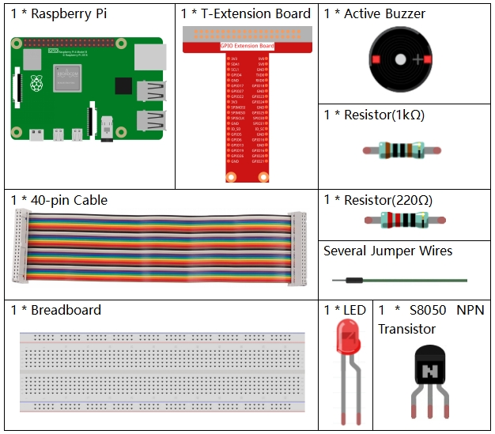

.. note::

    Hello, welcome to the SunFounder Raspberry Pi & Arduino & ESP32 Enthusiasts Community on Facebook! Dive deeper into Raspberry Pi, Arduino, and ESP32 with fellow enthusiasts.

    **Why Join?**

    - **Expert Support**: Solve post-sale issues and technical challenges with help from our community and team.
    - **Learn & Share**: Exchange tips and tutorials to enhance your skills.
    - **Exclusive Previews**: Get early access to new product announcements and sneak peeks.
    - **Special Discounts**: Enjoy exclusive discounts on our newest products.
    - **Festive Promotions and Giveaways**: Take part in giveaways and holiday promotions.

    👉 Ready to explore and create with us? Click [|link_sf_facebook|] and join today!

3.1.11 Morse Code Generator
=============================

Introduction
-----------------

In this lesson, we'll make a Morse code generator, where you type in a
series of English letters in the Raspberry Pi to make it appear as Morse
code.

Components
---------------

Schematic Diagram
-----------------------

============ ======== ======== ===
T-Board Name physical wiringPi BCM
GPIO17       Pin 11   0        17
GPIO22       Pin 15   3        22
============ ======== ======== ===

.. image:: img/Schematic_three_one11.png
   :align: center

Experimental Procedures
----------------------------

**Step 1:** Build the circuit. (Pay attention to poles of the buzzer:
The one with + label is the positive pole and the other is the
negative.)

.. image:: img/image269.png
   :alt: Morse_bb
   :width: 800

**Step 2**: Open the code file.

.. raw:: html

   <run></run>

.. code-block::

    cd ~/davinci-kit-for-raspberry-pi/c/3.1.11/

**Step 3**: Compile the code.

.. raw:: html

   <run></run>

.. code-block::

    gcc 3.1.11_MorseCodeGenerator.c -lwiringPi

**Step 4**: Run the executable file above.

.. raw:: html

   <run></run>

.. code-block:: 

    sudo ./a.out

After the program runs, type a series of characters, and the buzzer and
the LED will send the corresponding Morse code signals.

.. note::

    If it does not work after running, or there is an error prompt: \"wiringPi.h: No such file or directory\", please refer to :ref:`C code is not working?`.

**Code Explanation**

.. code-block:: c

    struct MORSE{
        char word;
        unsigned char *code;
    };

    struct MORSE morseDict[]=
    {
        {'A',"01"}, {'B',"1000"}, {'C',"1010"}, {'D',"100"}, {'E',"0"}, 
        {'F',"0010"}, {'G',"110"}, {'H',"0000"}, {'I',"00"}, {'J',"0111"}, 
        {'K',"101"}, {'L',"0100"}, {'M',"11"}, {'N',"10"}, {'O',"111"}, 
        {'P',"0110"}, {'Q',"1101"}, {'R',"010"}, {'S',"000"}, {'T',"1"},
        {'U',"001"}, {'V',"0001"}, {'W',"011"}, {'X',"1001"}, {'Y',"1011"}, 
        {'Z',"1100"},{'1',"01111"}, {'2',"00111"}, {'3',"00011"}, {'4',"00001"}, 
        {'5',"00000"},{'6',"10000"}, {'7',"11000"}, {'8',"11100"}, {'9',"11110"},
        {'0',"11111"},{'?',"001100"}, {'/',"10010"}, {',',"110011"}, {'.',"010101"},
        {';',"101010"},{'!',"101011"}, {'@',"011010"}, {':',"111000"}
    };

This structure MORSE is the dictionary of the Morse code, containing
characters A-Z, numbers 0-9 and marks \"?\" \"/\" \":\" \",\" \".\" \";\" \"!\" \"@\" .

.. code-block:: c

    char *lookup(char key,struct MORSE *dict,int length)
    {
        for (int i=0;i<length;i++)
        {
            if(dict[i].word==key){
                return dict[i].code;
            }
        }    
    }

The function **lookup()** works by \"checking the dictionary\". Define a
**key,** search the same words as **key** in the structure **morseDict**
and return the corresponding information— \"**code**\" of the certain
word.

.. code-block:: c

    void on(){
        digitalWrite(ALedPin,HIGH);
        digitalWrite(BeepPin,HIGH);     
    }

Create a function on() to start the buzzer and the LED.

.. code-block:: c

    void off(){
        digitalWrite(ALedPin,LOW);
        digitalWrite(BeepPin,LOW);
    }

The function off() turns off the buzzer and the LED.

.. code-block:: c

    void beep(int dt){
        on();
        delay(dt);
        off();
        delay(dt);
    }

Define a function beep() to make the buzzer and the LED emit sounds and
blink in a certain interval of **dt**.

.. code-block:: c

    void morsecode(char *code){
        int pause = 250;
        char *point = NULL;
        int length = sizeof(morseDict)/sizeof(morseDict[0]);
        for (int i=0;i<strlen(code);i++)
        {
            point=lookup(code[i],morseDict,length);
            for (int j=0;j<strlen(point);j++){
                if (point[j]=='0')
                {
                    beep(pause/2);
                }else if(point[j]=='1')
                {
                    beep(pause);
                }
                delay(pause);
            }
        }
    }

The function morsecode() is used to process the Morse code of input
characters by making the \"1\" of the code keep emitting sounds or lights
and the \"0\"shortly emit sounds or lights, ex., input \"SOS\", and there
will be a signal containing three short three long and then three short
segments \" · · · - - - · · · \".

.. code-block:: c

    int toupper(int c)
    {
        if ((c >= 'a') && (c <= 'z'))
            return c + ('A' - 'a');
        return c;
    }
    char *strupr(char *str)
    {
        char *orign=str;
        for (; *str!='\0'; str++)
            *str = toupper(*str);
    return orign;
    }

Before coding, you need to unify the letters into capital letters.

.. code-block:: c

    void main(){
        setup();
        char *code;
        int length=8;
        code = (char*)malloc(sizeof(char)*length);
        while (1){
            printf("Please input the messenger:");
            delay(100);
            scanf("%s",code);
            code=strupr(code);
            printf("%s\n",code);
            delay(100);
            morsecode(code);
        }
    }

When you type the relevant characters with the keyboard,
code=strupr(code) will convert the input letters to their capital form.

Printf() then prints the clear text on the computer screen, and the
morsecod() function causes the buzzer and the LED to emit Morse code.

Note that the length of the input character mustn’t exceed the
**length** (can be revised).
