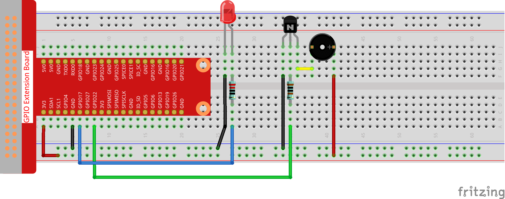

.. note::

    Ciao, benvenuto nella Community su Facebook per gli appassionati di SunFounder Raspberry Pi, Arduino e ESP32! Approfondisci le tue conoscenze su Raspberry Pi, Arduino ed ESP32 insieme ad altri appassionati.

    **Perché unirti a noi?**

    - **Supporto esperto**: Risolvi i problemi post-vendita e le sfide tecniche con l’aiuto della nostra community e del nostro team.
    - **Impara e Condividi**: Scambia consigli e tutorial per migliorare le tue competenze.
    - **Anteprime Esclusive**: Ottieni accesso anticipato agli annunci dei nuovi prodotti e anteprime esclusive.
    - **Sconti Speciali**: Approfitta di sconti esclusivi sui nostri prodotti più recenti.
    - **Promozioni e Giveaway Festivi**: Partecipa a concorsi e promozioni in occasione delle festività.

    👉 Pronto a esplorare e creare con noi? Clicca su [|link_sf_facebook|] e unisciti oggi stesso!

3.1.11 Generatore di Codice Morse
===================================

Introduzione
--------------

In questa lezione, realizzeremo un generatore di codice Morse, in cui 
potrai digitare una serie di lettere in inglese sul Raspberry Pi e vederle 
tradotte in codice Morse.

Componenti
-------------

.. image:: img/3.1.10.png
    :align: center

Schema di Collegamento
--------------------------

============ ======== ======== ===
T-Board Name physical wiringPi BCM
GPIO17       Pin 11   0        17
GPIO22       Pin 15   3        22
============ ======== ======== ===

.. image:: img/Schematic_three_one11.png
   :align: center

Procedure Sperimentali
--------------------------

**Passo 1:** Costruisci il circuito. (Fai attenzione ai poli del 
cicalino: quello con l'etichetta + è il polo positivo e l'altro è il negativo.)

**Passo 2**: Apri il file del codice.

.. raw:: html

   <run></run>

.. code-block::

    cd ~/davinci-kit-for-raspberry-pi/c/3.1.11/

**Passo 3**: Compila il codice.

.. raw:: html

   <run></run>

.. code-block::

    gcc 3.1.11_MorseCodeGenerator.c -lwiringPi

**Passo 4**: Esegui il file eseguibile.

.. raw:: html

   <run></run>

.. code-block:: 

    sudo ./a.out

Dopo l'avvio del programma, digita una serie di caratteri, e il cicalino 
e il LED invieranno i segnali corrispondenti in codice Morse.

.. note::

    Se non funziona dopo l'esecuzione o compare un messaggio di errore: \"wiringPi.h: No such file or directory\", consulta :ref:`Il codice C non funziona?`.

**Spiegazione del Codice**

.. code-block:: c

    struct MORSE{
        char word;
        unsigned char *code;
    };

    struct MORSE morseDict[]=
    {
        {'A',"01"}, {'B',"1000"}, {'C',"1010"}, {'D',"100"}, {'E',"0"}, 
        {'F',"0010"}, {'G',"110"}, {'H',"0000"}, {'I',"00"}, {'J',"0111"}, 
        {'K',"101"}, {'L',"0100"}, {'M',"11"}, {'N',"10"}, {'O',"111"}, 
        {'P',"0110"}, {'Q',"1101"}, {'R',"010"}, {'S',"000"}, {'T',"1"},
        {'U',"001"}, {'V',"0001"}, {'W',"011"}, {'X',"1001"}, {'Y',"1011"}, 
        {'Z',"1100"},{'1',"01111"}, {'2',"00111"}, {'3',"00011"}, {'4',"00001"}, 
        {'5',"00000"},{'6',"10000"}, {'7',"11000"}, {'8',"11100"}, {'9',"11110"},
        {'0',"11111"},{'?',"001100"}, {'/',"10010"}, {',',"110011"}, {'.',"010101"},
        {';',"101010"},{'!',"101011"}, {'@',"011010"}, {':',"111000"}
    };

Questa struttura `MORSE` rappresenta il dizionario del codice Morse, 
contenente i caratteri da A a Z, i numeri da 0 a 9 e i simboli \"?\" \"/\" \":\" \",\" \".\" \";\" \"!\" \"@\".

.. code-block:: c

    char *lookup(char key,struct MORSE *dict,int length)
    {
        for (int i=0;i<length;i++)
        {
            if(dict[i].word==key){
                return dict[i].code;
            }
        }    
    }

La funzione **lookup()** lavora come una “consultazione del dizionario”. 
Definisce una **chiave** e cerca le parole uguali alla chiave nella struttura 
**morseDict** per restituire l’informazione corrispondente— il \"**code**\" 
della parola specifica.

.. code-block:: c

    void on(){
        digitalWrite(ALedPin,HIGH);
        digitalWrite(BeepPin,HIGH);     
    }

Create a function on() to start the buzzer and the LED.

.. code-block:: c

    void off(){
        digitalWrite(ALedPin,LOW);
        digitalWrite(BeepPin,LOW);
    }

La funzione `off()` spegne il cicalino e il LED.

.. code-block:: c

    void beep(int dt){
        on();
        delay(dt);
        off();
        delay(dt);
    }

Definisce la funzione `beep()` per far emettere suoni al cicalino e far 
lampeggiare il LED a un intervallo specifico di **dt**.

.. code-block:: c

    void morsecode(char *code){
        int pause = 250;
        char *point = NULL;
        int length = sizeof(morseDict)/sizeof(morseDict[0]);
        for (int i=0;i<strlen(code);i++)
        {
            point=lookup(code[i],morseDict,length);
            for (int j=0;j<strlen(point);j++){
                if (point[j]=='0')
                {
                    beep(pause/2);
                }else if(point[j]=='1')
                {
                    beep(pause);
                }
                delay(pause);
            }
        }
    }

La funzione `morsecode()` è utilizzata per processare il codice Morse dei 
caratteri di input, facendo sì che il \"1\" del codice emetta un suono o 
una luce più lunghi e lo \"0\" emetta un suono o una luce brevi, es., se 
l'input è \"SOS\", si emetterà un segnale con tre brevi, tre lunghi e poi 
tre brevi, cioè \" · · · - - - · · · \" .

.. code-block:: c

    int toupper(int c)
    {
        if ((c >= 'a') && (c <= 'z'))
            return c + ('A' - 'a');
        return c;
    }
    char *strupr(char *str)
    {
        char *orign=str;
        for (; *str!='\0'; str++)
            *str = toupper(*str);
    return orign;
    }

Prima della codifica, è necessario uniformare le lettere a maiuscole.

.. code-block:: c

    void main(){
        setup();
        char *code;
        int length=8;
        code = (char*)malloc(sizeof(char)*length);
        while (1){
            printf("Please input the messenger:");
            delay(100);
            scanf("%s",code);
            code=strupr(code);
            printf("%s\n",code);
            delay(100);
            morsecode(code);
        }
    }

Quando digiti i caratteri rilevanti tramite la tastiera, `code=strupr(code)` 
convertirà le lettere di input in maiuscole.

`Printf()` stampa poi il testo in chiaro sullo schermo del computer, mentre 
la funzione `morsecode()` fa sì che il cicalino e il LED emettano segnali in 
codice Morse.

Nota che la lunghezza del carattere in input non deve superare il valore 
**length** (modificabile).

