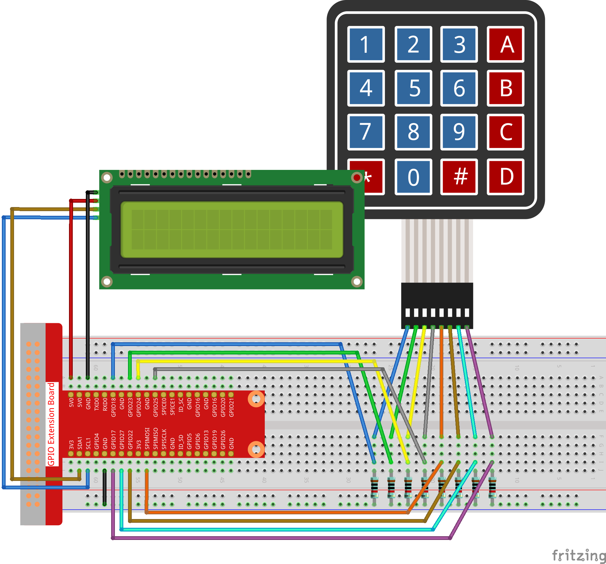

.. note::

    Ciao, benvenuto nella Community di Facebook per gli appassionati di SunFounder Raspberry Pi, Arduino ed ESP32! Approfondisci le tue conoscenze su Raspberry Pi, Arduino ed ESP32 insieme ad altri appassionati.

    **Perché unirti a noi?**

    - **Supporto Esperto**: Risolvi problemi post-vendita e sfide tecniche con l’aiuto della nostra community e del nostro team.
    - **Impara e Condividi**: Scambia suggerimenti e tutorial per migliorare le tue competenze.
    - **Anteprime Esclusive**: Accedi in anteprima agli annunci di nuovi prodotti e sneak peek.
    - **Sconti Speciali**: Approfitta di sconti esclusivi sui nostri prodotti più recenti.
    - **Promozioni e Giveaway Festivi**: Partecipa a concorsi e promozioni in occasione delle festività.

    👉 Pronto a esplorare e creare con noi? Clicca su [|link_sf_facebook|] e unisciti oggi stesso!

3.1.12 GIOCO – Indovina il Numero
====================================

Introduzione
---------------

"Indovina il Numero" è un divertente gioco di società in cui tu e i tuoi 
amici inserite a turno un numero (0~99). L’intervallo di numeri si restringe 
ad ogni input fino a quando qualcuno indovina correttamente il numero segreto. 
A quel punto, il giocatore che ha dato la risposta esatta viene dichiarato 
sconfitto e “punito”. Per esempio, se il numero fortunato è 51 (che i giocatori 
non conoscono) e il giocatore ① inserisce 50, l’intervallo numerico diventa 
50~99; se il giocatore ② inserisce 70, l’intervallo diventa 50~70; se il 
giocatore ③ inserisce 51, questo giocatore è quello sfortunato. In questo 
progetto, utilizziamo il tastierino per inserire i numeri e l’LCD per visualizzare i risultati.

Componenti
------------

.. image:: img/list_GAME_Guess_Number.png
    :align: center

Schema di Collegamento
-------------------------

============ ======== ======== =======
T-Board Name physical wiringPi BCM
GPIO18       Pin 12   1        18
GPIO23       Pin 16   4        23
GPIO24       Pin 18   5        24
GPIO25       Pin 22   6        25
SPIMOSI      Pin 19   12       10
GPIO22       Pin 15   3        22
GPIO27       Pin 13   2        27
GPIO17       Pin 11   0        17
SDA1         Pin 3    SDA1(8)  SDA1(2)
SCL1         Pin 5    SCL1(9)  SDA1(3)
============ ======== ======== =======

.. image:: img/Schematic_three_one12.png
   :align: center

Procedure Sperimentali
--------------------------

**Passo 1:** Costruisci il circuito.

**Passo 2**: Configura I2C (vedi Appendice. Se hai già configurato I2C, 
salta questo passo).

**Passo 3**: Cambia la directory.

.. raw:: html

   <run></run>

.. code-block::

    cd ~/davinci-kit-for-raspberry-pi/c/3.1.12/

**Passo 4**: Compila il codice.

.. raw:: html

   <run></run>

.. code-block::

    gcc 3.1.12_GAME_GuessNumber.c -lwiringPi

**Passo 5**: Esegui il programma.

.. raw:: html

   <run></run>

.. code-block::

    sudo ./a.out

Dopo l’avvio del programma, sulla schermata LCD apparirà la pagina iniziale:

.. code-block:: 

   Welcome!
   Press A to go!

Premi 'A' per iniziare il gioco e sul display LCD apparirà la schermata 
del gioco.

.. code-block:: 

   Enter number:
   0 ‹point‹ 99

.. note::

   Se il programma non funziona o appare un messaggio di errore: \"wiringPi.h: No such file or directory", consulta :ref:`Il codice C non funziona?`.

All’avvio del gioco, viene generato un numero casuale “ **point** ” che 
non appare sul display LCD, e il tuo compito è indovinarlo. Il numero 
inserito apparirà alla fine della prima riga fino a quando non sarà eseguita 
la verifica finale. (Premi 'D' per iniziare la comparazione; se il numero 
inserito è superiore a **10**, la comparazione si avvierà automaticamente.)

L'intervallo del numero **point** appare sulla seconda riga, e dovrai inserire 
il numero all'interno di questo intervallo. Quando inserisci un numero, 
l'intervallo si restringe; se indovini il numero fortunato (o sfortunato), 
apparirà “Hai indovinato!”.

**Spiegazione del Codice**

Nella parte iniziale del codice troviamo le funzioni per **keypad** e 
**I2C LCD1602**. Per ulteriori dettagli, puoi consultare **1.1.7 LCD1602 I2C** 
e **2.1.5 Tastierino.**

Ecco alcuni elementi chiave da conoscere:

.. code-block:: c

    /****************************************/
    //Inizia qui
    /****************************************/
    void init(void){
        fd = wiringPiI2CSetup(LCDAddr);
        lcd_init();
        lcd_clear();
        for(int i=0 ; i<4 ; i++) {
            pinMode(rowPins[i], OUTPUT);
            pinMode(colPins[i], INPUT);
        }
        lcd_clear();
        write(0, 0, "Welcome!");
        write(0, 1, "Press A to go!");
    }

Questa funzione inizializza **I2C LCD1602** e **Keypad** e visualizza 
"Benvenuto!" e "Premi A per iniziare!".

.. code-block:: c

    void init_new_value(void){
        srand(time(0));
        pointValue = rand()%100;
        upper = 99;
        lower = 0;
        count = 0;
        printf("point is %d\n",pointValue);
    }

La funzione genera un numero casuale 'point' e resetta l’intervallo del 
suggerimento numerico.

.. code-block:: c

    bool detect_point(void){
        if(count > pointValue){
            if(count < upper){
                upper = count;
            }
        }
        else if(count < pointValue){
            if(count > lower){
                lower = count;
            }
        }
        else if(count = pointValue){
            count = 0;
            return 1;
        }
        count = 0;
        return 0;
    }

La funzione `detect_point()` confronta il numero inserito con “point”. 
Se non coincidono, **count** assegna valori a **upper** e **lower** e 
restituisce '0'; in caso contrario, restituisce '1'.

.. code-block:: c

    void lcd_show_input(bool result){
        char *str=NULL;
        str =(char*)malloc(sizeof(char)*3);
        lcd_clear();
        if (result == 1){
            write(0,1,"You've got it!");
            delay(5000);
            init_new_value();
            lcd_show_input(0);
            return;
        }
        write(0,0,"Enter number:");
        Int2Str(str,count);
        write(13,0,str);
        Int2Str(str,lower);
        write(0,1,str);
        write(3,1,"<Point<");
        Int2Str(str,upper);
        write(12,1,str);
    }

Questa funzione visualizza la schermata del gioco. La funzione 
**Int2Str(str,count)** converte **count**, **lower** e **upper** 
da **intero** a **stringa** per il corretto display su **lcd**.

.. code-block:: c

    int main(){
        unsigned char pressed_keys[BUTTON_NUM];
        unsigned char last_key_pressed[BUTTON_NUM];
        if(wiringPiSetup() == -1){ //when initialize wiring failed,print messageto screen
            printf("setup wiringPi failed !");
            return 1; 
        }
        init();
        init_new_value();
        while(1){
            keyRead(pressed_keys);
            bool comp = keyCompare(pressed_keys, last_key_pressed);
            if (!comp){
                if(pressed_keys[0] != 0){
                    bool result = 0;
                    if(pressed_keys[0] == 'A'){
                        init_new_value();
                        lcd_show_input(0);
                    }
                    else if(pressed_keys[0] == 'D'){
                        result = detect_point();
                        lcd_show_input(result);
                    }
                    else if(pressed_keys[0] >='0' && pressed_keys[0] <= '9'){
                        count = count * 10;
                        count = count + (pressed_keys[0] - 48);
                        if (count>=10){
                            result = detect_point();
                        }
                        lcd_show_input(result);
                    }
                }
                keyCopy(last_key_pressed, pressed_keys);
            }
            delay(100);
        }
        return 0;   
    }

**main()** contiene l'intero processo del programma:

1) Inizializza **I2C LCD1602** e **Keypad**.

2) Usa **init_new_value()** per creare un numero casuale **0-99**.

3) Verifica se è stato premuto un pulsante e ne acquisisce il valore.

4) Se viene premuto il pulsante 'A', appare un numero casuale **0-99** 
   e inizia il gioco.

5) Se viene rilevata la pressione del pulsante '**D**', il programma 
   entrerà nella fase di valutazione del risultato e lo visualizzerà 
   sullo schermo LCD. Questo passaggio consente di verificare il risultato 
   anche inserendo solo un numero e poi premendo il pulsante '**D**'.

6) Se vengono premuti i pulsanti **0-9**, il valore di **count** cambia; 
   se **count** è maggiore di **10**, inizia la verifica.

7) Gli aggiornamenti e i valori del gioco sono visualizzati su **LCD1602**.

