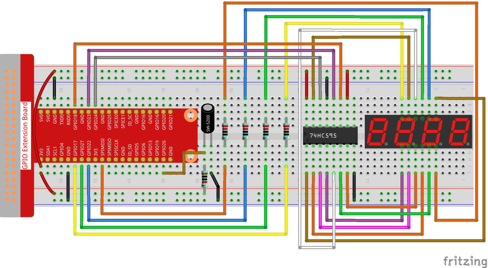

.. note::

    ¡Hola! Bienvenido a la Comunidad de Entusiastas de SunFounder para Raspberry Pi, Arduino y ESP32 en Facebook. Únete para profundizar en el mundo de Raspberry Pi, Arduino y ESP32 junto a otros aficionados.

    **¿Por qué unirse?**

    - **Soporte Experto**: Resuelve problemas post-venta y desafíos técnicos con ayuda de nuestra comunidad y equipo.
    - **Aprende y Comparte**: Intercambia consejos y tutoriales para mejorar tus habilidades.
    - **Previsualizaciones Exclusivas**: Accede anticipadamente a anuncios de nuevos productos y adelantos exclusivos.
    - **Descuentos Especiales**: Disfruta de descuentos exclusivos en nuestros productos más recientes.
    - **Promociones Festivas y Sorteos**: Participa en sorteos y promociones especiales.

    👉 ¿Listo para explorar y crear con nosotros? Haz clic en [|link_sf_facebook|] y únete hoy mismo.

3.1.13 JUEGO– 10 Segundos
==============================

Introducción
-------------------

En esta lección, haremos un dispositivo de juego para desafiar tu concentración. 
Ata el interruptor de inclinación a un palo para hacer una varita mágica. Agita 
la varita y el display de 4 dígitos comenzará a contar. Al agitarla nuevamente, 
el conteo se detendrá. Si logras mantener el conteo en **10.00**, ¡ganas! Puedes 
jugar con tus amigos para ver quién es el maestro del tiempo.

Componentes
----------------

.. image:: img/list_GAME_10_Second.png
    :align: center

Diagrama Esquemático
-------------------------

============ ======== ======== ===
T-Board Name physical wiringPi BCM
GPIO17       Pin 11   0        17
GPIO27       Pin 13   2        27
GPIO22       Pin 15   3        22
SPIMOSI      Pin 19   12       10
GPIO18       Pin 12   1        18
GPIO23       Pin 16   4        23
GPIO24       Pin 18   5        24
GPIO26       Pin 37   25       26
============ ======== ======== ===

.. image:: img/Schematic_three_one13.png
   :align: center

Procedimientos Experimentales
-------------------------------

**Paso 1**: Ensambla el circuito.

**Paso 2**: Accede a la carpeta del código.

.. raw:: html

   <run></run>

.. code-block::

    cd ~/davinci-kit-for-raspberry-pi/c/3.1.13/

**Paso 3**: Compila el código.

.. raw:: html

   <run></run>

.. code-block::

    gcc 3.1.13_GAME_10Second.c -lwiringPi

**Paso 4**: Ejecuta el archivo.

.. raw:: html

   <run></run>

.. code-block::

    sudo ./a.out

Agita la varita para que el display de 4 dígitos comience a contar; 
agítala de nuevo para detener el conteo. Si logras que el contador 
marque **10.00**, ganas. Agítala una vez más para iniciar otra ronda.

.. note::

    Si no funciona después de ejecutar el código o aparece un mensaje de error como: \"wiringPi.h: No such file or directory\", consulta :ref:`c code is not working?`.

**Explicación del Código**

.. code-block:: c

    void stateChange(){
        if (gameState == 0){
            counter = 0;
            delay(1000);
            ualarm(10000,10000); 
        }else{
            alarm(0);
            delay(1000);
        }
        gameState = (gameState + 1)%2;
    }

El juego se divide en dos modos:

gameState=0 es el modo \"inicio\", donde se mide el tiempo y se muestra 
en el display de segmentos, y se ingresa al modo \"mostrar\" al agitar 
el interruptor de inclinación.

gameState=1 es el modo \"mostrar\", que detiene la medición y muestra el 
tiempo en el display. Al agitar nuevamente el interruptor de inclinación, 
el cronómetro se reinicia y el juego comienza de nuevo.

.. code-block:: c

    void loop(){
        int currentState =0;
        int lastState=0;
        while(1){
            display();
            currentState=digitalRead(sensorPin);
            if((currentState==0)&&(lastState==1)){
                stateChange();
            }
            lastState=currentState;
        }
    }

Loop() es la función principal. Primero, el tiempo se muestra en el display de 
4 dígitos y se lee el valor del interruptor de inclinación. Si el estado del 
interruptor cambia, se llama a stateChange().

